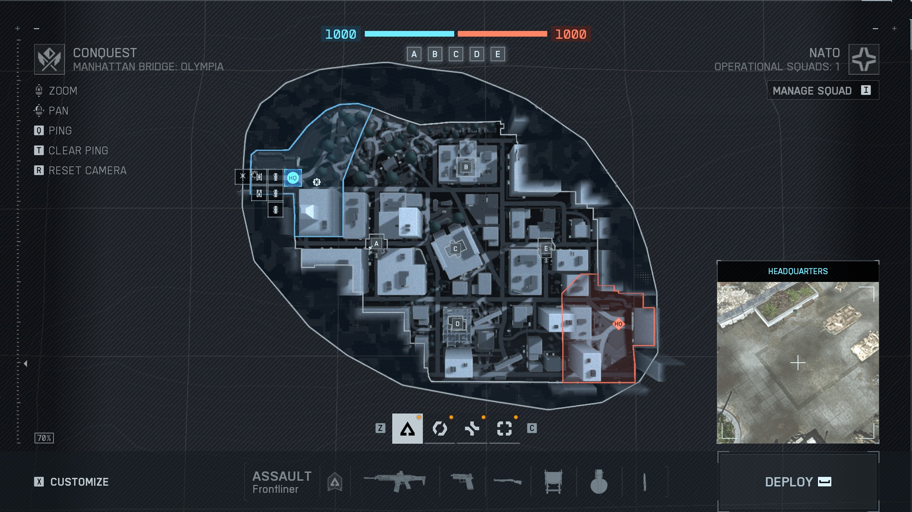
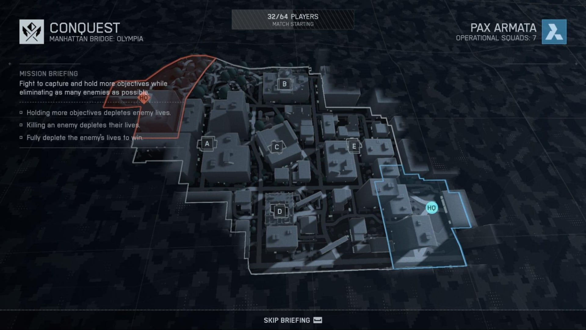

# BF6 曼哈顿大桥：截图边界与尺寸复测
2026-09-14 · 研究对象：Manhattan Bridge / Olympia，64人征服模式 · 结论性质：图片估算

## 结论与上一版修订

**依据实际查看的官方部署截图、另一张实机部署截图，以及社区原作者的米制比例图，BF6曼哈顿大桥地面战区的外包范围约580×410米。**

这是非规则街区的外接矩形，约0.24 km²；包含双方基地的不规则战区面积建议按约0.13 km²理解，不含基地的共同争夺区域约0.10 km²。不扣除边界内建筑，亦不累加多层室内面积，均不是“净可走面积”。

建议保守工作区间：
- 外包长边：520–640米；短边：370–450米。
- 含双方基地的不规则区域：0.11–0.15 km²。
- 不含基地的共同争夺区域：0.085–0.115 km²。

这些区间用于制作规划，不是统计意义上的置信区间。总体可信度中等：截图身份和五据点形状可核查，绝对米制尺度依赖社区作者的HUD校准；本次没有拿到同一时刻的原始HUD读数与玩家坐标对照帧，也没有读取现行游戏引擎边界坐标。

**上一版800×600米是本项目设计建议，不能作为BF6实际尺寸。** 同口径比较外接矩形：800×600=480,000m²；本次约580×410=237,800m²，前者约为后者2倍。不要把480,000m²的矩形直接除以130,000m²的不规则区域后声称地图大了相应倍数。

如果首版希望贴近这张地图的实际紧凑程度，建议先使用**600×450米的地面编辑包络、约0.12–0.15 km²的不规则可玩区域、5个征服据点**搭灰盒。此处600×450是便于制作的取整建议，不是测出的游戏边长。800×600保留为后续扩展方案。

## 1. 实际查看了什么

### A. EA官方征服部署截图

来源为EA 2025-10-10地图介绍页面，明确标注Manhattan Bridge: Olympia。原图2560×1440，查看与配准时等比例显示为1600×900。

[EA官方页面](https://www.ea.com/games/battlefield/battlefield-6/news/maps) · [官方原始图片](https://drop-assets.ea.com/images/72tXUw6Hx9DIzuRAhThq48/8b9388bd72e6cb1fdbe57ffdff467ba3/BF6-Manhattan-Bridge-Olympia-16x9.png)

可直接识别：A/B/C/D/E五个据点、画面左上与右下两端HQ、贴近街区的折线边界，以及范围更大的平滑外围白线。**本次没有证据确认平滑外围白线就是飞行边界或摄像机边界，因此不将它纳入已确认地面面积，也不给它编造用途。**

### B. 独立公开实机部署截图

该图标题同样显示Conquest / Manhattan Bridge: Olympia，并显示32/64玩家、五个据点和两端HQ。其阵营颜色与A图相反，但街区和据点的相对位置一致。镜头有明显倾斜，适合确认拓扑与边界，不直接拿整张图的宽高换算米数。

[图片所在文章](https://esportsinsider.com/battlefield-6-maps-ranked) · [公开原图](https://esportsinsider.com/wp-content/uploads/2025/10/Manhattan-Bridge-Map.jpg)

### C. 原作者米制比例图

使用ClaraTheRed / PENGUINonPC比较图的高清版本，实际下载尺寸12100×8400。作者方法为读取游戏HUD的远处旗点距离，同时打开大地图量像素，归一为1米/像素；图中背景每格标示100×100米。作者另在前帖明确，数值顺序为“不含出生区／包含出生区”。**不同版本比例不同：早期图是2米/像素，本次没有混用。**

[原作者方法与高清图链接](https://www.reddit.com/r/Battlefield/comments/1omver9/updated_battlefield_maps_from_bf3_bf4_bfhl_bf1/) · [高清原图](https://i.imgur.com/bV0bq9m.png) · [面积口径说明](https://www.reddit.com/r/Battlefield/comments/1ol17ao/battlefield_2042_maps_compared_to_battlefield_6/)

此图的曼哈顿大桥标注为0.10 / 0.13 km²。本次没有只抄面积标签，而是对原图单独做了轮廓、基地分区和据点对应复测。参考资料的绝对比例仍继承作者校准，不等于我重新在游戏里测了一次HUD。

检索到的小A地图教学和jackfrags实机视频可继续用于路线与场景研究；本轮没有成功取得可核查的视频帧，不引用虚构时间戳，也不使用视频标题推算尺寸：
- [小A：曼哈顿大桥跑位](https://www.youtube.com/watch?v=5KLl8uqmugY)
- [jackfrags：新地图实机](https://www.youtube.com/watch?v=l5QmeorZUwM)

## 2. 像素到米：可复算方法

采用高清比例图坐标，左上角为原点，x向右、y向下；这些是图片坐标，不是地理坐标。测量区域为x=3650…4349、y=3260…3729，共700×470像素。

比例关系：s=1m/px；长度L=像素长度×s；面积A=区域像素数×s²。按原图背景格再次检查，100像素对应一格100米。未对整图缩放后再计数。

提取黄色轮廓，规则为R>210、G>205、B<90，选择属于曼哈顿的连通边界，排除邻图。按外围填充得到基地与中央区域，再按HQ分界分区。粗描线使“算不算线条”对面积有明显影响，故保留原始数值作为诊断，不把它们包装成精确地理面积：

- 含描线的外包框为581×407像素，工程表达取约580×410米。
- 三个区域内部、不计粗黄色线条的总像素数为127,986。
- 其中中央区99,512，两个HQ内部14,779和13,695，三者相加为127,986。
- 将整个外边界与内部分界粗线都计入，会得到148,812像素²。
- 另按可见轮廓中心附近人工描线，面积约140,124像素²；手描本身也有误差。

由此可见，本图能支持“含基地约0.13–0.14 km²”的量级，不能支持精确到个位平方米的结论。最终报告使用约0.13 km²。0.11–0.15 km²是综合现有样本选定的制作工作区间，不保证涵盖尺度、描线和版本误差同时累积的极端情况；若线性尺度偏差为5%，面积还会变化约10%。

## 3. 用五个据点核对两张图

在高清比例图的另一局部窗口（原点3650,3000）读取旗点中心：
A=(254,493)，B=(381,386)，C=(365,500)，D=(367,606)，E=(491,500)。

在EA图等比例显示为1600×900时读取：
A=(660,428)，B=(818,294)，C=(800,438)，D=(803,569)，E=(959,438)。

使用统一缩放、微小旋转和平移拟合五点，得到约1.256个EA显示像素/米，五点均方根位置残差约1.26显示像素。该残差只说明两图据点关系吻合，**不是地图的绝对测量误差**；同一社区尺度误差会同时影响所有点。

从这套坐标得到的平面直线距离约为：
- A至C：110米。
- C至E：125米。
- B至D：220米。
- A至E：235–240米。

这些数值都从同一校准图导出，不是四条独立HUD实测。实际步行还要绕建筑、上下楼，不能当作路线长度。此图的交战密度来自约百米级据点间隔和多层街区，而不是横穿整座现实跨河桥。

## 4. 地图边界应如何理解

按截图方向描述，避免无地理配准就假定正北：
- 左上端HQ连着一小段弯曲外缘和建筑入口，是一端基地。
- B点在上部相对独立的大建筑；A、C、E大致构成横向争夺带，其中C是倾斜摆放的中心建筑。
- D点在下部破损建筑区域。
- 右下端HQ连着另一片建筑与街道，形成另一端基地。
- 中央区与两端基地通过不规则折线连成一个街区走廊；形状明显不是满矩形。
- 五个据点全部位于桥头街区样本内；截图不支持“整座跨河大桥＋两岸都可玩”的判断。

现实DUMBO地标可用于建筑和街景识别，但只有先找到可靠对应点，才能用现实底图进一步校准。不能把现实保护区边界、整桥长度、照片透视中的车宽或楼层数直接替换成游戏尺度。

这些证据主要来自2025年首发前后与社区更新样本，不等于逐边验证了2026年现行客户端的所有屋顶、地面与空中边界。

## 5. 如何影响当前项目制作

1. 若目标是尽量接近参考图，首个征服灰盒以600×450米包络、5据点起步，边界内不规则区域约0.12–0.15 km²。随后按64人、6台地面载具实测调整，不为了沿用上一版数字强行扩城。
2. 编辑／流送生产边界可先预留800×800米，为边缘建筑、水岸和背景过渡留空间；这是项目建议，与实际地面面积分开记录。
3. 第一版800×600米、6据点方案保留为“扩展城市版”，不再作为贴近BF6原图的默认尺寸。
4. 单人不能继续把600×500米称为从新版600×450米包络内直接裁切。应在新的固定城市母图内重新选区与验证25分钟路线；每局清零、96条物品定义等原规则不变。
5. 220×180米爆破、160×120米死斗仍是本项目灰盒建议，本次没有测量BF6相应小模式真实边界，不能当作原作数据。
6. 桥梁和曼哈顿天际线继续作为远景；没有依据将1.6×1.2千米飞行区、4×4千米背景构图范围写成BF6实测结果。
7. 环境240个预制件是复用库配额，并非地图摆放实例数量。本次只校正空间基准，不自动把资产数量按面积线性缩减。

## 6. 证据存档与复核边界

原图、复测结果和计算记录保存在同目录evidence中。来源清单见[evidence/sources.json](evidence/sources.json)。原始图像保持不变，二次绘制的边界示意只作分析标注。

较早的IllTry8129测图给出112,122m²含HQ、85,506m²不含HQ，方法也是比例图描边。它与后图量级一致但相差约16–17%；底图比例、描边或版本均可能影响，不将差异断言为地图扩建，也不直接取平均。[较早测量记录](https://www.reddit.com/r/Battlefield/comments/1oghs9f/all_map_sizes_in_m%C2%B2_upcoming_ones_too/)

若要提高到可执行的1:1地图规格，下一步需要同一游戏版本下的至少两组长距离HUD/测距读数＋大地图对应帧，或可验证的征服边界坐标。当前这份已足以把首版灰盒从泛化建议收敛到有照片依据的量级。
