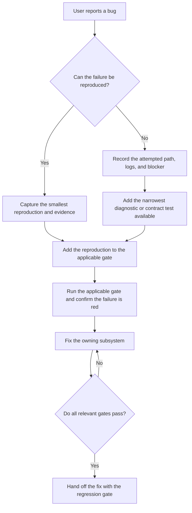

# AGENTS.md

AI-first TypeScript game engine. Target: surpass Three.js. **AI is the primary user** — when AI-friendly conflicts with human-friendly, AI wins (`.claude/skills/forgeax-closed-loop/agents/ai-user-charter.md`).

## Public SDK source mode

When `.forgeax-public-distribution` exists, this checkout is the source surface
of a public SDK archive. It is intentionally independent of the contributor
checkout: it has no `.gitmodules` or private binary asset submodule, `pnpm
install` does not need to hydrate internal repositories, and `pnpm build:engine`
is the source-build gate. `bun fx setup` selects the same public-safe path and
skips all submodule operations. The SDK already carries the checked WASM
payloads under the source package `pkg/` directories, so source users modify
TypeScript, rebuild the affected packages, and consume those workspace outputs
from their game.

Asset-heavy demo and browser fixtures that are not part of the Engine package
build remain contributor-checkout concerns. They must not be made a hidden
dependency of the public source build; use a public project asset or the
deterministic Preview canonical fallback instead.

The contributor-only worktree, asset, and maintenance notes below apply only
when this marker is absent. In public SDK source mode, their submodule steps are
not applicable.

## Design axiom — compression == intelligence

> [!IMPORTANT]
> **Metric: concepts a reader holds to follow any single piece — not LoC.** Judge every diff by Δ-concept-count. A phantom field / overload / wrapper generic / ledger is a loss even when tests pass; a removed duplicate / SSOT-collapse / union-shrink is a win even when LoC grows. Mechanism: 9 principles in `../forgeax-harness/rules/architecture-principles.md`, each removing one reader question (SSOT "which copy?", Derive "in sync?", closed unions "other states?").

**Human awkwardness is the anti-entropy signal AI cannot self-generate** (AI defaults to **add** over **remove**). When a human sweep yields "this is awkward / does this duplicate something", surface it **as a question, not a prescription**; let AI re-derive. Batch signals. (PR #370, #376.) §Change stance · §Error model · §Component naming apply this to API / failures / types.

Repository-family routing SSOT: `.agents/rules/delivery-workflow-routing.md`. Intake gate (task-shape routing + Direct-edit signals) SSOT `.agents/skills/forgeax-closed-loop/SKILL.md` §Intake gate. Direct edit must run relevant gates (typecheck / unit / lint / smoke) before commit.

### Bug-fix stability loop

> [!TIP]
> When the user asks to fix a bug, recommend and attempt reproduction before changing the owning
> implementation whenever the environment makes that practical. A reproducible bug is a future
> stability asset: encode it as the smallest useful regression gate, then make the fix prove itself
> against the same path.

Use this TDD-style loop for engine bugs:

- The regression gate must exercise the same engine or user-visible path when feasible; do not replace
  a runtime, browser, Dawn, or smoke failure with a weaker mock merely to get a green test.
- A red reproducer is an intermediate checkpoint, not a finished change. After adding it, implement
  the minimal owner-level fix and keep running the applicable local gates until the changed surface
  passes. For engine, RHI, and `hello-*` changes, follow the Smoke gate below.
- If reproduction is impossible because of an external dependency or unavailable environment, preserve
  the evidence and state the blocker explicitly; add the strongest deterministic unit or contract test
  that captures the observed invariant, then run every remaining applicable gate.
- Keep the regression test and the fix in the same change when possible. Each repaired failure should
  leave behind a permanent proof for the next agent.

### Smoke gate

Engine / RHI / hello-* changes must pass all hello-* / learn-render dawn-node smokes (300 frames) + `pnpm test:browser` + `pnpm test:dawn`. Roster `ls apps/hello/ apps/learn-render/`. Per-demo criteria (structural-only vs pixel readback ε≤0.05, FALSIFY): `packages/runtime/README.md` §structural-only smoke. Main red ≥24h → `post-merge-monitor`.

> [!IMPORTANT]
> **dawn-node smoke is necessary-but-not-sufficient** — it skips the dev-server pack path (`JSON.stringify → fetch → JSON.parse`) AND WebGPU validation. Browser-path-only bugs (typed-array survival, BGL shape mismatch, vertex-attr presence) need a Playwright e2e probe (`apps/hello/skin/scripts/smoke-browser.mjs`).

## Change stance

> [!IMPORTANT]
> **Optimal > compatible.** Take the breaking change when the new surface is clearly better. No deprecation windows, shim packages, `v1/v2` dual-paths, or renamed-export compat — migrate in one cut.

- Rename / delete / reorder / narrow / pivot freely. "Painful to migrate" is not a veto; "the new shape is worse or equal" is
- Exception: external wire protocols with known consumers (published npm APIs, JSON-RPC inspector codes) — `*ErrorCode` unions add-only minor / free-form major
- **Demo failures route to engine fixes, not workarounds.** A demo that can't render the obvious thing surfaces a real engine gap — fix it; a demo-side workaround (1×1 stand-in, manual rAF, ad-hoc fetch) freezes it
- **`OOS-*` is a classifier, not a commitment** — out-of-scope tags reflect what a prior feat deferred; re-pick the optimal solution per feat

## Packages

Game authors install `@forgeax/engine`. Its root is the runtime surface, focused capabilities use `@forgeax/engine/<package-directory>`, and its `forgeax` bin is the single CLI. The `@forgeax/engine-*` packages remain physical owner and automated publication units at the exact same version; consumers do not install them individually.

- **Directory naming** — directory names usually derive from the suffix after `@forgeax/engine-` (`packages/runtime/` ↔ `@forgeax/engine-runtime`); `packages/engine/` is the user-facing umbrella and CLI facade. The project manifest package lives at `packages/project/`, while its public identity remains `@forgeax/engine-project`.
- **Per-package contracts** — each package contract is its `packages/<pkg>/README.md`; temporary exceptions are `physics-rapier2d`, `physics-rapier3d`, and `vite-plugin-rhi-debug`, whose manifest/source is authoritative until a README exists. The package-by-package design map below is the navigable index.
- **Task → skill routing** — `rules/forgeax-engine-usage.md` maps task shape to one focused `forgeax-engine-*` skill; project authoring tools and live-instance CLI inspection are separate routes

Entry `Engine.create({ canvas })` / `createRenderer(canvas, ...)`.

## Module design map — cognitive injection

This is the package-by-package change-time map: it answers **which boundary owns a concern and which invariant must survive a change**. Each named `packages/<pkg>/README.md` is still the detailed API/error/capability contract; do not infer an API from this map.

### World and host contract

| Package | Core design idea / invariant |
|---|---|
| `engine` | User-facing umbrella: root forwards only the runtime entry, generated subpaths forward focused package exports, and the CLI delegates to DevKit. It owns no Engine behavior and never becomes a mega bundle. |
| `types` | The main entry is the cross-package POD vocabulary: closed unions, `Result`, and phantom brands with no runtime constants or duplicated platform values. Its explicit Node-only `inspector-client` subpath owns the shared JSON-RPC wire client. |
| `math` | Pure, out-parameter-first, SoA-friendly transforms over branded `Float32Array`; allocation and semantic type safety are explicit rather than hidden in objects. |
| `ecs` | Schema-defined archetype World is the game-state and time authority. Token-scoped `Update`/`FixedUpdate` systems expose explicit mutation and scheduling; `createWorldContext` adapts reversible World contributions into one Cordis realm, while `World.components` gives plugin-installed component vocabulary an independent per-World lease and refuses final release while entities or systems still use it. Frame work stays in ECS; shared storage and independently loadable numeric `QuerySpan` kernels add bounded data parallelism, while structural work stays serial and partial-write failure poisons the World. |
| `net` | Realm-neutral replication/session owner: `NetSession` owns logical `SessionId`, endpoint attachment, bounded ACK/retry/recovery, protocol-v2 baseline/delta lifecycle, and retirement; consumers never own socket reconnect or transport `PeerId` policy. |
| `state` | A typed state machine owns state-scoped entity lifecycle inside one World; state transitions are scheduled ECS work, not a parallel object graph. |
| `app` | App is the host and execution assembly seam: it owns one native Cordis Context per realm, selects main, co-located Engine Worker, or shared Kernel tiers, owns one-credit frame pacing and capability/report/rebuild control, and keeps DOM input plus Web Audio on the Host without making World browser-aware. |
| `input` | One frame-start scan freezes a normalized `InputSnapshot`; systems consume snapshot/action semantics instead of acquiring DOM events independently. |
| `plugin` | Exact-pinned DeepSeek Cordis re-export plus ForgeaX Context service augmentation. Its opt-in loader subpath uses the exact DeepSeek Harness Entry/EntryTree/Loader and replaces only module resolution with a browser-safe static Catalog; Context/Fiber/effect remains the only lifecycle and no parallel runner exists. |
| `host` | Business-neutral frontend/backend host pair: each side owns one native Cordis lifecycle, the backend publishes a revisioned serializable assembly, and the frontend activates that projection through the browser-safe Catalog Loader. Typed transport handles capability requests, cancellation, disconnect, and stale generations; Project, App, World, Renderer, Net, and Tool Runtime remain domain owners. |
| `dsh` | Concrete Engine ↔ DeepSeek Harness federation connector: each side stays in its native Context/Loader/Fiber tree, bridge messages are versioned POD, attach owns only a lease, launch owns only its child instance, and the optional DSH Web panel embeds an explicit Engine endpoint without adding work to an unconfigured frame loop. |
| `intelligence` | Optional provider-neutral Activity/Session boundary: bounded input, ordered polled POD output, cancellation, structured terminal failure, Cordis-owned disposal, and a MessagePort bridge keep asynchronous intelligence outside the ECS frame and outside World/Renderer authority. |
| `project` | `packages/project/` is the schema-validated `forge.json` project manifest package; its public identity remains `@forgeax/engine-project`, its `plugins[]` is the persistent DSH-aligned Entry authority, and `realm` is the sole ForgeaX build-placement extension. |
| `devkit` | Node-only external-project product seam: one CLI derives Vite, a literal static plugin Catalog, Entry activation, project-declared asset importers plus shader producers, tests, static dist verification, deterministic Web ZIP or single-HTML delivery, archive-backed bootstrap, and transactional plugin install/uninstall from existing authorities. It adapts `tool-runtime` into named/generic CLI, library, private, and admitted service execution without a runtime package scanner or parallel plugin/tool state. |
| `tool-runtime` | Focused realm-neutral AI tool contract: descriptor/executor contributions, typed closed failures, lexical ToolRun terminal, snapshot/artifact refs, and operation timing. DevKit adapts it; it owns no filesystem, renderer, Editor, or second registry. |

### GPU abstraction and implementations

| Package | Core design idea / invariant |
|---|---|
| `rhi` | A math-free, spec-aligned, opaque-handle interface. Capability absence is data, not an exception; high-level code depends on this seam, never a backend kind. |
| `rhi-webgpu` | Thin browser-native WebGPU adapter that preserves RHI shape and opaque handles instead of growing renderer policy. |
| `rhi-wgpu` | Thin TypeScript shell over the wgpu WASM substrate; it provides the same RHI vocabulary while isolating Rust binding details. |
| `rhi-wgpu-native` | Private Rust native-wgpu owner for desktop hosts: native device/surface lifetime, capability probes, and the bounded Ray Query spike stay behind one crate instead of leaking raw wgpu into Tauri apps. |
| `rhi-null` | A headless no-op RHI with structural bookkeeping for deterministic unit tests; it is a real backend boundary, not a test mock leaked into production code. |
| `net-websocket` | Browser WebSocket connection and Node ws listener implement the NetEndpoint contract; real-socket lifecycle and binary frames without replication/profile/codec knowledge. |
| `wgpu-wasm` | The merged Rust `wgpu` + `naga` raw-binding substrate is intentionally below AI-facing packages; only its narrow RHI/shader shells expose it. |

### Rendering and shader construction

| Package | Core design idea / invariant |
|---|---|
| `runtime` | Concrete renderer assembly: backend/service selection, factory invocation, lifecycle cleanup, and the bridge into extracted SoA frame data. Domain contracts live in focused scene/skinning/animation/render packages. |
| `render-graph` | Passes declare reads/writes and execution; the graph owns resource lifetime, validation, and barrier insertion. It is RHI-pure and never imports runtime/ECS policy. |
| `scene` | Scene identity, hierarchy, and world-transform propagation; owns `Transform`, `ChildOf`, `Children`, `Name`, and `scenePlugin`. |
| `skinning` | Renderer-independent `Skin` binding and joint-path resolution with a closed skinning error union. |
| `animation` | Animation graph definition/evaluation, clip lookup, `AnimationPlayer`, and playback systems. |
| `render` | Render vocabulary plus extract/prepare/record and `Renderer`; a renderer-owned persistent CPU projection consumes World change evidence and derives capability-gated GPU Scene tables, while runtime only selects concrete services and assembles them. An optional Profiler receives bounded CPU evidence without owning render policy. |
| `geometry` | Pure procedural mesh factories plus the canonical vertex-attribute layout. Mesh facts and GPU layouts derive from one attribute map, never parallel handwritten layouts. |
| `shader` | Runtime shader lookup is content-addressable and compiler-free. A single material `paramSchema` derives bind-group layout, uniform layout, and loader projection. |
| `shader-compiler` | Build-time WGSL composition, validation, and reflection are pure compilation work; no compiler/WASM dependency crosses into the player runtime. |
| `naga` | Thin build-time access to raw Naga parse/validate/reflection, kept separate from shader registry and renderer code. |
| `vite-plugin-shader` | The bundler bridge forwards compiler behavior through load/transform/bundle/HMR hooks so authored shader modules retain one build-time contract. |
| `vfx` | Runtime-safe code-first GPU VFX contract: strict schema-v2 source, cooked-program loading, `ParticleEffectPlayer`, and bounded ordered FixedUpdate intents; no compiler, RHI state, or CPU particle mirror. |
| `vfx-render` | Persistent GPU simulation and indirect billboard/mesh RenderFeature: fixed-bounds culling, per-renderer projection/material state, recovery, and host attachment; no source authoring or runtime compilation. |
| `vfx-compiler` | Build-time WGSL hook/import composition, managed compute shell, Naga validation/reflection, deterministic artifact, and NativeCooker adapter; no World, Renderer, Device, or runtime dependency. |
| `graphics-extras` | Graphics-adjacent pure logic—glyph layout/bake, tile bits, video primitives—lives outside runtime; ECS/render-coupled system entry points remain in runtime. |
| `picking` | Runtime-downstream free queries share camera-to-ray core logic and scale precision from entity AABB to vertex to tile cell without putting interaction policy in rendering. |

### Asset schemas, import, and delivery

| Package | Core design idea / invariant |
|---|---|
| `pack` | Disk sidecars, GUID tools, and scanning define the asset-package contract. Validation is a fail-fast chain, and GUID identity survives reimport. |
| `assets-runtime` | A runtime GUID-to-payload catalogue plus loader registry; it resolves and loads assets but does not own source import/cooking or mint consumer handles. |
| `import` | Build-time import is protocol-injected and separate from runtime load. Importers cook source into DDC payloads through one registry rather than runtime-specific branches. |
| `codec` | Runtime-safe decode and build-time encode are separate entry points; compression containers and decompression gates stay centralized. |
| `image` | Image import is a deterministic pure disk-to-POD pipeline whose sidecar compression policy is derived once rather than re-decided by each consumer. |
| `font` | Build-time MSDF atlas baking and runtime font loading are distinct phases; runtime text consumes prepared assets instead of font-tool internals. |
| `gltf` | A portable glTF parser projects standard source into engine POD sub-assets and sidecar packages, keeping source-format interpretation out of runtime rendering. |
| `fbx` | One ufbx/WASM parser serves browser and Node and projects FBX into the same engine POD asset model, never an Autodesk SDK/native-addon dependency. |
| `vite-plugin-pack` | Development transport/HMR and build `pack-index` emission are bundler responsibilities; development routes and build output remain separate forms. |
| `ui` | Browser-only UiAsset loader and mount seam: each instance owns an open ShadowRoot, layer, AbortSignal, and idempotent dispose; dynamic behavior remains in the consumer. |

### Simulation and media implementations

| Package | Core design idea / invariant |
|---|---|
| `physics` | ECS schemas and `PhysicsWorld` define the physics contract; interface policy is independent of the simulation backend. |
| `physics-rapier2d` | The 2D Rapier/WASM adapter owns SIMD loading, backend synchronization, stepping, and writeback; vector conversion stays at this backend boundary. |
| `physics-rapier3d` | The 3D Rapier/WASM adapter owns the same three-phase boundary for 3D bodies/colliders, events, and transform synchronization. |
| `audio` | Audio components, tick/plugin, backend protocol, POD clips, and a closed intent union are realm-neutral; Engine Workers produce intents and never transport Web Audio objects. |
| `audio-webaudio` | The Host-owned Web Audio consumer decodes and caches clips by source key, fences stale entity plays, and owns `AudioContext`, bus topology, source nodes, and cleanup. |
| `intelligence-fake` | Deterministic provider evidence: explicit `advance()` drives the same Activity consumer for offline tests and 300-frame validation without credentials or timing mocks. |
| `intelligence-dsh` | Node Host adapter exact-pinned to the DSH SDK; each Activity owns one JSON-RPC runtime so DSH 0.1 process-close semantics provide honest isolated cancellation and complete subprocess cleanup without leaking DSH types across realms. |

### Inspection, debugging, and development bridges

| Package | Core design idea / invariant |
|---|---|
| `profiler` | Opt-in bounded CPU capture for the App/Render loop: `ProfileCapture` is the schema-validated offline boundary, allocation and overflow evidence are explicit, and CLI/Remote access reuses existing surfaces. It does not own ECS spans, GPU timing, UI, or a new RPC method. |
| `preview` | Engine-owned AI resource preview contract: one typed `preview.host` capability, canonical presentations, four closed subject operations, and manifest-v2 evidence publication. It owns no asset import, renderer, VFX, or second tool registry. |
| `debug-draw` | Immediate-mode debug primitives stage per-frame CPU data and render through a small RHI layer; it visualizes engine facts without becoming a scene asset system. |
| `remote` | Live inspection is an explicitly transported, physically isolated JSON-RPC/CLI surface with script contracts; optional profiler and execution roots are structural projections, not new RPC methods or upstream imports. |
| `rhi-debug` | A RenderDoc-style frame tape captures self-contained initial resources, deterministically replays on a fresh device, and exposes structured per-draw/offline inspection. Its producer-owned P2 projection compares one explicit pair, returns raw first divergence plus bounded event-resource lineage, and feeds the result-only viewer without moving comparison policy into the viewer or CLI. |
| `vite-plugin-rhi-debug` | Development-only endpoints and define injection connect browser capture to the RHI-debug tape path; no capture machinery remains in a production build without the plugin. |

**Maintenance rule:** when adding, extracting, or materially repurposing a package, update its row in this map in the same change. Preserve the separation stated here; use the named README and source for precise forms, error codes, and capability details.

## Component naming

- Single-semantic components drop the `Component` suffix — `Transform`, `Camera`, `DirectionalLight`
- Unity slot suffixes kept as idiom — `MeshFilter` (geometry) + `MeshRenderer` (material)
- Relationship components take the holder's perspective; field mirrors name — `ChildOf { parent: Entity }` (not `Parent`)
- Category discriminants sink into the asset — `MeshRenderer { materials: Handle<MaterialAsset>[] }` + `MaterialAsset.passes[].shader` (shader identity = discriminant)

Roster `packages/runtime/README.md` §Naming.

## Error model

Closed unions are the SSOT — exhaustive `switch (err.code)` without default; TS guards completeness. Error objects carry `.code` / `.expected` / `.hint` / `.detail` (`.detail` narrows per `.code` via discriminated union). **Read the source, don't duplicate member lists** — `packages/<pkg>/src/errors.ts` (shared unions `packages/types/src/index.ts`); grep `'export type [A-Z]\w+ErrorCode'`.

## Metric registry

`forgeax-metrics.schema.json` — CI metric declaration SSOT. Closed `MetricKind` (5, order locked): `'bundle-size' | 'fps' | 'bench' | 'gate' | 'spike-report'`. Each workspace declares all 5 in `package.json#forgeax.metrics` (`enabled=true`, or `false`+`reason`); undeclared/typo/non-`ok` → block PR.

## Harness floating clone

`.forgeax-harness/` is a **floating clone** of `forgeax-engine-harness`, gitignored, NOT a submodule. Engine carries zero harness-pointer commits. `pnpm harness:sync` materialises it (auto by `postinstall`; skip `FORGEAX_SKIP_HARNESS_SYNC=1`). Offline or divergent sync warns and falls back to the existing clone by default; set `FORGEAX_HARNESS_STRICT=1` when a reconciled clone is required. MUST stay at `<engine>/.forgeax-harness/`.

> [!CAUTION]
> Three repos easily confused in a contributor checkout: `forgeax-harness` (closed-loop tooling source) · `forgeax-engine-harness` (loop-state repo, clone's origin) · `forgeax-engine-assets` (binary sidecar submodule; absent from public SDK source).

## Worktree discipline

> [!CAUTION]
> **Never switch the root checkout's branch.** `git checkout` / `switch` / `checkout -b` in the primary working directory is forbidden — editing files there is fine; moving its pointer is not.

- Branch work goes through a worktree `.worktrees/<branch>/` (closed-loop `manage_worktree.py create`; ad-hoc `git worktree add`). All commits there
- After the task is committed or merged, confirm the worktree is clean and remove it with `git worktree remove .worktrees/<branch>`; delete the no-longer-needed merged branch as well
- Fresh contributor worktree re-materializes: `forgeax-engine-assets` (`submodule update --init --recursive`), `.forgeax-harness` (`pnpm harness:sync`), `wgpu_wasm_bg.wasm` (cp from main tree). Public SDK source has no private asset submodule and keeps the checked WASM payloads in place.

## Assets submodule (contributor checkout only)

In a contributor checkout, "assets" collides across three layers: runtime API (`AssetRegistry` + `Handle<AssetUnion>`, no files on disk) · runtime inspection (Inspector root `assets`, JSON-RPC WS:5732) · the submodule **`forgeax-engine-assets/`** (binary sidecar, engine stores pointer only — loop screenshots Apache-2.0 under `.forgeax-harness/forgeax-loop/<featureId>/screenshots/`, vendor namespace upstream-licensed e.g. `learn-opengl/` = **CC BY-NC 4.0**). Public SDK source mode does not contain or fetch this repository.

Disk schema, `pack-index.json` rows, build-catalog dispatch, AI image-reading protocol, license boundaries — contributor checkout SSOT `forgeax-engine-assets/README.md` + `packages/pack/README.md`; public SDK source mode carries only the SDK allowlisted preview canonical kit. The SDK `game-3d` template generates its complete asset closure from tracked `*.pack.ts` sources and otherwise uses the tracked `packages/pack/README.md` contract.

## Asset authority map

The machine-readable M5 audit is [`asset-authority.schema.json`](asset-authority.schema.json), with its executable gate at [`scripts/forgeax/check-asset-authority-audit.mjs`](scripts/forgeax/check-asset-authority-audit.mjs). Pack or external source plus Meta owns author facts; importers and native cookers produce validated outputs; DDC is disposable build-time cache evidence; Catalog is a projection; runtime reads the projection; and Editor writes go through the asset-authoring gateway. `forge.json` remains the `engine-project` manifest authority and is not a Catalog asset.

Use the shared words `subject`, `execution`, `lifecycle`, `lastKnownGood`, and `sourceKey`. AI recovery starts with `inspect`, then follows a producer-owned `rebuild` or `cold-cook`; `preview-LKG`, `override`, `promote`, and `stop-publish` remain explicit operations with their owner and write boundary. The project map, asset skill, and Editor discovery docs all point back to the audit schema rather than restating its category matrix.

## SDK distribution

> [!IMPORTANT]
> The SDK ZIP has two deliberate surfaces: a built Engine/DevKit closure for
> immediate game work, and a clean-commit Engine source snapshot for source-level
> game development and inspection.

> [!IMPORTANT]
> SDK release is a two-phase Candidate → Promotion protocol. Dispatch
> `sdk-release-candidate.yml` on current `main` to build one seed, run the four
> independent gates, and seal `sdk-candidate.json`; dispatch
> `sdk-release-promote.yml` with that run ID to consume the exact sealed bytes.
> Promotion never rebuilds, waits for npm metadata/dist-tag/tarball visibility,
> and finalizes the GitHub Release idempotently. Never pre-create or push
> `sdk-v{version}`; a same-version different-integrity result is terminal.
> Operator commands and recovery semantics live in
> `skills/forgeax-engine-sdk/SKILL.md` and the maintained release design spec.

`pnpm sdk:build` packages these surfaces together. The archive layout is the
contract; do not replace the source snapshot with a workspace link or make the
consumer verifier depend on the producer checkout.

The same build also creates exact-version npm tarballs under `artifacts/sdk/npm/`.
All physical Engine packages publish automatically, `@forgeax/engine` is the
single user-facing dependency, and `@forgeax/engine-sdk` is an on-demand carrier
used only by `forgeax sdk install`. The carrier exists because this repository's
GitHub Releases are private; ordinary users must not need GitHub credentials.
The SDK ZIP, bare `packages/`, npm tarballs, carrier, manifest, and provenance
must share one version and Engine commit.

| Archive path | Authority and use |
|:--|:--|
| `bin/forgeax` | Standalone built CLI entrypoint; direct SDK users do not build the Engine first. |
| `packages/` + `templates/` + `skills/` + `store/pnpm/` | Full ZIP: bare built public package directories, project-local Engine skills, explicit `empty` and `game-3d` templates, and their offline game-project closure. |
| npm carrier `packages/` + `templates/` + `skills/` | Publishable built surface with the same templates and packages, but without `store/pnpm/`; `new`/`init` resolve the locked dependencies from npm. |
| `source/engine/` | `git archive HEAD` snapshot of the tracked Engine project, including `AGENTS.md`, `CLAUDE.md`, README files, `rules/`, and `skills/`. |
| `source/engine/packages/*/pkg/` | Prebuilt WASM glue and binaries for wgpu, FBX, and Basis codec paths; these remove the default Rust/Emscripten fetch or compile prerequisite. |
| `sdk-manifest.json` | Per-file archive inventory plus the source snapshot and prebuilt-WASM summary. |

The source snapshot is intentionally not a nested Git checkout and does not
include `node_modules`, `.git`, `.gitmodules`, `.forgeax-harness`, or the binary
asset submodule. Source users can run `pnpm install` and `pnpm build:engine` in
`source/engine/`; the checked WASM payloads make the normal install path skip
those separate WASM hydration steps. A source change still requires the relevant
source gates, followed by a fresh SDK build and exact-ZIP verification.
Exact-ZIP source verification runs the unpacked template's renderer, UI, input,
camera, movement, animation, projection, and FixedTick path. Its one explicit
omission is the long `game-3d` collision journey, which remains mandatory in the
default full Preview template smoke. The Candidate archive/browser gate runs
that complete journey and requires successful baseline CI for the exact Engine
commit before sealing. Hosted source verification may additionally
record one exact Chrome/Lavapipe external-Instance loss only when it precedes a
completed semantic journey. It preserves the old renderer's `device-lost`
terminal state, then proves a new Chrome/GPU process can reach `alive` after a
real frame submission; fresh-process viability must never be presented as
survival of the lost renderer. The report is `passed-with-omissions`, and every
different, duplicate, late, page, response, or console error remains fatal.

The SDK manifest schema is versioned independently from game `forge.json`
schemas. Its `source` section is descriptive; the single `artifacts` array remains
the SSOT for every file digest, including source files and WASM payloads.
The ZIP manifest includes the offline `store/pnpm/` rows; the npm carrier carries
the same identity and package/source metadata but intentionally omits those rows
with the store itself.

## Commands

`pnpm install && pnpm build` (complete incremental package + app fleet + `tsc -b`) · `pnpm build:engine` (package + shared shader inputs + incremental declarations for daily engine feedback) · `pnpm build:app hello/triangle` (one named app) · `pnpm build:clean` (declared output roots + full cold rebuild) · `pnpm test:unit` (=`test`) · `test:browser`/`test:dawn` (chromium+WebGPU / dawn native) · `test:all` (CI source of truth) · `pnpm --filter @forgeax/hello-triangle smoke` (dawn-node e2e) · `pnpm --filter @forgeax/engine-profiler smoke:consumer` / `test:perf` (bounded CPU evidence) · `pnpm -F @forgeax/engine-wgpu-wasm build` (CONTRIBUTING §Rust) · `metrics:check`/`:run`/`:run-fps`/`:report` · `bench:pixel-parity` · `pnpm check:code-file-lines` (tracked code files must stay at or under 4096 physical lines) · `pnpm dev` (:5173) · `biome check --write .`

`build:engine` and `build:app` are feedback shortcuts, not replacements for the browser, Dawn, smoke, or full-fleet gates. The root build keeps `tsc -b` incremental; only `build:clean` removes the explicitly declared package/app `dist` roots and shared producer output.

### P2 RHI-debug AI route

For a reader/writer divergence, start at [`packages/rhi-debug/README.md`](packages/rhi-debug/README.md). Capture one `.rhitape` artifact, derive its `FrameModel`, then use the `forgeax` `rhi.summary` and `rhi.inspect` operations with the same `ArtifactRef`; the Viewer consumes that single tape and never recaptures or creates a second evidence owner.

Read accepted evidence raw-first: the tape header, selected `workIndex`, bindings, pipeline state, resource descriptors, and requested pixels. Branch on structured `RhiDebugError.code` and `.detail` for unavailable capture, invalid/versioned tape, replay failure, unsupported readback, or a bounded recovery action. Do not grep raw events or add workload-specific AA/SSAO/CSM/InstanceData branches to this generic package boundary.

**Repo maintenance CLI** — `bun fx <cmd>` (`scripts/fx.ts`, the one bun+TS dev script; `bun`/`pnpm fx` both work): contributor checkout `setup` initializes submodules before `pnpm install`; public SDK source `setup` skips all submodule operations and runs `pnpm install` plus `pnpm build:engine` · `update` (pull root ff-only + update submodules in contributor checkout, or skip them in public SDK source, then fast-forward `.forgeax-harness`; `--dry-run`/`--no-stash`) · `clean` (restore clean `git status`: reset + submodule scrub + drop orphan submodule dirs + `git clean`, always keeps `.forgeax-harness`; `--deep`/`-x` also wipes root gitignored artefacts, `--dry-run`/`-n` previews) · `help`. `test:fx` gates the pure helpers.

**ForgeaX CLI** — `forgeax` is the single total entry. From npm use `forgeax sdk install <directory>` to install the exact-version npm carrier, then use the unpacked SDK's `forgeax project new <directory> --template game-3d` for every 3D game or `forgeax project new <directory> --template empty` otherwise; template selection is required. The npm carrier installs locked Engine dependencies from the registry, while the full SDK ZIP provides the equivalent offline path. The game target must be outside the SDK root. From a game project root: `forgeax project skill install|verify` · `forgeax help --tree --json` · `forgeax asset list --json` · `forgeax project preview` · `forgeax project package [--format web-zip|single-html] [--output release/game-web.zip]` · `forgeax dev status --json`. `project package` rebuilds with relative URLs and emits either the default deterministic Web ZIP (HTTPS static/HTML-game hosting; its `index.html` is never a `file://` player) or an explicit single-HTML candidate with adjacent SHA-256; only the latter may pass a file-based player gate after its exact candidate is verified. Preview operations are the closed set `project.preview`, `material.preview`, `mesh.preview`, `vfx.preview`, and `texture.preview`; resource previews accept a GUID and use the Engine-owned AssetRegistry path. Use the single `forgeax-engine-cli` skill for authoring operations, composition, plugin Entry, preview evidence, packaging, optional service admission, live-instance eval/inspection, and package-owned offline bins. `ToolClient` and `ToolRun` remain internal composition contracts, not another product entry.

**CI retry discipline** — For a verified intermittent external GitHub Actions network or transport failure (`ECONNRESET`, TLS timeout, signed-artifact URL failure) with no code-level error, retry only failed jobs: `gh run rerun <run-id> --failed`. Never issue a whole-run rerun; preserve successful work and its evidence. If attempt-scoped artifact identities prevent that retry, repair the workflow's artifact/provenance contract instead of rerunning successful work.

**CI monitoring discipline** — When a user requests periodic PR-CI monitoring, run one foreground watcher at their requested interval (for a five-minute cadence: `gh pr checks <pr> --watch --interval 300`). Do not make intermediate GitHub status requests. A background watcher is not durable because the command executor reaps child processes when its session ends. Merge only after the watcher exits successfully and all checks are green.

## Conventions

- **ESM-only**, output `.mjs`; types `tsc -b`. **TS strict** — `tsconfig.base.json` is SSOT (`exactOptionalPropertyTypes`, `noUncheckedIndexedAccess`, `verbatimModuleSyntax`)
- **Errors structured** — return `Result`, never throw for expected failures. **Explicit registration** — components/resources/events need schema. **No comments unless why is non-obvious**
- **Lint naming** — private/protected fields no underscore prefix; package-internal `_xxx` needs `@internal` JSDoc
- **Biome** lint+format · **Vitest** · **tsup**
- **Dual lockfile** — `pnpm-lock.yaml` + `bun.lock` both committed; `pnpm run sync` if drift, gate `pnpm ci:channel-align`. When editing `ci.yml` / `check-ci-channel-alignment.mjs`, run `pnpm run lint && pnpm ci:channel-align`. Dependabot parity `sync-bun-lock-on-dependabot.yml` (`FORGEAX_BUN_LOCK_OUT_OF_SYNC`).
- **English-only source + entry docs** — ASCII + math/Greek; enforced `scripts/forgeax/check_english_only.py`
- **Duplication check** — `pnpm dup-check` (jscpd, SSOT `.jscpd.json`)

## Test layout

- Test directories use the plural `__tests__/` spelling. Do not add `test/`, `tests/`, or `__test__/`.
- Tests owned by a source module live under the nearest source root's `__tests__/` directory; package- or workspace-boundary tests live under the package/workspace root `__tests__/`; script tests live under the owning `scripts/**/__tests__/` directory.
- Keep performance benchmarks in `bench/` and name them `*.bench.ts`; this is the only test-like file location outside `__tests__/`.
- Test runner ownership is encoded by the filename: `*.test.ts` for the default Vitest unit project, `*.test.mjs` for Node `node:test` or script harnesses, `*.browser.test.ts` for browser mode, `*.dawn.test.ts` for Dawn, `*.test-d.ts` for type tests, and `*.integration.test.ts` for cross-module semantics.
- Run `pnpm test:layout` after adding or moving a test. The same check is part of `pnpm lint:grep`.

## Skills & knowledge base

- `skills/` — repo-local `forgeax-engine-*` usage skills; routing `rules/forgeax-engine-usage.md`. `forgeax-engine-cli` is the single total CLI skill for project operations, composition, live-instance inspection, and package-owned offline bins. Debug index `forgeax-engine-debug` (symptom → root-cause → fix)
- `.claude/skills/` — harness-installed (closed-loop, steps, install, monitor, …)
- `.forgeax-harness/knowledge-base/` — ingested source analyses (Bevy / EnTT / Flecs / Three.js / Babylon.js) + design wikis. Reference repos `references/manifest.json`
