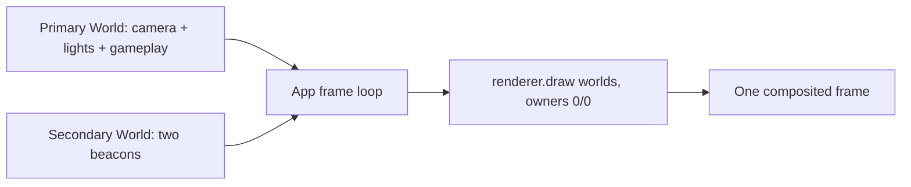

# Game Default

## Public VFX extension seam

Template consumers import only `@forgeax/engine-vfx` and
`@forgeax/engine-vfx-render`. Create a typed `VfxEffectContract`, keep patches
and channel submissions on one `ParticleEffectInstance`, and call
`host.inspect(world)` for structured evidence. Cook source with
`scripts/asset-cook-contract.mjs`; runtime never compiles WGSL. Advanced
renderer declarations execute as billboard, mesh, ribbon, trail, or beam
resources and must not be replaced with a demo-side custom mesh.

This is ForgeaX's canonical first game: a small target-range mission that teaches scene assets,
ECS behavior, physics, picking, rendering, UiAssets, spatial audio, and a host-defined asset plugin
through one coherent loop. Real projectile hits must earn Score 50 before the collapsed Asset Lab
unlocks `Target profile`; applying the profile turns the RedBox into a moving precision target. One
real projectile hit there opens an authored BlueBall -> RedBox -> YellowPillar relay. Only a real hit
on the named active target advances it, and the RedBox interval visibly uses the existing GUID-backed
FBX companion before the authored presentation returns. Finishing the relay keeps Play active: visit
the beacon too early to see its refusal, collect the three visible authored EnergyCores through real
`WASD` physics contact, then return to the activated beacon for Victory. The same panel names five optional
asset outcomes—JPEG target, WebM panel, PNG projectile, TTF score text, and the imported FBX companion—without making the player
memorize a hotkey wall; their legacy keys (`P`, `L`, `M`, `N`, `Y`) remain available for keyboard play.
Every variation changes the existing target-range world and the `R` key visibly restores the authored
RedBox baseline. The default HUD also teaches two gameplay decisions: `F`/click fires immediately,
while holding `C` starts the authored charge VFX and releasing it fires a larger, higher-impact shot;
consecutive real hits inside the visible Combo window raise the multiplier, and waiting lets it expire.
The authored Sentinel encounter also owns the project-local Boss Lightning suite. `assets/plugins/gameplay-vfx.ts`
creates exactly one GPU VFX host for both legacy player feedback and the 13 hostile emitters in
`boss-lightning-suite.pack.json`: four telegraph emitters begin on the real first-core cadence edge,
five ribbon/trail/beam/release emitters ride the real hostile projectile, and four contact emitters
start at the projectile Transform before an admitted cover/player collision is consumed. The same
owner stops on Sentinel `Disabled`, `Victory`/`Defeat`, typed Reset, and Stop, and reports structured
unavailability without a CPU particle mirror or renderer fallback. Protagonist attack presentation
and Day/Night lighting are intentionally separate follow-up slices.
The authored BouncyBall now counterattacks through the same arena: dodge it with `WASD`, watch real
physics contact remove one of three HUD hearts, shoot it through the ordinary target-health path to
disable it, or lose all hearts and use `R` to replay from typed Defeat. After taking damage, reach the
authored green pickup to restore exactly one heart; touching it at full health leaves it available.

## Run, inspect, change

From the engine checkout:

```sh
pnpm --filter @forgeax/preview dev
```

Open `http://localhost:5173/?game=game-default` in a WebGPU browser. Start with
`assets/scene.pack.json` and `assets/multi-material-target.pack.json` for persistent world content.
The `RedBox` mesh uses two positional material slots, so its triangle-list body and line-list accent
are the first multi-primitive asset recipe in the template. Start with `assets/plugins/scene-runtime.ts` for scene
loading, fallback, and physics attachment. `main.ts` is only the stable entry; `assets/plugins/game-plugin.ts`
is the root native Cordis plugin, while `assets/plugins/systems/gameplay.ts` wires the named
input, camera, movement, projectile, feedback, and camera-follow systems (top-down, fixed-radius orbit,
FPS/free-flight, and bounded orthographic Map).
`assets/plugins/game-plugin.ts` owns only realm composition and reversible effects. Its three neighbors
make the assembly map explicit: `gameplay-targets.ts` owns the target roster and GUID-backed
asset plugins, `gameplay-session.ts` owns the one-shot runtime capabilities and reset transaction, and
`gameplay-wiring.ts` registers projections and systems. The guided profile/JPEG/WebM/FBX-companion paths
are part of the normal game, while the built-in mesh, FBX cube, and glTF comparisons are created only by
`?asset-evidence=1` or `?render-evidence=1`. The guided FBX companion is prepared hidden and unlocks after
the precision mission, so it can replace the same scored target without making a
canonical-only gallery pay for cold-start setup or turning the entrypoint into a second gameplay system.
The cold-start HUD also names the authored primary `RedBox`, projects its ECS-owned health and
points (`assets/plugins/target-status.ts`). That cue is part of the playable target encounter, not an
inspection witness: after a hit the same card changes to the target's damaged health while the existing
world-space score, audio, VFX, and mission progress provide the consequence.
`assets/plugins/camera-orbit.ts`, `assets/plugins/camera-zoom.ts`, and `assets/plugins/free-camera.ts` own the
canonical spherical pose math; `assets/plugins/systems/camera-input.ts`, `assets/plugins/systems/camera-follow.ts`,
and `assets/plugins/systems/player-movement.ts` own the named ECS systems; `assets/plugins/components/gameplay.ts`
is the runtime state contract, so camera/player/projectile/flash/reset data is discoverable through the World;
`assets/plugins/gameplay-input.ts` owns the InputSnapshot-to-intent systems;
`assets/plugins/gameplay-lifecycle.ts` owns the reset request; `assets/plugins/hud.ts` and `assets/plugins/settings.ts` own the
DOM-facing UiAssets; `assets/plugins/gameplay-audio.ts` owns the GUID-loaded hit SFX and AudioSource edge loop;
`assets/shaders/hit-flash.wgsl` plus `assets/plugins/hit-flash-material.ts` demonstrate the build-time/runtime custom
material shader boundary. The authored `YellowPillar` also demonstrates the same boundary with
`assets/shaders/animated-target.wgsl`: Preview registers a schema-driven `time` uniform, the Play update writes
it, and `R` restores the authored material object exactly. The canonical standalone shader gallery
remains `apps/bevy/animate-shader`; this template keeps one animated target in the existing game.
`assets/plugins/change-detection.ts` composes ECS `Added`/`Changed` filters and resource change ticks with the
existing target hit/reset loop; the score resource is the single numeric source projected to the HUD,
while `apps/bevy/change-detection` remains the canonical isolated matrix. The settings panel also
demonstrates `Camera.clearColor` as a live preset (`Sky blue`/`Purple`) over the authored scene;
`apps/bevy/clear-color` remains the canonical empty-scene toggle. The authored `BlueBall` also gets
a private `MaterialAsset` clone with standard PBR clearcoat parameters in `assets/plugins/clearcoat-material.ts`;
it keeps the same physics, scoring, hit-flash, and reset loop, while `apps/bevy/clearcoat` remains the
canonical coated-versus-uncoated contrast.

Depth of field is the template's first depth-aware fullscreen post-process. `assets/plugins/depth-of-field.ts`
registers the authored WGSL pass through the public `Renderer.postProcess` and `PostProcessParams`
boundaries, composes it into the existing URP pipeline, and exposes a reset-safe Bokeh toggle in the
settings UiAsset. The render-evidence smoke proves that the effect changes compositor pixels and that
off/on/reset state remains owned by one gameplay settings path; `apps/bevy/depth-of-field` remains the
isolated focal-distance/aperture reference.

The authored hit loop also composes `assets/plugins/chromatic-aberration.ts` and
`assets/shaders/chromatic-aberration.wgsl` as a transient fullscreen material. `triggerFlash()` writes a
short-lived intensity through `PostProcessParams`, the Play system decays it, and `R` restores zero.
The effect is installed after DoF as an ordered URP post-effect, so the template demonstrates
multiple fullscreen passes without adding a second scene; `apps/bevy/fullscreen-material` remains
the standalone chromatic-shader oracle.

Hit feedback also demonstrates world-space MSDF text. `assets/plugins/world-score-text.ts` keeps one pooled
`GlyphText`, loads the legacy baked DejaVu `FontAsset` by GUID, and can switch that same entity with
`Y` (or the `TTF score text` button) to a second stable GUID produced from the licensed `DejaVuSansMono.ttf` by the public `font`
importer/plugin. Preview registers `fontImporter`, delivers the TTF source through the Pack-v2
catalog, and keeps the legacy pack as the comparison baseline. The named guided action changes the
same hit consequence: the imported TTF handle uses its own GlyphText metrics plus a larger cyan
presentation, and the next real score reports `imported glyph metrics on scored hit`; `R` restores
the yellow legacy label. This teaches source TTF → declared sub-asset GUIDs → MSDF bake/importer →
runtime FontAsset without copying the hello-text gallery or adding another scene. The DOM score popup
remains the screen-space UI example, so the two text contracts are visible together without creating
a second score owner. `apps/hello/text` remains the pre-baked MSDF renderer oracle, while
`apps/hello/m2-content-pipeline` remains the source-reimport/Worker recovery oracle.

The Play shooting system also demonstrates the ECS `CommandBuffer` boundary: bullets are spawned and
expired through deferred commands, while `commands.isDeferred` prevents same-system Transform writes
against pending handles. The synchronous `R` reset remains the gameplay owner's cleanup boundary, and
the render-evidence smoke records the deferred spawn count after a deterministic canvas shot. `F` (or
click) fires immediately; holding `C` builds the ECS-owned `ChargeShot` component, updates the
authored HUD charge meter, and starts the authored Pack charge effect, then releasing fires the same
projectile owner with a larger mesh and scaled score/health consequence. `R` clears the charge state,
meter, and VFX through the existing reset transaction.

The same projectile path now has a compact player-facing scoring loop. `assets/plugins/hit-streak.ts`
stores `HitStreak` on the player, records consecutive target-feedback hits for 1.65 seconds, and
caps the multiplier at `x2.75`. The awarded points are used by the existing change-detection score,
target-health, world-text, popup, VFX, and spatial-audio owners, so the second hit is visibly worth
more without adding a second score or damage authority. Its `Update` system owns expiry and the HUD
shows `ready`, `active`, and `expired`; `R` resets the same component through the normal lifecycle.

The arena's risk loop is owned by `assets/plugins/counterattack.ts`. `PlayerHealth` exists only on the
real KCC player, while `BouncyBallHazard` stores patrol/chase state only on the authored `BouncyBall`
target and `DamageHazard` is the shared contact cooldown for every damaging body. The BouncyBall keeps its existing scene, scoring, `TargetHealth`, and `Disabled`
identity; its kinematic sensor is attached to the host's single `PhysicsWorld`. The player carries
`CollidingEntities`, and only that Rapier-written contact set can admit damage. Distance selects a
movement direction but never decides a hit. Each admitted attacker contact removes exactly one heart
and arms that attacker's 1.2-second cooldown; contact during the window is harmless.

The north-arena Sentinel extends that risk loop without creating another projectile or health family.
`assets/scene.pack.json` owns the visible Sentinel at local ID 35 and cover pieces 36-37. The first
real EnergyCore collection wakes a 45-`FixedUpdate` frozen-aim telegraph; after it fires, the existing
`Projectile` component, collider, CCD motion, lifetime, cleanup, and inspection path carries the distinct
red/orange hostile shot. `assets/plugins/projectile-impact.ts` is the one contact arbiter: cover wins,
player shots can reach the charged barrier or active scored targets, hostile shots can reach only the
player, and every admitted or refused non-source collision consumes the shot exactly once.

Hostile-player contact delegates to `Counterattack.admitDamage`, so Shield, cooldown, hearts, HUD/audio/VFX,
and typed Defeat retain their existing owners. Ordinary and charged player fire neutralizes the Sentinel
through the same `TargetHealth.damage → TargetDisabling.disable` route as every scored target. Disabled,
Victory, and Defeat clear source-keyed hostile shots; the sole `R` transaction restores full Sentinel health,
dormant cadence/material, both unchanged covers, zero counters, and no projectiles before returning to Play.
The read-only `game-default.snapshot` reports the authored identities, PhysicsWorld readiness, mode/ticks,
frozen aim, health, Disabled state, impact counters, and player/hostile projectile counts; no inspection action
can synthesize wake, contact, damage, score, or terminal state.

`assets/plugins/barrier-route.ts` composes that same risk owner into an authored route. Scene local IDs
33 and 34 are the visible emitter and energy barrier guarding `EnergyCoreAlpha`. The barrier stays
dormant until the existing target relay reaches `complete`, then arms without adding another unlock
ledger. Real projectile contacts with the emitter read the existing `Projectile.impactScale`: ordinary
fire visibly refuses, while a charged value greater than one clears `BarrierRoute.active` exactly once. That one fact projects
both the barrier's mesh and its damaging Rapier body, so opening and reset cannot drift presentation
from contact. Reckless player contact is admitted only by the shared `DamageHazard` path; projectiles
and other entities cannot mutate health. Opening does not write score, health, rewards, extraction, or
Victory, and the existing EnergyCore owner still requires a later real player contact.

Extraction pressure is not another component or progress ledger. `createGameplaySession` gives the
counterattack owner a read of the existing extraction snapshot, and `deriveCounterattackPressure`
clamps `ExtractionObjective.collected` directly to tier `0..3`. The exported
`COUNTERATTACK_PRESSURE_TABLE` beside that function is the sole documented numeric table: its patrol
speed, chase speed, and pursuit radius all rise strictly per core, while its final chase speed stays at
or below 1.5 times the tier-0 authored baseline. The counterattack system alone applies those values to
the BouncyBall Transform and mode. Read-only snapshots expose the live row, while HUD text and the
existing world-text/audio/VFX collection feedback announce the same derived tier. Disabled still
suppresses movement and damage immediately; outside Reset, only choosing the existing Shield reward
explicitly arms the authored BouncyBall again.

At zero hearts the owner requests `Defeat` through the existing `GameState`. The authored HUD UiAsset
shows empty hearts and replay guidance, while the same Play run condition freezes hazard, health,
projectile, relay, target-health, and related mutation. Ordinary shots still call the established
`TargetHealth.damage → TargetDisabling.disable` route, so enough real hits neutralize the BouncyBall;
Disabled's query exclusion stops its chase and the explicit guard rejects any residual contact.
`R` enters the sole Reset transaction and restores player health, attacker state/pose, target health,
Disabled, projectiles, relay, feedback, and the three-heart HUD before returning to Play.

The recovery side of that loop is owned by `assets/plugins/health-pickup.ts`. `HealthPickup` identifies
the one `HealthPickup` entity authored in `assets/scene.pack.json`; runtime assembly adds a kinematic
sphere sensor to that same identity. Only the player's Rapier-written `CollidingEntities` set can admit
a recovery, and only in `Play` while `PlayerHealth.current < max`. An admitted contact writes exactly
`+1` to the existing `PlayerHealth`, reuses the HUD, pooled `+1 HEART` world text, spatial hit audio,
and hit VFX, then schedules ECS despawn through the system command buffer. Full-health contact is a
refusal, not a consume. The sole Reset transaction recreates the authored local identity, pose, mesh,
material, sensor, and physics body and clears the recovery witnesses.

The extraction objective is owned by `assets/plugins/energy-core-extraction.ts`. The three named
EnergyCores and one beacon remain persistent authored entities in `assets/scene.pack.json`; runtime adds
only their ECS mission components and Rapier sensors. `ExtractionObjective` on the beacon is the sole
progress authority, while the eligible roster is re-derived from live `EnergyCore` entities every frame.
Only the player's real `CollidingEntities` contacts admit each core once and schedule its deferred
despawn. Early beacon contact reports the remaining count, exactly 3/3 enlarges and activates the same
beacon, and a later real contact requests the existing typed Victory. The sole Reset transaction respawns
the three authored identities with their original poses, mesh/material handles, sensors, and bodies.

Use the focused player proof in either Preview transport:

```sh
pnpm --filter @forgeax/preview smoke:counterattack
pnpm --filter @forgeax/preview smoke:counterattack-production
pnpm --filter @forgeax/preview smoke:charged-barrier
pnpm --filter @forgeax/preview smoke:charged-barrier-production
pnpm --filter @forgeax/preview smoke:mission-progression
pnpm --filter @forgeax/preview smoke:mission-progression-production
pnpm --filter @forgeax/preview smoke:sentinel-ranged-threat
pnpm --filter @forgeax/preview smoke:sentinel-ranged-threat-production
```

Both runs use only keyboard/mouse input and the read-only `game-default.snapshot`. They prove a
full-health refusal, one-heart damage, cooldown suppression, real pickup recovery, one deferred
despawn, three-hit Defeat, frozen Play witnesses, R replay, real projectile neutralization, and a
final held-R reset with clean browser diagnostics. The mission progression smoke additionally proves
two complete relay/extraction/Victory cycles, early beacon refusal, exactly three core despawns, active
beacon admission, terminal freeze, and exact core respawn. A health change without
`CollidingEntities`, a repeated hit inside cooldown, mutation after a terminal state, a duplicate
pickup consume, or a Disabled BouncyBall attack is a failure.

The gameplay state is deliberately ECS-shaped. `GameplayInput`, `PlayerMotion`, `FreeCameraMotion`,
`CameraRig`, `Projectile`, `HitFlash`, `ProjectilePolicy`, `ResetPose`, and `TargetPresentation` are
the shared component contracts; `PlayerHealth`, `DamageHazard`, `BouncyBallHazard`, and `BarrierRoute` are the focused risk-route
contracts. `gameDefaultGameplayConfig`, `gameDefaultSettings`, and
`gameDefaultCommandCounters` are named World resources. Health, disabling, change-detection, and state
witnesses use the same resource boundary. The system files under `assets/plugins/systems/` consume and
write those contracts. A query result array is only a frame-local traversal view, never a second owner
for pose, bullets, flash timers, camera mode, authored material slots, or reset state.

For the shipped path, run `pnpm --filter @forgeax/preview smoke:render-evidence-production`. It builds
Preview and runs the same render-evidence owner from `dist/`/`vite preview`, covering the authored
FBX/compressed-texture/material/post-process/camera/hit-reset/recovery composition without a second
gameplay owner.

For shipped GPU recovery, run `pnpm --filter @forgeax/preview smoke:device-loss-reentry-production`.
It builds `dist/`, crashes Chrome's GPU process, calls public `Renderer.recover()`, and checks the
same `Play` projection, advancing fixed ticks, visible frame, and zero unexpected errors after
`alive → device-lost → alive`.

The companion also starts the charge VFX through the inspection action before the crash, so this one run proves the
late-installed particle RenderFeature's shader prewarm, Pack GUID continuity, ready billboard + mesh
buckets, and `R` reset cleanup across recovery in the production host.

Target health is the template's dense ECS example: `assets/plugins/target-health.ts` attaches one
`GameDefaultTargetHealth` component to each authored target, runs its writable `current/max`
columns through `Query.spans()`, applies hit damage with `world.set`, and restores all rows on `R`.
The render-evidence snapshot proves the contiguous capability and row-shape invariant; the canonical
32-row health grid remains in `apps/bevy/contiguous-query`.

The target roster is ECS-owned as well. `assets/plugins/scoring-target.ts` keeps one active query and
one explicit `Disabled` query, exposing only derived entity traversals to systems that need the full
reset set. Its authored `relayStep` metadata orders BlueBall, RedBox, and YellowPillar;
`assets/plugins/target-relay.ts` stores only progress in a World resource and re-derives the active
entity from that query. No bootstrap-local target array survives a disable/re-enable transition.

Structural lifecycle is paired with that health owner in `assets/plugins/target-disabling.ts`: when a target
reaches zero health, the template adds the ECS `Disabled` marker. Ordinary target queries then omit
the row while an explicit `[TargetDisabling, Disabled, Entity]` query supplies the witness; reset
removes the marker from the original target identities before restoring health. This teaches the
difference between structural disabling and merely hiding a mesh, while keeping the canonical
`apps/bevy/entity-disabling` timeline as the isolated query oracle.

The same target also demonstrates the render-owned `Visibility` component through
`assets/plugins/visibility-loop.ts`. The focused inspection action toggles explicit `hidden`/`visible` intent; the target
remains a physics body, pick candidate, scored target, and possible `Disabled` row, so this is
not a second lifecycle path. `R` restores `inherited`, while the render-evidence and Preview
snapshot report the author intent, resolved effective state, resolution source, and renderer's
explicit-hidden count. `apps/hello/entity-visibility` remains the canonical hierarchy and
shadow-participation oracle; game-default keeps only the gameplay-sized composition.

The authored HDR sky follows the same asset path. Preview registers the image importer, while
`assets/plugins/asset-content-evidence.ts` provides an opt-in browser witness for GUID loading, skybox
application, reload/reset churn, and structured missing-asset recovery:

```sh
FORGEAX_ASSET_LOOP_DIR=<run>/artifacts \
pnpm --filter @forgeax/preview smoke:asset-loop
```

The Asset Lab is the guided content front door. `assets/plugins/asset-lab-actions.ts` is the single
action router used by both the named HUD buttons and the legacy keyboard bindings; `assets/plugins/hud.ts`
owns only presentation and the status slot. The six controls therefore teach real plugin paths without
creating a second asset registry, format gallery, or reset owner. Each result is reported as `active`
or `restored` in the same panel, and the shared `R` transaction returns all six paths to the authored
RedBox baseline. The PNG projectile entry is outcome-oriented: enable it, fire once, and the status
confirms the animated projectile reached the normal hit/score/VFX/audio path. The TTF entry is also
outcome-oriented: enable it, land one real score, and the world-space label visibly switches to the
imported font presentation before `R` restores the authored label. The FBX companion is mission-gated: after
the precision hit, the `FBX target · animate` button makes the imported humanoid replace the visible RedBox
presentation while the original target's collider, score, health, and reset owners remain in place; a real
hit restarts the imported `run` clip and reports the result in the same status slot. Guided presentations are
mutually exclusive: selecting another variation restores the authored target first, while `R` restores every
variation and the original placement in one transaction.

`L` (or the `JPEG target` button) is the guided JPEG image lesson. Preview includes the exact `wood-container.jpg.meta.json`
sidecar from `forgeax-engine-assets/demo-assets/hello-sprite`; `assets/plugins/jpeg-texture-swap.ts` loads
the cooked `TextureAsset` by GUID, clones the existing RedBox `MaterialAsset` slots with
`baseColorTexture`, and keeps the authored mesh, line-list accent, collider, hit, score, and
Visibility owners intact. The render-evidence and `game-default.snapshot` projections expose the
source name, dimensions, format, color space, and swap count. `R` restores the authored material
array, so the JPEG path teaches source → sidecar → image importer → pack-index → runtime material
delivery without adding a second scene or a decoder in game code. `apps/hello/sprite` remains the
deeper 2D texture/sort oracle.

`M` (or the `WebM panel` button) is the guided runtime-video lesson. Preview serves the licensed
`forgeax-engine-assets/demo-assets/hello-video-cutscene/cutscene.webm` from Vite's `publicDir`;
`assets/plugins/video-texture-panel.ts` catalogs a runtime-only `VideoAsset { kind: 'video', url }`, loads it
through the default video loader, creates a `VideoPlayer` quad with a video-backed MaterialAsset,
and registers a host-owned `VideoElementProvider`. The panel follows the existing scored target and
faces the active camera. After the panel is enabled, a real scored hit calls the same `VideoPlayer`
owner to seek the WebM to the authored `0.35s` hit playhead, replay it, and report the hit context in
the Asset Lab status; the snapshot exposes the reaction count and playhead. This is intentionally not
a new WebM importer or Pack sidecar: the engine's video contract keeps bytes and DOM lifecycle at the
host boundary. `game-default.toggle-video-texture` and `M` toggle the panel; `R` pauses, hides,
rewinds, and clears the hit context, while Stop removes the provider and disposes the `<video>` element.
The focused canonical upload and cutscene oracles remain
`apps/hello/video-texture` and `apps/hello/video-cutscene`.

`P` (or the `Target profile` button after Score 50) is the host-plugin lesson. Before the threshold,
the authored button is disabled and the shared action adapter returns `unavailable`; keyboard, HUD,
and inspection callers therefore cannot bypass the player-facing mission. `assets/target-profile.json` and its sidecar declare a
`game-default-target-profile` GUID; `apps/preview/vite.config.ts` injects the matching importer,
while `main.ts` registers the runtime loader and loads the profile through `AssetRegistry`. The
profile applies a visible target tint, doubles the existing score value, and supplies the RedBox's
precision rotation speed through the existing `GameDefaultRotatable` ECS component;
`game-default.toggle-target-profile` and `R` provide the reversible action/reset path. The precision
hit opens the three-target relay; inactive hits keep the normal score/health/feedback consequences
but cannot advance relay progress. The accepted YellowPillar hit requests typed `GameState.Victory`;
the existing HUD UiAsset shows `Victory`, final score, and `R` replay guidance while Play-owned
movement, projectile, target, score, relay, charge, streak, and recovery mutation is frozen. `R`
still enters the one `Reset` transaction, restores Mission 1/3 and all gameplay/content/UI state,
then returns to `Play`. The `smoke:mission-progression` dev/production pair proves real hits -> unlock
-> profile -> precision hit -> wrong-target rejection -> BlueBall/RedBox/YellowPillar -> Victory
freeze -> reset -> a second real Victory -> a second reset. This is the
complete custom source → sidecar/GUID → pluginPack importer → Pack v2 → loader → gameplay chain,
adapted from `apps/hello/custom-importer` without importing its unrelated reel-machine scene.

`N` (or the `PNG projectile` button) is the first atlas-animation asset lesson. Preview adds the `hello-sprite-atlas` directory to
the existing `pluginPack` roots, so `walk.atlas.png.meta.json` is handled by the standard image
importer and its GUID resolves to a cooked `TextureAsset`. `assets/plugins/sprite-atlas-loop.ts` projects the
four regions from the companion `walk.atlas.json` build-time text channel into the public
`SpriteAnimation` + `SpriteRegionOverride` components on the same fired projectile. The engine's
`spriteAnimationTickSystem` advances frames; `game-default.toggle-sprite-atlas` (or `N`) turns the
representation on for newly spawned shots, while `game-default.snapshot.spriteAtlas` proves the
GUID, payload format, current frame, tracked entity count, animated-shot count, and animated-hit
count. The status slot confirms a real atlas projectile hit, while hit/score, physics, audio, and
`R` reset remain the existing owners. `apps/hello/sprite-atlas` stays the
10,000-entity fold/performance oracle; this template intentionally composes one animated shot
instead of copying its gallery. If named atlas metadata becomes a runtime requirement, add a
narrow host importer/plugin rather than parsing source JSON in the player.

The fired projectile is also the custom-mesh lesson. `assets/plugins/custom-projectile-mesh.ts` builds a
24-vertex indexed cube with position/normal/UV/tangent attributes and uploads a deterministic
procedural checker texture. `G` mutates the shared GPU mesh between the upper and lower atlas halves
and `R` restores the mesh bytes and removes active projectiles. The projectile keeps a capsule
collider so rendering and physics are separate public contracts. Authored image import and texture
compression remain owned by their focused canonical apps rather than making every copied game
depend on a generated, gitignored source asset. Render evidence can compare that PBR mesh with an
unlit `forgeax::sprite` quad and `forgeax::sprite-lit` using the existing authored
DirectionalLight and PointLight; the same input, physics, scoring, audio, inspection, and reset owners
remain in play. The canonical standalone custom-mesh correctness matrix remains
`apps/bevy/generate-custom-mesh`.

The authored `RedBox` is the multi-material/submesh lesson. Its separate
`assets/multi-material-target.pack.json` carries one GUID-addressed 12F mesh with a filled
triangle-list submesh and a line-list accent, plus red/cyan `MaterialAsset` rows. The scene binds
`materials[0..1]` to `submeshes[0..1]`; `triggerFlash()` changes only slot 0 so the cyan accent remains
visible, and the same `R` owner restores the complete material array. The browser render-evidence
snapshot reports the material/submesh counts and topologies before, during, and after reset. The
isolated positional/mixed-topology oracle remains `apps/hello/multi-material`.

The template also composes a secondary ECS World without creating a second
renderer or requestAnimationFrame loop. `assets/plugins/multi-world-overlay.ts` creates
two small beacons with their own material handles; `App.setDrawSource` routes
`[primaryWorld, overlayWorld]` through the existing camera and lights. The
inspection action `game-default.toggle-multi-world` is a safe falsifier: turning
it off must remove both beacons while leaving the primary gameplay scene alive,
`R` restores the documented two-world baseline, and Stop removes the routing.



This is the classic host-composition pattern: each World keeps its own ECS
state and time policy, while the App owns one measured delta and one lifecycle.
Do not add a template-local `requestAnimationFrame`; change the App seam if a
future composition needs another routing policy.

Real projectile hits own the transient VFX asset lesson. `assets/hit-vfx-effect.pack.json` is a
direct v3 author Pack with one `vfx/hit` sourceKey containing a local billboard emitter and one
world-space mesh emitter; Preview registers the shared VFX native cooker, so the build produces
the canonical runtime program and artifact rather than making the game parse source.
The authored `assets/charge-vfx-effect.pack.json` now participates in the player path: the charge
system starts and stops the same `ParticleEffectPlayer` while the player holds `C`. It keeps the same
materials and mesh but adds continuous-rate scheduling and a box-spawn emitter. Both GUIDs are
loaded by `assets/plugins/vfx-hit-loop.ts` and switched on the same player attached to the existing
scored target. The loop builds one CPU FixedUpdate simulation with the scene-space resolver and
installs one `particleRenderFeature` through the renderer's late `installRenderFeature` seam. A real
projectile hit and `game-default.trigger-vfx-hit` select the finite hit burst; the inspection action
`game-default.trigger-vfx-charge` remains recovery/evidence for that same charge mode. All paths
increment the seed and share the same billboard/mesh output buckets. `R` selects the hit asset, sets
`playing=false`, seed zero, and clears the trigger count. `game-default.snapshot.vfxHit` reports the active
mode/GUID, emitter/alive telemetry, RenderFeature readiness, and structured errors,
making source → cooker → GUID switch → ECS player → simulation → render-feature → reset
inspectable without a second scene or renderer. The focused
`apps/hello/boss-lightning` demo remains the deeper standalone multi-emitter oracle.

The focused browser proof for this composition is:

```sh
FORGEAX_VFX_CHARGE_DIR=<run>/artifacts/vfx-charge \
  pnpm --filter @forgeax/preview smoke:vfx-charge
FORGEAX_VFX_CHARGE_DIR=<run>/artifacts/vfx-charge-production \
  pnpm --filter @forgeax/preview smoke:vfx-charge-production
```

It checks both Pack index rows, positive charge output, charge-to-hit switching,
reset cleanup, and page/console/HTTP diagnostics in dev and production hosts.

The player-loop proof covers the authored Combo path in both hosts:

```sh
FORGEAX_HIT_STREAK_DIR=<run>/artifacts/hit-streak-dev \
  pnpm --filter @forgeax/preview smoke:hit-streak
FORGEAX_HIT_STREAK_DIR=<run>/artifacts/hit-streak-production \
  pnpm --filter @forgeax/preview smoke:hit-streak-production
```

It fires at the isolated authored BouncyBall, observes `x1.00 → x1.25`, waits for ECS expiry,
replays one hit, and verifies the HUD, health reset, score reset, and browser diagnostics.

The focused mesh-swap smoke is the FBX asset-format delivery proof. It explicitly starts Preview with
`?render-evidence=1`, which opts into the comparison-only asset owners. Preview registers the FBX importer and scans the hydrated
`forgeax-engine-assets/vendor/fbx-test/cube.fbx` sidecar; `assets/plugins/fbx-mesh-swap.ts` loads the emitted mesh
sub-asset by GUID and swaps it onto the same authored scoring target. Because `cube.fbx` has one
submesh while `RedBox` teaches two authored material slots, the swap owner derives a one-slot view
while FBX is active and restores the complete authored mesh/material pair on `R`. The existing
collider, hit/score, input, render-evidence, and reset owners stay in place, so this is a format
delivery change rather than a second scene. Built-in sphere and FBX cube comparisons are inspection-only;
normal play keeps the authored target mesh until the mission-gated FBX companion is enabled; the
comparison-only imported-skin owner remains available to evidence runs without changing the default scene.

The imported `humanoid.fbx` is the canonical skeletal-animation lesson. `assets/plugins/fbx-skinned-target.ts`
loads the scene and its `run` clip by stable GUID, instantiates the `Skin`/`AnimationPlayer` payload,
and joins the existing Play, hit, and reset lifecycle. In the normal game the scene is hidden until the
precision mission is complete; the guided companion then follows the scored RedBox and restarts the clip
on real hits. The evidence mode keeps the same owner visible at its canonical placement. The authored placement is written to the
imported scene root (`scale: [0.03, 0.03, 0.03]`) rather than only to the mesh node: skin palettes
are derived from the joint hierarchy, so root placement keeps the rendered mesh and its joints in
the same coordinate space. `game-default.snapshot` reports the root, skin entity, clip, joint count,
placement, animation time, and hit pulses; the inspection smoke also requires a 72-byte skinned
vertex layout and an indexed FBX draw.

The focused mesh-swap smoke also owns the glTF asset-format comparisons. Preview scans the license-safe Khronos
`khronos-gltf-samples/BoxTextured/BoxTextured.glb` and
`khronos-gltf-samples/BoxTextured/glTF/BoxTextured.gltf` sidecars with `gltfImporter`;
`assets/plugins/gltf-mesh-swap.ts` loads both mesh/material pairs by GUID. The evidence distinguishes the binary GLB
container and embedded Cesium texture from textual glTF source closure with the
external `BoxTextured0.bin` buffer. Both variants replace the same scored RedBox target, while its
explicit physics, hit, score, inspection, and reset owners remain unchanged. The variants are
mutually exclusive with each other, the built-in sphere, and the FBX swap; `R` restores the authored
RedBox mesh and its complete two-slot material array. The public render-evidence snapshot exposes
`glbMeshSwap` and `gltfMeshSwap` independently so browser probes can falsify either delivery path.

The same semantic `InputMap` accepts a standard gamepad without adding a second input owner:
left-stick axes move, South jumps, R2 fires, Y toggles the projectile UV atlas, and East requests
reset. `InputSnapshot.gamepad(0)` is frozen at the frame-start scan, so browser evidence can inspect
the exact button/trigger/axis state while normal gameplay systems consume the same actions. Run the
focused proof with `pnpm --filter @forgeax/preview smoke:gamepad`.

The authored `Player` is also the guided CharacterController example. `assets/plugins/scene-runtime.ts`
attaches a kinematic capsule and `CharacterController`; `main.ts` computes movement intent and jump
gravity, calls `PhysicsWorld.moveAndSlide`, and reads back the resolved `Transform` plus
`grounded`. The scene's static colliders own obstacle behavior, so the template has no duplicate
manual blocker list. FPS free-flight explicitly teleports the same body because KCC owns kinematic
movement in the other views.

Run the focused semantic proof with `pnpm --filter @forgeax/preview smoke:character-controller`.

After a change, run the browser smoke and the derived capability audit from the engine root:

```sh
pnpm test:browser
```

During Play, press `R` to reset the player, mission and relay progress, target profile, active FBX variation, dynamic props, bullets, score, camera, view mode, input
intent, and the player-owned hit AudioSource to the authored starting state. Shoot a target to see
the same hit event drive score, flash, popup, physics, and a spatial `sfx` bus one-shot.

The local `AGENTS.md` is the detailed contract. If a requested feature does not fit the current
engine boundary, fix the deepest owner or document the routed gap before adding a template-only
shim.
# UI consumer boundary

The default template consumes HUD and settings UiAssets from `assets/ui/*.pack.json`. Their stable markup and style live directly in the pack payloads; use `assets/plugins/hud.ts` or `assets/plugins/settings.ts` only for dynamic values, event ownership, modal focus, and cleanup. UI screenshots are auxiliary evidence; DOM assertions and lifecycle behavior remain the acceptance source of truth.

For a shipped-path check, run `pnpm --filter @forgeax/preview smoke:ui-production`. This builds
Preview and proves the two derived-identity rows, Pack v2 payloads, ShadowRoot interaction, and three clean
Stop/boot cycles from the production `dist/`; `smoke:ui-authoring` is the separate authoring-host
contract.

For an authored HUD change, run `pnpm --filter @forgeax/preview smoke:production-ui-edit`. It edits
the source pack, proves a new production package URL and live score text, and restores the pack after
the baseline/changed/restored cache legs.
