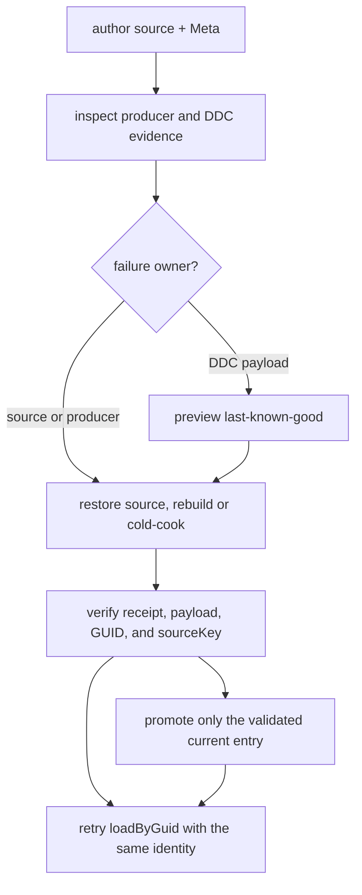

# ForgeaX format tier one


> [!IMPORTANT]
> The producer runs importer, runtime, recovery, type, layout, Meshopt Dawn/reference, KTX2/Basis 20-cell Dawn, imported Morph, and 300-frame Dawn/browser gates. The Morph route is the standard ECS `MorphWeights` + `MeshFilter`/`MeshRenderer` lane with receipt-bound observation and screenshot-owned browser pixels. Evidence remains fail-closed for the independently blocked KTX2/Basis normalized comparison and the static/no-animation FBX boundary, so row-level format release remains blocked.

## Start here

| Need | Canonical entry | What it answers |
|:--|:--|:--|
| Immutable request | [`forgeax-format-classification.csv`](../../../.forgeax-harness/docs/forgeax-format-classification.csv) | Which rows are in tier one; source SHA-256 is `a87159400f5de776ce46304540999c2e7f84cec07defceaa661d0a0926a9c2d5`. |
| Current support matrix | [`format-support-matrix.json`](evidence/format-support-matrix.json) | M7 importer/runtime/GPU/recovery/visual cells; incomplete paths remain fail-closed. |
| M7 gate report | [`final-gates.json`](evidence/final-gates.json) | 16 executable commands pass; unsupported GPU, incomplete runtime-matrix, and browser-consumer cells remain fail-closed. |
| Judgment input | [`judgment-input.md`](../../../.forgeax-harness/forgeax-loop/feat-20260812-format-classification-tier1/judgment-input.md) | Release decision, acceptance mapping, and remaining blockers. |
| Browser dogfood producer | [`apps/hello/format-tier1`](.) | Vite page at `http://127.0.0.1:5173/`; the glTF fixture is built by `gltfImporter` into Pack/Catalog and loaded through the renderer-owned `loadByGuid` route. |
| Browser visual evidence | [`browser-visual-evidence.json`](evidence/browser-visual-evidence.json) | Headed Chromium reaches the imported Morph mesh/animation through the standard `MorphWeights` + `MeshFilter`/`MeshRenderer` consumer; receipt observation and stable screenshot pixels are recorded. KTX2/Basis is separately blocked. |
| Morph GPU evidence | [`morph-visual-evidence.json`](evidence/morph-visual-evidence.json) | Imported glTF producer, renderer-owned `loadByGuid`, 300 Dawn frames, standard/base/zero/animated phases, receipt-bound observation, and source-bound browser screenshot evidence; FBX animation remains explicitly unavailable. |
| Recovery evidence | [`run-format-tier1-recovery.mjs`](../../../scripts/forgeax/run-format-tier1-recovery.mjs) | Inspect, producer failure, rebuild/cold-cook, same-identity verify for all three formats. |
| AI index | [`ai-discovery.md`](../../../.forgeax-harness/forgeax-loop/feat-20260812-format-classification-tier1/ai-discovery.md) | Short route from a format, error, GUID, or evidence cell to its owner. |

## Tier-one scope

| CSV row | Format | Current feature boundary | Current result |
|--:|:--|:--|:--|
| 8 | Meshopt | glTF source decode and runtime asset path | Real compressed source reaches importer, Pack/Catalog/loadByGuid, standard MeshFilter/MeshRenderer consumption, and a dedicated Dawn/reference topology/attribute/index readback. Browser visual output remains a separate evidence layer. |
| 18 | KTX2 / Basis | KTX2/Basis source and target capability selection | Four inputs reach importer/runtime and all 20 Dawn cells record target/fallback, Catalog/loadByGuid, residency, readback, and normalized comparison. LDR max error exceeds AC-06 and HDR normalized reference is unavailable, so the row remains blocked. |
| 26 | Morph targets | glTF imported animation plus FBX static/no-animation boundary | The glTF fixture reaches imported animation, `loadByGuid`, the standard ECS `MorphWeights` + MeshFilter/MeshRenderer lane, and Dawn/browser evidence. FBX evidence stops at the static importer/Pack boundary; no FBX animation or shared glTF/FBX runtime/GPU capability is claimed. |

## Evidence flow



The recovery runner is deliberately producer-shaped. It never mints a new GUID, changes `sourceKey`, or treats a cache hit as proof. A failed cook leaves `currentKey` and `lastKnownGoodKey` observable; a successful retry is current only after receipt and payload verification.

## Structured failure vocabulary

| Failure code | Owner | Required next action |
|:--|:--|:--|
| `format-tier1-meshopt-source-invalid` | Meshopt importer | Inspect the source and rerun the producer rebuild/cold-cook. |
| `format-tier1-ktx2-ddc-payload-invalid` | DDC validation plus KTX2/Basis producer | Inspect the receipt, keep LKG read-only, delete the invalid payload, and cold-cook. |
| `format-tier1-morph-source-invalid` | glTF/FBX Morph importer | Repair target/weight cardinality, then rebuild/cold-cook. |
| `ddc-entry-invalid` | DDC entry store | Follow `.expected` and `.hint`; do not publish the unreadable entry. |

Every failure is machine-readable as `.code`, `.expected`, `.hint`, and `.detail`. The canonical runtime asset route remains `loadByGuid`; handles are projections and do not replace GUID identity.

## Current gates

- [x] CSV provenance and first-tier rows 8, 18, and 26 are pinned.
- [x] Imported glTF Morph producer reaches `AssetRegistry.catalog` and `loadByGuid`; Dawn runs 300 frames with final readback pass. FBX remains static/no-animation importer evidence.
- [x] Meshopt, KTX2/Basis, and Morph recovery contamination scenarios are supported.
- [x] Available M7 executable checks run from one implementation revision; final-gates remains blocked when matrix, normalized comparison, or browser consumer evidence is incomplete.
- [x] Whole-fleet Dawn regression passes; the Morph browser producer has receipt-bound Standard-lane observation plus stable screenshot pixels.
- [x] Final importer/runtime/GPU/recovery/visual matrix is published fail-closed.
- [x] Browser Morph visual support is promoted for the standard ECS lane; visual acceptance is screenshot-owned rather than a synthetic `visiblePixels` field. KTX2/Basis still has no browser texture consumer.
- [x] Closed-loop judgment approval is recorded for this implementation; format-tier1 release remains fail-closed only for its independent KTX2/Basis and FBX capability boundaries.

<details>
<summary>Run the M6 recovery evidence locally</summary>

```sh
pnpm --filter @forgeax/engine-ddc build
node scripts/forgeax/run-format-tier1-recovery.mjs --json
node --test apps/hello/format-tier1/evidence/__tests__/recovery-scenarios.test.mjs
```

The command creates a temporary DDC root and removes it after verification. It does not mutate the project Catalog or the immutable CSV.

</details>

<details>
<summary>Run the Morph importer and GPU evidence locally</summary>

```sh
pnpm --filter @forgeax/engine-render build
node apps/hello/format-tier1/scripts/smoke-dawn.mjs
pnpm exec vitest run --project dawn packages/render/src/__tests__/morph-culling-reentry.dawn.test.ts
```

The Dawn runner records imported `loadByGuid`, standard-lane, and receipt-bound evidence under `evidence/morph-visual-evidence.json`. Headed browser capture is produced separately by the Vite page; screenshot pixels are the visual authority.

</details>

<details>
<summary>Run the feature-owned browser dogfood producer</summary>

```sh
pnpm --filter @forgeax/hello-format-tier1 dev --host 127.0.0.1 --port 5173
```

Open `http://127.0.0.1:5173/` and inspect the Meshopt consumer, the four KTX2/Basis blocked input cells, and the four Morph states. Each Morph card reports the real imported weights consumed by `MorphWeights` and the standard MeshFilter/MeshRenderer lane; judge visual output from the captured screenshot.

</details>

<details>
<summary>Run the M7 final gates locally</summary>

```sh
node apps/hello/format-tier1/scripts/run-final-gates.mjs
node --test apps/hello/format-tier1/evidence/__tests__/final-support-matrix.test.mjs
```

The runner exits non-zero while any required release capability remains unresolved. That is intentional: command records and structured GPU witnesses remain usable, and release cannot be mistaken for a green result. KTX2/Basis normalized failures, HDR unsupported cells, and the FBX static/no-animation boundary remain visible in the report.

</details>
