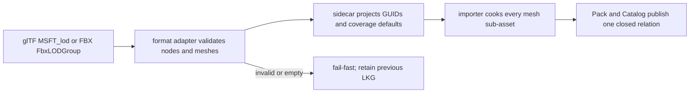

# hello-lod-occlusion

This fixture consumes a real `lod-scene.gltf` and its producer-authored
`lod-scene.gltf.meta.json` sidecar through Vite `pluginPack` and the glTF
importer. The root node uses standard `MSFT_lod` node relationships; the
sidecar records the two lower-detail mesh GUIDs and absolute projected-height
coverage values `0.5` and `0.2`.

## Source and sidecar contract

The source format owns the relationship, while the sidecar owns the durable
engine identity and coverage facts. A standard glTF file places
`MSFT_lod.ids` on the highest-detail node and puts the
`MSFT_screencoverage` array in that node's `extras`. The standard array has one
entry for each root/lower range plus a terminal discard threshold. For example,
`[0.5, 0.2, 0.01]` describes ranges `1.0..0.5`, `0.5..0.2`, and
`0.2..0.01`; the terminal discard value is intentionally not copied into
`MeshAsset.lods`. The importer also reads the repository's older document-level
coverage fixture only as an internal compatibility adapter.

```json
{
  "extensions": { "MSFT_lod": { "ids": [1, 2] } },
  "extras": { "MSFT_screencoverage": [0.5, 0.2, 0.01] }
}
```

FBX `FbxLODGroup` levels follow the same ordered root-to-lower projection. FBX
does not provide a portable screen-coverage scale, so a first import with no
explicit sidecar values uses the shared deterministic default for `n` lower
levels:

$$c_i = round6(0.5 \times 0.4^{i-1}), \qquad i = 1 \ldots n$$

| Total authored LODs | Lower levels (`n`) | Generated `screenCoverage` |
|:--:|:--:|:--|
| 2 | 1 | `0.5` |
| 3 | 2 | `0.5, 0.2` |
| 4 | 3 | `0.5, 0.2, 0.08` |

Existing legal sidecar values always win; only an appended suffix receives
defaults. Every referenced root/lower mesh must produce a non-empty mesh
sub-asset before publication. Empty primitives, missing mesh rows, malformed
coverage, or an unresolved GUID fail the import and leave the previous sidecar
and last-known-good Pack authoritative.



`lod-scene.gltf` intentionally contains different payload sizes (LOD0: 8
vertices/36 indices, LOD1: 6/24, LOD2: 4/12). Rebuild the app after changing
the source or sidecar; ignored `dist/` output is disposable and must never be
treated as an independently authored asset.

The browser and Dawn scripts fail closed when their backend or compositor is
unavailable. They do not replace the asset with procedural geometry, hand-write
a pack index, or treat canvas liveness as visual evidence. Renderer inspection
is a detached bounded POD containing source identity, view/slot generations,
LOD histogram, query timing, page pressure, fallback error hints, and at most
64 stable samples. The performance producer also records renderer-owned CPU
draw process time, query-page map-only latency, and GPU-selected index work.
CPU A/B p50/p95 values use only the post-warm-up retained window, matching the
GPU timing sample window; warm-up CPU values remain diagnostics and never enter
the regression ratio. CPU p95 remains diagnostic because hosted runner tails
can contain an isolated GC or scheduler interruption; admission uses the paired
post-warm-up CPU median with a bounded 20% regression allowance. GPU admission
keeps a hard 15% median-improvement floor and a <=5% p95 regression ceiling;
these are GPU timestamp thresholds, not wall-clock measurements.
Query memory is reported as the combined resolve plus staging allocation
(`96 KiB + 96 KiB = 192 KiB` for the three-page pool), not as a single buffer.

```bash
pnpm --filter @forgeax/hello-lod-occlusion build
pnpm --filter @forgeax/hello-lod-occlusion smoke
pnpm --filter @forgeax/hello-lod-occlusion smoke:browser
```

## What this fixture proves

- [x] The input is a real glTF file with standard `MSFT_lod` node relations.
- [x] The producer sidecar supplies stable mesh GUIDs, Pack references, and
  absolute projected-height coverage.
- [x] Vite `pluginPack` builds the source through the registered glTF importer;
  the generated `dist/pack-index.json` is an output, not a hand-written input.
- [x] Runtime inspection is bounded and detached, with explicit readiness,
  fallback, and generation identity.
- [ ] GPU performance evidence: `smoke:performance` remains fail-closed until
  `evidence/gpu-frame-samples.json` contains same-device Browser/Dawn samples.

The performance schema reserves 32 warm-up frames and retains 64 samples for
each A/B order (128 retained samples total). It rejects synthetic samples,
unavailable backends, and identity mismatches. The regular `smoke` and
`smoke:browser` commands are asset/consumer checks; they are not substitutes
for a compositor screenshot or GPU timestamp evidence.

The producer keeps one locked 128-candidate fixture (16 visible / 112
occluded) and records four structural groups: `control` and the A/B baseline
(root-pinned LOD0, no occluder), `lodOnly` (LOD-on, no occluder),
`occlusionOnly` (root-pinned LOD0, occluder-on), and `treatment` (LOD-on,
occluder-on). GPU timing is still the two-order baseline / treatment
comparison. CPU p95 admission compares `treatment` with `occlusionOnly`, which
holds the query transport and occluder cost constant and isolates incremental
LOD work; the no-occluder baseline remains the GPU control.
Group rows run for the shared derived settle floor and then require stable
observations; at `Q=2048` this is 98 submits and at `Q=4096` it is 50. Each row
also reports `batchCount` (all selector/filtered plan batches) and
`indirectDrawCount` (non-zero-capacity raster commands actually encoded).
Suppressed-only batches remain in selector accounting but do not create a
zero-sized storage binding or an empty raster command, so
`0 < indirectDrawCount <= batchCount` is the expected relation. The current
topology key may still turn 128 LOD candidates into 128 singleton selector
batches, and that cost must remain visible in production evidence. The renderer
inspection v2 publishes rows for every World attachment
and marks their attribution mode. When the renderer joins every row to the
same submit it publishes same-submit per-World GPU facts; missing rows or
projection-only attribution keep the World-reorder falsification unavailable.
The producer never infers attribution from array position or aggregate counts;
missing rows or unavailable attribution remain fail-closed.

The authored occluder is sanity-calibrated with one central-hidden and one
side-visible sentinel using the same imported payload and proxy-query path.
That calibration does not stand in for the locked 16/112 workload. The
delayed-map falsifier injects 15 ms before the real map and requires at least
10,000 µs of renderer-reported map latency; no host-only timer is accepted.

> [!IMPORTANT]
> When inspection reports `producer-failed`, repair the source Meta or importer
> and rebuild through the import owner. For `query-failed`, `page-exhausted`,
> or `device-loss`, retry after the next valid frame. All failure paths remain
> all-visible and never remove a draw because a query transport failed.
