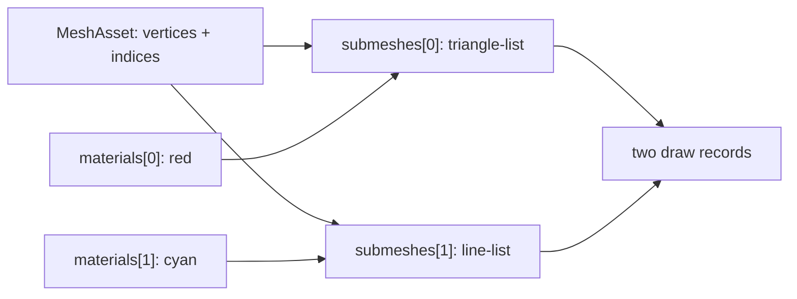

# Multi-material MeshAsset

This demo is the smallest public recipe for drawing multiple primitives from one
`MeshAsset`. A single index buffer carries a filled quad and two nested wire
loops; `MeshRenderer.materials[i]` selects the material for `submeshes[i]`.

> [!IMPORTANT]
> The material array is positional, not a material-name lookup. A missing or
> duplicated slot is deliberately a falsifier: the renderer must reject a
> count mismatch, and the cyan line pass must disappear when both slots use red.

## Data flow



| Primitive | Range | Topology | Slot | Expected pixels |
| --- | ---: | --- | ---: | ---: |
| Filled quad | 6 indices | `triangle-list` | `materials[0]` | red |
| Nested wire loops | 16 indices | `line-list` | `materials[1]` | cyan |

## Run the gates

```bash
pnpm --filter @forgeax/hello-multi-material typecheck
pnpm --filter @forgeax/hello-multi-material build
pnpm --filter @forgeax/hello-multi-material smoke
```

The Dawn smoke renders 300 frames and requires both red and cyan readback
counts to stay above zero. `FALSIFY=truncate-materials` and
`FALSIFY=duplicate-material` exercise the two load-bearing failure modes.

## M26 default inheritance and repair

The M26 gauntlet keeps the same mesh and adds two mesh-owned
`materialSlots.defaultMaterial` GUIDs. With `MeshRenderer.materials=[]`, the
renderer exposes `mesh-default` provenance for both slots. The journey then
adds an ignored overflow override, checks the structured
`mesh-renderer-material-override-overflow` detail and unchanged red/cyan
pixels, repairs slot 0 in the same `World`/page, and checks blue/cyan pixels
plus settled diagnostics. Repeating the empty override is the cleanup
idempotence check.

```bash
pnpm --filter @forgeax/hello-multi-material smoke:m26
pnpm --filter @forgeax/hello-multi-material smoke:m26:browser
```

The public browser controller is `globalThis.__forgeaxMultiMaterial`; its
`readState`, `injectOverflow`, `repair`, and `cleanup` methods are intentionally
small evidence hooks rather than a second rendering path.

## M32 shared-handle generation fencing

The M32 journey uses the same page and `World` to bind an explicit red
`MaterialAsset` handle beside a cyan sibling, remove only the red consumer
edge, release its producer grant, and allocate a blue replacement in the same
slot with a fresh generation. `resolveAssetHandle(world, oldHandle)` must retain
the exact `shared-ref-stale` detail, while the pre-repair frame remains red/cyan.
The fresh handle is then bound through `World.set`; the sibling, device error
stream, reference counts, and repeated cleanup are checked before the page is
closed.

```bash
pnpm --filter @forgeax/hello-multi-material smoke:m32
pnpm --filter @forgeax/hello-multi-material smoke:m32:browser
```

The browser controller adds `readM32State`, `m32Baseline`, `m32Invalidate`,
`m32Repair`, and `m32Cleanup` for this journey only. They expose public ECS
mutations and observed state; they do not create a second renderer or rebuild
the `World`.
