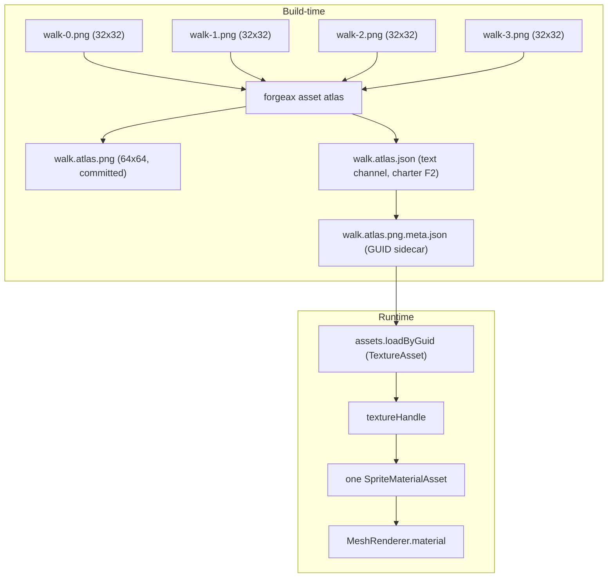

# hello-sprite-atlas

> **1 atlas / 10000 independent sprite entities / 1 instanced drawIndexed** -- the canonical AI-user spawn shape (Transform + MeshFilter + MeshRenderer + SpriteRegionOverride per entity) collapsed transparently into a single GPU draw by the record-stage fold operator (feat-20260622-chunk-gpu-instancing-sprite-tilemap M1). No `Instances` component on any entity -- AC-03 transparent abstraction (charter P4).

## 4-step recipe (charter F1 progressive disclosure)

```ts
import { AssetGuid } from '@forgeax/engine-pack/guid';
import { HANDLE_QUAD } from '@forgeax/engine-assets-runtime';
import { Transform } from '@forgeax/engine-scene';
import { MeshFilter, MeshRenderer } from '@forgeax/engine-render';
import { SpriteRegionOverride } from '@forgeax/engine-render/authoring';

// Step 1: createApp(canvas, opts) -- one-screen takeoff
const appRes = await createApp(target, { clearColor: [0.07, 0.07, 0.09, 1] });

// Step 2: select the scoped dev catalog or the emitted production catalog
configureRuntimeAssetCatalog(assets, runtimeBinding);

// Step 3: load the baked atlas by its authored GUID
const atlasGuid = AssetGuid.parse('0e8657b1-c0ab-4940-a4f6-27fcd976823c');
const texHandleRes = await assets.loadByGuid<TextureAsset>(atlasGuid.value);

// Step 4: spawn independent entities; the renderer folds them transparently
for (const position of positions) world.spawn(
  { component: Transform, data: { /* ... */ } },
  { component: MeshFilter, data: { assetHandle: HANDLE_QUAD } },
  { component: MeshRenderer, data: { materials: [materialHandle] } },
  { component: SpriteRegionOverride, data: { region: new Float32Array([0,0,0.5,0.5]) } },
);

// Start the rAF loop
app.start();
```

## Component field tables

### SpriteRegionOverride (1 field)

| Field | Type | Purpose |
|:--|:--|:--|
| `region` | `array<f32, 4>` | Per-entity UV region [uMin, vMin, uW, vH]; written by tick system each frame |

> [!NOTE]
> This app is the M4 fold/performance oracle. It intentionally uses one static atlas
> region and does not install a per-frame animation system or an `Instances` component.
> The public `SpriteAnimation` + `SpriteRegionOverride` playback recipe lives in
> `apps/bevy/sprite-animation`; keep that focused animation consumer separate from this
> 10,000-entity fold gate.

## Error scenarios (charter P3 structured failure)

| Scenario | Error class | `.code` | `.hint` | Recovery |
|:--|:--|:--|:--|:--|
| Missing `<canvas id="app">` | `Error` (throw) | -- | `missing <canvas id="app"> in index.html` | Fix HTML |
| `createApp` returns `!ok` | `AppError` | `app-error` | App-level failure | `reportAppError(err)` |
| `renderer.ready` fails | `RhiError` | RHI-specific | `.hint` on error | Log + return |
| `ATLAS_GUID` parse fails | `PackError` | `guid-parse-failed` | `.hint` on error | Log + return |
| `loadByGuid` fails | `AssetError` | `asset-not-found` | `.hint` on error | Log error + return (fail-fast) |
| Sidecar fetch fails | `TypeError` / HTTP error | -- | `sidecar fetch error` | Log error + return (fail-fast) |
| Sampler/material registration fails | `AssetError` | `asset-not-registered` | `.hint` on error | Log + return |
| atlas Pack row is missing | `AssetError` | `asset-not-found` | GUID and Pack v2 catalog are not aligned | Repair the authored sidecar/catalog path |

## Atlas topology (Mermaid)



## Run locally

```bash
pnpm --filter @forgeax/hello-sprite-atlas dev      # vite dev server -> http://localhost:5194
pnpm --filter @forgeax/hello-sprite-atlas build    # vite production build
pnpm --filter @forgeax/hello-sprite-atlas smoke    # dawn-node 300 frames + pixel readback (eps<=0.05)
```

## Rebuild atlas from sources

The committed `walk.atlas.png` and `walk.atlas.json` are generated by the
`forgeax asset atlas` CLI from the four 32x32 source frames in the
`forgeax-engine-assets/demo-assets/hello-sprite-atlas/frames/` asset authority.
To regenerate them (e.g. after adding or changing source frames):

```bash
# From the repository root:
pnpm forgeax asset atlas \
  --input "forgeax-engine-assets/demo-assets/hello-sprite-atlas/frames/*.png" \
  --name walk \
  --output "forgeax-engine-assets/demo-assets/hello-sprite-atlas" \
  --maxSize 4096

# Then force-add the binary outputs (gitignore bypasses *.png by default):
git add -f forgeax-engine-assets/demo-assets/hello-sprite-atlas/walk.atlas.png
git add    forgeax-engine-assets/demo-assets/hello-sprite-atlas/walk.atlas.json
git add    forgeax-engine-assets/demo-assets/hello-sprite-atlas/walk.atlas.png.meta.json
```

The `walk.atlas.json` sidecar remains the charter F2 text channel for downstream animation
consumers; this fold demo only needs the authored atlas GUID and a fixed first-frame region.
After regenerating the atlas, also regenerate the smoke reference PNG:

```bash
pnpm --filter @forgeax/hello-sprite-atlas smoke    # writes reference PNG + exits 1 on first run
git add -f apps/hello/sprite-atlas/scripts/reference-dawn-walk-frame-0.png
```

## Source roadmap

| Path | Purpose |
|:--|:--|
| `index.html` | `<canvas id="app">` host page |
| `src/main.ts` | Bootstrap: createApp + asset loading + spawn 10000 independent sprite entities (no `Instances` component) sharing one atlas material |
| `src/__tests__/main-type-affordance.test-d.ts` | AC-08 IDE autocomplete type inference: SpriteAnimation 6-field shape + SpriteRegionOverride 1-field shape |
| `scripts/smoke-dawn.mjs` | dawn-node headless smoke: 10000 sprite entities, 300-frame loop, asserts drawIndexed=1/frame + instanceCount=10000 + foldedDraws metric advance (M4 / w17) |
| `vite.config.ts` | forgeaxShader + pluginPack, port 5194 |
| `forgeax-engine-assets/demo-assets/hello-sprite-atlas/walk.atlas.json` | Atlas sidecar (charter F2 text channel): 4 regions [name, uMin, vMin, uW, vH] |
| `forgeax-engine-assets/demo-assets/hello-sprite-atlas/walk.atlas.png.meta.json` | GUID sidecar for `loadByGuid<TextureAsset>` resolution |
| `assets/walk.atlas.png` | 64x64 baked atlas PNG (4 walk frames, 2x2 grid) |

## Reference PNG

| File | Generated by |
|:--|:--|
| `scripts/reference-dawn-walk-frame-0.png` | First run of `pnpm --filter @forgeax/hello-sprite-atlas smoke` (writes baseline + exits 1 with "WRITTEN" marker; force-add then rerun for COMPARED mode) |

> The reference PNG is produced only when a WebGPU-capable runtime executes the smoke script (dawn-node + Vulkan or a real GPU). When the host container lacks Vulkan, the smoke aborts and the baseline stays un-generated; the first GitHub Actions CI run with the standard `lavapipe` swiftshader stack populates it (charter F2 + P5 producer/consumer split).

## What this demo proves

- **`SpriteRegionOverride` is a 1-field per-entity UV override**. The shader computes `uv * region.zw + region.xy`, so a single float4 write selects one atlas tile without rebinding the material.
- **10,000 independent entities share one atlas material**. The record-stage fold groups equal `(Layer.value, position.z, materialHandle)` rows and emits one instanced `drawIndexed` call; there is no `Instances` opt-in component.
- **The fold is transparent to the AI user**. The canonical spawn shape remains `Transform + MeshFilter + MeshRenderer + SpriteRegionOverride`; the renderer owns the optimization.
- **The atlas sidecar is a build-time text channel** (charter F2). The companion `apps/bevy/sprite-animation` consumer demonstrates how to project its regions into `SpriteAnimation`; this app keeps the performance oracle deterministic with a fixed first-frame region.

## Relation to docs/roadmaps/2026-05-15-2d-roadmap.md M2

This demo is the visible deliverable for **`docs/roadmaps/2026-05-15-2d-roadmap.md` M2 Atlas + Animation**. The M2 roadmap line "100 entities share 1 atlas -> 1 draw call (instanced) + frame-step accuracy unit test" is satisfied by the 10x10 instance grid (`INSTANCE_COUNT = 100`) and the `packages/runtime/src/systems/__tests__/sprite-animation-tick-*.test.ts` unit test suite (6 files).
