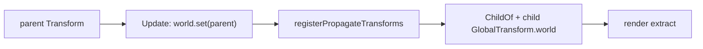

# Hello transform hierarchy

This demo is the focused `ChildOf`/`GlobalTransform.world` propagation oracle. A
parent cube moves in an `Update` system, a child keeps only its local offset,
and `registerPropagateTransforms(world)` derives the child's world matrix before
render extraction. A static sphere is the stability landmark.

## Data flow



The public recipe is an explicit `World`, `ChildOf { parent }`, local
`Transform`, and one propagation registration. The Dawn smoke renders a rest
frame twice for stability, moves only the parent, and requires a non-black
parent-move diff; `stabilityDiff` and `parentMoveDiff` are printed together so
an AI user can distinguish a broken hierarchy from nondeterministic rendering.

```bash
pnpm --filter @forgeax/hello-transform-hierarchy typecheck
pnpm --filter @forgeax/hello-transform-hierarchy build
pnpm --filter @forgeax/hello-transform-hierarchy smoke
```

## Template boundary

`templates/game-3d` already owns hierarchy through authored SceneAsset
mounts, `ChildOf` projection, imported FBX/glTF targets, physics, gameplay,
render evidence, and typed reset. This static parent/child gallery is therefore
kept as the canonical propagation oracle rather than copied as a second scene.
A future guided slice would need a hierarchy change on an existing gameplay
entity with a visible consequence and the same reset/re-entry/cleanup owner.
