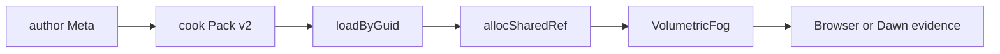
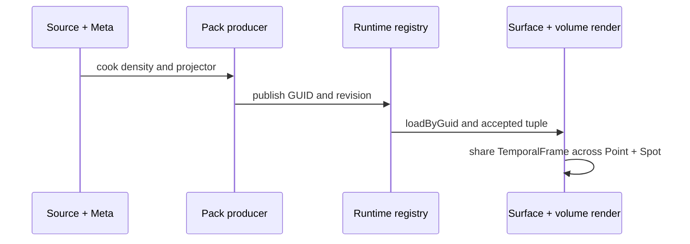

# Hello volumetric fog

## AI-first MVD route

这是公开 3D density texture 与 volumetric fog 的最小消费示例。它只组合 Engine 已有的
`TextureAsset`、`AssetRegistry`、`VolumetricFog` 与 RenderGraph；fog 的采样、光照和恢复
仍由 Engine owner 执行。



### Copyable 128³ density route

The fixture below is the complete author-to-World path. Keep the GUID and
`sourceKey` unchanged when the producer is repaired; they are the identity
facts that connect Meta, Pack, and the runtime registry.

`assets/density.volume.json`:

```json
{
  "format": "forgeax-volumetric-density",
  "width": 128,
  "height": 128,
  "depth": 128,
  "base": 90,
  "gradient": 18
}
```

`assets/density.volume.json.meta.json`:

```json
{
  "schemaVersion": "1.0.0",
  "kind": "external-asset-package",
  "importer": "volumetric-density",
  "revision": { "digest": "volumetric-density-v1", "observedAt": 1, "rootId": "volumetric-density" },
  "source": "density.volume.json",
  "importSettings": {},
  "subAssets": [{
    "guid": "019f0000-0000-7000-8000-0000000003f1",
    "sourceIndex": 0,
    "sourceKey": "volumetric-fog/density.raw",
    "name": "volumetric-density",
    "kind": "volumetric-density"
  }]
}
```

After the [`volumetric-density` importer](./src/volumetric-density-importer.ts)
publishes Pack v2, the runtime half is deliberately small:

```ts
import type { TextureAsset } from '@forgeax/engine-types';
import { SpotLight, VolumetricFog } from '@forgeax/engine-render';
import { Transform } from '@forgeax/engine-scene';
import { volumetricDensityLoader } from './src/volumetric-density-importer';

assets.loaders.register(volumetricDensityLoader());
const guid = assets.parseGuid('019f0000-0000-7000-8000-0000000003f1');
const result = await assets.loadByGuid<TextureAsset>(guid);
if (!result.ok) throw new Error(`density load failed: ${result.error.code}`);
const density = world.allocSharedRef('TextureAsset', result.value);
const selectedSpot = world.spawn(
  { component: Transform, data: { pos: [0, 5.6, 0] } },
  {
    component: SpotLight,
    data: {
      direction: [0, -1, 0],
      intensity: 100,
      range: 12,
      innerConeDeg: 14,
      outerConeDeg: 28,
    },
  },
).unwrap();

world.spawn({
  component: VolumetricFog,
  data: {
    light: selectedSpot,
    density,
    boundsMin: [-1, -1, -1], boundsMax: [1, 1, 1],
    extinction: [0.2, 0.2, 0.2], albedo: [0.8, 0.8, 0.8],
    emission: [0, 0, 0], anisotropy: 0, maxDistance: 50,
  },
}).unwrap();
```

The resulting `TextureAsset` is `shape.viewDimension: '3d'` with a
`128 × 128 × 128` extent and linear `r8unorm` data. For the source descriptor and
raw-byte sibling contract, see [`packages/image/README.md`](../../../packages/image/README.md).

## Official Three.js volume-lighting parity scene

The runnable scene is deliberately a direct consumer of Engine owners. It
matches the pinned Three.js example with a procedural `TeapotGeometry(0.8,
18)`, a `100 × 100` floor at `y = -3`, a `20 × 10 × 20` volume, and the exact
camera and light fields recorded in
[`threejs-volume-lighting-parity.json`](./threejs-volume-lighting-parity.json).



The projector bytes are vendored under
`forgeax-engine-assets/threejs/webgpu-volume-lighting/` with MIT notice and
SHA-256 provenance. They are not a fake beam, a second fog shader, or a second
renderer. The `acceptedTuple` is exactly
`guid/generation/view/sampler/projection/revision`; invalid publication stays
on the LKG recovery path.

| Parity fact | Value |
|:--|:--|
| Camera | `PerspectiveCamera(60, 0.1, 100)` at `(-8, 1, -6)` looking at origin |
| PointLight | `#f9bb50`, intensity `3`, range `100`, `(0, 1.4, 0)` |
| SpotLight | white, intensity `100`, angle `PI / 6`, penumbra `1`, decay `2`, `(2.5, 5, 2.5)` |
| Volume | `128³`, 12 steps, resolution `0.25`, denoise `0.6`, intensity `1` |
| Output | Neutral tone mapping, exposure `2`, raw paired capture `1920 × 1080` |

### 验证

- Browser：`pnpm --filter @forgeax/hello-volumetric-fog build`，再运行 `smoke:browser`；
  receipt 必须带 backend、pixel、provenance、verdict 与 confidence。
- Browser receipt：`FORGEAX_FOG_RECEIPT=/tmp/volumetric-fog-receipt.json FORGEAX_FOG_URL=http://127.0.0.1:5173/ pnpm --filter @forgeax/hello-volumetric-fog smoke:browser`，然后运行
  `node scripts/smoke-falsify.mjs --receipt /tmp/volumetric-fog-receipt.json --head "$(git rev-parse HEAD)"`。
  receipt 的 backend、temporal limits、volume identity 与 renderer errors 均来自一次 settle 后的
  `renderer.inspect()`，falsifier 会检查它们之间的一致性。
- Dawn：`pnpm --filter @forgeax/hello-volumetric-fog smoke`；输出包含 fresh HEAD、limits、
  memory、sample 与 recovery facts。
- Falsification：`node scripts/smoke-falsify.mjs --receipt <receipt.json>`；backend、GUID、
  generation 或 exact head 不一致时必须退出 1。

> [!IMPORTANT]
> 失败先执行 inspect，再按错误 `hint` 修复 Meta/import/Pack producer。示例不使用 fallback、
> atlas、stand-in 或 app-local fog shader。
