# Textures (LearnOpenGL §1.4)

> [!NOTE]
> **对应 LO 原章节**：[LearnOpenGL §1.4 Textures](https://learnopengl.com/Getting-started/Textures)
>
> **对应引擎能力**：feat-20260515-learn-render-getting-started — `@forgeax/engine-image` 解码 + `forgeax asset import` 产 sidecar + GUID 寻址的 `AssetRegistry.loadByGuid<TextureAsset>` 单入口；render-system `materialBindGroup` 自动消费 `MaterialAsset.baseColorTexture` 槽位（`packages/runtime/src/render-system-extract.ts` 内 switch `mat.shadingModel` 路由）。

## 这个示例展示什么

LO §1.4 的核心论点是「把磁盘 JPG 解码 → 上传到 GPU → fragment shader 用 `texture(sampler2D, vTexCoord)` 采样」。forgeax 把同样的语义拆成 4 步 recipe，全部走 `AssetRegistry.loadByGuid` 单入口（charter P4 一致抽象 + AC-15 (c)）：

1. **磁盘 GUID-寻址** — `assets/wood-container.jpg` 配套 `wood-container.meta.json` (`kind=external-asset-package`，`subAssets[0]={kind:'image', sourceIndex:0, guid:UUIDv7, importSettings:{colorSpace,mipmap,addressMode,filterMode}}`)；GUID 由 `forgeax asset import` 一次性铸造，`reimport` byte-identical（AC-16）
2. **Cube + Material 同型 sidecar** — `cube-mesh.stub.meta.json`（GUID 别名到引擎内置 `HANDLE_CUBE`）+ `material-wood.pack.json` (`kind=internal-text-package`，`UnlitMaterialAsset.baseColorTexture` 引用 wood GUID)
3. **运行时 `loadByGuid<T>(guid)` 单入口** — 3 个 `await assets.loadByGuid<TextureAsset|MeshAsset|MaterialAsset>(guid)` 调用即拿到 `Handle<T>`；调用栈不暴露 `decodeImage` / `uploadTexture` 等低层入口（charter P5 producer/consumer split）
4. **ECS 实体** — `world.spawn(Transform, MeshFilter{cube}, MeshRenderer{material})`；render-system 每帧 `world.query(MeshRenderer)` 迭代时对 `entry.material.baseColorTexture` 推断为 `Handle<TextureAsset> | undefined`，无需 `as` 兜底（AC-09 grep 锚点 `// ac-09:`）

> [!IMPORTANT]
> **forgeax 不暴露 `glGenTextures` / `glBindTexture` / `glTexImage2D` / `glTexParameteri` 这类 OpenGL 全局状态机入口**；texture 上传 + 采样器配置由 `MaterialAsset.baseColorTexture` + `TextureAsset.{format,colorSpace,mipmap}` 在引擎内部完成（charter P4 一致抽象）。AI 用户写「我要给 cube 贴 wood-container 木箱」就是写 3 个 GUID 字面量 + 3 行 `loadByGuid` + 1 个 `world.spawn`，不用学 GL `GL_TEXTURE_2D` / `GL_TEXTURE_WRAP_S` / `GL_TEXTURE_MIN_FILTER` 词汇。

## 渲染流程

```mermaid
flowchart LR
  Disk["assets/wood-container.jpg<br/>+ .meta.json"] --> Imp["forgeax asset import"]
  Imp --> Sidecar["GUID 写入 sidecar<br/>(UUIDv7)"]
  Sidecar --> RT["loadByGuid<TextureAsset>"]
  RT --> Reg["AssetRegistry"]
  Reg --> Up["uploadTexture<br/>(rgba8unorm-srgb)"]
  Up --> Mat["UnlitMaterialAsset<br/>baseColorTexture"]
  Mat --> Spawn["world.spawn<br/>MeshRenderer"]
  Spawn --> RS["RenderSystem extract<br/>materialBindGroup"]
  RS --> Pipe["unlit.wgsl + sampler2D"]
  Pipe --> Frame["swap-chain frame"]
```



## 引擎用法

```ts
// 来自 src/index.ts 的关键片段（三段式注释 AC-06）。

// 1. engine usage - 引擎公开符号集
import { World } from '@forgeax/engine-ecs';
import { AssetGuid } from '@forgeax/engine-pack/guid';
import { createRenderer, EngineEnvironmentError } from '@forgeax/engine-runtime';
import { Camera, MeshRenderer, MeshFilter } from '@forgeax/engine-render';
import { Transform } from '@forgeax/engine-scene';
import { HANDLE_CUBE } from '@forgeax/engine-assets-runtime';
import type { Handle, MaterialAsset, MeshAsset, TextureAsset } from '@forgeax/engine-types';
import materialPackJson from '../assets/material-wood.pack.json';

// 2. example-specific glue - LO §1.4 container 三个 GUID 字面量
const CONTAINER_TEXTURE_GUID = '019e3969-1d46-773e-988c-a10e305ff2a4';
const CUBE_MESH_GUID         = '019e3968-6007-71ae-856e-1fd6c9728cfb';
const WOOD_MATERIAL_GUID     = '019e2cc6-5e6a-757c-a001-b69bc85af3c3';

// 3. bootstrap - 4-step recipe
const renderer = await createRenderer(canvas, { /* clearColor / shaderManifestUrl */ });
const assets = renderer.assets;

// (1) select the scoped dev catalog or the emitted production catalog
configureRuntimeAssetCatalog(assets, runtimeBinding);

// (2) loadByGuid x 3 - 单入口调用栈（AC-15 c）
const containerHandleRes = await assets.loadByGuid<TextureAsset>(containerGuid);
const cubeHandleRes      = await assets.loadByGuid<MeshAsset>(cubeGuid);
const matHandleRes       = await assets.loadByGuid<MaterialAsset>(matGuid);

// (3) world.spawn cube + camera
world.spawn(
  { component: Transform,        data: { /* posZ=0 ... */ } },
  { component: MeshFilter,       data: { assetHandle: cubeHandleRes.value } },
  { component: MeshRenderer, data: { material: matHandleRes.value } },
);

// ac-09: AI-user TS-inference proof point
const matLookup = assets.get<MaterialAsset>(matHandleRes.value);
if (matLookup.ok) {
  const slot: Handle<TextureAsset> | undefined = matLookup.value.baseColorTexture;
  // slot is inferred; no `as` cast required (charter P4)
}

// (4) rAF loop -> renderer.draw(world)
requestAnimationFrame(function tick() { renderer.draw(world); requestAnimationFrame(tick); });
```

`assets/wood-container.jpg` 是磁盘 fixture，`wood-container.meta.json` 是 build-time 由 `forgeax asset import` 一次性产出的 sidecar（含 `subAssets[].guid` UUIDv7 + `importSettings` 5 字段：`colorSpace`/`mipmap`/`addressMode`/`filterMode` + 可选 `format`）。`material-wood.pack.json` 是 `kind=internal-text-package` 自包含包，`assets[0].payload.baseColorTexture` 引用 wood 的 GUID。runtime 阶段 `loadByGuid` 不感知物理路径——它只认 GUID，pack-index 把 GUID 翻译成 URL。

## 与 LO 原版的差异

| 维度 | LO 原版（C++ / GLSL 330） | forgeax 这里（TS / WGSL） |
|:--|:--|:--|
| 解码 | `stb_image.h` 的 `stbi_load("container.jpg", &w, &h, &nrChannels, 0)`，单线程同步读 + 解码 | build-time `@forgeax/engine-image` 在 `forgeax asset import` 流水线里调用解码 → 写 sidecar；runtime 完全隔离解码（charter P5 + research F-4） |
| GPU 上传 | `glGenTextures(1, &id) + glBindTexture(GL_TEXTURE_2D, id) + glTexImage2D(GL_TEXTURE_2D, 0, GL_RGB, w, h, 0, GL_RGB, GL_UNSIGNED_BYTE, data)` 串行手写状态机 | `assets.loadByGuid<TextureAsset>(woodGuid)` 单入口 → 引擎内部 `uploadTexture` + 自动绑定到 `materialBindGroup` 槽位（`render-system-extract.ts` 的 switch `mat.shadingModel`） |
| 采样器配置 | `glTexParameteri(GL_TEXTURE_2D, GL_TEXTURE_WRAP_S, GL_REPEAT)` + `GL_TEXTURE_MIN_FILTER, GL_LINEAR` 等四五行 GL 调用 | `importSettings: { colorSpace, mipmap, addressMode, filterMode }` 一次性写入 sidecar；reimport byte-identical（AC-16） |
| 颜色空间 | `glTexImage2D(internalformat=GL_SRGB)` 手指定 + 教程末提示注意线性空间 | `TextureAsset.format: 'rgba8unorm-srgb' \| 'rgba8unorm'` + `colorSpace: 'srgb' \| 'linear'`；`linear + srgb` 组合在 dawn 测试里抛 `image-format-unsupported.detail.formatColorSpaceConflict`（AC-08） |
| Shader 采样 | `texture(ourTexture, TexCoord)` GLSL `sampler2D` uniform；CPU 侧 `glUniform1i(loc, 0)` 手绑 unit 0 | WGSL `@group(?) @binding(?) var sampler_0: sampler` + `var texture_0: texture_2d<f32>` 由引擎自动布局；AI 用户不写 binding number |
| 错误处理 | `if (data) { ... glTexImage2D(...); stbi_image_free(data); } else { std::cout << "Failed to load texture" << std::endl; }` 字符串打印；可静默继续 | forgeax 用结构化错误（`err.code` 闭族 `AssetErrorCode 4` + `PackErrorCode 8` + image-format-unsupported / image-meta-missing）替代 LO C++ 抛异常 / 静默失败；AI 用户 `switch (err.code)` exhaustive narrow，不解析 `err.message`（charter P3） |
| 路径加载 | `stbi_load("container.jpg", ...)` 直接物理路径 | runtime 不接受路径；GUID 是唯一寻址凭证；pack-index.json 4 字段（`guid` / `packageUrl` / `kind` / `sourcePath`）由 `vite-plugin-pack` 在 build/dev 阶段维护 |
| Mesh 顶点 | `glVertexAttribPointer(0, 3, GL_FLOAT, ...) + glEnableVertexAttribArray(0)` + `glVertexAttribPointer(1, 2, GL_FLOAT, ...)` 手布局 pos + uv | `MeshFilter { assetHandle: cubeHandleRes.value }`（GUID-derived handle 别名到引擎内置 cube）；引擎自动绑定 `@location(0) pos` + `@location(1) uv` |

## 关键代码量

| 文件 | 行数 | 角色 |
|:--|---:|:--|
| `src/index.ts` | ~390 | 三段式注释（引擎使用 + 示例胶水 + 启动）+ 4 步 recipe + `// ac-09:` 锚点 + `__captureTextures` 钩子 |
| `assets/wood-container.meta.json` | ~30 | `kind=external-asset-package` sidecar（subAssets[0]={kind,sourceIndex,guid} + importSettings 5 字段） |
| `assets/material-wood.pack.json` | ~25 | `kind=internal-text-package`（UnlitMaterialAsset payload + baseColorTexture refs[0]） |
| `assets/cube-mesh.stub.meta.json` | ~15 | cube 别名 sidecar（GUID 映射到引擎内置 HANDLE_CUBE） |
| `src/__tests__/textures.browser.test.ts` | ~150 | vitest browser e2e（AC-08 + AC-09 + AC-13 + AC-15 (c) + AC-17 (a) 三段断言） |
| `src/__tests__/textures-srgb.dawn.test.ts` | ~110 | dawn-node sRGB / linear 一致性反例（AC-08 image-format-unsupported.detail.formatColorSpaceConflict） |
| `scripts/smoke-dawn.mjs` | ~330 | dawn-node 端到端：解码 → 上传 → 300 帧 → 5-pixel grid readback + AC-25 wall-time 监控 |

## HMR manual verification

The `@forgeax/engine-vite-plugin-pack` `configureServer` middleware watches the asset directory tree with five file-extension suffixes (`.meta.json`, `.pack.json`, `.jpg`, `.jpeg`, `.png`) and publishes the neutral catalog change. This app explicitly chooses `refresh: reloadAssetHost()` in `vite.config.ts`, so its host requests Vite `full-reload` after a watched change. The runtime has no incremental GPU upload path in v1 (OOS-5); the integer-second reload window is the v1 invalidation cushion.

| Trigger | File | Observed effect |
|:--|:--|:--|
| (1) sidecar `importSettings` change | `assets/wood-container.meta.json` (e.g. flip `mipmap: "auto"` <-> `mipmap: "none"`) | Plugin rebuilds the catalog; browser reloads; the rendered cube reflects the new sampler / mipmap state. |
| (2) pack-index indirect change | rename / delete a `.pack.json` or `.meta.json` entry | Plugin rebuilds the catalog; browser reloads; `loadByGuid` against the changed GUID resolves the new payload. |
| (3) JPG content change | `assets/wood-container.jpg` (e.g. re-export from imagemagick + same path) | No catalog row changes because rows derive from sidecars, not bytes; this app's explicit host refresh requests browser reload, then the rendered cube shows the new pixels. |

To exercise manually:

```bash
pnpm --filter "@forgeax/app-learn-render-1-getting-started-4-textures" dev
# In another terminal, edit one of the three trigger paths above; observe
# the `[forgeax-pack] ... changed: <filename>` warn line on stderr and the
# vite [vite] hmr update log on stdout. Confirm the canvas redraws with
# the new asset state after the reload completes.
```

Failure surface: the dev plugin does not block on schema errors; malformed sidecars are skipped with a `[forgeax-pack] scan error` console warn so iteration is uninterrupted. Schema-level enforcement runs through `forgeax asset verify --root <project> --json` (8-step fail-fast scanner; the dev path optimises for iteration cadence).

## 运行

```bash
# 开发服务器（vite 端口 5183）
pnpm --filter "@forgeax/app-learn-render-1-getting-started-4-textures" dev

# 构建（产出 dist/）
pnpm --filter "@forgeax/app-learn-render-1-getting-started-4-textures" build

# vitest browser e2e（chromium + WebGPU）
pnpm test:browser

# vitest dawn e2e（sRGB / linear 一致性）
pnpm test:dawn

# dawn-node smoke (300 frames + pixel readback epsilon <= 0.05)
pnpm --filter "@forgeax/app-learn-render-1-getting-started-4-textures" smoke

# 录制 golden PNG（forgeax-engine-assets 子模块）
pnpm --filter "@forgeax/app-learn-render-1-getting-started-4-textures" exec node scripts/bench-screenshot.mjs

# Build-time importer（产 sidecar；reimport byte-identical AC-16）
pnpm exec forgeax asset import \
  apps/learn-render/1.getting-started/4.textures/assets/wood-container.jpg
pnpm exec forgeax asset verify \
  apps/learn-render/1.getting-started/4.textures/assets/
```

<details>
<summary>LO 原版 C++/GLSL 关键片段（参考用）</summary>

LO §1.4 在 `src/1.getting_started/4.1.textures/textures.cpp` + `4.1.texture.fs` / `4.1.texture.vs` 的核心代码（来自 [JoeyDeVries/LearnOpenGL master 分支](https://github.com/JoeyDeVries/LearnOpenGL)）：

```glsl
// 4.1.texture.vs (vertex shader, GLSL 330)
#version 330 core
layout (location = 0) in vec3 aPos;
layout (location = 1) in vec3 aColor;
layout (location = 2) in vec2 aTexCoord;

out vec3 ourColor;
out vec2 TexCoord;

void main()
{
    gl_Position = vec4(aPos, 1.0);
    ourColor = aColor;
    TexCoord = vec2(aTexCoord.x, aTexCoord.y);
}
```

```glsl
// 4.1.texture.fs (fragment shader, GLSL 330)
#version 330 core
out vec4 FragColor;

in vec3 ourColor;
in vec2 TexCoord;

uniform sampler2D ourTexture;

void main()
{
    FragColor = texture(ourTexture, TexCoord);
}
```

```cpp
// textures.cpp -- stb_image load + glTexImage2D upload + sampler config
#define STB_IMAGE_IMPLEMENTATION
#include "stb_image.h"

// load and create a texture
unsigned int texture;
glGenTextures(1, &texture);
glBindTexture(GL_TEXTURE_2D, texture);

// set the texture wrapping parameters
glTexParameteri(GL_TEXTURE_2D, GL_TEXTURE_WRAP_S, GL_REPEAT);
glTexParameteri(GL_TEXTURE_2D, GL_TEXTURE_WRAP_T, GL_REPEAT);
// set texture filtering parameters
glTexParameteri(GL_TEXTURE_2D, GL_TEXTURE_MIN_FILTER, GL_LINEAR);
glTexParameteri(GL_TEXTURE_2D, GL_TEXTURE_MAG_FILTER, GL_LINEAR);

// load image, create texture and generate mipmaps
int width, height, nrChannels;
unsigned char *data = stbi_load("resources/textures/container.jpg", &width, &height, &nrChannels, 0);
if (data)
{
    glTexImage2D(GL_TEXTURE_2D, 0, GL_RGB, width, height, 0, GL_RGB, GL_UNSIGNED_BYTE, data);
    glGenerateMipmap(GL_TEXTURE_2D);
}
else
{
    std::cout << "Failed to load texture" << std::endl;
}
stbi_image_free(data);

while (!glfwWindowShouldClose(window))
{
    // bind Texture
    glBindTexture(GL_TEXTURE_2D, texture);

    // render container
    glUseProgram(shaderProgram);
    glBindVertexArray(VAO);
    glDrawArrays(GL_TRIANGLES, 0, 6);

    glfwSwapBuffers(window);
    glfwPollEvents();
}
```

`stb_image.h` / `stbi_load` / `glGenTextures` / `glBindTexture` / `glTexImage2D` / `glTexParameteri` / `glGenerateMipmap` / `texture(sampler2D, ...)` / `void main` / `gl_Position` 十个 LO §1.4 关键标识在本折叠块全部命中（grep 闸门 AC-23 + T-M8-05 description）。

</details>
