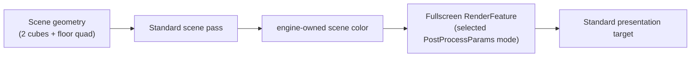

# Framebuffers (LearnOpenGL section 4.advanced-opengl 5)

> [!NOTE]
> **LO original chapter**: [LearnOpenGL 4.5 Framebuffers](https://learnopengl.com/Advanced-OpenGL/Framebuffers)
>
> **Engine surface**: the Standard renderer plus one declarative `createFullscreenRenderFeature` and 6 ECS-selected effects.

## Hit-rate index (AI user fast-locate)

| Engine capability | grep anchor | Where |
|:--|:--|:--|
| Standard scene-color route | `createApp` + `Standard` | `src/index.ts` (bootstrap) |
| declarative fullscreen effect | `createFullscreenRenderFeature` | `src/index.ts` (framebufferEffect) |
| ECS-selected effect payload | `PostProcessParams` | `src/index.ts` (installPipelineByKey) |
| feature-stage recovery probe | `RenderFeature.plan` | `src/index.ts` (recoveryFeature) |

## What this example shows

LO 4.5 demonstrates framebuffer objects (FBO): render the scene into an offscreen colour attachment, then re-sample that attachment through a fullscreen quad shader to apply post-process effects. The tutorial walks through a single effect (inversion), introduces a kernel-based blur, and finishes with a kernel-based edge-detection pass.

In forgeax, this example expresses the same visual pattern through the Standard renderer. The scene graph and presentation targets stay renderer-owned; the app contributes one declarative fullscreen feature and changes its ECS payload:

1. **Standard scene pass**: the engine renders the two cubes and floor into its owned scene-color target.

2. **Fullscreen post-process feature**: `createFullscreenRenderFeature` lets the Standard pipeline sample the scene-color target and write the presentation target.

3. **Six swappable effects**: `installPipelineByKey` writes the selected mode into `PostProcessParams`; graph ownership and lifecycle remain in the Standard renderer.

4. **Effect roster** (key 1--6):

| Key | Effect | Shader | Notes |
|:--|:--|:--|:--|
| 1 | passthrough | `passthrough.wgsl` | Identity pass; baseline pixel-exact output |
| 2 | inversion | `inversion.wgsl` | `1 - sample.rgb` |
| 3 | grayscale | `grayscale.wgsl` | rec.709 luma: `0.2126*r + 0.7152*g + 0.0722*b` |
| 4 | sharpen | `sharpen.wgsl` | 3x3 Laplacian kernel: edge enhancement |
| 5 | blur | `blur.wgsl` | 3x3 box-blur kernel |
| 6 | edge-detection | `edge-detection.wgsl` | 3x3 Laplacian kernel: edge highlighting |

The scene uses two unlit textured cubes and a floor quad (the canonical LO 4.5 layout). Shading is intentionally unlit (`forgeax::default-unlit`) so the visual delta between effects is dominated by the post-process pass, not by per-cube lighting.

## Run

```bash
# Dev server (port 5181)
pnpm --filter "@forgeax/app-learn-render-4-advanced-opengl-5-framebuffers" dev

# Build
pnpm --filter "@forgeax/app-learn-render-4-advanced-opengl-5-framebuffers" build

# Smoke (dawn-node pixel-readback)
pnpm --filter "@forgeax/app-learn-render-4-advanced-opengl-5-framebuffers" smoke

# Typecheck
pnpm --filter "@forgeax/app-learn-render-4-advanced-opengl-5-framebuffers" typecheck

# Full M24 gauntlet: Dawn, Browser, and Browser-live recovery journeys
pnpm --filter "@forgeax/app-learn-render-4-advanced-opengl-5-framebuffers" smoke:gauntlet
```

## Controls

Press digits **1--6** to switch between the six post-process effects. The current effect name is shown in the top-left HUD overlay.

| Key | Effect |
|:--|:--|
| 1 | passthrough |
| 2 | inversion |
| 3 | grayscale |
| 4 | sharpen |
| 5 | blur |
| 6 | edge-detection |

## Architecture



The Standard topology is fixed; only the fullscreen mode payload changes. The renderer owns graph reuse and presentation-target lifetime.

## forgeax-vs-LearnOpenGL mapping

| LO concept | LO C++ / OpenGL | forgeax equivalent |
|:--|:--|:--|
| Framebuffer object (FBO) | `glGenFramebuffers` + `glBindFramebuffer` + `glFramebufferTexture2D` | Standard renderer-owned scene-color/depth targets |
| Colour attachment | `glFramebufferTexture2D(GL_FRAMEBUFFER, GL_COLOR_ATTACHMENT0, ...)` with `GL_RGB` internal format | Standard scene-color logical target |
| Depth attachment | `glFramebufferRenderbuffer(GL_DEPTH_STENCIL_ATTACHMENT, ...)` | Standard depth logical target |
| Render-to-FBO then re-sample | First pass: bind FBO + draw; second pass: unbind FBO + bind texture + fullscreen quad | Standard scene pass + declarative fullscreen feature |
| Fullscreen quad | Hand-crafted 6-vertex quad (NDC [-1,1]) | Engine-builtin fullscreen draw |
| Kernel convolution | `float offset = 1.0 / 300.0; vec2 offsets[9] = ...; float kernel[9] = ...` in fragment shader | Identical WGSL kernel literal in each `*.wgsl` file; `texelSize` via `1.0 / vec2(textureDimensions(screenTexture, 0))` |
| Post-process shaders | Inline GLSL fragments in `framebuffers.cpp` | Six separate `*.wgsl` files, one `@fragment fs_main` per file |
| Keyboard input | GLFW `processInput(GLFWwindow*)` checking `glfwGetKey` per key | `window.addEventListener('keydown', ...)` in dev mode, `installPipelineByKey(export)` for smoke harness |
| Scene | Two cubes + floor (container.jpg + metal.png) | Identical scene: two `HANDLE_CUBE` + one `HANDLE_QUAD` (floor) with the same textures |
| Window + loop | `glfwCreateWindow` + `while(!glfwWindowShouldClose)` | `createApp(canvas, opts)` from `@forgeax/engine-app` |

## Differences from the LearnOpenGL original

| Dimension | LO original (C++ / GLSL / GLFW) | forgeax here (TS / WGSL / WebGPU) |
|:--|:--|:--|
| FBO allocation | Manual: `glGenFramebuffers` + `glBindFramebuffer` + attachment validation | Standard renderer owns scene-color/depth allocation and validation |
| Re-sampling pass | Manual: unbind FBO, bind attachment texture, draw fullscreen quad | `createFullscreenRenderFeature`; Standard derives the typed access |
| Effect switching | One FBO + one quad shader per demo; separate app state handles which effect is active | One fullscreen feature; `PostProcessParams` changes the mode without a second pipeline registry |
| Floor texture tiling | `GL_REPEAT` wrap mode + quad UV range making metal.png tile across the floor | **Known difference**: `default-unlit` material has no tiling/offset values (research F-A3). The 5x5 floor quad stretches a single metal.png tile across the entire floor instead of repeating it 5x5 times. The post-process effect demonstration is preserved; the visual floor texture density is coarser. |
| Colour space | OpenGL with sRGB framebuffer on LDR formats | Offscreen colour target uses `bgra8unorm-srgb` (hardware sRGB encode on store, sRGB decode on sample via `TextureSampleType::Float`). The inversion smoke check (AC-03 pixel-diff epsilon <= 0.05) covers the sRGB encode/decode round-trip. |
| Post-process shader organisation | All effect shaders in one `framebuffers.cpp` file as inline GLSL strings | Six separate `*.wgsl` files, each with one `@fragment fs_main` entry point. Each has a companion `*.wgsl.meta.json` sidecar (`kind: 'post-process'`) for `vite-plugin-shader` to recognise and compile at build time. |
| Shader compilation | Runtime `glCompileShader` + `glLinkProgram` | Build-time naga_oil compose via `vite-plugin-shader`; runtime feature registration consumes the pre-compiled WGSL string |
| GPU backend | OpenGL 3.3+ | WebGPU (auto-selected: Dawn-native for smoke, browser WebGPU for dev) |

> [!IMPORTANT]
> The inversion-vs-passthrough pixel-diff test (AC-03, epsilon <= 0.05) explicitly covers the sRGB encode/decode round-trip on the offscreen colour target. The smoke assertion `|B - (255 - A)| <= 0.05*255` (where A = passthrough readback, B = inversion readback) is the same linear-space colour-inversion invariant the LO tutorial uses, adjusted for the forgeax offscreen-RT format.

## Smoke

```bash
# Dawn-node pixel-readback smoke (300 frames, in-process passthrough -> inversion swap)
pnpm --filter "@forgeax/app-learn-render-4-advanced-opengl-5-framebuffers" smoke

# Falsify mode: invert the assertion -- GREEN smoke fails (exit != 0)
FORGEAX_SMOKE_FALSIFY=1 pnpm --filter "@forgeax/app-learn-render-4-advanced-opengl-5-framebuffers" smoke
```

The smoke harness:

- Boots the demo in Dawn-node (no browser/GPU driver), runs 30 warm-up frames, reads back the passthrough framebuffer (state A).
- Calls `installPipelineByKey('2')` to switch to inversion, runs 30 more frames, reads back the inversion framebuffer (state B).
- Asserts: for all pixels over the cube+floor region, `|B - (255 - A)| <= 0.05 * 255` (epsilon <= 0.05).
- `FORGEAX_SMOKE_FALSIFY=1` flips the assertion: expects the inequality to be **violated** (exit != 0), confirming the smoke is testing a real difference.

Total frames: 300 minimum (`SMOKE_MIN_FRAMES`). Zero RHI errors required (bus monitored at exit).

## Same-process feature-plan recovery

The public `window.__learnRenderFramebuffers` seam also exercises a failed
`RenderFeature.plan` and recovery without rebuilding the Renderer, App, or page:

```ts
const framebuffers = window.__learnRenderFramebuffers;
framebuffers?.pause();
framebuffers?.installCyclePipeline();
// getState().cycleDiagnostic identifies the failed feature plan.
framebuffers?.installRepairedPipeline();
framebuffers?.resume();
framebuffers?.dispose();
framebuffers?.dispose(); // idempotent
```

The cycle and invalid-format buttons deliberately put the recovery feature into
a failing `plan` state. The Standard host reports the closed
`render-feature-stage-failed` contract, isolates that feature, and keeps the
last-known-good scene/post path intact. The repaired mode returns an empty
feature plan, then the same Renderer renders again and switches back to the
inversion effect to prove later healthy selection still works.

The browser journey uses a visible canvas screenshot for the no-contamination
oracle and the feature status for the failure/recovery oracle. The complete
`smoke:gauntlet` output includes the Dawn pixel path, the same-page Chrome
feature-plan recovery path, and the Browser-live pause/fault/reinstall/resize/
cleanup path. Browser artifacts are written under `FORGEAX_M24_ARTIFACT_DIR`
when set.

## Key files

| File | Lines | Role |
|:--|--:|:--|
| `src/index.ts` | ~550 | Three-section bootstrap -- scene spawn (2 cubes + floor), one fullscreen feature with 6 modes, `installPipelineByKey` named export, feature-plan recovery seam, keydown HUD |
| `src/shaders/passthrough.wgsl` | ~15 | Identity fragment shader: `textureSample(screenTexture, screenSampler, in.uv)` passthrough |
| `src/shaders/inversion.wgsl` | ~15 | Colour inversion: `1.0 - textureSample(...).rgb` |
| `src/shaders/grayscale.wgsl` | ~15 | Rec.709 luma: `dot(sample.rgb, vec3(0.2126, 0.7152, 0.0722))` |
| `src/shaders/sharpen.wgsl` | ~30 | 3x3 Laplacian kernel: edge enhancement with kernel `[0,-1,0, -1,5,-1, 0,-1,0]` |
| `src/shaders/blur.wgsl` | ~30 | 3x3 box-blur kernel: average with kernel `[1/9]*9` |
| `src/shaders/edge-detection.wgsl` | ~30 | 3x3 Laplacian kernel: edge highlighting with kernel `[1,1,1, 1,-8,1, 1,1,1]` |
| `src/shaders/*.wgsl.meta.json` | 6 x ~4 | Sidecar files (`kind: 'post-process'`) for `vite-plugin-shader` build-time compilation |
| `scripts/smoke-dawn.mjs` | ~380 | Dawn-node pixel-readback smoke: boot + passthrough readback + `installPipelineByKey('2')` inversion swap + pixel-diff assertion + FALSIFY mode |

## AI user discoverability

- Directory name: `apps/learn-render/4.advanced-opengl/5.framebuffers/` mirrors LO chapter ordering
- Package name: `@forgeax/app-learn-render-4-advanced-opengl-5-framebuffers` is grep-able by chapter prefix
- Three-section source markers (`// 1. engine usage` / `// 2. example glue` / `// 3. bootstrap`) serve as grep anchors
- The six effect ids and the `PostProcessParams` write are inlined so AI users can grep an effect key and land on the exact selection line
- `installPipelineByKey` named export is documented in this README for smoke harness and programmatic reuse
- All custom shader callsites point to `skills/forgeax-engine-render-pipeline/SKILL.md` for the full worked-example reference
