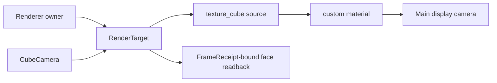
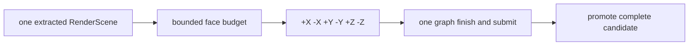

# RenderTarget, CubeCamera, and ReflectionProbe

> [!NOTE]
> This Engine-owned consumer demonstrates the public render-target contract used by the PBR reflection path.

## 这个示例展示什么

The normal example creates a cube `RenderTarget`, exposes its texture as a `texture_cube` material source, and uses `CubeCamera` to fill the six faces with six deterministic colors. After the six-face candidate is promoted, the display mesh samples that same cube source and the browser smoke checks its actual canvas pixel. The optional reflection mode continues to exercise `ReflectionProbe` raw capture and roughness mip levels.

The Browser and Dawn evidence scripts run the same public consumer. A healthy renderer intentionally returns `renderer-state-invalid` from `recover()`; that is the documented healthy-recover guard, not device-loss evidence. Actual recovery is an owner invalidation/rebuild path and stale receipts cannot be observed after the device generation changes.

## 渲染流程



## 引擎用法

```ts
const targetResult = renderer.createRenderTarget({
  shape: 'cube',
  width: 64,
  height: 64,
  format: 'rgba8unorm-srgb',
  mipLevels: 1,
  sampleCount: 4,
  sampled: true,
  readback: true,
});
if (!targetResult.ok) throw targetResult.error;
const target = targetResult.value;
const sourceResult = renderer.createRenderTargetTextureSource(target, {
  aspect: 'color',
  dimension: 'cube',
  mipLevel: 0,
});
if (!sourceResult.ok) throw sourceResult.error;
const source = sourceResult.value;
const targetHandle = world.allocSharedRef('RenderTarget', target);
const sourceHandle = world.allocSharedRef('RenderTargetTextureSource', source);
const material = world.allocSharedRef('MaterialAsset', {
  kind: 'material',
  passes: [{ name: 'Forward', program: {
    module: 'learn_render::6_4_cube_reflection',
    vertexEntry: 'vs_main', fragmentEntry: 'fs_main',
  } }],
  parameters: [
    { name: 'baseColor', type: 'color' },
    { name: 'cubeTexture', type: 'texture_cube' },
  ],
  values: { baseColor: [1, 1, 1, 1], cubeTexture: sourceHandle },
});
world.spawn({
  component: CubeCamera,
  data: { target: targetHandle, near: 0.1, far: 20, updateIntent: 0, requestVersion: 0, faceBudget: 6 },
});
// Bind `material` to the display mesh; it samples the promoted cube source.
const ticketResult = renderer.requestTargetReadback(target, { mipLevel: 0, face: 0 });
if (!ticketResult.ok) throw ticketResult.error;
const ticket = ticketResult.value;
const receiptResult = renderer.draw({ leases: [lease], camera: { lease }, environment: { lease } });
if (!receiptResult.ok) throw receiptResult.error;
const receipt = receiptResult.value;
const completed = await receipt.completed;
if (!completed.ok) throw completed.error;
const result = await renderer.observe(receipt, {
  include: ['target-readbacks'],
  targetReadbacks: [ticket],
});
if (!result.ok) throw result.error;
```

The complete consumer is in `src/index.ts`. It publishes `__renderTargetReflectionReport` with the stable target ID, launch URL, receipt frame and generation, readback byte length, and recovery code for smoke assertions.

In the normal path the report also contains `materialSampling`: the custom shader ID, cube-source shape, the center pixel from the main canvas, and its nearest expected cube-face epsilon. This is the end-to-end assertion that `CubeCamera -> RenderTarget -> RenderTargetTextureSource -> texture_cube binding -> draw` produced visible pixels.

## CubeCamera capture

`CubeCamera` is a transient capture intent paired with `Transform` and a shared cube `RenderTarget`. The renderer keeps the capture inside the display frame:



The canonical face order is `+X, -X, +Y, -Y, +Z, -Z`. A candidate is not sampled or promoted until all six faces share one successful `FrameReceipt`; a failed or nested capture retains the previous active generation or the documented neutral fallback. Debug and UI overlays, and the candidate target itself, are excluded from the Standard capture contribution.

The CPU orientation oracle is covered by `src/__tests__/cube-camera.browser.test.ts`. Browser and Dawn evidence entrypoints are `scripts/smoke-cube-camera-browser.mjs` and `scripts/smoke-cube-camera-dawn.mjs`; they publish six-face readback values plus the actual `texture_cube` material-consumer pixel, resolve identity, backend, source SHA, and uncaptured GPU errors before being treated as pixel evidence. The authored shader and its generated per-shader cube binding are in `src/cube-reflection.wgsl` and `src/cube-reflection.pack.json`.

## ReflectionProbe M4 evidence

The Engine exposes the ReflectionProbe component, renderer-owned raw cube capture,
incremental PMREM filtering, last-known-good promotion, scene selection, local box
projection, roughness LOD, and Skylight fallback through the public render surface.
`renderer.inspect().reflectionProbes.selection` reports the selected probe identity
(`worldId` and `entityKey`) or the `{ kind: 'skylight' }` fallback.
The paired contract tests are `src/__tests__/reflection-probe.browser.test.ts` and
`src/__tests__/reflection-probe.dawn.test.ts`.

The M4 smoke entrypoints are `scripts/smoke-reflection-probe-browser.mjs` and
`scripts/smoke-reflection-probe-dawn.mjs`. Browser evidence captures the real display
PNG and ROI, while both Browser and Dawn assert six raw capture faces, all 30 PMREM
face/mip steps, mip range 0..4, no uncaptured GPU errors, and the inside-probe /
outside-Skylight fixture. The exact source revision is included in each report.

The five stable target IDs and four paired evidence commands are listed in
`src/feature-manifest.json`; this is a consumer manifest only and is never
consulted by the runtime.

## SSR dependency fallback evidence

The fallback-only dependency fixture is published as paired Browser and Dawn
manifests under `artifacts/ssr-fallback/`. Both lanes bind the same source HEAD,
source tree, lock hash, render build hash, fixture revision, and 300-frame run.
Read `manifest.json` first for `status`, `identity`, and per-expectation
`observed`/`verdict`/`confidence`; then follow `readback.locator`, `png.locator`,
and `readback.validationLog` for the raw evidence. The frozen thresholds are
linear HDR absolute error `<= 0.05` and HDR luma relative error `<= 0.02`.

The paired commands are `scripts/smoke-browser.mjs` and `scripts/smoke-dawn.mjs`.
They are independent WebGPU and Dawn executions and do not substitute page
liveness, RhiNull output, or one backend for the other. The dev-only mutations in
`scripts/falsification.mjs` intentionally fail for candidate visibility, BRDF
source mismatch, and missing r32float storage usage; they are not CI evidence.

This follow-up unlocks dependency evidence only. It does not implement SSR v1,
Hi-Z, ray marching, temporal resolve, compose, or history, and the parent SSR
consumer remains fallback-only when any receipt is absent or mismatched.

For an AI-readable recovery route, start at `renderer.inspect()` and the paired
manifest identity, then follow the structured failure's `expected`, `hint`, and
owner/action detail. Rebuild or recover only through that owner, submit again, and
reinspect. The fixture publishes detached evidence and never exposes live GPU
handles or creates another report owner. `artifacts/ssr-fallback/README.md` is the
machine-facing index for evidence level, locator, and recovery semantics.

## 与 LO 原版的差异

| Dimension | LearnOpenGL-style approach | ForgeaX approach |
|:--|:--|:--|
| Render destination | A framebuffer and texture are managed through global OpenGL state | `Renderer` owns opaque target and source handles |
| Camera role | A capture camera writes to a manually managed framebuffer | `CubeCamera` is an explicit bounded capture intent; the display camera consumes the resulting source |
| Readback | Caller reads pixels after issuing ad-hoc synchronization | A matching `FrameReceipt` is required before observing a readback ticket |
| Failure handling | String logs or unchecked API errors | Structured `err.code`, `err.expected`, `err.hint`, and discriminated `err.detail` guide recovery |

## 运行

```bash
pnpm --filter @forgeax/app-learn-render-6-pbr-4-render-target-reflection dev
pnpm --filter @forgeax/app-learn-render-6-pbr-4-render-target-reflection build
pnpm --filter @forgeax/app-learn-render-6-pbr-4-render-target-reflection smoke
pnpm --filter @forgeax/app-learn-render-6-pbr-4-render-target-reflection smoke:browser
```

<details>
<summary>LearnOpenGL framebuffer vocabulary</summary>

The original OpenGL route uses identifiers such as `glBindTexture`, `glClear`, and `glFramebufferTexture2D` around a framebuffer object. ForgeaX keeps those concepts behind the typed renderer owner and exposes only the public target/source contract to a consumer.

</details>
