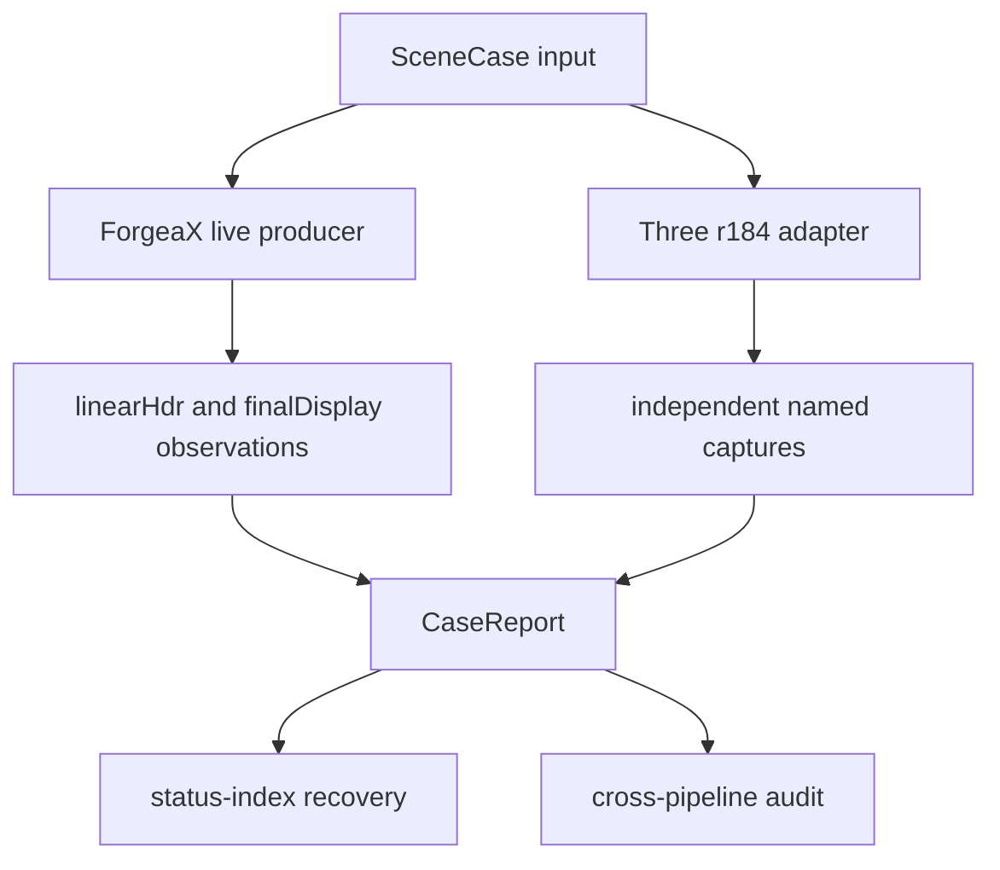
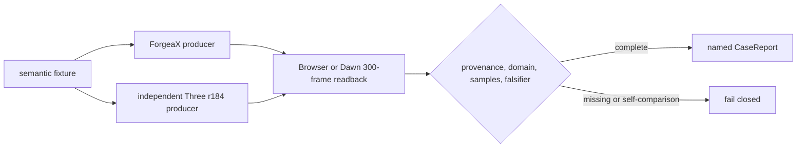

# Color and Lighting Parity

Minimal, evidence-first parity gate for Three.js r184 and ForgeaX color and lighting.

## Start here

```bash
pnpm bench:color-lighting-parity
```

The command builds the consumer, starts the preview server, executes the browser
matrix, and fails closed when a required producer or report field is missing.
The browser result is returned by `window.__colorLightingParity`; the Dawn
producer gate is exercised by the direct-light Dawn test.

## Capability and matrix contract

| Capability | Required route | Authority |
| :-- | :-- | :-- |
| Direct-light parity | Three r184 plus ForgeaX `SceneCase` | [`scene-case.schema.json`](./schemas/scene-case.schema.json) |
| Named case result | One `CaseReport` per case | [`case-report.schema.json`](./schemas/case-report.schema.json) |
| Required parity backend roster | Browser WebGPU, Dawn, Chromium WebGL2 fallback | [`package.json`](./package.json) `parityMatrix`; per-case `applicableBackends`/`matrixRequiredBackends` are owned by [`required-cases.ts`](./src/coverage/required-cases.ts) |
| Chromium final-display sentinel slice | Six Chromium WebGL2 cells: default sRGB, alpha mask, alpha blend, ACES tone, direct directional URP, transparent LDR URP | [`verify-webkit-color-lighting.mjs`](../../../scripts/dev-verify/verify-webkit-color-lighting.mjs) runs ForgeaX rhi-wgpu + Three r184 in isolated Chromium processes with WebGPU disabled; the filename remains a compatibility anchor for the protected CI context |
| Required pipelines | `urp` and `hdrp` | Generated `status-index.json` |

The current backend and pipeline matrix is generated at
`report/color-lighting-parity/status-index.json`. Read
[`status-index.md`](./status-index.md) for the recovery map; this README does
not duplicate per-case status values.

> [!CAUTION]
> A matrix is complete only when required, primary, and matrix counts have no
> `not-executed`, `failed`, `unsupported`, or `degraded` entries. Missing
> producer evidence remains incomplete even when a browser canvas is visible.

> [!IMPORTANT]
> `finalDisplay` is display-space diagnostic output. `linearHdr` is the only
> attachment evidence used for HDR lighting claims. A final canvas, browser
> skip, generic smoke, replay texture, or analytic-only result never upgrades
> a missing producer to pass.

> [!NOTE]
> The Chromium fallback closes only the declared final-display sentinel cells.
> Its WebGL2 path does not claim `linearHdr`, HDRP transparent, or HDR IBL
> coverage. CI proves that `navigator.gpu.requestAdapter()` is absent or
> resolves to `null`, plus a real WebGL2 context; a missing capability fails
> closed instead of becoming a skip.
> Raw byte differences remain diagnostic; finite analytic/ROI fallback budgets
> are still enforced, with no empirical gamma, multiplier, or blend correction.

## Current status

The unique report authority is the per-case `CaseReport`. Read the generated
`directLightEvidence`, `attachmentEvidence`, `readback`, `status`, `verdict`,
and `firstDivergence` fields; do not infer matrix coverage from this document.



## Evidence vocabulary

| Field | Meaning | Required proof |
| :-- | :-- | :-- |
| `linearHdr` | Native linear HDR producer attachment | `rgba16float`, current frame, native readback bytes, raw hash, size, pipeline, backend |
| `finalDisplay` | Native canvas/display output | Final readback bytes, raw hash, size, pipeline, backend |
| `attachmentReadbackStatus` | Attachment execution state | `complete` only after the producer readback is complete |
| `missingPipelineIds` | Required producer coverage | Empty when the unified `forgeax::standard` producer is present in the required runtimes |
| `firstDivergence` | First named failure owner | A report-owned metric, never an aggregate-only claim |

## Two-hop navigation

1. Use [`status-index.md`](./status-index.md) to map a report state to its one
   recovery action.
2. Open the named owner and schema:
   [`SceneCase`](./schemas/scene-case.schema.json),
   [`CaseReport`](./schemas/case-report.schema.json),
   [capture/readback](./src/capture/attachment-readback.ts),
   [error routing](./src/errors.ts), or
   [cross-pipeline audit](./src/integration/cross-pipeline-audit.test.ts).

The engine-side recovery entry points are [`forgeax-engine-material`](../../../skills/forgeax-engine-material/SKILL.md),
[`forgeax-engine-shader`](../../../skills/forgeax-engine-shader/SKILL.md),
[`forgeax-engine-render-pipeline`](../../../skills/forgeax-engine-render-pipeline/SKILL.md),
and [`forgeax-engine-rhi`](../../../skills/forgeax-engine-rhi/SKILL.md).

## M5 vertex-color parity lane

M5 adds seven named cases. The semantic JSON under
[`cases/vertex-color/`](./cases/vertex-color/) is the only shared input; the
ForgeaX and Three.js r184 adapters build their own scene, shader, capture, and
readback. The report records `sourceSha`, fixture hash, producer/build/backend,
color domain, samples, expected/observed RGBA, verdict, confidence, and
artifact references. The schema and TypeScript owner remain the authority:
[`case-report.schema.json`](./schemas/case-report.schema.json),
[`visual-evidence.schema.json`](./schemas/visual-evidence.schema.json), and
[`required-cases.ts`](./src/coverage/required-cases.ts).

| Case | Semantic input | Declared evidence domain | Falsifier |
| :-- | :-- | :-- | :-- |
| `vertex-color-vec3` | glTF VEC3 FLOAT, implicit alpha `1` | `displayEncoded` | white color changes a colored sample |
| `vertex-color-vec4` | RGBA / VEC4 FLOAT, non-`1` alpha | `linearHdr` | white color changes RGB |
| `vertex-color-normalized` | normalized UBYTE/USHORT endpoints and midpoint | `linearHdr` | raw integer values are not treated as normalized |
| `vertex-color-skinning` | colored mesh plus deterministic joint motion | `displayEncoded` | color survives all 300 frames |
| `vertex-color-mixed-primitives` | colored and absent-color primitives | `displayEncoded` | plain primitive is not given prior primitive color |
| `vertex-color-mask-taa` | vertex alpha drives MASK and TAA history | `displayEncoded` | cutout/history samples retain alpha coverage |
| `vertex-color-no-color-baseline` | `COLOR_0` absent, same geometry/material | `displayEncoded` | stream absence and baseline bytes stay unchanged |

Each case requires Browser WebGPU and Dawn, exactly 300 frames, live
`copyTextureToBuffer` readback, and RGB/alpha $arepsilon \le 0.05$ in the
declared domain. `linearHdr` is linear working space; `displayEncoded` is the
final display space; alpha is coverage and is never sRGB encoded.



Run the lane from the repository root with
`FORGEAX_BROWSER_HEADLESS=0 pnpm bench:color-lighting-parity`. The gate writes
one report per case/backend under
`report/color-lighting-parity/vertex-color/`. Missing producer, readback,
domain, threshold, provenance, or visual evidence is `blocked`/`failed`; a
visible canvas, `RhiNull`, WGSL text assertion, self-comparison, all-zero
capture, or analytic-only result is not a pass.

<details>
<summary>Recovery owners</summary>

- `producer` / `backend`: the owning Browser or Dawn scene probe.
- `readback` / `domain`: [`attachment-readback.ts`](./src/capture/attachment-readback.ts).
- `provenance` / `samples` / `epsilon`: [`evaluate-case.ts`](./src/evaluator/evaluate-case.ts).
- `falsifier`: the named case producer; restore the semantic fixture before rerunning.
- `report` / `visual artifact`: the parity evidence writer and visual reader.

</details>

## Raw capture and reruns

The live observation path is:

```ts
renderer.observeCurrentFrame({
  semantic: 'linear-hdr',
  readback,
});
```

The producer owns the current frame. The readback owner copies and maps the
native resource, then returns bytes and provenance. Parity consumes the bytes,
hash, format, size, frame, pipeline, and backend fields; it does not consume a
graph key, RHI texture, or backend-private handle.

For a focused rerun, execute the browser producer directly and use the
partitioned Dawn runner for the native producer. It starts one fresh Vitest
process for the complete direct-light roster and verifies all ten tests. The
single process keeps the real-pixel falsifiers on the same bounded fixture
without paying a second Dawn adapter/Vite startup.
Keep the resulting report with the same `caseId`; do not replace a failed
producer capture with a hand-authored hash.

```bash
pnpm exec vitest run --project=browser \
  apps/parity/color-lighting/cases/direct-light/__tests__/direct-light.browser.test.ts
node scripts/ci/run-direct-light-dawn.mjs
```

## Scope boundary

The direct-light gate covers the frozen Three r184 squared finite-range
authority and `KHR_lights_punctual` import semantics. M5 IBL is a later
milestone and must consume this `linearHdr` seam rather than add an IBL-only
readback path.

> [!CAUTION]
> Never accept self-comparison, final-canvas self-comparison, URP-as-HDRP
> provenance, stale observations, missing `COPY_SRC`, guessed multiplier or
> curve, arbitrary graph keys, or a second copy/map implementation.
