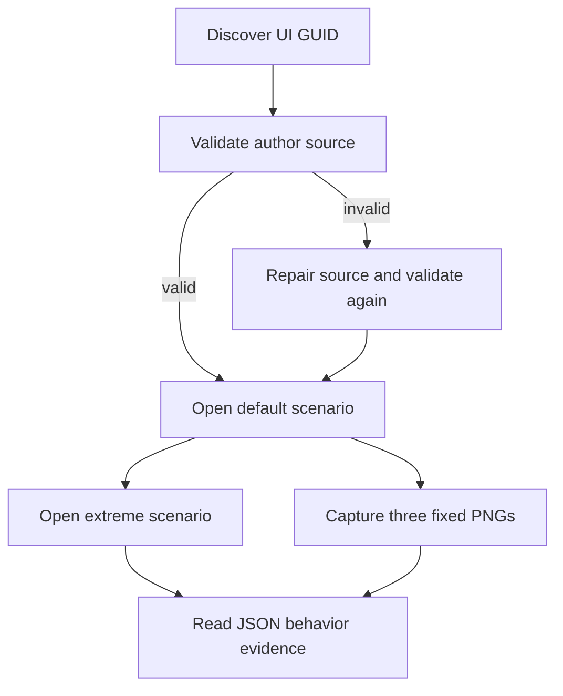

# `@forgeax/preview`

VFX Batch B consumers use the public package barrels and the same inspect and
recovery projection exposed by Preview tooling. The host does not provide a VFX
RPC or raw RHI escape hatch.

The preview app is a small, independent dogfood host for the UI authoring loop. It exposes the same loader, mount, scenario, refresh, and capture seam used by a future editor without adding an editor panel or a second asset format.

## Shortest path

Open the dev host, then use the browser global `__forgeaxUiAuthoring` from automation:

```ts
const host = window.__forgeaxUiAuthoring;
const [target] = host?.discover() ?? [];
const validation = await host?.validate();
const opened = await host?.open('default');
const evidence = opened?.ok ? await host.capture(browserAdapter) : opened;
```

The checked-in smoke command runs the full loop and prints one JSON report:

```bash
pnpm --filter @forgeax/preview smoke:ui-authoring
```



## Catalog-backed authored UI

The authoring smoke uses the real catalog entry
`019f8354-6386-4386-849d-f2ab4b96229d` from
`assets/ui-authoring/preview-hud.ui.html`, not the fallback fixture. The host
loads that GUID through the Preview catalog/import path, preserves invalid
source edits as an overlay, and reports `preview-load-failed` with the
importer's source diagnostics without installing the bad content. A repaired
source is accepted in the same page and `session.retry()` remounts it; the
smoke also clicks the repaired action, checks deterministic capture, calls
`dispose()` twice, and falsifies an incomplete image resource so readiness
reports `resources`.

## Production real-game UI matrix

`smoke:ui-production` is the shipped Preview boundary for the real
`game-default` HUD and Settings packs. Its consumer-owned matrix lives in
`scripts/ui-real-scenario-matrix.mjs` and runs `default`, `extreme-data`, and
`modal-focus` at fixed `320x180` and `960x540` viewports, repeating the matrix
to compare deterministic DOM/projection evidence. Each case checks the
catalogued Pack v2 rows, open ShadowRoots, positive font/canvas readiness,
HUD projections, Settings defaults, modal focus/inert/action ownership, and
post-message cleanup. PNGs are secondary evidence; readiness is established
from the live DOM and existing game inspection projections.

```sh
FORGEAX_UI_PRODUCTION_DIR=<run>/artifacts \
  pnpm --filter @forgeax/preview smoke:ui-production
```

## What the host proves

| Check | Observable result |
| --- | --- |
| GUID discovery | `discover()` returns the target `guid` and `kind`. |
| Invalid to repair | `repair()` returns structured diagnostics for invalid HTML, then a valid result after the source is fixed. |
| Scenarios | `open('default')` and `open('extreme')` use ordinary TypeScript `data-ui-part` scenarios. |
| Determinism | Playwright captures the mounted preview host three times as real PNG bytes at one viewport, scale, and frozen clock; the smoke rejects tiny or differing payloads. |
| Lifecycle | `dispose()` removes the run-owned host and clears the browser global. |

> [!IMPORTANT]
> The global is a development smoke seam only. Production game code should consume `@forgeax/engine-ui/preview` directly and own its session root. Scenario modules are not imported into the production asset payload.

## Game inspection and recovery

The normal Preview host also exposes `globalThis.__forgeaxPreviewInspection` for one loaded game.
It is the documented P7 front door for AI tooling:

```ts
const inspection = window.__forgeaxPreviewInspection;
inspection?.list();
await inspection?.read('game-default.snapshot');
await inspection?.run('game-default.set-view', { mode: 'orbit' });
inspection?.renderer.health();
await inspection?.captureFrame(1);
```

The host owns transport, renderer health/recovery, RHI capture, and Stop cleanup. The game owns the
projection definitions and never exposes a raw World or private renderer internals. Every operation
returns a structured `{ ok: false, error: { code, expected, hint, detail? } }` result for expected
failures. `captureFrame` is unavailable unless the Preview Vite dev host has its RHI debug plugin;
this is explicit rather than a silent no-op. Stop/reload clears the global and all game projections.

The clean-copy proof repeats this contract across three fresh boots. It observes
`globalThis.__forgeaxPreviewInspection === undefined` after Stop, then
rediscovers the same four actions and two reads after the next navigation:

```sh
FORGEAX_CLEAN_COPY_DIR=<run>/artifacts \
  pnpm --filter @forgeax/preview smoke:clean-copy-reentry
```

The production companion builds Preview and repeats the three-boot/reset/Stop contract against
Vite Preview's `dist/`. Each production boot also requires the capture operation to return the
structured `rhi-debug-unavailable` result, keeping the shipped inspection surface explicit:

```sh
FORGEAX_CLEAN_COPY_DIR=<run>/artifacts \
  pnpm --filter @forgeax/preview smoke:clean-copy-production
```

The cross-backend proof captures one real `game-default` Preview frame through this
same inspection front door, then replays the exact tape on a fresh Dawn device
for RT pixel readback and on `rhi-null` for structural replay. It requires frame
marks and draw evidence, a non-empty Dawn RT, matching dimensions, and a
live-vs-Dawn RGB delta <= 0.1; the null leg remains structural-only:

```sh
FORGEAX_CROSS_BACKEND_DIR=<run>/artifacts \
  pnpm --filter @forgeax/preview smoke:cross-backend-replay
```

This reuses the existing backend replay owner; it does not create a second game,
renderer, or synthetic tape.

The asset-content proof has the same production companion. It builds Preview, serves the shipped
`dist/` through Vite Preview, and repeats the HDR GUID/name, equirect payload, skybox pass,
intensity/reload/reset, and structured missing-GUID recovery contract. This is the production
catalog boundary for the first-user asset lesson; it is not a second asset evidence owner:

```sh
FORGEAX_ASSET_LOOP_DIR=<run>/artifacts \
  pnpm --filter @forgeax/preview smoke:asset-loop-production
```

For development authoring, `test:catalog-refresh` builds the Preview workspace, starts the real Vite
CLI host, changes the watched `base-material.pack.json` sidecar, and proves the same game-default
canvas and Play inspection snapshot survive the full reload before restoring the source:

```sh
FORGEAX_CATALOG_REFRESH_DIR=<run>/artifacts \
  pnpm --filter @forgeax/preview test:catalog-refresh
```

The runner allocates a strict port, waits for HTTP readiness, and terminates its detached Vite
process group. It uses a whitespace-tolerant numeric marker so formatting changes in the authored
pack do not turn into a false fixture-drift failure.

The shipped production counterpart rebuilds after a material edit and compares both the Pack v2
payload and the visible frame:

```sh
FORGEAX_PRODUCTION_MATERIAL_EDIT_DIR=<run>/artifacts \
  pnpm --filter @forgeax/preview smoke:production-material-edit
```

The Preview manifest declares the template and binary sidecar roots for the build cache, so changing
an external `apps/game-capability-lab` asset is a cache miss rather than a stale production `dist/` hit.
The smoke restores the source and rebuilds the restored output in `finally`.

The RHI debug plugin is serve-only. Production Preview builds set
`FORGEAX_ENGINE_RHI_DEBUG=0` and the app host gates browser capture imports on
`import.meta.env.DEV`, so generated production assets contain no
`capture-browser` or `engine-rhi-debug` chunk.

Run the focused contract proof with:

```sh
FORGEAX_INSPECTION_DIR=<run>/artifacts pnpm --filter @forgeax/preview smoke:inspection-recovery
```

The adjacent recovery proof uses Chrome's deterministic `Browser.crashGpuProcess` control, then
reads the same projection before and after `renderer.recover()`:

```sh
FORGEAX_DEVICE_LOSS_DIR=<run>/artifacts pnpm --filter @forgeax/preview smoke:device-loss-reentry
```

The companion enters the public game-default charge VFX action before loss and validates that the
late particle RenderFeature's Pack GUID, ready billboard/mesh batches, and reset cleanup survive the
recovery in both dev and production. It also fails on an actionable first-frame preparation error,
so shader prewarm regressions cannot hide behind a later retry.

This proves browser GPU-process recovery only; it does not claim physical hardware TDR coverage.

The WebKit admission proof runs the same game through the existing WebGL2 fallback. It asserts the
authored custom-material schema and capability variant, invokes the real hit-feedback action, and
keeps a screenshot as the visual witness:

```sh
FORGEAX_WEBGL2_DIR=<run>/artifacts \
  pnpm --filter @forgeax/preview smoke:webgl2-material
```

This is a fallback admission gate, not a second renderer or template backend branch.

The production companion builds the same Preview first, then serves `dist/` through Vite Preview
and repeats the WebGL2 contract. It is the clean-copy boundary for authored pack delivery: the
FBX skin/animation, GUID audio, custom-material schema/variant, hit, reset, and zero-error claims
must survive the production catalog rather than only the development importer route:

```sh
FORGEAX_WEBGL2_DIR=<run>/artifacts \
  pnpm --filter @forgeax/preview smoke:webgl2-production
```

<details>
<summary>Error recovery and prohibited shortcuts</summary>

Branch on `error.code`, then read `expected`, `hint`, and the narrowed `detail`. `capture-not-ready` lists every unmet readiness fact and never includes `png`; repair the named resource, clock, scenario, or browser failure and retry.

Do not parse `message`, silently skip a scenario, mount to `document.body`, add a duplicate UI manager, or use a custom mesh/stand-in to hide an engine asset failure.
</details>

## Preview inspection and capture

Preview exposes game-owned read and action projections through one
JSON-serializable inspection boundary. Use `inspection.list()` to discover the
available ids, then call `inspection.read(id)` or `inspection.run(id, args)`;
the loaded game owns the meaning of each projection.

RHI capture is a separate optional capability. When enabled,
`inspection.captureFrame()` uploads one `rhi-tape` artifact to the Vite debug
provider for DevKit summary and fresh-device inspection. Do not pass raw World,
renderer, physics, audio, or GPU objects through the inspection surface. Recover
from a failure by reading `code`, `expected`, `hint`, and `detail`, then retry
the owner-level path with a fresh target.
