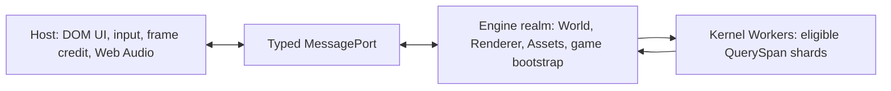

# @forgeax/engine-app

> **App is the browser host adapter: it measures one frame delta, passes it to the World, and draws.** Game scheduling, time resources, fixed-step policy, and gameplay behavior belong to the ECS World.

## One-screen takeoff

```ts
import { createApp } from '@forgeax/engine-app';
import { Time, Update } from '@forgeax/engine-ecs';
import { forgeaxBundlerAdapter } from 'virtual:forgeax/bundler';

const result = await createApp(canvas, {}, forgeaxBundlerAdapter());
if (!result.ok) {
  console.error(result.error.code, result.error.hint);
  throw result.error;
}

const app = result.value;
app.world.addSystem(Update, {
  name: 'move-player',
  queries: [],
  fn: (world) => {
    const delta = world.getResource(Time).delta;
    movePlayer(delta);
  },
}).unwrap();
app.start().unwrap();
```

The canvas form creates a World, renderer, default plugins, browser input backend, and rAF loop. Handle the `Result` before calling `start`.

The main-thread canvas host fits CSS size × device pixel ratio to the active device's `maxTextureDimension2D`, using one scale for both axes. It applies that limit after renderer construction and before each frame, so high-DPI windows and preview reparenting cannot request an oversized surface. CSS layout stays at the requested size; explicit intrinsic canvas sizes remain caller-owned.

## Recovery frame contract

Use `renderer.state() -> renderer.inspect() -> renderer.recover() ->
FrameReceipt` as the shortest recovery route. App is only the frame-admission
owner: it advances the World and calls `draw` when the Renderer is `alive`.
During `device-lost` or `recovering`, App preserves the rAF heartbeat and
refreshes its time baseline, but does not advance the World or submit. Renderer
owns the single recovery flight; concurrent callers share it. A `faulted`
Renderer must be disposed and recreated, and `disposed` is terminal.

Branch on the closed error `code`, then read `expected`, `hint`, and typed
`detail` to decide whether to wait, explicitly retry, repair the named owner,
or rebuild. After success, retry the same frame request and treat the returned
`FrameReceipt` as the only submitted proof for the new device generation. Target
and history fallback preserves logical identity but is uninitialized until a
successful receipt; structural output, Browser/Dawn readback, and PNG evidence
must not be substituted for one another. App does not expose devices, graph
nodes, history textures, or a second retry manager.

## RHI capture

When the development RHI-debug flag is enabled, `app.rhiCapture` exposes one
single-frame `captureFrame()` capability. A successful call returns one
self-contained `rhi-tape` artifact; pass that same artifact to DevKit's
`rhi.summary` and `rhi.inspect` operations, using the summary's
`FrameModel.works[].workIndex` for selection.

App owns only the optional capture capability. Replay, readback, PNG output,
and artifact/file handling remain in the RHI-debug core and DevKit shells, so
the live App surface does not grow a second replay cache or inspection API.

## Execution tiers

`execution` moves the complete World, Renderer, AssetRegistry, render features,
and gameplay plugins into one Engine Worker. The Host keeps DOM input, frame
credit, Web Audio, and inspection. `shared` adds a lazy persistent Kernel Worker
pool over shared ECS numeric columns; it does not split the live World or render
graph across realms.

The bootstrap module constructs renderer features and native Cordis plugins
inside the selected realm. Those plugins receive the real owners through
`inject`; there is no parallel `run(context)` or cleanup ledger.

```ts
// game-bootstrap.ts
import type { ExecutionBootstrapEntry } from '@forgeax/engine-app';
import { audioPlugin } from '@forgeax/engine-audio';

const bootstrap: ExecutionBootstrapEntry = (data) => ({
  features: [createGameRenderFeature(data)],
  plugins: [
    audioPlugin(),
    createGamePhysicsPlugin(data),
    {
      name: 'game-session',
      inject: ['world', 'renderer', 'assets', 'executionBootstrapHost'],
      async apply(ctx) {
        const session = await createGameSession({
          world: ctx.world,
          renderer: ctx.renderer,
          assets: ctx.assets,
          port: ctx.executionBootstrapHost.port,
        });
        ctx.effect(() => () => session.dispose(), 'game/session');
      },
    },
  ],
});

export default bootstrap;
```

```ts
const result = await createApp(canvas, {
  execution: {
    tier: 'auto',
    bootstrap: new URL('./game-bootstrap.mjs', import.meta.url),
    bootstrapData: { gameId: 'example' },
    bootstrapPort: realmPort,
  },
}, forgeaxBundlerAdapter());
if (!result.ok) throw result.error;

const app = result.value;
app.start().unwrap();
const report = app.execution.report();
console.log(report.requestedTier, report.actualTier, report.selectionReason);

if (report.world.health === 'poisoned') {
  const rebuilt = await app.execution.rebuild();
  if (!rebuilt.ok) throw rebuilt.error;
}
```



| Requested tier | Runtime shape | Selection rule |
|:--|:--|:--|
| `main-serial` | Host-owned World and Renderer | Always available |
| `engine-worker` | Co-located Engine Worker | Requires Worker, OffscreenCanvas, and Worker WebGPU |
| `shared` | Engine Worker plus SAB Kernel pool | Also requires isolation headers, SharedArrayBuffer, and Atomics wait |
| `auto` | Best available proven tier | Reports the actual tier and reason; never disguises fallback |

An explicit unavailable tier returns a structured `AppError`; only `auto` falls back. Serve `shared` with `Cross-Origin-Opener-Policy: same-origin` and `Cross-Origin-Embedder-Policy: require-corp` or `credentialless`, then verify the Worker-realm facts in `app.execution.report()`. Every SharedKernel module is imported, export-checked, and retained in every lane before the Engine Worker reports ready; frame jobs invoke that retained module synchronously, so an invalid module fails before the first shared write without adding a dynamic-import Promise to each dispatch. A partial Kernel write poisons the World, stops update/draw, and requires explicit rebuild to obtain a new World identity.

`bootstrapData` must be structured-cloneable and is validated before a canvas is
transferred. `bootstrapPort` is the realm side of a host-created
`MessageChannel`; `executionBootstrapHostPlugin` provides it and closes it with
the execution Fiber. Keep DOM UI on the Host side of that typed channel.
`ExecutionBootstrapHost.setPointerLockAllowed` is the one built-in
realm-to-Host control because browser input ownership remains on the Host.

> [!IMPORTANT]
> Runtime asset delivery in an execution realm uses `execution.assetCatalog`,
> a serializable `{ url, expectedScope? }` descriptor. Engine constructs the
> `CatalogSource` and `AssetRegistry` inside the selected realm, so an Engine
> Worker never captures a Host-side registry. `expectedScope` keeps a scoped
> game catalog tied to its `scopeId` and `generation`; `CreateAppOptions.assetCatalog`
> remains realm-bound and is rejected when `execution` is requested.

When `execution` is present, realm-bound `CreateAppOptions` (`features`,
`plugins`, RHI injection, draw source, membership
timing, and bundler import transport) are rejected instead of working only in a
`main-serial` fallback. Construct them in the bootstrap module so `auto` has one
game assembly path in every selected tier.

The machine-readable report contract is [`schema/execution-report.schema.json`](./schema/execution-report.schema.json). Shared Kernel eligibility and storage rules are owned by [`@forgeax/engine-ecs`](../ecs). The production reference and benchmark commands are in [`hello/multithreaded-execution`](../../apps/hello/multithreaded-execution).

`report.frame` is the host-owned frame-credit projection. Ordinary main-serial
loops admit at most two unresolved renderer receipts; a saturated loop skips
the tick without running World update or draw. The next admitted tick forwards
the full elapsed interval to the World, whose time policy owns clamping and
fixed-step catch-up. Pauses and device-loss recovery freeze simulation instead.
`submitted`, `completed`, and
`inFlight` satisfy `inFlight = submitted - completed`; `highWater` records the
maximum in-flight depth and `throttledTicks` records intentional skips. A
receipt rejection is settled before its structured error is fanned out, so a
throwing listener cannot leak an unhandled Promise rejection. The Engine Worker
keeps its existing one-credit protocol and reports the same shape with
`inFlight` in `{0, 1}`.

## Renderer feature passthrough

`CreateAppOptions.membershipTiming` is a transparent Render option. App does
not timestamp frames or own timing reasons; it forwards the value to Runtime
and Render. Omit it for zero timing work, use `cpu-control` for the independent
CPU control path, or use `gpu` for bounded backend-aware evidence.

`CreateAppOptions.gpuPassTiming` follows the same transparent projection. App
does not admit a timing capability, create a session, allocate a `frameId`, or
own a receipt. The host uses the Render-owned sequence `gpuPassTiming` opt-in
-> `draw()` receipt -> `observe(receipt, { include: ['timings'] })`, then reads
the Render status, closed reason/error `code`, and recovery `hint`. Membership
timing remains producer-specific and is not generic accepted GPU evidence.

`CreateAppOptions.features` is the transparent app seam for producer-owned
renderer features. The array is forwarded to the existing renderer options
without reordering, copying, or adding an App-level VFX branch. A feature host
therefore remains the owner of its feature and lifecycle:

```ts
import { createApp } from '@forgeax/engine-app';
import { createVfxRuntimeHost } from '@forgeax/engine-vfx-render';

declare const canvas: HTMLCanvasElement;
declare const camera: import('@forgeax/engine-vfx-render').ParticleRenderCameraSource;
declare const bundler: import('@forgeax/engine-app').BundlerOptions;

const vfxHost = createVfxRuntimeHost({ camera });
const result = await createApp(canvas, { features: [vfxHost.feature] }, bundler);
if (!result.ok) {
  console.error(result.error.code, result.error.hint);
  throw result.error;
}
result.value.start().unwrap();
```

The app does not attach a VFX World or registry. Call
`vfxHost.attachWorld({ world, assets })` before the first update and
`vfxHost.detachWorld({ world })` during teardown. Inspect structured Result
errors by `code`, `expected`, `hint`, and `detail`; do not treat a successful App
construction as proof that a particle asset is ready or visible.

## Point-shadow recipe

The optional `pointShadowPlugin()` is the App recipe for consuming the
renderer-owned point-shadow capability. It injects the existing `renderer`
provider and publishes `ctx.pointShadow`; it does not create a second renderer,
atlas, or frame loop. `ctx.pointShadow.inspect()` returns detached
`PointShadowInspection` facts from the last completed frame, and
`ctx.pointShadow.admit(requested)` returns a structured Result before a game
publishes a request. Capacity is derived from Render's
`SHADOW_ATLAS_DEFAULT_LAYERS` SSOT, and missing `storageBuffer` support or an
over-budget request is an actionable error rather than a silent fallback.

```ts
import { createApp, pointShadowPlugin } from '@forgeax/engine-app';

const result = await createApp(canvas, { plugins: [pointShadowPlugin()] }, bundler);
if (!result.ok) throw result.error;
const admission = result.value.pluginContext.pointShadow?.admit(requestedShadows);
if (admission !== undefined && !admission.ok) throw admission.error;
```

## Frame-loop responsibility

Every frame follows one host-owned sequence:

```text
measured deltaSeconds -> world.update(deltaSeconds) -> renderer.draw([world], { cameraOwner: 0, resourceOwner: 0 })
```

The host measures the delta once and forwards that same value to its World. A `World` validates the delta, owns `Time` and `FixedTime`, runs its `Update` and `FixedUpdate` schedules, and applies its own time policy. App does not maintain an elapsed clock, clamp time, register frame callbacks, or offer a second scheduling surface.

Frame pacing is part of that same authority: the loop checks receipt credit
before the sequence above, and only a successful renderer submission consumes a
credit. Use `app.execution.report().frame` for diagnostics; do not add a second
queue, rAF callback, or renderer completion ledger in a game or plugin.

`app.onError` receives structured failures from the World update and renderer draw paths.

```ts
const unlisten = app.onError((error) => {
  console.error(error.code, error.hint);
});

const started = app.start();
if (!started.ok) console.error(started.error.code, started.error.hint);

// Pause scheduling without destroying the realm:
unlisten();
app.stop();

// Final ownership release:
await app.dispose();
```

`App.lastError` retains the most recent dispatch failure after the listener
callback runs, so an AI host can inspect the same object without scraping
console output:

| Fact | Recovery surface |
|:--|:--|
| `app-system-update-failed` | `detail.cause` preserves the original failure and `detail.systemName` identifies the owner when known. |
| Renderer or device failure | `app.onError` and `lastError` expose the closed error code with `expected`, `hint`, and discriminated `detail`. |
| No failure observed | `lastError` is `undefined`; do not infer readiness from App construction alone. |

Hosts that discover additional Worlds during bootstrap can update the routing pull
without creating a second frame loop:

```ts
app.setDrawSource(() => ({
  worlds: [app.world, overlayWorld],
  cameraOwner: 0,
  resourceOwner: 0,
}));
// `app.setDrawSource(undefined)` restores the single-world path.
```

The injected Worlds are updated by the same frame loop before the renderer draw;
the setter changes only draw routing, while each World retains its own time policy.

## Opt-in CPU profiling

Performance tooling passes one `Profiler` capability through the canvas or assemble options. App
and Render write bounded records into that capability only while a capture is active; default App
construction has no profiler work and no capture artifact.

```ts
import { createProfiler } from '@forgeax/engine-profiler';

const profiler = createProfiler();
const result = await createApp({ renderer, world, profiler });
if (!result.ok) throw result.error;

const started = profiler.startCapture({ frameLimit: 120, eventLimit: 1024 });
if (!started.ok) throw started.error;
// Run the App for the requested frames, then finish the bounded session.
const capture = started.value.finish();
if (!capture.ok) throw capture.error;
```

Read `profiler.phaseCatalog` for the owner-declared App and Render relation. Use
`validateProfileCapture(capture.value)` before persisting or passing an artifact to the CLI. The
profiler is a CPU diagnostic capability; it does not replace ECS schedules, GPU timestamps, or a
browser UI.

## Time policy

Canvas-form callers configure the World time policy when they create the App.

```ts
const result = await createApp(canvas, {
  time: {
    fixedDeltaSeconds: 1 / 60,
    maxStepsPerUpdate: 4,
    maxDeltaSeconds: 0.1,
  },
});
```

Systems read time through ECS resources:

- `Time.delta`: validated variable-rate seconds for the current frame.
- `Time.elapsed`: accumulated validated variable-rate seconds.
- `FixedTime.delta`: fixed simulation interval.
- `FixedTime.tick`: completed fixed updates.
- `FixedTime.overstep`: seconds accrued toward the next fixed update.
- `FixedTime.droppedSeconds` and `FixedTime.droppedUpdates`: explicit metrics when the configured catch-up cap truncates work.

The assemble form preserves the injected World's policy. Create that World before assembly instead of passing a competing app option.

```ts
import { World } from '@forgeax/engine-ecs';
import { createApp } from '@forgeax/engine-app';

const world = new World({ time: { fixedDeltaSeconds: 1 / 120, maxStepsPerUpdate: 8 } });
const result = await createApp({ renderer, world, plugins: [myPlugin] });
if (!result.ok) throw result.error;
result.value.start().unwrap();
```

## Callback deletion migration

`registerUpdate` is deleted. Convert each former callback into a named ECS system and select its schedule explicitly.

```ts
import { Time, Update, defineSystem } from '@forgeax/engine-ecs';

const AnimateHud = defineSystem({
  name: 'animate-hud',
  queries: [],
  fn: (world) => updateHud(Math.sin(world.getResource(Time).elapsed)),
});

app.world.addSystem(Update, AnimateHud).unwrap();
```

Use `FixedUpdate` for deterministic simulation.

```ts
import { FixedUpdate } from '@forgeax/engine-ecs';

app.world.addSystem(FixedUpdate, {
  name: 'step-combat',
  queries: [],
  fn: () => stepCombat(),
}).unwrap();
```

Schedule ordering is ECS data. Use `before`, `after`, system sets, and token-first mutation APIs rather than a callback list.

## Input and plugins

The canvas form inserts the input backend and activates its scan system on `Update` before user systems. Gameplay systems consume the frozen `InputSnapshot`; they do not install raw browser event listeners.

```ts
import { INPUT_SNAPSHOT_RESOURCE_KEY, type InputSnapshot } from '@forgeax/engine-input';
import { Update, defineSystem } from '@forgeax/engine-ecs';

const ReadInput = defineSystem({
  name: 'read-input',
  queries: [],
  fn: (world) => {
    const input = world.getResource<InputSnapshot>(INPUT_SNAPSHOT_RESOURCE_KEY);
    if (input.keyboard.down('KeyW')) moveForward();
  },
});
app.world.addSystem(Update, ReadInput).unwrap();
```

Pass optional capabilities as native Cordis plugins. Providers are explicit:

```ts
import { audioPlugin } from '@forgeax/engine-audio';
import { webAudioPlugin } from '@forgeax/engine-audio-webaudio';
import { physicsPlugin } from '@forgeax/engine-physics';

const result = await createApp(canvas, {
  plugins: [webAudioPlugin(), audioPlugin(), physicsPlugin('rapier-3d')],
});
if (!result.ok) throw result.error;

const feature = await result.value.pluginContext.plugin(optionalGameplayFeature);
await feature.dispose();
await result.value.dispose();
```

Every App owns one `pluginContext`. Cordis `inject`, `provide`, `effect`, and
`Fiber` are the only composition lifecycle. `stop()` controls frame scheduling;
`dispose()` drains plugin effects and releases Host/renderer ownership. An
assemble-form host still owns the World and renderer objects it supplied, while
the App owns the Cordis realm it assembled around them.

## API index

| Entry | Shape | Purpose |
|:--|:--|:--|
| `createApp(canvas, options?, bundler?)` | `Promise<Result<App, CanvasAppError>>` | Creates the canvas-form World, renderer, plugins, input, and frame loop. |
| `createApp({ renderer, world, plugins?, ... })` | `Promise<Result<App, AssembleAppError>>` | Assembles host-owned renderer and World without replacing their policy. |
| `CreateAppOptions.time` | `TimePolicy` | Policy used only for the newly created canvas-form World. |
| `CreateAppOptions.features` | `readonly RenderFeature<unknown>[]` | Existing renderer feature seam, forwarded by reference and order. |
| `CreateAppOptions.ssrIdentity` | `SsrAdmissionIdentity` | Optional exact source/tree/lock/build binding for the renderer-owned SSR M0 inspection; omission means SSR is not requested. |
| `CreateAppOptions.execution` | `ExecutionOptions` | Selects `auto`, `main-serial`, `engine-worker`, or `shared` and names the bootstrap module. |
| `ExecutionOptions.assetCatalog` | `ExecutionAssetCatalog` | Supplies the serializable catalog URL and optional scope fence to the selected Engine realm. |
| `App.execution.report()` | `ExecutionReport` | Returns the schema-valid requested/actual tier, capabilities, health, frame-credit, performance, audio, and fault projection. |
| `App.execution.rebuild()` | `Promise<Result<ExecutionReport, AppError>>` | Rebuilds only a poisoned Worker World with a new identity. |
| `App.start()` | `Result<void, AppError>` | Arms the rAF loop. |
| `App.stop()` / `pause()` / `resume()` | `Result<void, AppError>` | Controls the rAF lifecycle. |
| `App.dispose()` | `Promise<Result<void, AppError>>` | Drains the Cordis realm, Host resources, and renderer ownership. |
| `App.pluginContext` | `Context` | Native Cordis realm for runtime and asset-resident game plugins. |
| `App.stepFrame(deltaSeconds)` | `Result<void, AppDispatchError>` | While paused, advances one deterministic update/draw frame through the same App frame authority used by rAF. |
| `App.releaseSurfacePreserveWorld()` / `restoreSurface()` | `Promise<Result<void, RhiError>>` | Temporarily pauses presentation and relinquishes the canvas surface while preserving the same World, Renderer, registry, and execution authority; restore resumes only a loop that was running before release. |
| `App.onError(callback)` | `() => void` | Subscribes to structured World and renderer failures. |
| `App.setDrawSource(drawSource)` | `void` | Replaces per-frame multi-world routing; `undefined` restores the single-world path. |
| `App.world` / `App.renderer` | readonly | Exposes the assembled ECS and renderer instances. |

## Boundaries

- `createApp` returns `Result`; inspect `.ok`, `.error.code`, and `.error.hint` rather than swallowing failures.
- `createRenderer` is the lower-level route. Its host is responsible for `world.update(deltaSeconds)` and renderer drawing.
- Demo motion failures are engine or schedule integration failures. Do not restore a demo-local callback or manual frame loop workaround.
- Deterministic preview and tooling seeks must pause the App and use `stepFrame`; they must not call `world.update` or `renderer.draw` as a parallel frame path.
- `Camera.clearColor` belongs to the Camera component, and bundler wiring belongs to `BundlerOptions`; neither is an App time responsibility.

See `packages/app/src/types.ts` for option and Result types, `packages/app/src/internal/frame-loop.ts` for the frame-loop implementation, `packages/plugin/README.md` for the Cordis lifecycle, and `packages/ecs/README.md` for World schedule and time semantics.

### SSR M0 identity binding

SSR dependency inspection is opt-in. Pass the exact four-field identity when the
host requests the fallback projection:

```ts
const result = await createApp(canvas, {
  ssrIdentity: { sourceHead, sourceTree, lockSha256, buildSha256 },
});
```

Then read `result.value.renderer.inspect().ssrDependencies`. Without
`ssrIdentity`, the projection is explicitly `requested: false` with
`failure.code === 'ssr-not-requested'` and zero SSR work; it is not an unknown
device or an admitted result. For a requested but unbound renderer, the
projection keeps `identity: undefined` and returns a closed failure whose
`detail.action` tells the AI user to bind/rebuild the owning receipt. Every
other blocked result exposes the same owner-directed `detail.action` alongside
`code`, `expected`, and `hint`.

The identity opt-in enables the inspection seam; the current frame still has to
contain at least one validated Standard PBR renderable before the renderer asks
the producer for the fallback MRT. A frame with no such renderable therefore
reports `requested: false` and zero work even when `ssrIdentity` is present.
Treat that as a consumer-demand fact, not as proof that the device or producer
is unavailable. After the first draw completes, inspect again so the asynchronous
format probe and temporal submit receipt have had a chance to publish.

## Remote component discovery

Quick start in a Node or dawn-node host:

```ts
import { createApp } from '@forgeax/engine-app';

process.env.FORGEAX_ENGINE_REMOTE_SERVE = '1';
const result = await createApp({ world, renderer });
// Use the existing WS client to call the existing introspect method.
```

The app host derives JSON-safe descriptors from the global ECS component
registry after plugins build. It injects those descriptors into the existing
remote `introspect` response; app does not define, validate, or own a component.

| Boundary | Contract | Recovery |
|:--|:--|:--|
| App -> remote | `startServer({ introspection })` carries data only | If remote is absent, verify dev mode or the explicit headless env flag |
| Remote -> consumer | Existing `eval` and `introspect` methods remain the full surface | Use the returned `RemoteError` fields, never message parsing |
| ECS/render | Registry and `Visibility` remain package-owned | Use `_import('@forgeax/engine-render')` in eval, not app-local labels |

The descriptor is a transport projection, not a live token: it contains schema,
field reflection, labels, and JSON-safe metadata, but no methods or validator
functions. Camera, picking, lifecycle, assets, and VFX shadow policy remain
outside the app host.
