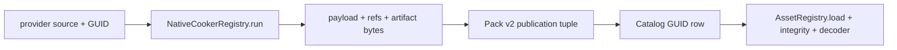

# @forgeax/engine-assets-runtime

## MaterialAsset 唯一成功路径

Runtime 负责 `paramSchema -> derive -> compile/reflect -> cook/load -> extract/record`
中的 load 与 extract/record 消费：按 GUID 读取 producer 已 cook 的 artifact、
receipt、`coordinateSet` 与 `physicalUvScale`，验证 `layoutIdentity` 后交给
render owner。缺失或 stale 时 inspect、修复 producer 并 recook；不会在 runtime
编译 WGSL 或补写 app 侧坐标。

> [!CAUTION]
> 只按结构化 `code`、`detail`、`hint` 恢复；不要复制 source-owned error union，
> 也不要从 URL 或数组顺序重建 asset identity。

## Authoring and recovery index

## 灯光资产 runtime 入口

三条最短入口：

1. 场景 payload 通过 `refs` 往返 `SpotLight.iesProfile` 与 `SpotLight.cookie`；零 handle 表示字段缺席。
2. `IesProfileAsset` 由默认 loader 读取 cooked bytes；runtime 只消费 payload，不读取 `.ies` 源文本。
3. Cookie 通过普通 `TextureAsset` loader/load 状态进入 render；Catalog 不创建旁路 registry。

runtime 只读 producer 已发布并验证的 projection。失败读取 `code`、`detail`、`expected`、`hint`；修复 source/producer 后以同一 authored GUID 重建并重试。`current`、`stale`、`lastKnownGood`、`verified` 各自保留证据边界。

For extended lighting, runtime consumes the same GUID-addressed published
projection for IES and Cookie and passes Probe `irradiance`/`radius` facts to
the renderer owner. It does not own a probe grid, capture, bake, visibility
kernel, Sky contributor, or specular path. `accepted`, `lastKnownGood`,
`recovered`, and `verified` remain separate receipt states; unavailable GPU
resources stay explicitly unavailable.

## Material contract index

The runtime loader reads the Pack publication by GUID and exposes a read-only
projection to render. Runtime values and module slots are data, while compiler
context is a closed input; no material macro, feature define, cook, or DDC
write belongs here. Preserve the layered identities
`materialContractDigest`, `sourceClosureDigest`, `layoutIdentity`,
`programIdentity`, `cookIdentity`, and `materialPublicationIdentity`, and
compare `current` with `generation` before sending the first producer
divergence back through cold-cook and receipt/artifact verification.

The shortest static consumer path is `configurePackIndex(url)` followed by
`loadByGuid<ConcreteAsset>(guid)`. The public barrel exposes the concrete
17-kind types and returns durable payloads, dependency `refs`, and local
`artifacts`; it does not mint a generic GUID-to-handle materializer. Animation,
tileset, render, audio, and VFX owners perform their own World or Host
projection after load.

Catalog source is selected once per host mode: `configureRuntimeBinding(binding)`
owns the scope/generation-bound catalog used by Vite development servers, while
`configurePackIndex(url)` owns the static catalog emitted by a production build.
They are alternatives, not a sequence. App demos can use the shared
`configureRuntimeAssetCatalog` helper from `@forgeax/apps-shared` to keep this
selection as one SSOT and avoid overwriting a scoped development URL with
`/pack-index.json`.

Read structured errors by `code` and use `hint`/`detail` to inspect, rebuild or
cold-cook, refresh LKG, or attach a capability. Host capability loss affects
install/play/execute only; descriptor loading stays available.

The runtime matrix is the same 17 durable kinds as `SCRIPTABLE_PACK_ASSET_KINDS`:
`mesh`, `material`, `scene`, `texture`, `equirect`, `sampler`, `font`,
`render-pipeline`, `tileset`, `video`, `skeleton`, `skin`, `animation-clip`,
`animation-graph`, `audio`, `particle-effect`, and `ies-profile`.

The authority map is [`asset-authority.schema.json`](../../asset-authority.schema.json). Runtime reads Catalog decisions and validated Pack/DDC projections by GUID; it never writes Pack, Meta, DDC, or authoring state.

## Material publication inspection

`inspectMaterialRuntime(ready)` is the read-only, GUID-addressed inspection
projection after the `MaterialReady` gate. Its first-level identity is
`materialGuid`, `publicationGeneration`, `specializationKey`,
`artifactDigest`, and `readiness`. Expand `sourceClosure`,
`parameterContract`, `refs`, and `receipt` only when owner debugging requires
them. The returned `status: 'Ready'` is retained for compatibility with the
runtime result; `readiness: 'ready'` is the machine-readable state field.

For a built-in Standard material the same snapshot also exposes
`standard.mode`, `standard.layers`, `standard.passFamily`,
`standard.passNames`, and `standard.layerPlanIdentity`. A declared layer stays
in `standard.layers` even when its factor is `0`; an absent layer is missing
from that list. Read `parameterContract.values` for the authored factor and
`receipt.derivedInterface`/`receipt.identity` for the derived interface and
artifact identity. This keeps the physical admission and `forward` versus
`forward + deferred + shadow` decision inspectable without a second registry.

```ts
const info = inspectMaterialRuntime(ready);
const physical = info.standard;
if (physical?.mode === 'physical') {
  console.log(physical.layers, physical.passFamily, info.parameterContract.values);
}
```

Material failure consumers branch on stable kebab-case codes:
`shader-module-not-found`, `material-reflection-binding-mismatch`,
`material-specialization-not-cooked`, `asset-artifact-missing`,
`asset-artifact-integrity-mismatch`, and `material-cook-record-invalid`.
Read `expected`, `actual`, `hint`, `retryable`, and `recoveryActions` when
present. Do not infer readiness from a transport URL, a shader manifest, a
natural-language message, or a fallback material.

The same inspection seam accepts producer lifecycle observations for a
material that is pending, failed, or being held as last-known-good. These
projections preserve the material GUID, generation, structured failure and
recovery hint without copying producer state into the renderer. A pending
observation means the cook/resident work has not completed; a failed
observation points back to the producer error; a last-known-good observation
is explicit and still carries the failed current generation. Follow
`inspect -> rebuild/recook or refresh LKG -> loadByGuid` through the producer
owner. Runtime never guesses from URLs, silently repairs a stale artifact, or
creates a parallel readiness ledger.

## Plugin-owned loader registrations

`assetsPlugin(registry)` provides the renderer-owned registry to a Cordis
realm. `assetLoaderPlugin(loader)` and `packLoaderPlugin(loader)` register one
loader as a reversible Fiber effect, so removing a feature cannot leave a stale
kind handler behind. GUID, Catalog, Pack, and payload identity remain owned by
`AssetRegistry`; the plugin controls only the registration lifetime.

```ts
const feature = await app.pluginContext.plugin(assetLoaderPlugin(dialogueLoader));
const dialogue = await app.renderer.assets.loadByGuid<Dialogue>(guid);
await feature.dispose();
```

Use `registry.loaders.register(...)` directly only in a lower-level host that
owns the matching disposer itself. App/game capability composition should use
the plugin helpers so registration and teardown share one Cordis lifecycle.

| Lifecycle | Runtime action | Recovery |
|:--|:--|:--|
| `current` | Load the validated projection | Inspect evidence if a dependency fails |
| `missing` / `cooking` | Return structured not-ready failure | Rebuild in the studio/build host |
| `stale` / `failed` | Do not use raw source | Cold cook, or explicitly preview last-known-good |

Use [`check-asset-authority-audit.mjs`](../../scripts/forgeax/check-asset-authority-audit.mjs) to inspect the owner and runtime-source conclusion before changing a producer.

## External provider cold-load (custom kinds)

Custom provider kinds stay outside the built-in `Asset` union, but they still
use the same producer and runtime authorities. The smallest executable example
is [`voxel-provider-cold-load.integration.test.ts`](src/__tests__/voxel-provider-cold-load.integration.test.ts).

> [!IMPORTANT]
> The provider owns source discovery and `NativeCookerRegistry`; the runtime
> only consumes the verified Pack/Catalog projection. It never invents a typed
> Pack or Preview kind, mints a GUID, or treats a transport URL as identity.



| Boundary | Owner fact | Fixture proof |
|:--|:--|:--|
| Provider/Cook | source key, GUID, payload, refs, artifact bytes | `NativeCookerRegistry.runDraft/run` |
| Publication | one scope/generation/digest/output-set tuple | `createRuntimePackPublication` + `projectRuntimePack` |
| Catalog | producer projection and dependency relation | `projectExternalCatalogEntries` |
| Runtime | GUID lookup, byte length/SHA-256, decoder result | `AssetRegistry` + `AssetArtifactReader.read` |
| Recovery | decoder lease revocation and uncached reload | dispose lease, observe `asset-decoder-missing`, reinstall and reload |

Run the complete provider-to-runtime path with:

```bash
pnpm exec vitest run --project='@forgeax/engine-assets-runtime' \
  packages/assets-runtime/src/__tests__/voxel-provider-cold-load.integration.test.ts \
  --maxWorkers=1 --no-file-parallelism
```

The fixture deliberately uses a custom `voxel-shape` decoder only; it is an
asset-runtime/provider contract probe, not the Wave 2 Voxel product or a
replacement for the standard 17 built-in asset kinds.

> [!IMPORTANT]
> Runtime material consumption is `configurePackIndex` -> `loadByGuid<MaterialAsset>` -> cooked readiness -> `world.internSharedRef`. The registry returns the loaded payload and follows its dependency graph; it does not create an app-owned shader artifact or a parallel material authoring surface. Interning preserves one handle per catalogued payload identity inside a World; explicit `world.allocSharedRef` calls remain independent resources.

## MaterialAsset runtime recovery

Load a root and any inherited child through the same GUID catalog. A ready material must have its effective `passes`, `values`, `parent` chain, per-slot `coordinates`, references, artifact, and receipt. For a failure, switch on the structured code, read `detail` and `hint`, repair the package or cook output, and retry the same GUID. A missing cook is not a valid fallback to runtime compilation.

A values-only child reuses the cooked program projection of its parent-chain
owner. Program lookup follows the same catalogued parent payloads as contract
resolution; it does not substitute the authored module name for the installed
specialization identity. Child values remain governed by the root contract.

The runtime asset layer: catalogue an asset by GUID, load its payload + all
transitively-referenced sub-assets, resolve a `Handle` back to its payload, and
wire the default loader set. Tier 2.1 package extracted from
`@forgeax/engine-runtime` (feat-20260705-runtime-tier2-decomposition M1) so an AI
user loads only the asset-cluster concept surface — not the whole renderer — when
the task is "get an asset into the World".

## AssetEvidence SDK boundary

`AssetRegistry.inspect(guid)` and `verifyByGuid(guid)` expose the injected SDK side of the same `AssetEvidence` chain: source declaration, catalog `packageUrl`/`cookReceiptUrl`, producer `CookReceipt`, Pack v2 artifact verification, and optional runtime state. The registry does not import the Node CLI, Vite, or filesystem policy. Call `configureAssetEvidence(source)` in a host that can supply those facts; without it the result is explicit `unknown`/capability-missing evidence.

Cook states are not interchangeable: `notCooked`, `ready/current`, `ready/stale`, and `unknown` each describe a different recovery action. Package/artifact verification separately reports `notChecked`, `passed`, or `failed`. Follow `.code` and `.hint`, repair the producer or package, and rerun the probe; never convert a missing capability into passed evidence.

## 30-second self-introduction

- **`AssetRegistry`** — instance-per-engine GUID -> payload catalogue. `catalog` /
  `loadByGuid` / `lookup` / `parseGuid` / `inspect` / `resolveName` / `packageOf` /
  `rename` / `invalidate` / `invalidateAll` / `instantiate`. Post-D-17 it stores
  the PAYLOAD and mints no handles (scene GUID resolution interns column handles
  on the World via `world.internSharedRef('Kind', payload)`). `Renderer.assets` is an `AssetRegistry`
  assembled by `createRenderer` (which injects the post-spawn hook and concrete
  Web Audio loader; video is a default loader — see D-1 / D-2).
- **`HANDLE_CUBE` / `HANDLE_TRIANGLE` / `HANDLE_QUAD` / `HANDLE_SPHERE` /
  `HANDLE_CYLINDER` / `HANDLE_NINESLICE_QUAD`** — process-static builtin mesh
  handles (reserved ids 1-6, `< BUILTIN_BASE`), resolved through
  `BuiltinAssetRegistry` (never reference-counted). Pair with `MeshFilter`.
- **`resolveAssetHandle(world, handle)`** — two-tier (builtin / user-tier
  `world.sharedRefs`) handle -> payload resolution; returns a closed-union error
  (`shared-ref-stale` / `shared-ref-released` / `asset-not-found`) so callers
  distinguish "re-acquire handle" from "re-load asset" from "check GUID".
- **`LoaderRegistry` + `wireDefaultLoaders(registry, extraLoaders?)` +
  `createDefaultLoaderRegistry(extraLoaders?)`** — the default set covers the
  complete 17-kind durable `Asset` union, including both inline and artifact
  forms. `createRenderer` may replace the durable audio descriptor loader with
  its concrete Web Audio catalog-entry loader; the registry still has one
  owner per kind.

### 30s hands-on example

```ts
import { AssetRegistry, HANDLE_CUBE } from '@forgeax/engine-assets-runtime';
import { MeshFilter, MeshRenderer } from '@forgeax/engine-render';
import { Transform } from '@forgeax/engine-scene';

// A builtin mesh handle needs no registration ceremony:
world.spawn(
  { component: Transform, data: { pos: [0, 0, 0], quat: [0, 0, 0, 1], scale: [1, 1, 1] } },
  { component: MeshFilter, data: { assetHandle: HANDLE_CUBE } },
  { component: MeshRenderer, data: { materials: [matHandle] } },
).unwrap();

// Imported meshes normally use an empty override vector. AssetRegistry
// recursively loads MeshAsset.materialSlots defaults; Render inherits them.
world.spawn(
  { component: Transform, data: {} },
  { component: MeshFilter, data: { assetHandle: importedMeshHandle } },
  { component: MeshRenderer, data: { materials: [] } },
).unwrap();

// Catalogue + load a GUID-addressed asset (dev / inline path):
const guid = assets.parseGuid('cbe42beb-8975-5096-b3a1-3dda4cb4c077');
const res = await assets.loadByGuid(guid); // -> Result<payload> (D-17: payload, not handle)
```

## API surface

| Symbol | Kind | One-line |
|:--|:--|:--|
| `AssetRegistry` | class | GUID -> payload catalogue + loader dispatch + scene instantiate |
| `HANDLE_CUBE` / `HANDLE_TRIANGLE` / `HANDLE_QUAD` / `HANDLE_SPHERE` / `HANDLE_CYLINDER` / `HANDLE_NINESLICE_QUAD` | const | builtin mesh handles (ids 1-6) |
| `BuiltinAssetRegistry` / `BUILTIN_*` / `BUILTIN_BASE` | const | process-static builtin payloads and reserved slot boundary; the shared vertex-layout SSOT is `PROCEDURAL_FLOATS_PER_VERTEX` from `@forgeax/engine-geometry` |
| `resolveAssetHandle` / `walkMaterialPassesOverSharedRefs` | fn | two-tier handle -> payload resolution |
| `LoaderRegistry` | class | kind -> loader dispatch table |
| `wireDefaultLoaders` / `createDefaultLoaderRegistry` | fn | wire all 17 durable Asset loaders + caller `extraLoaders` |
| `assetsPlugin` / `assetLoaderPlugin` / `packLoaderPlugin` | fn | Provide a registry and bind loader registrations to a Cordis Fiber lifetime |
| `DynamicTextureStore` / `DynamicTextureDevice` | class/type | per-frame dynamic texture upload store; replacement devices invalidate stale transient textures before the next upload |
| `unpackMeshBin` / `UnpackedMeshBin` | fn/type | strict mesh-binary v4 sidecar decode with geometry projection verification |
| `validateTilesetPayload` / `TilesetValidateOptions` | fn/type | register-time tileset payload gate |
| `PostSpawnHook` / `SkinJointResolver` | type | post-spawn hook contract (D-1; runtime injects `postSpawnResolveJoints`) |
| `Asset` / `MeshAsset` | type | re-exported asset union shapes (SSOT `@forgeax/engine-types`) |

Full `AssetRegistry` surface + signatures: source SSOT
`packages/assets-runtime/src/asset-registry.ts`. The load + DDC / pack-fetch
pipeline lives in `packages/assets-runtime/src/registry/load-by-guid.ts`; the
instantiate cluster + hook types in `registry/instantiate.ts`; material
validation in `registry/validate-material.ts`.

## Mesh binary v4 loading

[`loaders/mesh-bin.ts`](src/loaders/mesh-bin.ts) is the sole runtime decoder.
It rebuilds the geometry projection from the wire mask, compares schema version,
stride, and digest, validates every byte/cardinality bound, then publishes the
mesh and metadata as one result. Inline-pack loading uses the same loader.

| Failure | Runtime behavior | Next action |
|:--|:--|:--|
| v2/v3 or malformed bytes | closed `MeshBinAssetError` with sourceKey, expected/actual, and recovery hint | Re-cook through the owning importer |
| invalid refs or metadata | no MeshAsset publication | Repair producer refs/Meta and retry |
| failed replacement after a prior load | retain the catalogued last-known-good payload | Inspect evidence, cold-cook, then publish atomically |

> [!WARNING]
> Runtime has no legacy decoder and no re-cook fallback. A white/default mesh
> is not a valid recovery for a malformed artifact.

### Scene instantiation failure atomicity

> [!IMPORTANT]
> `assets.instantiate` and `assets.instantiateFlat` run the renderer-injected
> post-spawn hook as part of one transaction. If joint wiring returns the
> existing `skin-joint-path-unresolved` or `skin-asset-unresolved` result, the
> method returns that exact structured error and removes only the entities,
> hierarchy, mount state, joint publication, and shared-reference grants
> created by that call. Repair the catalogued asset or joint path, then retry
> with the same registry and World; no process or World reconstruction is
> required.

## Catalog source: enumerate first-class asset rows, then observe row changes

> [!IMPORTANT]
> A catalog is an enumerable complete row set plus subscribable row changes.
> Wire the source, **subscribe before enumerating**, then keep the local view
> keyed by GUID. `CatalogDelta` reports facts only; it never chooses a page
> reload or an editor update policy.

`CatalogSource` is the runtime boundary between `AssetRegistry` and a concrete
catalog transport. Its two operations are `enumerate()` and `subscribe()`;
the public row and delta shapes are `CatalogEntry` and `CatalogDelta` from
`@forgeax/engine-types`. Read those exported types for their complete fields
instead of copying a second schema into a consumer.

### Producer fact parity

> [!IMPORTANT]
> Static entries and URL/fetch entries have the same neutral `CatalogEntry`
> shape. `parseCatalog()` preserves `packageId`, `provenance`, `revision`,
> `sourceKey`, `sourceIndex`, `relations`, and `diagnostics`; it never derives
> them from `relativeUrl`, `sourcePath`, or array position.

| Runtime input | What is checked | What is not done |
|:--|:--|:--|
| Static `entries` | Optional expected revision continuity | No payload decode or re-import |
| URL `fetch` | JSON shape, required locator, and optional expected revision | No identity reconstruction from the URL |
| Malformed row | Structured `asset-parse-failed` with `expected` and `hint` | Never converted into an empty successful catalog |
| Revision mismatch | Structured failure with expected and actual revisions | Never applied over the last verified snapshot |

The source is a neutral facts boundary, not an asset decoder. Decode, upload,
and GPU work remain in their existing loader paths; the catalog parser only
enumerates facts and locators.

```ts
const unsubscribe = assets.subscribeCatalog((delta) => {
  // Delete first, then replace added/changed rows by their stable GUID.
  for (const guid of delta.removed) rowsByGuid.delete(guid.toLowerCase());
  for (const row of [...delta.added, ...delta.changed]) {
    rowsByGuid.set(row.guid.toLowerCase(), row);
  }
});

const snapshot = await assets.enumerateCatalog();
if (!snapshot.ok) {
  console.error(snapshot.error.code, snapshot.error.hint);
  // Fix the source configuration or catalog endpoint, then call enumerateCatalog() again.
} else {
  for (const row of snapshot.value) rowsByGuid.set(row.guid.toLowerCase(), row);
}

// Safe to call more than once.
unsubscribe();
unsubscribe();
```

### Delta and refresh ownership

| Delta set | Carries | Consumer action |
|:--|:--|:--|
| `added` | complete new `CatalogEntry` rows | insert/replace by lowercase GUID |
| `changed` | complete replacement `CatalogEntry` rows | replace by lowercase GUID |
| `removed` | stable GUID strings | remove by lowercase GUID |

The producer emits no delta when its final catalog projection is unchanged.
Source-only byte changes likewise are not forged into a row change. A browser
host that needs those bytes to refresh explicitly selects its own policy (for
the Vite adapter, `reloadAssetHost()`); an editor can instead merge the delta
without recreating its realm. The registry does not import Vite or infer either
policy.

### Recovery and static sources

Call `setCatalogSource(source)` before enumeration. Replacing a source disposes the
previous producer subscription; call `clearCatalogSource()` during host teardown
to remove the active transport and replica listeners without clearing payload caches.
Without a source,
`enumerateCatalog()` returns the structured `catalog-source-unconfigured`
error; endpoint and parse failures remain structured results as well. Inspect
`.code` and `.hint`, repair the external condition, then enumerate again — a
failed enumeration is not a permanent result.

When a source returns `asset-parse-failed`, branch on `.expected`, `.hint`, and
`.detail` rather than `.message`. For a stale revision, keep the last verified
catalog, repair or re-fetch the producer revision, and enumerate again.

Subscribe before the first enumeration to avoid the consumer-side missed-event
window. If a consumer subscribed late or needs to resynchronise after a
transport interruption, enumerate again and merge the returned complete rows
by GUID. A static source may safely return an idempotent no-op unsubscribe: it
has no continuing change transport and must not manufacture deltas.

## Error model

`AssetRuntimeErrorCode` is the package's closed error-code SSOT (exhaustive
`switch (err.code)` without `default`; TS guards completeness). Read the source,
don't duplicate the member list — `packages/assets-runtime/src/errors/asset.ts`
(grep `export type AssetRuntimeErrorCode`). Each error object carries
`.code` / `.expected` / `.hint` / `.detail`. `RendererError` (in
`@forgeax/engine-runtime`) composes `AssetRuntimeError` into its onError fan-out
union, so a dropped arm is a compile error.

## Dependencies

`@forgeax/engine-{codec, ecs, geometry, graphics-extras, image, pack, rhi, shader, types}`.
Never imports `@forgeax/engine-runtime` or an audio backend: runtime injects the
post-spawn hook and concrete audio catalog-entry loader at `createRenderer`.

## Runtime image bytes decoder (`decodeImageBytes`)

`decodeImageBytes(bytes, mime, opts?)` is the runtime SDK entry for AI users
who already hold image bytes in memory (fetched from a URL, embedded as
base64, produced by an out-of-tree decoder, etc.) and want to feed them into
`world.allocSharedRef('TextureAsset', pod)` + `GpuResourceStore.ensureResident`
without the disk-side importer / pack build pipeline in the loop. It is the
runtime counterpart to the build-time `.bin` / `.ktx2` texture loaders --
those stay authoritative for shipped assets; `decodeImageBytes` covers the
"bytes only exist at runtime" case that static loaders cannot serve
(tweak-20260714).

### Signature

```ts
export async function decodeImageBytes(
  bytes: Uint8Array | ArrayBuffer,
  mime: string,
  opts?: { colorSpace?: 'srgb' | 'linear'; mipmap?: boolean },
): Promise<Result<TextureAsset, ImageError>>;
```

- `bytes` -- encoded image byte stream (PNG or JPEG). Both `Uint8Array` and
  `ArrayBuffer` accepted; the function does not take ownership.
- `mime` -- byte-stream mime type. v1 whitelist: `'image/png' | 'image/jpeg'`
  (see boundaries below).
- `opts.colorSpace` -- `'srgb'` (default) or `'linear'`. Derives POD `format`:
  `srgb -> 'rgba8unorm-srgb'`, `linear -> 'rgba8unorm'` (mirrors the
  build-time `packages/image/src/image-importer.ts` `colorSpaceToFormat`
  rule -- one SSOT, no drift).
- `opts.mipmap` -- `true` (default) or `false`. When `true`, `mipLevelCount`
  is computed by the existing `numMipLevels({ width, height })`; when
  `false`, `mipLevelCount === 1`.

### v1 boundaries (explicit non-goals)

The function is intentionally a thin bridge from bytes to a `TextureAsset`
POD. What it does NOT do:

- **No network I/O.** `decodeImageBytes` never `fetch`es; the caller supplies
  bytes.
- **No GPU upload.** The POD is fed into the existing
  `world.allocSharedRef('TextureAsset', pod)` +
  `GpuResourceStore.ensureResident` path -- the upload primitives are not
  duplicated or replaced.
- **v1 supports PNG / JPEG only.** GIF / WebP / SVG / AVIF / KTX2 / HDR
  (`.hdr`) fall to `image-format-unsupported`; convert offline (or
  reach for the build-time importer, which handles a wider set) rather
  than expanding this API's mime table.
- **Not a replacement for the static texture loader.** Shipped `.bin` /
  `.ktx2` continue to flow through the pack pipeline (`loadByGuid`); this
  API only covers the runtime-only-bytes case (progressive disclosure --
  AI user sees the smaller, more focused surface).
- **Not a Node / server-side decoder.** Requires an environment with
  `createImageBitmap` + `OffscreenCanvas` (browser main thread or Worker).
  Missing capability surfaces as a structured `image-decode-failed` error
  (never a silent broken POD).

### Error codes (closed union subset)

`decodeImageBytes` only ever produces the four base `ImageErrorCode` members
listed here; the other atlas / HDR members of the union are not reachable
from this API. Every error object carries `.code` / `.expected` /
`.hint` / `.detail`; `.detail` narrows per `.code` (discriminated union).
Read the source, do not duplicate the member list --
`packages/types/src/index.ts` (grep `export type ImageErrorCode`).

| code | trigger | `.detail` narrows to |
|:--|:--|:--|
| `image-format-unsupported` | mime not in `['image/png', 'image/jpeg']` | `{ actualMime, path?, formatColorSpaceConflict? }` |
| `image-decode-failed` | decoder rejected bytes, or env lacks `createImageBitmap` | `{ reason, path? }` |
| `image-dimension-out-of-bounds` | reserved; transparent pass-through if the underlying decoder ever surfaces it | `{ requested: {width,height}, limit }` |
| `image-meta-missing` | reserved; not raised by this API in v1 (kept in the union for a single grep-discoverable SSOT) | `{ sourcePath, expectedSidecarPath }` |

### Error self-recovery paradigm

Structured errors with copy-pastable hints -- AI users consume via property
access, never by parsing `.message` (charter P3 explicit failure + P4
consistent abstraction; AGENTS.md Error model). Exhaustive `switch
(err.code)` needs no `default` -- TypeScript guards union completeness at
compile time, so future minor adds to `ImageErrorCode` surface as a
localised type error rather than a silent miss.

```ts
import { decodeImageBytes } from '@forgeax/engine-assets-runtime';

const bytes = new Uint8Array(await (await fetch(url)).arrayBuffer());
const result = await decodeImageBytes(bytes, 'image/png');
if (!result.ok) {
  const err = result.error;
  // .hint carries an executable recovery instruction (see IMAGE_ERROR_HINTS
  // SSOT in packages/types/src/index.ts); no string parsing needed.
  console.error(err.code, err.hint);
  // ImageError correlates the envelope code with its detail shape, so one
  // discriminant drives both recovery routing and IDE narrowing.
  switch (err.code) {
    case 'image-format-unsupported':
      // err.detail.actualMime -- rejected mime; convert offline
      console.error('bad mime:', err.detail.actualMime);
      break;
    case 'image-decode-failed':
      // err.detail.reason -- underlying decoder message (or "env lacks
      // createImageBitmap" when the platform capability is missing)
      console.error('decode reason:', err.detail.reason);
      break;
    case 'image-dimension-out-of-bounds':
      console.error('too big:', err.detail.requested, err.detail.limit);
      break;
    case 'image-meta-missing':
      console.error('missing sidecar:', err.detail.expectedSidecarPath);
      break;
  }
  return;
}

// Bytes in, POD out -- charter P4 one abstraction, same POD shape as the
// build-time texture loader emits, so downstream does not care about the
// byte source (progressive disclosure: allocSharedRef + ensureResident is
// the same call site as static assets).
const handle = world.allocSharedRef('TextureAsset', result.value);
```

### Isolation gate boundary

`decode-image-bytes.ts` is the SINGLE file in `@forgeax/engine-assets-runtime`
allowed to statically import `@forgeax/engine-image`. The
`scripts/check-image-pipeline-isolation.mjs` (a.2-anti) rule pins this
exact path as its whitelist; the wider runtime and the rest of
assets-runtime remain gated so a future accidental static import falls
loud, not silent.

## Route map

- Import images / glTF / fonts, wire `loadByGuid`, author sidecars: skill
  `forgeax-engine-assets`.
- Full asset-chain narrative (sidecar -> import -> pack-index -> loadByGuid):
  `packages/pack/README.md` + `forgeax-engine-assets/README.md`.
- Runtime image bytes decoding (this package, runtime-only-bytes case):
  see the `decodeImageBytes` section above.
# Static asset evidence

> [!IMPORTANT]
> Static assets load from Pack v2 through `packageUrl`. Runtime-only bytes are the separate exception.

`AssetEvidence` joins `packageUrl`, cook freshness, artifact verification, and optional runtime state. Use `lookup/verify --guid --project --catalog --json` or the SDK `inspect(guid)` / `verifyByGuid(guid)` surface. `notCooked`, `stale`, and `unknown` are distinct recovery states; `unknown` is not verification success.

## Indexed consumer recovery

The runtime consumer follows a read-only handoff:

1. **Inspect** with `assets.inspect(guid)` or `assets.verifyByGuid(guid)` and
   branch on the structured result's `code`, `detail`, and evidence states.
2. **Repair and rebuild or cold-cook** in the producer host. The runtime never
   writes source Meta, Pack, DDC, receipts, or Catalog authority.
3. **Verify** source freshness, receipt, package integrity, and artifact
   status through the injected evidence source or Pack CLI.
4. **Retry** the same GUID after a verified Catalog projection is available.
   Do not parse log strings, compile raw source in the player, or substitute a
   custom mesh/material for a missing engine product.

`AssetRegistry` consumes a producer projection and exposes structured not-ready
errors. It does not register importers, run `runImport`, own DDC lifecycle, or
expand the runtime transport surface. `unknown` means that required evidence
was unavailable; it is never a successful verification result.

## Surface load and recovery

Runtime treats a Standard Surface as published data: `moduleSlots.surface`,
parameters, values, closure identity, and generation are read from the Pack
record. It does not parse WGSL, infer a layer plan, or create a fallback pass.

```text
inspect -> producer rebuild or cold-cook -> atomic publication
        -> verify artifact/receipt/generation -> loadByGuid -> render
```

`programIdentity` and `cookIdentity` describe the compiled program and cook;
`materialPublicationIdentity` describes the published Pack generation; device
generation describes GPU resources only. Device loss therefore rebuilds GPU
state without pretending that a stale source artifact is valid.
