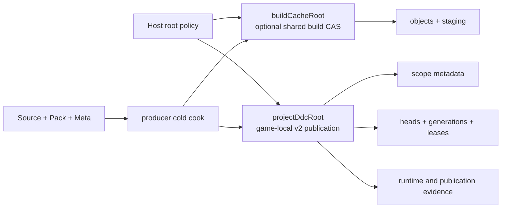
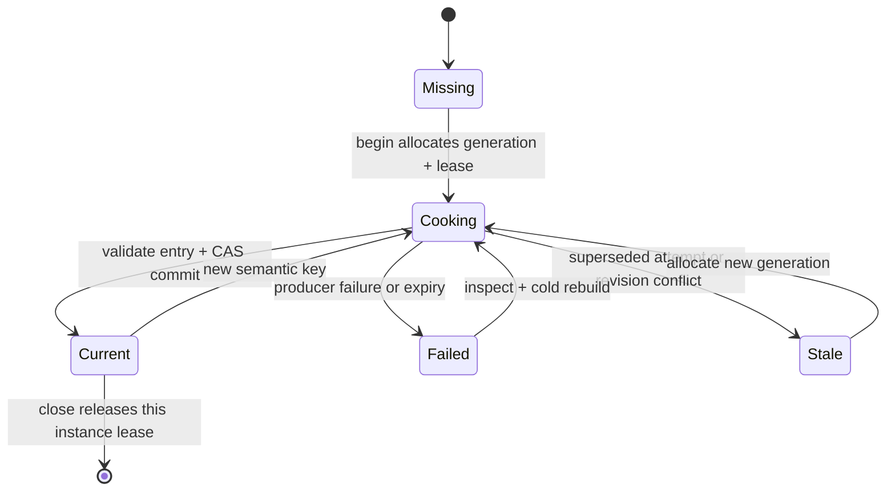

# @forgeax/engine-ddc

## Help and API schema

DDC is a Node-only, read-only, disposable projection of producer evidence. The author authority remains the source, Pack, and Meta inputs. A cache hit is never author truth, and a Catalog row is only a projection of validated producer facts.

The machine-readable category and producer index is [`asset-authority.schema.json`](../../asset-authority.schema.json). DDC does not provide Save, Undo, Move, Rename, Promote, or Editor write operations.

> [!IMPORTANT]
> DDC can be deleted and rebuilt from author inputs. It must not become Save, Undo, Move, Rename, collaboration state, or the only copy of a runtime asset.

The public entry point exports the following owners:

| Surface | Public exports | Purpose |
|---|---|---|
| Layout | `resolveBuildDdcLayout`, `resolveDdcLayout` | Resolve explicit build and project roots into the v2 child layout |
| Status | `serializeDdcStatus`, `projectDdcStatusForBrowser` | Produce a versioned status envelope and a path-free browser projection |
| Storage | `DdcEntryStore`, `ddcOutputDigest` | Stage, validate, publish, inspect, list, and remove immutable entries |
| Lifecycle | `DdcLifecycle`, `withDdcLock` | Allocate generation, fence leases, CAS heads, and recover failures |
| Scope and GC | `createRuntimeScope`, `collectDdcGarbage` | Preserve original scope identity and sweep only unreachable project objects |
| Errors | `DdcStoreError`, `DDC_ERROR_CODES` | Closed machine-readable errors with executable recovery actions |

Available Node subpaths are `.`, `./key`, `./entry-store`, `./layout`, `./status`, and `./errors`.

## Status summary

Status uses the stable schema identifier `forgeax-ddc-status/v2`. The first layer is the health summary; deeper fields identify the owner, scope, current/LKG facts, protection, and legal actions.

```json
{
  "schemaVersion": "forgeax-ddc-status/v2",
  "health": "blocked",
  "layers": [
    {
      "kind": "project",
      "owner": "engine-ddc",
      "rootKind": "project-ddc",
      "scopeId": "editor/main",
      "current": 7,
      "lastKnownGood": 6,
      "protection": ["current", "lease:editor-a"],
      "actions": [
        { "kind": "inspect", "executable": true },
        { "kind": "prune", "executable": true, "exactTarget": ".../generations/4" }
      ]
    }
  ]
}
```

`projectDdcStatusForBrowser(status)` preserves logical identity and recovery data while removing `gameDir`, `projectDdcRoot`, and every `exactTarget`. Browser and iframe consumers therefore never need host filesystem paths.

## Layer and scope layout

The host injects both roots. DDC never reads `cwd`, `roots[0]`, a basename, a game id, or a URL to infer persistence policy.



The canonical project root is `<gameDir>/.forgeax/ddc/v2`. The build root is an injected performance cache and may be shared only when the complete semantic key matches. Project publication, heads, current/LKG, leases, scopes, and runtime evidence never cross game boundaries.

| Call shape | Required root | Intended use | Missing-root behavior |
|---|---|---|---|
| `resolveBuildDdcLayout({ buildCacheRoot })` | `buildCacheRoot` | Build-only object reuse | Closed absolute-root failure |
| `resolveDdcLayout({ buildCacheRoot, projectDdcRoot })` | Both roots | Serve, publication, fixed bind, and rebind | `ddc-project-root-required` |
| `createRuntimeScope(projectDdcRoot, scopeId)` | Project root | Scope hash plus original metadata | `ddc-scope-mismatch` |

`a/b` and `a_b` receive different SHA-256 physical scope identities. The original scope id is stored in `scope.json` and is checked before enumeration or pruning; sanitized names and prefix matching are not ownership proofs.

## Lifecycle and recovery



Each `begin` persists a strictly increasing generation and an expected head revision. `commit` rechecks the lease, expiry, expected revision, desired key, entry receipt, and integrity before switching `current`. A failed candidate never promotes LKG to current; LKG remains a read-only recovery view.

`DdcGenerationSession` heartbeats active candidate leases while a multi-asset generation is still producing, so atomic publication may outlive one lease interval without weakening the final commit fence. Closing, discarding, or committing a candidate stops its heartbeat.

> [!NOTE]
> `DdcLifecycle.readCurrentEntry()` is a recovery read for a Pack producer to rehydrate its process-local transport cache after a restart. It accepts only a `current` head with a complete, integrity-checked entry; it never promotes LKG/stale content, mutates the head, or turns DDC into an authoring/runtime transport authority. Catalog and producer state remain the consumer-facing authority.

| Rollback surface | Contract | Result |
|---|---|---|
| `DdcLifecycle.beginWithSnapshot` | Captures the accepted head and allocates the lease while holding the same per-asset lock | No begin/snapshot TOCTOU window |
| `DdcLifecycle.restoreIfCurrent` | Accepts an active-attempt fence or an exact terminal mutation fence | `restored` or a diagnostic `not-owner` no-op |
| `DdcGenerationSession.restoreEntry` | Stops the heartbeat before the fenced restore and discards staging afterward | A superseded writer cannot overwrite a newer head |

> [!IMPORTANT]
> Rollback restores accepted content only. It never resurrects a superseded active lease, rewinds `revision` or `generation`, or replaces a newer active/terminal mutation. Stale, invalid, and failed terminal writes carry their own mutation fence so an old session cannot pass an ABA-shaped check.

<details>
<summary>Exact target and receipt contract</summary>

An immutable entry is accepted only when all of these facts agree:

1. `DdcEntry.key` matches `DdcReceipt.key` and the semantic key format.
2. `DdcReceipt.guid` matches the entry GUID.
3. `DdcReceipt.outputDigest` matches the canonical payload, refs, and artifact bytes.
4. The stored integrity record matches every payload, receipt, artifact, and entry digest.
5. The mutable head still owns the attempt, generation, and expected revision.

`DdcEntryStore.publish` is idempotent for the same key and integrity. A different payload under the same key remains a conflict; it is never silently overwritten. Staging and destination stay under the injected root so publication does not claim cross-device atomicity.

</details>

## Closed errors and executable actions

The closed configuration and lifecycle codes are:

| Code | Meaning | Safe recovery |
|---|---|---|
| `ddc-project-root-required` | Serve/publication did not receive a project root | Re-run host canonicalization and inject `projectDdcRoot` |
| `ddc-object-conflict` | Same object key has different integrity | Inspect and keep the verified object |
| `ddc-head-conflict` | Head revision changed before commit, or an existing head is unreadable/invalid | Inspect current/LKG and retry with a fresh attempt |
| `ddc-generation-conflict` | Requested generation is not allocatable | Allocate a persistent generation; do not edit the counter |
| `ddc-scope-mismatch` | Scope metadata and request disagree | Inspect the canonical project root and rebind |
| `ddc-lease-expired` | The attempt no longer owns a live lease | Discard stale work and acquire a new lease |

`DdcStoreError` exposes `code`, `hint`, `expected`, `actual`, `owner`, `rootKind`, `scope`, `generation`, `lease`, `revision`, and `recoveryActions`. Use these fields directly; do not parse `Error.message`, hand-edit heads/counters/leases, or recursively delete the cache. `toBrowserProjection()` removes host paths while retaining the fields needed to choose the next safe action.

## Safe action checklist

- [x] Inspect status before changing a head or pruning an object.
- [x] Keep current and LKG protected while a lease or revision can reach them.
- [x] Use a new generation after restart, stale work, or a lease conflict.
- [x] Cold-cook from source, Pack, and Meta when optional build CAS is absent, read-only, or corrupt.
- [ ] Treat DDC as an authoring or runtime transport authority.
- [ ] Guess a project root from `cwd`, a basename, `roots[0]`, game id, or URL.

The package owns derived evidence only. Source authority, Pack publication, Catalog projection, browser binding, and final release archives remain separate owners.
