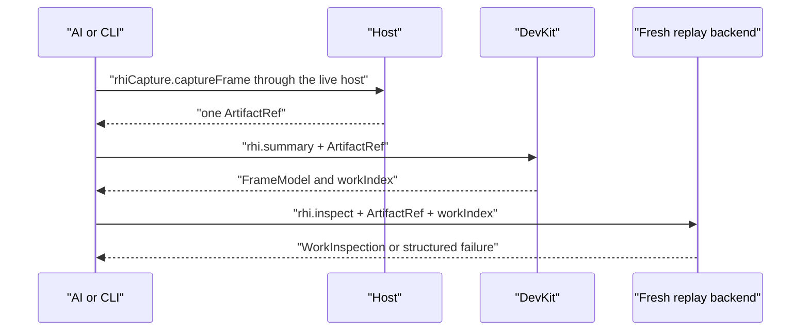
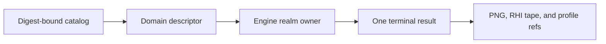

# @forgeax/engine-devkit

DevKit is the Node-only external-project seam for ForgeaX. It derives project
commands, authoring-preview contributions, and one AI-facing RHI-debug path from
the existing project authorities. It owns orchestration and file access; Engine
owns rendering, RHI events, replay backends, and preview execution.

> [!IMPORTANT]
> Keep one artifact reference across the RHI-debug flow. `rhi.summary` and
> `rhi.inspect` never rediscover a tape, infer a file pair, or parse error text.

## Navigation

- [CLI and catalog](#cli-and-catalog)
- [Browser compositor capture](#browser-compositor-capture)
- [Engine source binding](#engine-source-binding)
- [Startup diagnostics](#startup-diagnostics)
- [RHI-debug operations](#rhi-debug-operations)
- [Authoring preview](#authoring-preview)
- [Project authority](#project-authority)
- [Migration and carrier](#migration-and-carrier)

## CLI and catalog

The normal project commands remain available through the `forgeax` CLI:

```text
forgeax project new [directory] --template empty|game-3d
forgeax project init
forgeax project check
forgeax project skill install
forgeax project skill verify
forgeax project test
forgeax dev start
forgeax project build
forgeax project capture --backend auto --require-ui --output artifacts/capture/game-ui.png --json
forgeax project preview
forgeax project package [--format web-zip|single-html] [--output release/game-web.zip]
forgeax help --tree --json
forgeax debug rhi summary --artifact .forgeax-debug/{runId}/frame.rhitape --json
forgeax debug rhi inspect --artifact .forgeax-debug/{runId}/frame.rhitape --work-id {workIndex} --json

# Pack authoring identity and recovery
forgeax asset resolve --package-id {packageId} --source-key {sourceKey} --require identity --json
forgeax asset resolve {assetGuid} --require ready --json
```

> [!IMPORTANT]
> `forgeax dev start` is a source-development server and `forgeax project preview` is a
> verified static `dist/` server. Their `--json` startup envelopes expose
> `mode`, `serves`, and the current `rhi.capture` capability. Neither command
> silently invents a live capture attachment.

### Persistent live control

The `dev` live commands keep one project-backed Engine session for short,
stateful inspection loops. Start either the serial host or the Engine Worker,
then address the returned `instanceId` and `worldIdentity`:

```text
forgeax dev start --tier main-serial|engine-worker --headless --json
forgeax dev status --json
forgeax dev eval --instance-id {instanceId} --world-identity {worldIdentity} --code 'return simulation.execution.report()' --json
forgeax dev camera get --instance-id {instanceId} --world-identity {worldIdentity} --json
forgeax dev focus --instance-id {instanceId} --world-identity {worldIdentity} --entity {entity} --json
forgeax dev capture --instance-id {instanceId} --world-identity {worldIdentity} --output artifacts/capture/live.png --json
forgeax dev reload --json
forgeax dev stop --json
```

The live host observes the project generation and keeps the Engine world as
the authority. Status, reload, and stop address the one session for the
project root; eval, camera, focus, and capture carry the latest returned
identity. Camera, focus, and capture are transient requests, while reload
returns a new instance/load identity, so callers must use the latest envelope.
All commands accept the project `--root`; status, reload, and stop use the
root to find the session when no identity is needed.

Static deployment is an Engine-owned build product. A publishing host supplies
the project root, public URL base, and dedicated output directory; DevKit owns
the generated host, asset cooking, shader compilation, Pack index, and
`forgeax-dist.json` closure.

## Generated asset host

DevKit derives one producer composition for `dev` and `build`. The generated
host uses `pluginPack` with the project's asset roots and producer registrations;
serve mode opts into `reloadAssetHost()` when a watched byte change needs a
full host refresh. The same `runtimeBinding` shape identifies the game and
scope, while `generation` rejects stale Catalog work.

| Fact | DevKit rule |
|:--|:--|
| `producerReadiness` | Keep producer capability explicit; a missing importer or cooker is a structured failure. |
| `sourceKey` | Preserve producer semantic output identity; never replace it with source position or a cache path. |
| Catalog | Read the projection and its lifecycle/diagnostics; do not write Pack, Meta, or DDC from the generated host. |
| LKG | Treat `lastKnownGood` as read-only evidence while repairing the producer, then retry the same GUID. |

The authority map and executable audit are [`asset-authority.schema.json`](../../asset-authority.schema.json) and [`check-asset-authority-audit.mjs`](../../scripts/forgeax/check-asset-authority-audit.mjs). A failed command should expose its structured `code`, `expected`, `hint`, and `detail` so the named producer can be repaired without guessing from messages.

Game modules default-export native Cordis plugins. Plugin install/uninstall updates `forge.json.plugins[]`; pass `--dependency <package-or-local-spec>` to include `pnpm add` or `pnpm remove` in the same authoring transaction. A dependency failure restores the original manifest. The next dev/build generation deterministically adds or removes the literal Catalog import and production bundle reachability.

> [!IMPORTANT]
> DevKit also closes the Engine builtin-mesh dependency boundary. During a
> standalone build it adds a generated Pack descriptor only for builtin mesh
> GUIDs absent from the project; the Geometry decoder turns those descriptors
> into validated primitive meshes. Project-authored descriptors remain the
> single declaration, so the generated Pack never creates a GUID collision.

```bash
forgeax project build ./games/my-game \
  --base /games/my-game/ \
  --out-dir ./website-staging/games/my-game \
  --json
```

`--out-dir` resolves relative to the game project root unless it is absolute.
The selected directory is a derived build root and is emptied before writing.
`forgeax project preview` continues to verify and serve the default `dist/` directory.

`forgeax project new` accepts an absent or empty target only when that target is outside the unpacked SDK
root. An SDK-owned target fails before template copying with `project-target-inside-sdk`; use a
sibling directory or an absolute path outside the SDK.

`forgeax project new` requires an explicit template: choose `game-3d` for every 3D game, including custom
3D genres, and choose `empty` otherwise. Omitting `--template` fails with `sdk-template-required`.

> [!IMPORTANT]
> `game-3d` is a runnable, contentful third-person reference, not an empty 3D scene. It copies
> authored scene content, visible objects and static collision examples, character/material/animation packs,
> and UI into the new project; those choices affect the initial picture, movement space, and asset
> closure. Read the generated project's `README.md` before pruning anything, then keep, adjust, or
> replace the starter content for the game's goal and update scene, runtime, and pack references
> together when removing it.

`forgeax project package` rebuilds with relative URLs, verifies the complete `forgeax-dist.json` closure,
and emits a deterministic Web ZIP plus an adjacent SHA-256 file. The archive contains the bundled
Engine JavaScript/WASM runtime and game assets at its root for HTTPS static or HTML-game hosting;
it also attaches the project documents `README.md` and `docs/feedback.md` unchanged at those same
ZIP paths. Both documents are required, so an incomplete game archive fails before the build starts.
It does not contain other author source, `node_modules`, or a local development server. Use
`forgeax project preview` for local HTTP acceptance. Opening the archived `index.html` through `file://` is
unsupported.

| Web ZIP path | Owner | Purpose |
|:--|:--|:--|
| `README.md` | Game project | Human-facing game overview and run instructions |
| `docs/feedback.md` | Game project | Development issues and Engine/SDK feedback carried with the release |
| `index.html`, `forgeax-dist.json`, and declared dist artifacts | DevKit build | Browser runtime and cooked game closure |

`single-html` remains a separate self-contained-file format; the document attachment contract applies
to the Web ZIP only.

`forgeax project package --format single-html --output release/game-offline.html` emits a self-contained
single-HTML candidate and adjacent SHA-256. DevKit derives it from the same verified dist manifest,
embeds the generated module/worker/WASM/resource closure, and reports the candidate path, digest,
dist-manifest digest, and embedded asset count. The candidate is the acceptance object: open that
exact file through `file://` in the release browser profile and require zero remote requests, failed
requests, console/page errors, and resource misses before promotion. This format does not make
arbitrary dist `index.html` files or network-dependent services offline.

`discoverRhiDebugOperations()` returns the same descriptors used by help and
schema output. The operation manifest is the single discovery and recovery
surface for RHI-debug.

### Pack authoring operations

The default Tool Catalog projects the Pack-owned descriptors
`asset.list`, `asset.inspect`, `asset.resolve`, `asset.verify`,
`asset-source.create`, `asset-source.clone`, `asset-source.create-instance`,
`asset-source.apply-values`, `asset-source.rebuild`, and
`asset-source.cold-cook`. `forgeax asset resolve` is the CLI convenience
adapter for the same `asset.resolve` executor; it accepts a GUID, a
`packageId + sourceKey` pair, or a source locator. `--require identity` proves
only deterministic derivation, `present` proves current topology, and `ready`
requires current producer evidence and loadable artifacts. Query operations do
not build or write; mutations use the shared request-id and source-revision CAS
contract owned by `@forgeax/engine-pack`.

## Browser compositor capture

> [!IMPORTANT]
> forgeax project capture is a development visual-evidence path. It uses the host browser adapter when
> available and can explicitly use a software lane on machines with no physical GPU or display. It
> is not a player or release-acceptance gate.

The command starts the source-development host on an ephemeral loopback port, creates an Xvfb display
when `$DISPLAY` is absent on Linux, launches a real Chromium browser, waits for an engine frame signal
and non-flat **canvas** pixels, then takes a Playwright **page screenshot**. A page screenshot
composites the WebGPU canvas with normal DOM and open ShadowRoot UI;
`canvas.toDataURL()` cannot provide that proof. `--wait-ms` is an additional settle interval after the
first non-flat canvas frame, not a guess for CPU startup time.

```bash
forgeax project capture --backend software --require-ui \
  --output artifacts/capture/game-ui.png \
  --width 1280 --height 720 --wait-ms 4000 --json
```

The adjacent `game-ui.json` is the schema-v2 run manifest. Its run-level fields record the browser,
viewport, X display, lavapipe ICD discovery, and browser errors; its ordered `captures[]` rows record
each PNG digest, checkpoint, actual `GPUAdapterInfo`, canvas/UI witnesses, and canvas-only sampled luma
backend auto (the default) tries the normal browser adapter and falls back to the software lane only
when WebGPU is unavailable. backend hardware requires a non-software adapter; backend software pins
SwiftShader/lavapipe-compatible browser flags. The old --software spelling remains a compatibility
alias for backend software.

range. The witness screenshot temporarily hides every non-canvas element, so a visible HUD cannot
disguise a black 3D frame; the written PNG remains the complete page compositor output.
`--require-ui` requires at least one mounted child under the generated host's `#game-ui` root; unrelated
Engine or browser ShadowRoots are only diagnostics and cannot satisfy the gate. A uniform black frame
also fails even when canvas and adapter structure exist. Use `--browser` only when Chrome Beta is not at
`/opt/google/chrome-beta/chrome`.

The browser context fixes the viewport and screen size, DPR 1, sRGB colour profile, light colour
scheme, `en-US` locale, UTC timezone, and waits for `document.fonts.ready`. Projects must ship the same
Web font files on every machine; a system-font fallback is not a colour or layout parity contract.

For local/remote pixel or colour comparison, add `--deterministic`. The command navigates with
`?forgeaxCapture=1`. The Engine App publishes
`document.documentElement.dataset.forgeaxFrameSubmitted` (the monotonic frame id) after the Renderer
crosses its real queue-submit boundary and dispatches `forgeax:frame-submitted` on the canvas. DevKit
waits for that engine signal and a non-flat canvas crop before consuming the game's
`document.documentElement.dataset.forgeaxCaptureReady` checkpoint; it never guesses startup time. The
game remains the time authority: in capture mode it must pin its random seed, viewport-independent
state, local web fonts, and logical time/frame, render that state, then publish the ready marker. A
wall-clock delay is useful only as extra settle and is not parity evidence.

```bash
forgeax project capture --backend software --require-ui --deterministic \
  --width 1280 --height 720 --output artifacts/capture/parity.png --json
```

### Persistent playthrough capture

`capture` is the one-shot adapter over the same browser owner. For one game boot followed by input,
assertions, and multiple compositor captures, compose the persistent session through `a Node or Bun script using the SDK command client`:

```js
export default async function playthrough({ browser }) {
  const session = await browser.open({
    backend: 'auto',
    deterministic: true,
    requireUi: true,
    outputDir: 'artifacts/playthrough/boss-flow',
  });
  try {
    const { page } = session;
    await page.getByRole('button', { name: 'Start' }).click();
    const spawn = await session.capture('spawn');
    await page.keyboard.press('KeyW');
    const arena = await session.capture('arena');
    await page.getByRole('button', { name: 'Cast' }).click();
    const bossHit = await session.capture('boss-hit');
    return { report: session.reportPath, captures: [spawn, arena, bossHit] };
  } finally {
    await session.close();
  }
}
```

```bash
a Node or Bun script using the SDK command client tests/boss-playthrough.mjs --json
```

The Engine App frame signal and the game checkpoint are separate composable authorities:
`session.capture('boss-hit')` waits for the engine frame signal, then the exact
`document.documentElement.dataset.forgeaxCaptureReady` value and non-flat pixels. Playwright remains
the input/assertion owner through the unwrapped `session.page`.
DevKit owns Xvfb/Chrome/Vite lifecycle, compositor stabilization, PNG validation, numbering, digests,
and one `run.json`. A live `Page` or session belongs to the ordinary Node or Bun module that created
it; the unified CLI does not provide a script execution command.

| Browser backend | Owner | What it proves |
|:--|:--|:--|
| Mesa lavapipe | Dawn/Node smoke and explicit GPUTexture readback | Offscreen render pixels without a display; no HTML UI |
| Chrome hardware adapter | forgeax project capture --backend hardware | Browser compositor pixels on the selected adapter plus HTML/Shadow DOM |
| Chrome SwiftShader under Xvfb | forgeax project capture --backend software or a Node or Bun script using the SDK command client browser session | Browser WebGPU canvas plus HTML/Shadow DOM in ordered viewport PNGs |

> [!CAUTION]
> Software pixels are iteration evidence. They do not prove physical-GPU performance, vendor-driver
> behavior, HDR-display output, or release visual acceptance.

## Engine source binding

Built-package games normally resolve @forgeax/engine from the registry. A source-development game
can bind the same dependency name to a checked-out Engine workspace without editing its manifest:

```bash
forgeax project engine status --json
forgeax project engine use-local ../forgeax-engine --json
forgeax project engine check --json
forgeax project engine unlink --json
```

The binding is stored only in .forgeax/engine-binding.json; file absence is the single normal
registry/SDK state. The project manifest remains the dependency authority. engine doctor fails
closed for a pnpm workspace dependency that npm cannot consume, for an unbuilt local workspace, or
for a missing SDK package. Status derives its workspace digest from the actual built entry bytes and
reports their newest modification time. engine unlink removes the sole override and returns to the
normal registry/SDK resolution path.

Physical realm consumers use `createRealmDispatch`. Each descriptor is routed to
one owner for its declared `build`, `host`, or `engine` realm. A missing owner
returns `tool-capability-unavailable` with the realm in `detail`; it never falls
through to another realm.

## Startup diagnostics

The generated game host renders structured startup failures recursively instead
of coercing thrown objects to `[object Object]`. It preserves `name`, `message`,
`code`, `expected`, `hint`, `reason`, and bounded nested
`cause/detail/webgpuError/wgpuError/error` fields. Generic objects use bounded
JSON serialization and circular objects receive an explicit diagnostic.

When the resulting evidence mentions WebGPU, adapter absence, or no usable
backend, the host also states that ForgeaX supports browser WebGPU and a
wgpu/WebGL2 fallback. This note is intentionally not a fallback decision: the
structured cause remains the authority. A publishing Agent must not infer
unsupported hardware, swallow the entry error, or inject a replacement Canvas
game merely to remove an uncaught exception.

## RHI-debug operations

The operation manifest describes the complete host contract, but a standalone
CLI process does not own a running browser App. Consequently,
`forgeax debug rhi capture --json` is a structured capability probe and returns
`capture-unavailable` until a recorder-enabled live host supplies the
`rhiCapture` eval root. Use the browser live bridge described by the
`forgeax-engine-cli` skill to invoke that root; preserve the resulting tape's
`digest` and `path` for the offline commands below. `rhi.summary` and
`rhi.inspect` remain directly executable because they consume the persisted
artifact rather than live App state.



| Operation | Input | Output | Owner |
|:--|:--|:--|:--|
| `rhi.capture` | Optional abort signal | One `ArtifactRef` plus capture bytes | Host and recorder attachment |
| `rhi.summary` | One `ArtifactRef` | Strict v7 tape decode and `FrameModel` | Protocol decoder and frame model |
| `rhi.inspect` | One `ArtifactRef`, one `workIndex`, optional fields | Fresh-backend `WorkInspection` | Replay session and readback matrix |

### ArtifactRef

`ArtifactRef` is the handoff SSOT:

| Field | Type | Meaning |
|:--|:--|:--|
| `kind` | `'rhi-tape'` | The only RHI-debug artifact kind. |
| `digest` | `string` | Digest of the canonical v7 tape payload. |
| `source` | `string` | Host or operation that produced the artifact. |
| `path` | `string` | Optional Node-side path owned by the host. |
| `bytes` | `Uint8Array` | Capture payload supplied at the host boundary. |

Consumers switch on `RhiDebugError.code`, then narrow `.detail`. `.expected`
and `.hint` provide the next action without message parsing. Unknown operation
names, fields, artifact kinds, and tape versions fail at the boundary.

## Authoring preview

Preview defaults to four explicit Engine-owned domain descriptors:
`material.preview`, `mesh.preview`, `vfx.preview`, and `texture.preview`.
Each follows the same command declaration and terminal path and binds its
report and evidence to the requested subject and snapshot.



The generic `asset.preview` and `preview.run` shapes are not discoverable. A
private legacy proof helper may remain for migration tests, but it cannot appear
in the default catalog or act as a second domain owner. Browser and Dawn
consumers must verify subject pixels and structured evidence; DOM liveness and
RhiNull readiness are not visual proof.

## Project authority

游戏项目的权威只有 `forge.json#plugins[]`、包清单、源 Meta/Pack 文件和游戏插件代码。
DevKit 从这些事实派生 Vite、静态 Catalog 与 producer assembly；它不会扫描包或维护第二份
插件状态表。
The [asset authority audit schema](../../asset-authority.schema.json) records
the subject, execution, lifecycle, and runtime boundary for each producer; use
the producer's inspect/rebuild or cold-cook evidence when a derived Catalog is
stale instead of treating the runtime projection as author authority.

`forge.json#plugins[]` 是唯一的启动与插件 Entry 树。作者将根 Group 放在
`assets/plugin.ts`，通过 `definePluginGroup` 与 `usePlugin` 声明稳定配置和依赖；DevKit
只为清单中已经声明的模块生成 literal Catalog import，并交给原生 Cordis Loader 激活。
插件安装/卸载只更新这棵 Entry 树；依赖、realm 或配置失败会返回闭合错误并保留原有
last-known-good Fiber，修复 owner 后可重试同一更新。

SDK-created games keep all Engine usage skills as ordinary, committable files
under root `skills/`. `skill install` idempotently projects those files into the
supported Agent discovery roots with relative symlinks and narrow managed
`.gitignore` blocks. `skill verify` checks the source inventory, local manifest,
links, and ignore rules; foreign content at a managed destination fails closed.
SDK-backed installs disable pnpm's side-effects cache so the manifest-bound
offline store remains unchanged.

Game modules default-export native Cordis plugins. Plugin install/uninstall
updates `forge.json.plugins[]`; a dependency failure restores the original
manifest. The next dev/build generation deterministically adds or removes the
literal Catalog import and production bundle reachability.

## Migration and carrier

Only operations with committed, owner-attributed ArtifactRef proofs are admitted
to the migration roster. Operations without a verifiable digest remain absent:

| Operation | Owner | Evidence | Fallback |
|:--|:--|:--|:--|
| `preview.run` | Preview host | RHI, ProfileCapture, and PNG refs | Private executor |
| `preview.offline-analysis` | RHI-debug consumer | RHI and ProfileCapture refs | Private executor |

`resolveMigration` rechecks target realm, catalog digest, RHI backend, and
evidence before selecting a service. Service admission is optional; absent or
invalid admission selects the private executor.

`createCarrierProviderService` owns an authenticated, ephemeral provider
process. It exposes only POD carrier routes and keeps no provider registry after
`close()`. Consumers validate descriptor and recipe digests before execution.
A provider exit after `started` returns a structured terminal failure and never
migrates the run to a private executor.

<details>
<summary>Ownership boundary</summary>

DevKit does not own World, Renderer, Canvas, Context, Fiber, RHI events, a
second operation registry, or a replay backend. The host supplies capture and
backend factories; Engine supplies the actual rendering and replay behavior.

</details>
