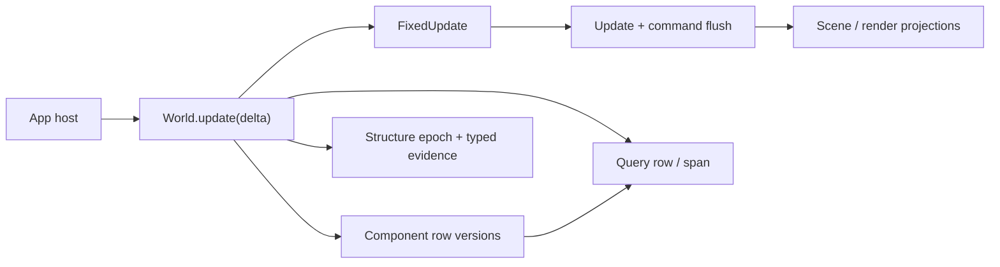
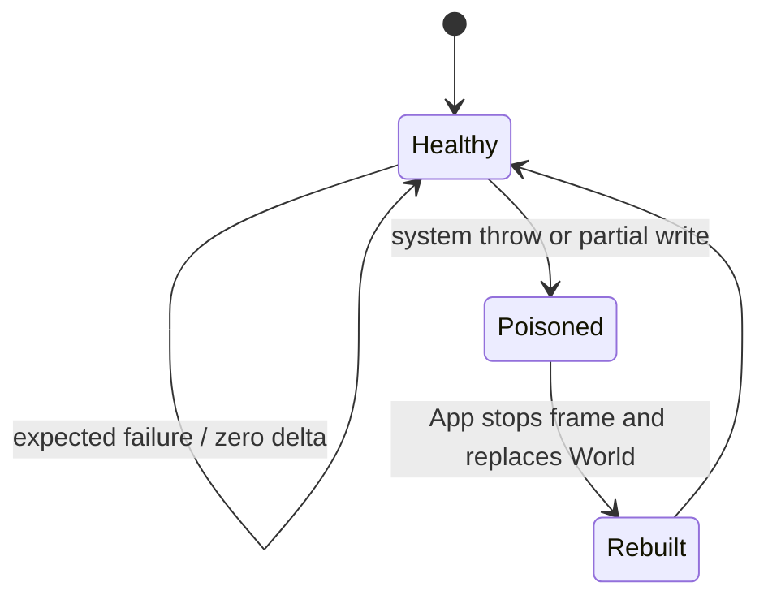

# `@forgeax/engine-ecs`

Archetype ECS for ForgeaX. The package owns the hot path shared by every
domain: entity identity, component storage, relationships, queries, structural
mutation, two schedules, resources, time, and optional shared numeric kernels.

> [!IMPORTANT]
> `World` is the state authority. Scene instances, render extraction, physics
> backends, asset ownership, input collection, and application lifecycle stay
> in their owning packages. Do not add a second ECS facade for one of those
> domains.

`World` directly owns its graph, entity records, managed stores, relationship
indexes, epochs, structural evidence, and execution health. Query, command, and
lifecycle helpers receive only the typed package-internal capabilities they
actually consume; there is no `WorldCore`, `WorldData`, or second state bag.



## The smallest useful journey

```ts
import type { Result } from '@forgeax/engine-types';
import {
  type EcsError,
  FixedTime,
  Update,
  World,
  defineComponent,
  defineSystem,
} from '@forgeax/engine-ecs';

const Position = defineComponent('Position', {
  x: { type: 'f32', default: 0 },
  y: { type: 'f32', default: 0 },
});

const Move = defineSystem({
  name: 'move',
  queries: [{ write: [Position] }],
  fn: (_world, [positions]) => {
    for (const row of positions) {
      const position = row.mut(Position);
      position.x += 1;
    }
  },
});

const world = new World();
const spawned = world.spawn({ component: Position, data: { x: 0, y: 0 } });
if (!spawned.ok) throw spawned.error;
const registered = world.addSystem(Update, Move);
if (!registered.ok) throw registered.error;
const stepped: Result<void, EcsError> = world.update(1 / 60);
if (!stepped.ok) console.error(stepped.error.code, stepped.error.hint);
```

The normal data path is `world.query(descriptor)` with a row iterator or a
packed `QuerySpan`. Success-path row access is direct and allocation-free;
expected boundary failures use the shared `Result` carrier from
`@forgeax/engine-types`.

## Components and schema

`defineComponent` accepts one closed storage vocabulary. The token exposes only
the schema facts needed by a consumer: `name`, frozen `fields`, and `storage`.
Authoring metadata, lifecycle callbacks, render policy, simulation policy, and
open-ended metadata do not belong on a component token.

| Shape | Use | Example |
|:--|:--|:--|
| scalar | numeric, boolean, or enum data | `{ type: 'f32', default: 0 }` |
| `string` | managed text value | `{ type: 'string', default: '' }` |
| `entity` | raw entity reference | `{ type: 'entity' }` |
| `shared<Tag>` | externally owned shared payload handle | `{ type: 'shared<MeshAsset>' }` |
| `array<T>` | variable array replaced as one value | `{ type: 'array<f32>' }` |
| `array<T,N>` | fixed-size inline array | `{ type: 'array<f32, 4>' }` |
| sparse tag | presence-only marker | `defineComponent('Disabled', {})` |

The `fields` object is deeply frozen at definition time. A value replacement
uses the ordinary mutation path:

```ts
const Trail = defineComponent('Trail', { points: { type: 'array<f32>' } });
const entity = world.spawn({ component: Trail, data: { points: new Float32Array([0, 1]) } }).unwrap();
const current = world.get(entity, Trail).unwrap();
world.set(entity, Trail, { points: new Float32Array([...current.points, 2]) });
```

The Scene package may define a single-field `Name { value: 'string' }` token
for authoring. ECS stores the value through the same closed `string` schema
vocabulary, but does not own the Scene component or its authoring policy.

Scene and Render own their domain schemas, for example `Instances { transforms`
is a Render-owned projection whose array payload still follows ECS replacement
semantics.

### Required components are resolved at structural boundaries

Use `requires` when a component is only valid with one or more other component
tokens. The ECS expands this declaration transitively during `spawn`,
`addComponent`, and deferred `Commands` materialization; it does not scan or
repair entities during a frame.

```ts
const GlobalTransform = defineComponent('GlobalTransform', { world: 'array<f32, 16>' });
const Transform = defineComponent(
  'Transform',
  { x: 'f32' },
  { requires: [GlobalTransform] },
);

// The archetype contains both columns. No scene-specific helper is required.
const entity = world.spawn({ component: Transform, data: { x: 0 } }).unwrap();
```

The declaration is generic: explicit data for a required component wins, and
missing requirements are appended once in dependency order. Removing a
required component is intentionally not a cascade; it is an explicit escape
hatch that lets an owner surface a structured invariant error instead of doing
hidden structural work.

There is no public `push`, `pop`, `capacity`, `reserveArrayCapacity`, view
class, or user-managed target-array mutation API. A replacement is one bounded
mutation, so an invalid value leaves the previous column and reference counts
unchanged.

Object-shaped numeric writes reject `NaN` before touching the column. The
returned `component-numeric-value-invalid` error carries the component, field,
entity, received value, and optional array index in `detail`; `Infinity` remains
valid when the schema accepts it. Branch on `error.code` and use `error.hint` to
choose the correction instead of parsing a message.

## Relationships: one source, one materialized index

Relationships preserve the reverse index because lookup complexity is part of
the contract. Reading a parent's children is $O(1 + k)$ for $k$ direct children,
not an $O(N)$ scan of every entity. The source is the only writable fact; the
target is an engine-maintained, read-only materialized vector with a
source-to-slot backpointer for amortized $O(1)$ attach, detach, and reparent.

```ts
import { defineComponent, defineRelationship } from '@forgeax/engine-ecs';

const Spatial = defineComponent('Spatial', {});

const { source: ChildOf, target: Children } = defineRelationship({
  sourceName: 'ChildOf',
  sourceField: 'parent',
  targetName: 'Children',
  targetField: 'entities',
  sourceRequires: [Spatial],
  exclusive: true,
  linkedSpawn: true,
});

const parent = world.spawn().unwrap();
const child = world.spawn({ component: ChildOf, data: { parent } }).unwrap();
const children = world.get(parent, Children).unwrap().entities;
```

`sourceRequires` applies the same structural-boundary rule to the writable
relationship source: adding `ChildOf` also materializes its required
components. The reverse `Children` projection does not gain a second write
path, and no frame system scans the world to repair the dependency.

`Children` and `AnimationTargets` are read projections, not a second write
authority. `Children { entities` is a materialized target owned by ECS; the
Scene package owns the `ChildOf` vocabulary and chooses where to use it. The
same rule applies to `AnimationTargets`. Direct target writes are rejected by
`World` at both the type and runtime boundaries.

## Queries and projections

Queries are the only public data-plane API. A row is the flexible path; a span
is the packed numeric path and includes entity handles for owner-side identity.
Raw `Table`, `Archetype`, `Column`, and `FieldView` values are package-private.

```ts
const query = world.query({ read: [Position] }).unwrap();
for (const row of query) console.log(row.entity, row.get(Position).x);
const writable = world.query({ write: [Position] }).unwrap();
for (const span of writable.spans().unwrap()) {
  const positions = span.mut(Position);
  for (let i = 0; i < span.length; i += 1) positions.x[i] += 1;
}
```

Incremental owners keep their own `changed` Query. Component row versions are
the value-change authority; `World.getStructureEpoch()` invalidates caches when
entity/component membership changes. There is no parallel value-event journal
or projection-change object vocabulary.

```ts
const structureEpoch = world.getStructureEpoch();
const changed = world.query({ changed: [Position] }).unwrap();
for (const span of changed.spans().unwrap()) {
  for (const entity of span.entities) console.log(entity);
}
// If world.getStructureEpoch() !== structureEpoch, reconcile membership from
// the owner's ordinary Query and then drain the changed Query once.
```

`added` is the matching first-observation filter for component membership. It
uses the same row-version cursor as `changed`, so each consumer drains its own
query independently:

```ts
const added = world.query({ read: [Position], added: [Position] }).unwrap();
for (const row of added) initializeProjection(row.entity, row.get(Position));
```

Structural membership facts have a bounded, typed cursor in the projection
subpath. Read after the last cursor, consume every returned event, and rebuild
from an ordinary query when the ring reports overflow:

```ts
import { readStructuralEvidence } from '@forgeax/engine-ecs/projection';

let cursor = 0;
const evidence = readStructuralEvidence(world, cursor);
if (evidence.status === 'overflow') {
  rebuildProjectionFromQuery(world);
  cursor = evidence.cursor;
} else {
  for (const event of evidence.events) applyStructuralEvent(event);
  cursor = evidence.cursor;
}
```

The `@forgeax/engine-ecs/world-read` seam is a read-only owner capability for
hot semantic scalar/array probes. `World.getStructureEpoch()` remains the
public cache-invalidation primitive; the seam never returns tables, archetypes,
columns, or mutable views. Ordinary gameplay code should continue to use
`World.get` and queries.

When an owner needs one scalar or one array element without materializing a row,
import the capability explicitly and keep the probe read-only. Entity fields
are returned as their stored u32, so narrow a non-null value to the existing
`EntityHandle` before passing it to another entity-typed probe:

```ts
import { ENTITY_NULL_RAW, type EntityHandle } from '@forgeax/engine-ecs';
import { ChildOf, Children } from '@forgeax/engine-scene';
import { worldRead } from '@forgeax/engine-ecs/world-read';

const parentRaw = world[worldRead].getFieldValue(child, ChildOf, 'parent');
const parent: EntityHandle | undefined =
  parentRaw === undefined || parentRaw === ENTITY_NULL_RAW
    ? undefined
    : (parentRaw as EntityHandle);
const count =
  parent === undefined ? undefined : world[worldRead].getArrayLength(parent, Children, 'entities');
const firstChild =
  parent === undefined
    ? undefined
    : world[worldRead].getArrayElement(parent, Children, 'entities', 0);
```

`undefined` means the entity, component, field, or element is unavailable; the
capability never hands out a storage view and cannot mutate the World.

Queries never expose table ids, rows, columns, or a duplicate snapshot data
plane.

## Schedules, time, and resources

Only `Update` and `FixedUpdate` are user schedules. Registration is token-first;
there is no frame-end schedule, system-parameter DSL, terminal render hook, or
severity/error-handler registry.

```ts
world.addSystem(Update, Move).unwrap();
world.addSystem(FixedUpdate, {
  name: 'fixed-step',
  queries: [],
  fn: (fixedWorld) => {
    const fixed = fixedWorld.getResource(FixedTime);
    void fixed.tick;
  },
}).unwrap();
```

`world.update(deltaSeconds)` advances the clock, runs zero or more fixed steps,
runs one update step, and flushes each system's command buffer. Clock readers
receive a stable read view; the scheduler owns writes. Resources are non-owning
values: Cordis/plugin owners dispose external payloads, not `World`.

## Failure and recovery

Branch on `error.code`, never on a message string. The closed ECS error union
preserves `code`, `expected`, `hint`, `detail`, and `cause` where applicable.

```ts
const result = world.update(1 / 60);
if (!result.ok) {
  switch (result.error.code) {
    case 'world-poisoned':
      // Stop the frame and ask the App execution owner to rebuild.
      break;
    default:
      console.error(result.error.code, result.error.hint);
  }
}
```

Recovery means constructing a fresh World and replaying the authoritative
game state; a poisoned identity is never reused:

```ts
function createWorld(): World {
  const next = new World();
  next.addSystem(Update, Move).unwrap();
  return next;
}

let liveWorld = createWorld();
const step = liveWorld.update(1 / 60);
if (!step.ok && liveWorld.execution.health === 'poisoned') {
  // The first failed frame can be `system-failed`; a later call is
  // `world-poisoned`. Health is the stable recovery boundary for both.
  liveWorld = createWorld();
  for (const saved of savedPositions) {
    liveWorld.spawn({ component: Position, data: saved }).unwrap();
  }
}
```

Expected command failures are reported before structural commit and leave the
World unchanged. A system throw or an unknown post-write failure cannot prove
that no row was mutated: the World becomes poisoned and must be rebuilt by the
App execution owner. Shared-kernel partial writes follow the same fail-closed
rule.



## Inspection

`world.inspect()` is an explicit, detached, deeply frozen POD snapshot for
diagnostics. It is not a live registry and is not a storage escape hatch.
Consumers should use entity counts, active component names, schedule summaries,
and resource keys; gameplay code should use queries.

## Public surface and subpaths

The root barrel is intentionally small. Advanced capabilities are named by
their owner instead of being forwarded through the root.

| Entry | Purpose |
|:--|:--|
| `@forgeax/engine-ecs` | World, components, relationships, queries, schedules, resources, errors |
| `@forgeax/engine-ecs/projection` | Explicit render read versions, typed structural evidence, and numeric spans |
| `@forgeax/engine-ecs/shared` | Shared numeric kernel contracts |
| `@forgeax/engine-ecs/world-read` | Safe semantic scalar/array reads for owner-package hot paths |
| `@forgeax/engine-ecs/externalization` | Generic component projection and entity remap |

`Result`, `ok`, `err`, and `Handle` come from `@forgeax/engine-types`; ECS does
not forward them. There is no ECS remote bin, simulation record/restore
protocol, scene-instance resolver, or compatibility alias for removed APIs.

<details>
<summary>Removed concepts</summary>

The one-cut surface deliberately removes `FrameEnd`, `setErrorHandler`,
`defineSystemParam`, `ParamValidation`, simulation record/restore/trace APIs,
scene lifecycle methods, raw storage exports, relationship metadata lookup,
root `Result`/`Handle` forwarding, and array convenience commands. When a
consumer needs one of those concerns, move the owner to App, Scene, Render,
Physics, or the explicitly named ECS subpath.
</details>

## Contract invariants

The following are package-contract statements, not a claim that every
repository-wide browser, Dawn, or consumer gate is green. Gate results for a
specific change belong to its closed-loop verification report.

- [x] Entity and component mutation use one World authority.
- [x] Relationship targets remain materialized for $O(1 + k)$ reads.
- [x] Query row/span are the only public data plane.
- [x] `Update` and `FixedUpdate` are the only schedules.
- [x] Expected failures are structured; unknown partial writes poison the World.
- [x] Advanced projection/shared/externalization APIs are named subpaths.

For the full migration rationale and acceptance matrix, see the canonical
[ECS World ownership simplification design](../../.forgeax-harness/docs/specs/2026-09-08-ecs-worldcore-simplification-design.md).

### Large managed arrays

The eight BufferPool size classes bound pooling, not field capacity. Larger
arrays use dedicated allocations; release drops their storage instead of
retaining a large free bucket. Growth preserves bytes and slot identity, and
allocation failure returns the existing structured managed-buffer error. Small
fields keep their existing allocation and reuse behavior. Game data, including
instance transforms, remains World-owned regardless of its size.
