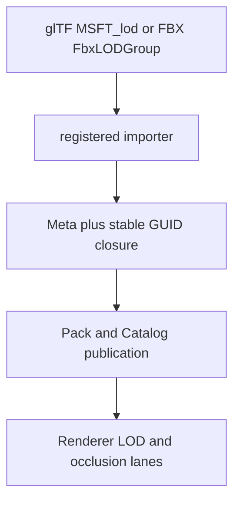

# @forgeax/engine

`@forgeax/engine` is the one package a game author installs. Its root is the
runtime entry, its focused subpaths expose every Engine capability, and its
`forgeax` binary owns project creation, validation, development, build, preview,
and SDK installation.

```bash
pnpm add @forgeax/engine
pnpm exec forgeax project check
```

pnpm projects that use Vite should keep
`public-hoist-pattern[]=@forgeax/engine-*` in `.npmrc`. Generated ForgeaX games
already include it; the focused hoist lets package-owned dynamic imports resolve
from Vite's project-level optimization cache without exposing extra declared
dependencies.

```ts
import { Engine } from '@forgeax/engine';
import { World } from '@forgeax/engine/ecs';
import { Transform } from '@forgeax/engine/scene';
```

## Import model

| Import | Meaning |
|:--|:--|
| `@forgeax/engine` | Runtime renderer assembly and the usual game entry |
| `@forgeax/engine/app` | App and frame-loop assembly |
| `@forgeax/engine/ecs` | ECS world, components, queries, and systems |
| `@forgeax/engine/<package-directory>` | The matching focused Engine package |

The focused `@forgeax/engine-*` packages remain the physical ownership and
release units inside the Engine repository. They are published automatically at
the same version because the umbrella depends on them, but game authors do not
need to discover or install them individually.

## SDK

The ordinary npm package is the connected, incremental development path. The
full SDK adds offline templates, Engine skills, a pnpm store, and the complete
public Engine source snapshot:

```bash
pnpm dlx @forgeax/engine sdk install ~/ForgeaX/1.2.3
node ~/ForgeaX/1.2.3/bin/forgeax.mjs project init
node ~/ForgeaX/1.2.3/bin/forgeax.mjs project new ~/Games/my-game
```

The SDK is fetched on demand from the public npm registry at the exact same
version. A private GitHub Release is an internal archive, not a user download
dependency.

## Asset-backed LOD recipe

Import a glTF or FBX through the project importer, keep the format relation and
author overrides in the producer sidecar, and publish all lower-detail meshes
in one Pack closure. The runtime consumes the normalized `MeshAsset.lods`
contract; it does not inspect FBX or glTF extension details.



For a first import with `n` lower levels, use the shared default sequence
`round6(0.5 * 0.4^(i-1))`: two total levels become `0.5`, three become
`0.5, 0.2`, and four become `0.5, 0.2, 0.08`. Existing sidecar coverage is
preserved by `sourceKey`; only an appended suffix receives defaults. Every
lower mesh GUID must be in the root mesh `refs[]`, otherwise publication stops
before DDC or Catalog mutation.

> [!WARNING]
> `smoke` proves the real asset/import route and `RhiNull` proves structural
> fallback. A release-quality silhouette or timing claim additionally needs
> same-device Browser/Dawn readback with matching source, view, slot, and
> generation identity.
