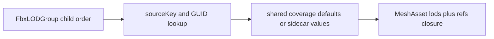

# @forgeax/engine-fbx

FBX importer for the forgeax engine. A single **ufbx**-based parser compiled to
WebAssembly via Emscripten -- works in both the browser and Node.js, no
Autodesk FBX SDK, no native addon. Emits the engine FBX POD JSON schema
(meshes, nodes, materials, skeletons, skins, clips), consumed by the shared
`parse-*.ts` / `to-asset-pack.ts` bridge layer.

## Evidence and recovery

The FBX producer writes source meta and a producer-owned `CookReceipt`; the catalog only supplies the GUID locator (`packageUrl` and optional `cookReceiptUrl`). `AssetEvidence` joins those records with Pack v2 package and artifact verification so browser/runtime code does not guess whether a cook completed.

Read `notCooked`, `ready/current`, `ready/stale`, or `unknown` literally. Package and artifact evidence must remain `notChecked`, `passed`, or `failed`. If the probe reports `stale` or `failed`, repair the source/import settings or recook and rerun `lookup/verify --guid --project --catalog --json`; retain the structured error hint for the next action.

```
FBX bytes -> ufbx (wasm) -> JSON POD -> parse-*.ts -> meta.json
```

## AI user consumption path

The importer key `'fbx'` is unchanged from the SDK era -- zero migration for
existing `.fbx.meta.json` sidecars. The engine resolves the importer
automatically via `loadByGuid`:

```ts
// 1) Point the asset registry at the pack index
assets.configurePackIndex('/pack-index.json');

// 2) loadByGuid dispatches on meta.importer: 'fbx' automatically
const res = await assets.loadByGuid<SceneAsset>(guid);
if (!res.ok) {
  console.error(res.error.code, res.error.hint);
  return;
}
const scene = res.value; // SceneAsset -- ready for instantiate()
```

Under the hood, `vite-plugin-pack` calls `fbxImporter.import(ctx)` which
initializes the ufbx WASM module on first use, parses the FBX bytes, and
returns `ImportedAsset[]` (mesh, material, scene, skeleton, skin,
animation-clip, texture). The importer registration is a one-liner if you
need it explicitly:

```ts
import { fbxImporter } from '@forgeax/engine-fbx';
import { ImporterRegistry } from '@forgeax/engine-import';
const importers = new ImporterRegistry();
importers.register(fbxImporter);
```

## 7 sub-asset POD types

The FBX importer produces 7 sub-asset kinds. Types are defined in
`@forgeax/engine-types` (SSOT) -- see the `Asset` union and the per-kind POD
interfaces. This section is a discovery index; do not copy-paste member lists
from here.

| POD type | Description | Source anchor |
|:--|:--|:--|
| `MeshPod` | Vertices, indices, attributes, submeshes | `@forgeax/engine-types` `MeshPod` |
| `MaterialPod` | PBR parameters (StingrayPBS / Phong / Lambert / fallback) | `@forgeax/engine-types` `MaterialPod` |
| `ScenePod` | Entity hierarchy + mounts | `@forgeax/engine-types` `ScenePod` |
| `TexturePod` | External file path | `@forgeax/engine-types` `TexturePod` |
| `SkeletonPod` | Joint count + inverse bind matrices | `@forgeax/engine-types` `SkeletonPod` |
| `SkinPod` | Skeleton GUID + joint paths | `@forgeax/engine-types` `SkinPod` |
| `AnimationClipPod` | Duration + channels + samplers | `@forgeax/engine-types` `AnimationClipPod` |

## Material mapping

Three branches, one output (`passes[0].shader` = `'forgeax::default-standard-pbr'`).
Priority: StingrayPBS > Phong > Lambert > fallback.

| Branch | Detection | Mapping |
|:--|:--|:--|
| **StingrayPBS** | `kind === 'stingray-pbs'` in the bridge JSON POD | Channels copied directly: `baseColor`, `metallic`, `roughness`, `normal`, `occlusion` |
| **Phong** | `kind === 'phong'` | `baseColor = diffuse`, `metallic = 0`, `roughness = 1 - sqrt(shininess / 100)` (Family A) |
| **Lambert** | `kind === 'lambert'` | `baseColor = diffuse`, `metallic = 0`, `roughness = 0.5` (no specular) |
| **Fallback** | No recognized material type | `baseColor = [0.5, 0.5, 0.5]` (grey), `metallic = 0`, `roughness = 0.5` |

The Phong-to-PBR roughness formula is **Family A**: `roughness = 1 - sqrt(shininess / maxGloss)`
with `maxGloss = 100`. Implementation SSOT: `src/parse-material.ts` lines
32-35 (`phongRoughness` function). Industry survey (5 engines/tools) and
formula rationale: KB `2026-06-15-fbx-phong-roughness-conversion.md` (Family A
vs Family B comparison, max_gloss convention).

## Error codes

Errors are structured: every error object carries `.code`, `.expected`,
`.hint`, and `.detail`. AI users switch on `.code` for exhaustive handling.

**FbxErrorCode** (this package, closed union): source SSOT is `src/errors.ts`.
Do not copy-paste the member list; inspect the source for the current union.

**ImportErrorCode** (in `@forgeax/engine-types`): source SSOT is
`packages/types/src/index.ts`; it owns the runtime importer-dispatch union.

## Contributor toolchain

<details>
<summary>Getting pre-built WASM (fetch-wasm)</summary>

The `pkg/` directory is **not committed to git** (zero-binary invariant). A
workspace `pnpm install` or `bun install` runs a package-local, best-effort
postinstall hook that fetches the matching bundle when it is absent. The hook
is idempotent and non-fatal: it skips a complete `pkg/`, and an unavailable
release leaves installation successful with the explicit recovery command
below. Set `FORGEAX_SKIP_FBX_WASM_FETCH=1` to opt out.

To provision a fresh checkout explicitly, fetch the pre-built WASM bundle from
GitHub Releases instead of compiling locally:

```bash
pnpm -F @forgeax/engine-fbx fetch-wasm
```

This runs `scripts/fetch-wasm.mjs`, which:
1. Resolves the GitHub repo from `git remote get-url origin` (SSH or HTTPS).
2. Computes the **content key** = `SHA256(bridge.c + fetch-ufbx.mjs +
   build-wasm.mjs)` truncated to 8 hex chars (SSOT: `scripts/content-key.mjs`).
3. Looks for a matching asset `fbx-wasm-v0.23.0-{sha8}.tar.gz` under the
   `wasm-artifacts` release tag.
4. Downloads and extracts it into `pkg/`. emcc emits a **pair** —
   `pkg/fbx-wasm.wasm` + its self-loading `pkg/fbx-wasm.mjs` glue — and the
   runtime imports the `.mjs` glue, so the release ships the whole `pkg/` as one
   tarball (mirrors `@forgeax/engine-wgpu-wasm` and `@forgeax/engine-codec`), not
   a lone `.wasm`.

The content key guarantees you get the bundle that matches your exact source --
no accidental mismatch. The shared downloader tries Node `fetch` first; when it
cannot complete the TLS/network handshake, it falls back to authenticated
`gh api`/`gh release download`, then `curl` (`curl.exe` on Windows). All paths
remain pinned to this repository, the `wasm-artifacts` tag, and the exact
content-keyed asset name.

If the asset is not found (e.g. modified `bridge.c` that was never published),
the script prints a structured error with a hint to compile locally. If the
repo is private, set `GITHUB_TOKEN`/`GH_TOKEN` or run `gh auth login`; public
repos work anonymously (no token needed).

</details>

<details>
<summary>Compiling from source (emcc fallback)</summary>

When no pre-built release is available, compile locally with Emscripten:

```bash
# Prerequisite: install emsdk and activate it
# https://emscripten.org/docs/getting_started/downloads.html

pnpm -F @forgeax/engine-fbx build:wasm
```

`build:wasm` runs two scripts in order:
1. `scripts/fetch-ufbx.mjs` -- downloads `ufbx.c` + `ufbx.h` (v0.23.0) from
   the official ufbx repo. Idempotent: skips if already present.
2. `scripts/build-wasm.mjs` -- invokes `emcc` to compile `ufbx.c` + `bridge.c`
   into `pkg/fbx-wasm.mjs` + `pkg/fbx-wasm.wasm`.

Both `ufbx.c`/`.h` and `pkg/` are in `.gitignore`; CI provides emsdk via
`emscripten-core/setup-emsdk` and rebuilds from a bare checkout on every run.

</details>

### Fetch-wasm error codes

| Code | Meaning | Self-help |
|:--|:--|:--|
| `E1_NETWORK` | Node fetch and available native transports failed, or an unexpected HTTP error occurred | Check the TLS/proxy diagnosis and retry with `gh auth login`, then use `pnpm -F @forgeax/engine-fbx build:wasm` (local emcc) |
| `E2_ASSET_NOT_FOUND` | Release tag or asset not found | `pnpm -F @forgeax/engine-fbx build:wasm`, or push to main to trigger CI release |
| `E3_ORIGIN_UNSUPPORTED_HOST` | `git remote get-url origin` returned a non-GitHub host | Check `git remote -v`; set origin to a GitHub remote |
| `E3_ORIGIN_PARSE_FAILED` | Cannot parse the origin URL into owner/repo | Expected `git@github.com:OWNER/REPO.git` or `https://github.com/OWNER/REPO.git` |
| `E3_NO_ORIGIN` | No `origin` remote configured | `git remote add origin <url>` or `build:wasm` |
| `E4_HASH_MISMATCH` | content key does not match any published asset | `pnpm -F @forgeax/engine-fbx build:wasm` |
| `E5_AUTH_FAILED` | Private repo requires authentication (401/403) | Set `GITHUB_TOKEN` environment variable, or `build:wasm` |

### Content-keyed idempotency

The CI `main-push` release step packs `pkg/` into `fbx-wasm-v0.23.0-{sha8}.tar.gz`
and publishes it under the `wasm-artifacts` release tag. The publish step checks
for an existing asset with the same name before uploading -- identical source
content never produces a duplicate release. The hash is computed from the source
at build time via `scripts/content-key.mjs` (Derive, Don't Duplicate -- no stored
hash file).

## License

MIT

## FbxLODGroup contract

The ufbx bridge emits native child order and optional native threshold/mode
diagnostics. The first child is the root MeshAsset (LOD0); remaining children
are ordinary mesh GUID references projected into `MeshAsset.lods[]` and root
`refs[]`. Native distance or percentage thresholds are diagnostic facts only;
the runtime selector uses the shared absolute screen-coverage contract.



Forced `eShow` and `eHide` modes fail as `fbx-lod-display-mode-unsupported`
with `expected`, `hint`, and the native `displayMode` detail. Repair the
FbxLODGroup in the DCC source, then recook; no partial Pack publication is
allowed.
