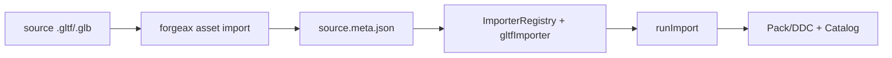

# @forgeax/engine-gltf

> [!IMPORTANT]
> glTF material output is a MaterialAsset payload. The bridge writes `passes`, `values`, and one structured texture value per slot, including `coordinates.set` and `coordinates.transform`; an optional `parent` is preserved, and the package cook then preserves those facts in the runtime-ready record. Consumers load the material by GUID with the scene graph.

The importer receives the built-in standard root through the source declaration's
`importSettings.standardMaterialGuid`. It writes that GUID as `MaterialAsset.parent`
and adds the same GUID to the material `refs[]` edge; no runtime handle or shader
identifier is invented by the glTF bridge.

## MaterialAsset bridge recovery

### Transmission/refraction extensions

`KHR_materials_transmission`, `KHR_materials_ior`, and `KHR_materials_volume` project into the same
Standard `MaterialAsset.values` contract: `transmission`, `ior`, `thickness`, `attenuationColor`, and
`attenuationDistance`, with texture slots retaining their coordinates and transforms. A GLTF material
with effective transmission and `alphaMode: BLEND` is rejected as the structured
`gltf-material-transmission-invalid` error; repair the source and reimport instead of silently changing
the render phase. The carrier validates the source, Pack, GUID load, and renderer inspection together.

If a source requests a UV set that the primitive does not provide, handle `gltf-material-uv-set-missing` using its material, primitive, slot, requested set, and available sets. Add the source UV set and re-import; do not substitute a custom mesh or discard the slot transform.

### KHR physical material extensions

The importer accepts the five second-stage material extensions below in both
`extensionsUsed` and `extensionsRequired`. A required extension outside the
supported set fails closed with `gltf-extension-unsupported`; a supported
extension is projected into the same Standard `MaterialAsset` root rather than
an extension-specific runtime type.

| Extension | Standard values / slots | Channel and color-space rule | Admission / recovery |
|:--|:--|:--|:--|
| `KHR_materials_clearcoat` | `clearcoat`, `clearcoatRoughness`, `clearcoatTexture`, `clearcoatRoughnessTexture`, `clearcoatNormalTexture`, `clearcoatNormalScale` | weight R, roughness G, coat normal RG; data textures are linear | coat normal uses the mesh tangent producer |
| `KHR_materials_anisotropy` | `anisotropyStrength`, `anisotropyRotation`, `anisotropyTexture` | direction RG, strength B; linear data | scalar and mapped forms both require a tangent frame |
| `KHR_materials_sheen` | `sheenColor`, `sheenRoughness`, `sheenColorTexture`, `sheenRoughnessTexture` | color RGB is sRGB; roughness A is linear | preserve each slot's UV transform; repair `gltf-material-uv-set-missing` on conflict |
| `KHR_materials_iridescence` | `iridescence`, `iridescenceIor`, `iridescenceThicknessMinimum/Maximum`, `iridescenceTexture`, `iridescenceThicknessTexture` | strength R and thickness G; both maps are linear | minimum greater than maximum is accepted per glTF semantics |
| `KHR_materials_specular` | `specular`, `specularTexture`, `specularColor`, `specularColorTexture` | weight A is linear; color RGB is sRGB | texture declarations select the physical Forward contract |

All five paths preserve `textureInfo.texCoord` and
`KHR_texture_transform` into `MaterialTextureValue.coordinates`. A material
with any of these declarations owns an extended Standard root, so its scalar
defaults and only its authored physical texture bindings participate in cook,
reflection, Pack refs, Catalog/load, and runtime sampling.

> [!IMPORTANT]
> `KHR_materials_anisotropy` always needs a finite tangent frame, even when
> only `anisotropyStrength` or `anisotropyRotation` is authored. If `TANGENT`
> is absent, the producer may generate it from `NORMAL + TEXCOORD_n + triangle
> topology`; if those inputs are missing or degenerate, import returns the
> structured `material-tangent-required` error. The importer persists generated
> tangents in `MeshAsset.attributes.tangent` and never writes an identity guess.

> Runtime glTF 2.0 importer (Tier-C subset). Pure-function pipeline `parseGlb` / `parseGltf` / `toAssetPack` is selected by the unified `forgeax asset import` producer, which writes `<source>.meta.json` (external-asset-package; dispatch on top-level `importer: 'gltf'`); runtime spawn happens via the existing `loadByGuid<SceneAsset>` plus `world.instantiateScene` 4-step recipe (no `loadGltf(url)` parallel API).

> [!IMPORTANT]
> `toAssetPack` and `reimportReuseMeta` return `Result` values. The producer derives semantic `sourceKey` values before GUID reuse; duplicate or ambiguous identities return `duplicate-source-key` / `ambiguous-source-key` and the CLI leaves the previous sidecar untouched. `sourceIndex` is a locator only, never a generated identity.

## Evidence and recovery

glTF remains a producer boundary: the `.meta.json` source declaration and importer settings are joined with the producer `CookReceipt`, the catalog `packageUrl`/`cookReceiptUrl`, and the Pack v2 descriptors as `AssetEvidence`. The runtime loader consumes packaged bytes; it does not mint cook facts.

Use `notCooked` when the source has no receipt, `ready/current` when the input fingerprint matches, `ready/stale` when it changed, and `unknown` when a capability is absent. Package and artifact verification are independently `notChecked`, `passed`, or `failed`. Recovery is to repair the meta/source or recook, then run `lookup/verify --guid --project --catalog --json`; do not hide an importer failure with a custom mesh.

## Tier-C scope (upgraded from Tier-B by feat-20260522-learn-render-3-1-sponza-model-loading-with-multi-l)

This package consumes:

- `scenes` + `nodes` (TRS or matrix decomposed via `mat4.decompose` wrapper)
- `meshes` with **multiple primitives** -- each primitive produces an independent `MeshIr` with UUIDv7 GUID; `SceneAsset` nodes reference individual primitive-level mesh sub-assets
- Vertex attributes: `POSITION` (VEC3, mandatory), `NORMAL` (VEC3), `TEXCOORD_0` (VEC2), `TANGENT` (VEC4, optional), and `COLOR_0` (see the support matrix below) -- decoded via the accessor SoA path; `INDICES` (U8/U16/U32 scalar — U8 widens to U16; U32 preserved, narrowed to U16 by bridge when maxIndex < 65536)
- `materials` with metallic-roughness and five KHR physical extensions mapped to pass-based `MaterialAsset` (see MaterialIr table below)
- `textures` / `images` / `samplers` top-level arrays parsed into `GltfDoc` IR; texture index -> image index -> URI two-hop resolution via `externalLoader`
- `cameras` of `type: 'perspective'`

## COLOR_0 importer contract

`COLOR_0` is interpreted only at the glTF importer boundary. The accessor
decoder in [`src/accessor/`](src/accessor/index.ts) returns a fresh, linear
RGBA `Float32Array`; the parser carries it as `GltfMeshIr.colors0`, and the
bridge projects it to the canonical `MeshAsset.attributes.color` path. No
shader location, material flag, or runtime `colors0` identity is introduced
here.

| Source accessor | Result |
|:--|:--|
| `VEC3` / `VEC4` + `FLOAT` | Direct finite values; `VEC3` receives alpha `1` |
| `VEC3` / `VEC4` + normalized `UNSIGNED_BYTE` | Values divided by `255` |
| `VEC3` / `VEC4` + normalized `UNSIGNED_SHORT` | Values divided by `65535` |
| Valid dense interleaved `byteStride` | Decoded per vertex, including padding |

Values stay in the linear `[0, 1]` range. The importer does not perform an
sRGB conversion. An absent optional `COLOR_0` is a valid plain primitive;
when a mesh also has colored primitives, the bridge writes explicit white
`(1, 1, 1, 1)` values for each absent primitive vertex. A declared but
unsupported or malformed accessor is a structured failure and is never
treated as absent. Sparse accessors and morph-target `COLOR_0` are explicit
deferred/unsupported branches in the first version.

The public `meshIrToMeshAsset` bridge returns `Result<MeshAsset, GltfError>`.
Its `gltf-mesh-bridge-invalid` detail is a closed reason union: empty input,
morph-target count mismatch, `COLOR_0` cardinality mismatch, or a typed
geometry-layout cause. Importer and smoke callers branch on `ok` before
publishing a mesh; they do not unwrap or parse human-facing error text.

For recovery, consume `Result` fields rather than parsing error text:

```ts
const parsed = await parseGltf(source, externalLoader, sourceKey);
if (!parsed.ok) {
  const { code, expected, detail, hint } = parsed.error;
  // Branch on code/detail, repair source + Meta, then re-import.
  reportImportFailure({ code, expected, detail, hint });
}
```

The complete closed error/detail union remains owned by
[`src/errors.ts`](src/errors.ts); `detail.semantic` and
`detail.accessorIndex` identify a failing `COLOR_0` accessor.

### MaterialIr (standard PBR)

| Field | Type | Required | Notes |
|:--|:--|:--|:--|
| `name` | `string` | no | From `material.name` |
| `baseColorFactor` | `[number, number, number, number]` | yes | Defaults to `[1, 1, 1, 1]` |
| `emissiveFactor` | `[number, number, number]` | no | Defaults to `[0, 0, 0]`; bridge emits `emissiveIntensity=1` |
| `baseColorTexture` | `number` (texture index) | no | Resolved via `textures[ti] -> images[si] -> uri` |
| `emissiveTexture` | `number` (texture index) | no | Resolved via `textures[ti] -> images[si] -> uri`; sampled by the built-in PBR shader |
| `metallicFactor` | `number` | yes | Defaults to `1.0` |
| `roughnessFactor` | `number` | yes | Defaults to `1.0` |
| `metallicRoughnessTexture` | `number` (texture index) | no | Same two-hop resolution |
| `normalTexture` | `number` (texture index) | no | Same two-hop resolution; TANGENT optional decode |

The physical extension fields are projected into the same IR object:

| Extension | Scalar fields | Texture fields |
|:--|:--|:--|
| `KHR_materials_clearcoat` | `clearcoatFactor`, `clearcoatRoughnessFactor` | `clearcoatTexture`, `clearcoatRoughnessTexture`, `clearcoatNormalTexture` |
| `KHR_materials_anisotropy` | `anisotropyStrength`, `anisotropyRotation` | `anisotropyTexture` |
| `KHR_materials_sheen` | `sheenColorFactor`, `sheenRoughnessFactor` | `sheenColorTexture`, `sheenRoughnessTexture` |
| `KHR_materials_iridescence` | `iridescenceFactor`, `iridescenceIor`, `iridescenceThicknessMinimum/Maximum` | `iridescenceTexture`, `iridescenceThicknessTexture` |
| `KHR_materials_specular` | `specularFactor`, `specularColorFactor` | `specularTexture`, `specularColorTexture` |

Each texture field is a `GltfTextureInfoIr | number` with an explicit texture
index and optional UV/transform facts. The bridge creates a complete extended
root for the declarations it sees; base-only materials may still inherit the
configured `standardMaterialGuid`.

### GltfDoc IR (textures / images / samplers)

| Array | Element | Notes |
|:--|:--|:--|
| `textures` | `TextureIr` | `{ sampler?, source, name? }`; `source` = image index |
| `images` | `ImageIr` | `{ uri?, mimeType?, name? }`; `uri` resolved via `externalLoader` |
| `samplers` | `SamplerIr` | `{ magFilter?, minFilter?, wrapS?, wrapT?, name? }` |

### Multi-primitive mesh handling

A single glTF `mesh` with N primitives produces N `GltfMeshIr` entries, then
the bridge merges them into one `MeshAsset` with N submeshes. Source material
indices are deduplicated into `MeshAsset.materialSlots[]`; each submesh stores
only its slot index. Canonical `SceneAsset` nodes carry `MeshFilter` plus an
empty `MeshRenderer.materials` override vector, so imported defaults remain
mesh-owned and reimport-safe.

Out of scope (each routed to its own `feat-future-*` anchor in `requirements.md` OOS-1 .. OOS-15): KHR material extensions other than the supported transmission/IOR/volume, clearcoat, anisotropy, sheen, iridescence, and specular paths / morph targets other than the explicit `COLOR_0` deferred signal / orthographic camera / sparse accessors / inspector future fields / pixel-parity vs three.js. Dense interleaved `COLOR_0` is supported; other interleaved accessor consumers retain their existing scope. v1.1 OOS additions (locked by feat-20260518-gltf-instancing-and-name-component): multi-primitive instancing / mesh-level + material-level + scene-level Name (only node.name lands as ECS `Name`) / instancing hard cap / SoA TRS direct-to-GPU pipe / IR-to-GPU direct path / ROTATION BYTE/SHORT normalized encoding / Babylon thin-instances style SoA channel / Bevy multi-tier Name propagation.

## Importer sub-asset PODs (7 kinds)

`gltfImporter` (consumed by `@forgeax/engine-vite-plugin-pack` at build / dev) emits one `ImportedAsset` POD per declared sub-asset entry in the meta sidecar. The kinds, in `out[]` order, are:

| Kind | POD type (`@forgeax/engine-types`) | refs[] cross-edge |
|:--|:--|:--|
| `mesh` | `MeshAsset` | default material GUIDs from `materialSlots[]` |
| `material` | `MaterialAsset` | texture GUIDs (slot bindings) |
| `scene` | `SceneAsset` | mesh + material + texture + skeleton GUIDs |
| `texture` | `TextureAsset` | -- |
| `skeleton` | `SkeletonAsset` | -- |
| `skin` | `SkinAsset` | skeleton GUID |
| `animation-clip` | `AnimationClip` | -- |

Skinned glTFs (e.g. Khronos `Fox.glb` with 24 joints + 3 clips) flow through the same `loadByGuid<SceneAsset>` + `assets.instantiate` spine as static glTFs. The bridge (`gltfDocToSceneAsset`) auto-emits `Skin { skeleton: <skeleton-guid-string> }` on every node with `NodeIr.skinIndex !== null` when the caller passes `skeletonGuidBySkinIndex`; `AssetRegistry._resolveSceneGuids` resolves the GUID to a runtime Handle at instantiate time, while mesh material dependencies load recursively from `MeshAsset.materialSlots[]`. `postSpawnResolveJoints` (`@forgeax/engine-runtime`) fills `Skin.joints[]` by walking `SkinAsset.jointPaths` against the spawn root's `ChildOf`-descendant subtree, so multiple `instantiate()` calls on the same skinned `SceneAsset` produce independently-posed instances (no cross-spawn joint sharing).

Sample reference: `apps/hello/skin` -- 3 Khronos Fox foxes side-by-side, each running a different clip (Survey / Walk / Run). Asset source under `forgeax-engine-assets/khronos-gltf-samples/Fox/` (CC BY 4.0; ATTRIBUTION.md alongside).

## Error surface (closed union, plan-strategy section 2.3 + section 8)

`GltfErrorCode` is the SSOT in `@forgeax/engine-gltf` (4-field surface `.code` / `.expected` / `.hint` / `.detail`; `GltfErrorDetail` discriminated per `.code`). Exhaustive `switch (err.code)` without `default` is the AI-user pattern.

> **M1 (2026-06-15):** GltfErrorCode / GltfErrorDetail / GltfError moved from `@forgeax/engine-types` to `@forgeax/engine-gltf`. Imports must change: `import { GltfError, GltfErrorCode, ... } from '@forgeax/engine-gltf'`.

| code | meaning |
|:--|:--|
| `gltf-malformed-header` | GLB magic / version / length header rejection or missing JSON chunk |
| `gltf-version-unsupported` | `asset.version` is not `'2.0'` |
| `gltf-buffer-out-of-bounds` | accessor reads past `bufferView.byteLength` |
| `gltf-extension-unsupported` | `extensionsRequired[]` lists an extension outside the supported allowlist exported as `EXTENSION_ALLOWLIST` (`EXT_mesh_gpu_instancing`, `EXT_meshopt_compression`, `KHR_lights_punctual`, `KHR_texture_transform`, transmission/IOR/volume, clearcoat, anisotropy, sheen, iridescence, specular) |
| `gltf-accessor-type-mismatch` | sparse / morph / interleaved / unknown componentType accessor (4 reasons) |
| `gltf-texture-load-failed` | `externalLoader` rejected for a texture `uri`; `detail.uri` carries the failing URI; hint: `'check sidecar meta.json + textures/ directory + vite-plugin-pack /__pack/lookup'` |
| `gltf-meta-missing` | sidecar `<source>.meta.json` is absent next to the `.gltf` / `.glb` source file |
| `gltf-instancing-count-mismatch` | `EXT_mesh_gpu_instancing` three TRS accessors (`TRANSLATION` / `ROTATION` / `SCALE`) have differing element counts |
| `gltf-image-mime-unsupported` | `image/mimeType` is neither `image/jpeg` nor `image/png`; `detail.mimeType` carries the failing MIME; hint: `'supported: image/jpeg \| image/png; transcode externally'` |
| `gltf-skin-joint-count-exceeded` | `skins[j].joints.length > 256` (MAX_JOINTS); hint: `'glTF skin must have <= 256 joints per skin'` |
| `gltf-skin-joint-name-missing` | glTF node referenced by a skin joint has no `name` field; hint contains skinIndex + jointPathIndex |
| `gltf-animation-cubicspline-unsupported` | animation sampler uses `CUBICSPLINE` interpolation (OOS-skin-cubicspline) |
| `gltf-morph-unsupported` | animation channel targets morph weights (`path==='weights'`, OOS-skin-morph-anim) |
| `gltf-color-accessor-unsupported` | `COLOR_0` type/component/normalized combination, sparse input, or morph-target input is deferred |
| `gltf-color-accessor-malformed` | `COLOR_0` count, finite/range, buffer bounds, or reference validation failed |
| `gltf-material-physical-invalid` | a clearcoat/anisotropy/sheen/iridescence/specular scalar or color violates its finite glTF range |

Mesh tangent admission is a material error because the geometry producer owns
the repairable frame. Branch on `material-tangent-required` and read its
`detail.material`, `detail.mesh`, `detail.layer`, `detail.uv`,
`detail.attributes`, and `detail.reason`; fix the source attributes and rerun
the same importer. Do not parse the human-facing message or silently continue
with an identity tangent.

Source-key conflicts are producer failures, not automatic renames. A
`duplicate-source-key` or `ambiguous-source-key` detail includes the semantic
`key` and the smallest conflicting `entries` (`kind`, `name`, and
`sourceIndex`); repair the source or its metadata and retry the same GUID.

When `ImporterRegistry` + `runImport` consumes a glTF source, malformed base64 in a buffer data URI is returned as the existing `ImportError` `source-validation-failed` with `detail.diagnostics[].code === 'gltf-buffer-data-uri-invalid'`. The failed attempt publishes no Pack; after repairing the same source, Meta, and GUID declarations, the same registry/process can retry normally.

## Skin & Animation importer (feat-20260523)

> Two submodules: `parse-skin.ts` (skin index dedupe via UUIDv5 + IBM decoding + jointPath derivation) + `parse-animation.ts` (LINEAR/STEP samplers, CUBICSPLINE/morph fail-fast). Called inside `parseGltfWithBin` -> `toAssetPack` which extends sub-asset output from 3 kinds (mesh/material/scene) to 6 (+ skeleton + skin + animation-clip).

- **Limitations**: CUBICSPLINE interpolation not supported; morph weight animation not supported; jointPath resolution uses leaf-name first-match (same-name sibling is warn-only).
- **BindPose AABB** derived at importer time (per skinned mesh-primitive, static BindPose) and written to mesh asset metadata for frustum cull; dynamic AABB deferred to OOS-skin-dyn-bounds.

## 4-step runtime recipe (apps/hello/gltf, M5)

```ts
// 1. configure pack index (vite-plugin-pack provides /__pack/lookup/:guid in dev mode)
engine.assets.configurePackIndex('/box-pack-index.json');

// 2-4. load mesh / material / scene by GUID, then instantiate scene into world
const sceneResult = await engine.assets.loadByGuid<SceneAsset>(sceneGuid);
if (!sceneResult.ok) {
  // GltfError surfaced upstream from the importer is converted into an AssetError
  // here; the runtime AssetRegistry uses the existing 4-member AssetErrorCode.
  return;
}
const root = engine.assets.instantiate(sceneResult.value, world);
// `root` is the synthetic root Entity (carries SceneInstance + identity Transform);
// equivalent to world.instantiateScene(handle).
```

## Unified asset producer

The glTF producer is selected by the unified `asset import` command. DevKit
loads this package's producer only when a `.gltf` or `.glb` source is passed;
the package no longer publishes an independent executable.

| Subcommand | Description | Exit code |
|:--|:--|:--|
| `forgeax asset import <path> --root <project>` | Parse `.gltf` / `.glb`; write sidecar `<source>.meta.json` (top-level `importer: 'gltf'`) next to source; UUIDv7 GUIDs assigned per sub-asset in document order | 0 success / 1 `GltfError` |
| `forgeax asset import <path> --dry-run --root <project>` | Validate the producer path without writing a sidecar | 0 if valid / 1 if missing or invalid |

```bash
# Unified invocation
forgeax asset import apps/hello/gltf/assets/box.glb --root ./game --json
forgeax asset import apps/hello/gltf/assets/ --dry-run --root ./game --json
```

### End-to-end source-to-Pack route

The CLI creates the authoring sidecar; the shared import runner is the single
Pack/DDC publication path. Keep these steps together when adding a glTF LOD:



1. Run `forgeax asset import <source> --root <project>` to create or refresh the
   adjacent `<source>.meta.json` and its stable sub-asset GUIDs.
2. Register `gltfImporter` with the build-time `ImporterRegistry` and pass the
   sidecar to `runImport`; this validates the declared LOD GUID closure and
   writes the Pack/DDC output.
3. Verify the resulting Catalog/receipt and load the root GUID at runtime. The
   complete `ImporterRegistry`/`runImport` example, including the filesystem
   adapter, lives in [`@forgeax/engine-import`](../import/README.md#the-importload-split).

See `.forgeax-harness/forgeax-loop/feat-20260515-gltf-loader-via-asset-system/plan-strategy.md` for the full roadmap.

## LOD extensions

The glTF adapter admits `MSFT_lod` at node level. The extension's `ids` array
is preserved in producer order; each referenced root or lower node must resolve
to a non-empty mesh sub-asset. Material, name, and guessed suffix conventions
do not create LOD relations.

The portable Khronos form stores coverage on the root LOD node:

```json
{
  "extensions": { "MSFT_lod": { "ids": [1, 2] } },
  "extras": { "MSFT_screencoverage": [0.5, 0.2, 0.01] }
}
```

The array describes the root and lower ranges and includes a terminal discard
threshold. The adapter keeps `[0.5, 0.2]` as the two lower-level absolute
`MeshAsset.lods[].screenCoverage` values and drops only that terminal discard
entry, which has no `MeshAsset` representation. The historical document-level
`extensions.MSFT_screencoverage.scales` form remains an internal fixture
adapter; node `extras` takes precedence when both forms are present.

| Source fact | Projection | Recovery |
|:--|:--|:--|
| `MSFT_lod.ids` | root MeshAsset `lods[]` and `refs[]` | repair node references and reimport |
| root `extras.MSFT_screencoverage` | absolute coverage values (terminal discard omitted) | repair values and reimport |
| legacy document `MSFT_screencoverage.scales` | explicit fixture coverage values | migrate to node `extras`, then recook |
| no coverage extension | shared importer defaults | keep existing sidecar values, then recook |

On malformed extension data, a required-but-missing `MSFT_lod` group, an empty
referenced mesh, or an unresolved mesh sub-asset, the importer returns
`gltf-lod-invalid` before publication. The old sidecar and Catalog LKG are the
recovery boundary; no relation is silently dropped by `flatMap` or a partial
Pack is published.
