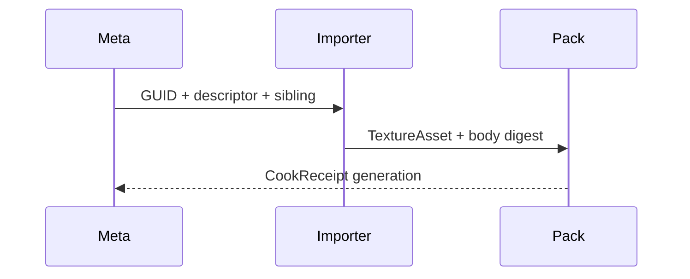
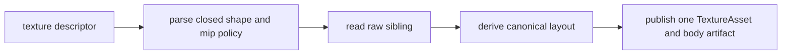

# @forgeax/engine-image

## 3D density source contract

体积密度仍由 image producer 生成标准 `TextureAsset`：`shape.viewDimension: '3d'`、
`shape.extent.depth`、`colorSpace: 'linear'` 与显式 `mips` 必须同时存在。Meta 保持
GUID/sourceKey；Pack body 与 receipt 提供 digest/generation 证据。



缺少 sibling、布局或 receipt 时返回结构化错误。修复同一 sourceKey 后重新 import/cook，
不要向 runtime 注入 1×1 或其它 stand-in 纹理。

> **Disk-to-memory image importer for forgeax-engine.** Pure functions translate `*.jpg` / `*.png` / `*.hdr` source files into `TextureAsset` / `EquirectAsset` PODs (raw `.bin` or Basis `.ktx2`) + `external-asset-package` sidecar JSON. GPU upload lives in `@forgeax/engine-runtime` (charter P5: producer / consumer split).

## Evidence and recovery

The image importer is a producer: its source meta declares the GUID and import settings, while the cook step owns the `CookReceipt`. The Vite pack producer later publishes the catalog `packageUrl` and optional `cookReceiptUrl`; consumers join those facts as `AssetEvidence` instead of treating a catalog row as proof.

For an image with no receipt, report `notCooked`; a matching input fingerprint is `ready/current`, and a changed fingerprint is `ready/stale`. Missing source, receipt, or runtime capability is `unknown`. Package and artifact checks are explicit `notChecked`, `passed`, or `failed`. Recover by fixing the source meta or recooking, then rerunning the offline `lookup/verify --guid --project --catalog --json` probe; do not substitute a runtime placeholder.

## PixelSurface authoring

`PixelSurface` is the small image-owned CPU authoring surface for generated
RGBA8 content. `createPixelSurface(width, height)` returns a validated POD
backed by `Uint8Array`; `setPixel`, `fillRect`, `fillCircle`, `blit`, and the
deterministic `noise` operation mutate that surface, while `toDecodedImage`,
`toTextureAsset`, and `toAssetPack` project it into existing image/Pack
contracts. It does not create GPU handles or duplicate the runtime texture
upload owner. Invalid dimensions, coordinates, rectangles, and source extents
return the closed `image-surface-invalid` error with `operation`, `field`,
`value`, and `expected` in `detail`; branch on `error.code`, never on message
text. Use `DecodedImage` for decoded source data and `PixelSurface` for
deliberately generated pixels.

## compressionMode sidecar field

The `.meta.json` sidecar accepts an optional `compressionMode` field controlling
the offline block-compression encoding (Basis KTX2). The default is `'auto'`.

### Four-mode semantics

| Mode | Behavior | Encoding | Runtime format |
|:--|:--|:--|:--|
| `'auto'` (default) | Derive encoding from color space + source format | Depends on source (see table below) | Depends on target caps |
| `'etc1s'` | Force ETC1S Basis encoding | ETC1S (fast preset, deterministic) | BC1/ETC1/ETC2 depending on caps |
| `'uastc'` | Force UASTC-LDR Basis encoding | UASTC-LDR 4x4 (fast preset, deterministic) | BC7/ASTC4x4/ETC2 depending on caps |
| `'none'` | Skip compression, produce raw RGBA `.bin` | None | `rgba8unorm` / `rgba16float` |

### 'auto' derivation rules (D-12)

| Source | colorSpace | Encoding | Rationale |
|:--|:--|:--|:--|
| PNG/JPEG | `'srgb'` | `etc1s` | Albedo/UI textures: ETC1S with sRGB transfer |
| PNG/JPEG | `'linear'` | `uastc` | Normal/ORM/data textures: UASTC-LDR with linear color |
| HDR (`.hdr`) | N/A (always linear) | `none` (rgba16float) | `.hdr` sources are always `kind: 'equirect'` (IBL/skybox). The runtime drives them through equirect-to-cube / irradiance / prefilter RENDER passes, and a block-compressed (BC6H) texture is sample-only, never color-renderable -- so equirect is forced to uncompressed rgba16float (feat-20260707 M5 fix). The `uastc-hdr` -> BC6H encoding remains in `compressionFor` for a purely-sampled HDR *texture*, but no current source path produces a non-equirect HDR texture. |

### Mip offline baking constraint

**Block-compressed textures cannot use runtime mipmap generation** (compressed
formats are not render-target-compatible). Mip chains must be baked offline
through the importer sidecar:

- Set `importSettings.mipmap: true` in `.meta.json` to bake a full mip chain
  during import. The encoder produces mip levels with a box filter.
- Runtime `mipmap: true` on a compressed TextureAsset fails fast with
  `mipgen-unsupported-compressed-format` (AC-09). The `.hint` directs you to
  set `compressionMode: 'none'` or bake mips offline.
- Uncompressed textures (`compressionMode: 'none'`) are exempt: they support
  runtime mip-gen normally.

## Array and volume source contract

`*.texture.json` is the source-owned descriptor for sampled arrays and volumes.
The descriptor is parsed once, then the producer emits one `TextureAsset` and
one asset-local body artifact; layer or slice GUIDs are not minted.

| Field | Contract |
|:--|:--|
| `shape.viewDimension` | Closed value: `2d`, `2d-array`, or `3d`. |
| `shape.extent` | Positive integer `width`/`height`, plus `layers` for `2d-array` or `depth` for `3d`. |
| `mips` | `none`, `generate`, or an explicit packed level count. |
| `rawSibling` | Required source-relative raw byte sibling; missing bytes return structured `source-read-failed`. |
| body artifact | Canonical `mip-major,image-major,row-major` bytes with one digest and byte length. |



> [!CAUTION]
> `2d-array` and `3d` are payload shapes, not separate asset kinds. Consumers
> must preserve the single GUID, canonical byte order, and producer digest;
> runtime code must not reconstruct layers from URL naming or create a
> per-layer fallback asset.

### Determinism

Same input bytes + same `compressionMode` + same import settings produce
byte-identical `.ktx2` every time (AC-02). The encoder runs single-threaded
with no timestamp or random seed, guaranteeing DDC cache safety.

## Entry points

| Entry | Surface | Browser-safe? |
|:--|:--|:--|
| `@forgeax/engine-image` (main) | `decodeImageInBrowser` (createImageBitmap path), `toAssetPack`, `subAssetKey` / `subAssetKeyEqual`, `reimportReuseMeta`, `imageError` / error types, `loadJpeg` / `loadUpng` (legacy lazy loaders) | yes — no `jpeg-js` / `upng-js` / `node:fs` |
| `@forgeax/engine-image/parse-image` | `parseImage(bytes, mime, opts?)` — synchronous Node decoder using `jpeg-js` / `upng-js` | **Node-only** (`exports['./parse-image']` carries `node` condition + `default: null`) |
| `@forgeax/engine-image/decode-image-from-file` | `decodeImageFromFile(path)` — async `node:fs` reader + sidecar resolver | **Node-only** (same `node` + `default: null` shape) |
| `@forgeax/engine-image/hdr-decoder` | `decodeHdr` — Radiance .hdr decoder | browser-safe (no Node-only deps) |
| `@forgeax/engine-image/image-importer` | `imageImporter` — public build-time `Importer` for PNG/JPEG/HDR/KTX2/Basis sources | **Node-only** |
| `@forgeax/engine-image/ktx2-encode` | `encodeTextureToKtx2` — deterministic build-time Basis encode arm | **Node-only** |

## Importer conversion diagnostics

Register `imageImporter` in one `ImporterRegistry` and drive it through the public
`runImport` entry point. Source bytes or image settings that fail an expected
conversion return `ImportError.code === 'source-validation-failed'` before DDC,
Pack, or Catalog publication. The first diagnostic has a stable
`image-conversion-<stage>-<owner-code>` code and the `image-conversion-<stage>`
rule; consumers should inspect those fields instead of parsing `Error.message`.

```ts
const registry = new ImporterRegistry();
registry.register(imageImporter);
const result = await runImport(meta, registry, fs);
if (!result.ok && result.error.code === 'source-validation-failed') {
  const diagnostic = result.error.detail.diagnostics[0];
  // Repair the bytes or import settings, then call runImport again with the
  // same registry and the same GUID declarations.
}
```

The conversion boundary covers PNG/JPEG decode, HDR decode, KTX2/Basis source
inspection, and Basis KTX2 encode refusal. `source-read-failed`, unsupported
extension handling, output-topology validation, and healthy compression,
color-space, and mipmap projection retain their existing semantics. A repaired
same-process retry must produce fresh artifact bytes and Pack projection without
retaining a rejected diagnostic.

## HDR equirect import path

HDR equirectangular sources (`.hdr`) are decoded at build-time by `imageImporter`'s HDR arm. The importer:
1. Detects `.hdr` sources by file extension
2. Decodes RGBE data via `decodeHdr` -> `Float32Array`
3. Converts f32 -> f16 bytes via `halfFloat.f32ToF16Bytes` (`@forgeax/engine-math`)
4. Produces an `EquirectAsset` POD: `format: 'rgba16float'`, `colorSpace: 'linear'`

The sidecar (`.hdr.meta.json`) declares `subAssets[0].kind: 'equirect'` (a dedicated asset kind; the prior `cube-texture` kind + its `importSettings.cubeFaceSize`/`specularMipLevels` are removed -- the equirect-to-cubemap projection params are decided internally by the render-system). At build-catalog time, the `.hdr` extension passes through as a `kind: 'equirect'` catalog row with `ImageMetadata(format: 'rgba16float')`. The `vite-plugin-pack` import step stores the f16 payload as an asset-local Pack v2 artifact. At runtime, `loadByGuid<EquirectAsset>` loads that local artifact through `equirectLoader` -- transparent to the consumer. The loaded `EquirectAsset` binds declaratively to `Skylight.equirect` / `SkyboxBackground.equirect`; the equirect-to-cubemap projection + IBL precompute run engine-internally.

## 4 步 recipe

```ts
// Node-only sub-export — fs read + decode in one call
import { decodeImageFromFile } from '@forgeax/engine-image/decode-image-from-file';
// browser-safe main entry — POD envelope helper
import { toAssetPack } from '@forgeax/engine-image';

// 1. read disk -- decodeImageFromFile checks the source before the sidecar,
//    returning image-decode-failed for a missing source and image-meta-missing
//    for an absent sidecar (charter P3 explicit failure)
const r = await decodeImageFromFile('apps/learn-render/.../wood-container.jpg');
if (!r.ok) {
  switch (r.error.code) {
    case 'image-meta-missing':
      // r.error.detail.expectedSidecarPath = '...wood-container.meta.json'
      console.error(r.error.hint);
      return;
    case 'image-decode-failed':
    case 'image-format-unsupported':
    case 'image-dimension-out-of-bounds':
      return;
  }
}

// 2. translate decoded bytes + meta to AssetPack (sidecar JSON shape)
const pack = toAssetPack(r.value.decoded, r.value.meta);

// 3. write byte-stable JSON to disk; second `forgeax asset
//    import` produces a byte-identical file (AC-16 idempotent reimport)
await fs.writeFile('wood-container.jpg.meta.json', JSON.stringify(pack, null, 2));

// 4. runtime consumes the sidecar via loadByGuid<TextureAsset>(guid) +
//    AssetRegistry.uploadTexture(handle, decoded) (M3, runtime side; image
//    package never imports `device.queue.writeTexture`)
```

## Base importer errors (charter P3 explicit failure)

| code | trigger | detail shape |
|:--|:--|:--|
| `'image-decode-failed'` | UPNG / jpeg-js decoder threw on the byte stream | `{ path, reason }` |
| `'image-format-unsupported'` | mime not in `['image/png', 'image/jpeg']`, or format <-> colorSpace mismatch on uploadTexture entry | `{ actualMime, path, formatColorSpaceConflict? }` |
| `'image-dimension-out-of-bounds'` | width / height exceed device caps (or hard 16k cap when caps absent) | `{ requested, limit }` |
| `'image-meta-missing'` | source file exists but no `<source>.meta.json` sidecar in the same directory | `{ sourcePath, expectedSidecarPath }` |

`decodeImageFromFile` produces the four base importer members above. The complete
`ImageErrorCode` vocabulary, per-code detail shapes, and correlated `ImageError`
envelope are owned by [`packages/types/src/index.ts`](../types/src/index.ts);
keep this package guide focused on the producer subset instead of repeating the
closed union. A `switch (err.code)` over that subset is exhaustive for this
function's documented result path.

## 形态铁律

- **二态分离** -- 本包仅做磁盘 -> 内存翻译；GPU 上传 (`copyExternalImageToTexture` / `writeTexture`) 全部在 `@forgeax/engine-runtime` 内，本包 grep `device.queue.writeTexture` 零命中（CI 闸门）
- **同型镜像 in-flight gltf loader** -- `subAssetKey { kind, name?, indexFallback }` 与 `feat-20260515-gltf-loader-via-asset-system` 完全等价（image 单子资产场景退化为 `kind='image'` / `indexFallback='images/0'`）
- **disk schema 复用 meta.schema.json** -- `*.meta.json` 走 `external-asset-package` kind，不新增 schema kind（plan-strategy D-4）
- **byte-identical reimport** -- 第二次 `forgeax asset import` 产出与第一次 `git diff` 输出空（AC-16）
- **Current source boundary** -- KTX2 / Basis are handled by the image importer; EXR, cubemap face, array layer, and video texture remain outside this package contract.

## 相关包

- [`@forgeax/engine-types`](../types) -- `ImageErrorCode` / `ImageErrorDetail` / `IMAGE_ERROR_HINTS` / `ImageMeta` / `DecodedImage` POD SSOT (math-free)
- [`@forgeax/engine-pack`](../pack) -- `AssetGuid.random()` UUIDv7 生成 + `external-asset-package` schema + scanner 6-step fail-fast (本包不修改 scanner 行为)
- [`@forgeax/engine-runtime`](../runtime) -- `AssetRegistry.uploadTexture(handle, decoded)` GPU 上传入口 (M3 落地，本包 M2 仅 producer)
