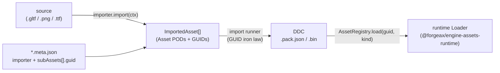
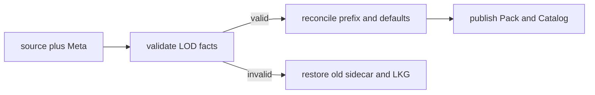

# @forgeax/engine-import

## Authoring and recovery index

## 灯光资产 producer 入口

三条最短入口：

1. `RectAreaLight`、`SpotLight` 与 `LightProbe` 由 render 的 ECS schema 创作，scene producer 只外化 `shared<T>` GUID。
2. `iesImporter` 只在 build-time 接受 LM-63 Type C `TILT=NONE`，输出固定 cooked `IesProfileAsset`；runtime 不解析 `.ies` 文本。
3. `SpotLight.cookie` 走现有 `TextureAsset`/image producer；不要建立 Cookie registry 或第二条采样路径。

producer 持有 authored/source authority，Pack 产出 published 记录，Catalog 是 admitted/current 的投影；失败只返回结构化 `import-failed` 并保留原 GUID，修复 producer 后按同 GUID 重试。`lastKnownGood` 只可预览，不能冒充 verified/current。

Extended-lighting imports keep the same source key across Rect, Spot modifier,
Probe, and recovery carriers. IES is a build-time Type C `TILT=NONE` producer;
Cookie uses the existing texture producer; Probe and Sky are not new asset
registries. A failed publish is a structured producer result, and runtime must
not parse source text, invent a cooked payload, or promote LKG to current.

ScriptablePack sources use the public `@forgeax/engine-import` producer bridge.
The output is the same Pack v2 durable payload used by ordinary importers. The
17 `SCRIPTABLE_PACK_ASSET_KINDS` are `mesh`, `material`, `scene`, `texture`,
`equirect`, `sampler`, `font`, `render-pipeline`, `tileset`, `video`,
`skeleton`, `skin`, `animation-clip`, `animation-graph`, `audio`, and
`particle-effect`, and `ies-profile`; all are loadable by GUID, while `refs`,
`artifacts`, `mediaType`, and `programFingerprint` remain producer facts.
Producer or dependency failures return `code`, `expected`, `hint`, and
`detail`; inspect the owning evidence, rebuild or cold-cook, and retry.

The import contract is [`asset-authority.schema.json`](../../asset-authority.schema.json). `ImporterRegistry` and `runImport` are the build-time owner for external source plus Meta; every writable multi-output declaration uses a stable `sourceKey`, while `sourceIndex` remains diagnostic evidence only.

| Need | Entry | Boundary |
|:--|:--|:--|
| Inspect producer evidence | Pack CLI `lookup` and `verify` JSON output | Read Catalog and receipt facts; do not parse messages |
| Rebuild | Registered importer through `runImport` | Write Pack/DDC output through the shared finalizer |
| Recover failed output | Fix source or Meta, then cold cook | Never return raw source as a runtime projection |
| Preview old output | Explicit Catalog last-known-good locator | Read-only preview; not current and not publishable |

The Importer owns neither DDC lifecycle nor Editor authoring writes. Editor writes go through its asset-authoring gateway, and runtime consumes the validated projection.

### ScriptablePack build generation

`buildScriptablePack()` accepts a ScriptablePack definition, resolves the
default/inherited values, and executes `build()` once for the current subject
identity. The result is a dynamic `sourceKey -> Asset` map; the bridge derives
`AssetGuid` values from `(subjectPackageId, sourceKey)` and sends the resulting
assets through the same registered output producers and Pack v2 finalizer used
by ordinary imports.

`buildScriptablePackWorklist()` is the internal clean-generation
fixed point. Subjects are evaluated in stable order, a forward `readByGuid()`
content miss waits for the subject that can materialize that GUID, and a pass
with no progress returns `pack-content-dependency-stalled`. Once all subjects
settle, the bridge validates references and incoming-reference deletions before
publication. A GUID written into a payload is only a reference dependency;
only `readByGuid()` creates a content dependency.

`produceScriptablePackProducts()` and
`materializePreparedScriptablePack()` adapt that result to the
existing DDC/Catalog/Pack v2 publication tuple. No parameter, parent, sourceKey,
or TypeScript execution contract crosses into the runtime package.

Build-time asset **import** runner + `ImporterRegistry` — the build-time half of
the engine's import/load split.

> [!IMPORTANT]
> **Build-time only.** This package never enters the player runtime bundle
> (AC-06). `@forgeax/engine-runtime` and `@forgeax/engine-app` do not depend on
> it. Its consumers are build tooling (the Vite pack plugin, the asset CLI).

## The DIP (dependency-inversion principle) shape

This is the engine's **third DIP instance** after RHI and Console. The engine
owns the contract (`Importer` / `ImportContext` / `ImportTransport` in
`@forgeax/engine-types`); concrete importers are injected by the host.

```ts
// Host assembly (vite.config.ts or build script)
import { pluginPack } from '@forgeax/engine-vite-plugin-pack';
import { gltfImporter } from '@forgeax/engine-gltf';
import { imageImporter } from '@forgeax/engine-image/image-importer';

export default {
  plugins: [
    pluginPack({
      importers: [gltfImporter, imageImporter],
    }),
  ],
};
```

### Three iron laws (architecture invariants)

1. **GUID import-stable**. The `*.meta.json` sidecar pins every target GUID at
   declare time. Import only reproduces those GUIDs, never mints new ones.
2. **Lazy**. The runtime reads meta only to build a *catalog* (which GUIDs
   exist, with which `kind`). Only a real `AssetRegistry.load(guid, kind)` triggers import
   (when the DDC is absent) + load. No eager full-import on startup.
3. **One-way dependency**. The engine owns the `Importer` interface; concrete
   importers are injected. The engine never reverse-imports `gltfImporter` /
   `imageImporter` / etc.

## The import/load split



- An **`Importer`** (`{ key, import }`) turns one external source + its
  `*.meta.json` GUID declarations into in-memory `ImportedAsset[]` PODs. It is
  pure of disk write + GUID minting — it reads the GUIDs declared in the meta
  (the **GUID import-stable iron law**) and stamps them onto the PODs.
- The **import runner** (`runImport(meta, registry, fs)`) dispatches a sidecar
  by its top-level `importer` string key to the registered `Importer`,
  validates the produced GUID set against the declared set, and folds the
  result into a DDC `.pack.json` document. The reserved key **`importer:
  'shader'`** is skipped — shader sidecars are consumed by
  `@forgeax/engine-vite-plugin-shader`'s orthogonal transform pipeline.
- **`ImportTransport`** (interface in `@forgeax/engine-types`) bridges the
  build-time importer to the runtime: the shipped form wires `null` transport
  (pre-import at build time, DDC miss -> fail-fast `asset-not-imported`); the
  studio form wires an HTTP adapter (`POST /__import/:guid`) for lazy on-demand
  import.

## Injection shape

### ScriptablePack build bridge

`buildScriptablePack` decorates a host-provided Asset snapshot source with the ordinary `AssetReader`. Each GUID is fixed to one generation/digest and cloned for the current Build. The adapter validates the exact output-key/kind closure, stamps descriptor identity, dispatches each Asset to the reusable `AssetOutputProducerRegistry`, and derives external usage from actual reads plus serialized refs. Scene output uses the source definition's neutral `sceneComponents` schema; it never consults a global ECS component registry.

| Derived usage | Input fingerprint | Runtime ref |
|:--|:--|:--|
| `content` | Asset generation and digest | No |
| `reference` | GUID only | Yes |
| `both` | Asset generation and digest | Yes |

Domain producers return structured `ImportError`; the generic bridge contains no per-kind switch. `createStandardAssetOutputProducerRegistry(sceneComponents)` composes the production Scene, Material, and Mesh owners with the definition-bound scene schema. Scene refs use the ECS externalization kernel shared with runtime save, Material refs cover parent/texture/sampler GUIDs, and Mesh emits the versioned binary artifact. The fingerprint covers canonical Meta, the definition-bound scene schema, the recursive source closure, observed external evidence, authoring contract version, and registered producer versions.

`createScriptablePackStagedAssetSnapshotSource()` owns clean-build content reads. It resolves a GUID to its local source owner, lazily builds that owner inside one fixed generation, memoizes private clones and digests, and reports `pack-content-dependency-stalled` for a cycle without consulting an older fallback generation. A fallback is only an explicit prebuilt authority for GUIDs with no local owner.

`createStandardAssetOutputProducerRegistry(sceneComponents)` registers the production
Material, Mesh, and Scene producers. Material output derives
parent/texture/sampler refs. Material texture references serialize as
`{ texture: refsIndex, sampler?: refsIndex }`, including GUID string shorthand;
bare numeric values remain scalars in children without a local parameter schema.
Mesh output derives default-material refs and emits
the `mesh-binary/4` body; Scene output uses the definition-bound neutral schema
through the shared ECS externalization contract. A specialized host may instead
register only the admitted kinds:

```ts
const outputs = new AssetOutputProducerRegistry();
outputs.register(materialAssetOutputProducer);
outputs.register(meshAssetOutputProducer);
```

### Mesh binary v4 producer contract

The Mesh producer calls [`packMeshBinV4`](src/mesh-bin.ts), which delegates
projection facts to geometry and records one stable digest, mask, stride,
cardinality, and payload length in the artifact header. Material defaults are
references into the producer refs table; GUID strings are not duplicated in the
binary metadata.

> [!IMPORTANT]
> A producer Result error contains `subject`, `sourceKey`, `expected`,
> `actual`, and a re-cook recovery hint. Failed validation returns no artifact,
> so the importer cannot publish a partial mesh product. v2/v3 mesh binaries
> are not compatibility inputs.

For prebuilt ordinary Pack dependencies, use
`createScriptablePackFileAssetSnapshotSource({ assetRoots })` from the same
package. It recursively indexes validated `.pack.json` assets by GUID and
returns private `ScriptablePackAssetSnapshot` clones with deterministic
generation/digest evidence; missing, malformed, unreadable, and colliding
inputs remain structured `Result` errors.

At the low-level `buildScriptablePack` boundary, `assetSource` is optional only
when `build` never calls `reader.readByGuid`. The first attempted content read
without a source returns structured `asset-not-found`; no empty snapshot or
stale content is invented. Production Vite hosts provide the staged generation
source described above.

`ImporterRegistry` mirrors the runtime `LoaderRegistry` and the Console
`Registry`: `register(importer)` (fail-fast on a malformed importer, idempotent
on a repeated key) + `get(key)` (returns `undefined`, which the runner maps to a
structured `ImportError(code='importer-not-registered')`).

```ts
import { ImporterRegistry, runImport } from '@forgeax/engine-import';
import { readFile } from 'node:fs/promises';

const registry = new ImporterRegistry();
registry.register(gltfImporter);

const fs = {
  async readSource(path: string) {
    try {
      const buf = await readFile(path);
      return { ok: true, value: new Uint8Array(buf) };
    } catch (e) {
      return { ok: false, error: e };
    }
  },
};

const result = await runImport(
  { importer: 'gltf', source: 'assets/box.gltf', subAssets: [...] },
  registry,
  fs,
);
if (result.ok) {
  console.log('DDC .pack.json:', result.value.pack);
}
```

## Error model

`ImportErrorCode` is a closed 5-member union (exhaustive `switch (err.code)`,
no `default:`). `ImportError` carries the four-field structured surface
(`.code` / `.expected` / `.hint` / `.detail`); SSOT lives in
`@forgeax/engine-types`.

| code | trigger |
|:--|:--|
| `importer-not-registered` | `meta.importer` has no registered importer |
| `source-read-failed` | `meta.source` could not be read |
| `import-produced-no-assets` | importer produced nothing, or omitted a declared GUID |
| `guid-mismatch` | importer produced a GUID not declared in `meta.subAssets[]` |
| `import-internal-error` | importer conversion or finalization failed; the runner wraps it in the existing structured Result. Finalization/digest failures carry a `detail.reason` prefixed with `finalization/digest`, and no CookProduct or Pack is returned for the failed attempt |

## Dual-form transport (M4)

| Form | `ImportTransport` | DDC source | DDC miss behavior |
|:--|:--|:--|:--|
| **studio** (dev server) | HTTP adapter `POST /__import/:guid` | lazily imported on demand | `transport.fetchPack(guid)` -> import -> load |
| **shipped** (player bundle) | `undefined` (null transport) | build-time pre-import via `generateBundle` | `asset-not-imported` fail-fast (never downgrades to runtime import) |

The runtime load path is **identical** in both forms — `ddcLoad` has zero
branches on transport. The only difference is whether `transportOrFail` is
reached on DDC miss (studio: it calls the transport; shipped: it returns the
error immediately).

## Indexed source-package lifecycle

Use this sequence when an import or Pack consumer reports a missing product:

1. **Inspect** the source Meta, declared GUID closure, Catalog row, DDC head,
   and producer receipt. Read the closed error union's `code` and `detail`.
2. **Repair** the source, Meta, or registered importer named by the detail.
   `ImporterRegistry` owns dispatch, while the source plus Meta remains the
   author authority.
3. **Rebuild** when the existing DDC entry can be replaced safely; **cold-cook**
   when integrity, receipt, or lifecycle state says the derived entry is
   invalid. Both paths use `runImport` and the shared finalizer.
4. **Verify** GUID closure, receipt freshness, DDC integrity, Pack artifacts,
   and the projected Catalog row.
5. **Retry** the same GUID after verification. Never parse an error message or
   turn an unverified source file into a runtime payload.

`runImport` keeps conversion and finalization failures inside its structured
Result boundary. A digest-capability refusal during CookProduct finalization
does not publish a partial product; repair that capability and retry the same
Meta/GUID through the same `ImporterRegistry`.

### Source-format LOD adapters

Format adapters project producer facts into the same `MeshAsset.lods` and Pack
closure. The adapter owns interpretation; the sidecar owns retained author
facts and the importer only produces validated derived output.

| Source fact | Normalized result | Required closure |
|:--|:--|:--|
| glTF `MSFT_lod` node relation | ordered root and lower mesh GUIDs | root `refs[]` contains every lower mesh |
| FBX `FbxLODGroup` level relation | ordered root and lower mesh GUIDs | root `refs[]` contains every lower mesh |
| sidecar `sourceOverrides.mesh.lods` | retained `screenCoverage` and source keys | every GUID resolves in the same package |

On first import the helper derives lower-level coverage with

$$c_i = round6(0.5 \times 0.4^{i-1})$$

for `i = 1 .. n`, where `n` is the number of lower levels. This yields
`0.5` for two total LODs, `0.5, 0.2` for three, and `0.5, 0.2, 0.08`
for four. Existing legal sidecar values always win; only a newly appended
suffix receives defaults. A changed middle source key or mesh GUID is rejected
and the previous sidecar plus last-known-good product remains authoritative.

The import package stops at build-time source conversion and product
publication. It does not write authoring state, own Editor operations, or add
runtime transport branches. A dev `ImportTransport` is an explicit host
adapter; a shipped bundle must carry its build-time product and keeps
`asset-not-imported` fail-fast semantics.

## Mesh LOD normalization and recovery

The shared helper in `src/mesh-lod.ts` owns validation, default coverage, and
prefix-stable reimport. For `n` lower levels, first-import defaults are derived
once with:

$$c_i = round6(0.5 * 0.4^{i-1}), 1 <= i <= n$$

Thus two levels produce `0.5`, three produce `0.5, 0.2`, and four produce
`0.5, 0.2, 0.08`. Existing legal sidecar values win; newly appended suffix
levels receive defaults. A middle sourceKey or GUID change is a structured
topology/authority error, so the previous sidecar and LKG remain intact.


