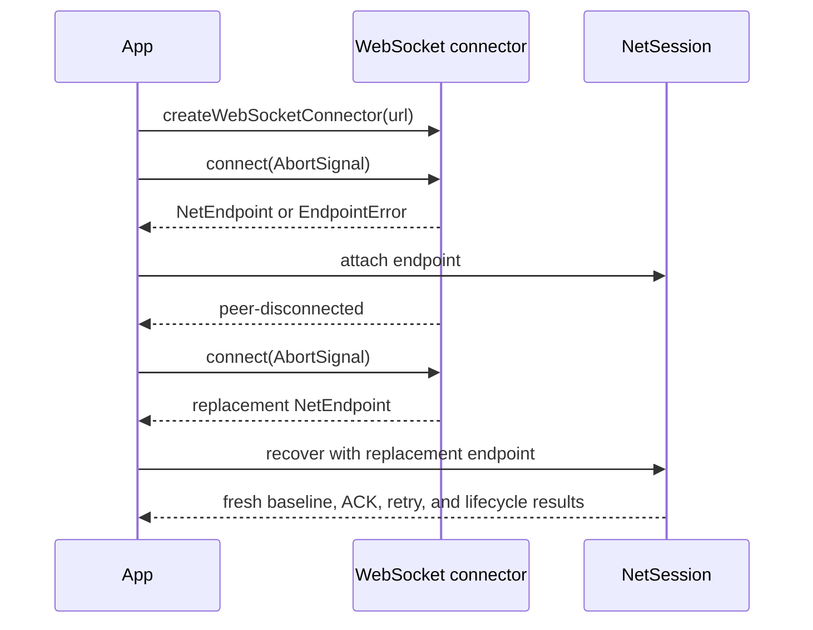

# @forgeax/engine-net-websocket

WebSocket transport adapters for the realm-neutral `NetEndpoint` and
`NetEndpointConnector` contracts.

> [!IMPORTANT]
> A socket reconnect is not an authoritative resync. This package reopens a
> byte transport and reports transport lifecycle; it does not decide session
> authority, accept a fresh baseline, acknowledge replication packets, retry
> application data, or own a replication ledger. Those responsibilities belong
> to `NetSession` in [`@forgeax/engine-net`](../net/README.md).

Replication, profiles, codecs, retry, and gameplay remain in `@forgeax/engine-net`.

## Platform entries

Both platform entries expose the same connector and endpoint vocabulary. Use
`createWebSocketConnector` when the caller owns an `AbortSignal` or needs a
replacement endpoint; use `connectWebSocketClientEndpoint` for one direct
connection.

| Platform | Connector | Direct endpoint | Listener |
|:--|:--|:--|:--|
| Browser | `createWebSocketConnector(url, options?)` | `connectWebSocketClientEndpoint(url, options?)` | N/A |
| Node | `createWebSocketConnector(url, options?)` | `connectWebSocketClientEndpoint(url, options?)` | `listenWebSocketEndpoint(options)` |

The browser symbols are exported from
`@forgeax/engine-net-websocket/browser`. The Node symbols are exported from
`@forgeax/engine-net-websocket/node`. There is no package-root runtime export.

## Minimal connector journey

```ts
import { createWebSocketConnector } from '@forgeax/engine-net-websocket/browser';

const connector = createWebSocketConnector('ws://localhost:8787');
const first = await connector.connect(new AbortController().signal);
if (!first.ok) {
  // Branch on first.error.code, expected, hint, and narrowed detail.
  throw first.error;
}

const endpoint = first.value;
const replacement = await connector.connect(new AbortController().signal);
if (!replacement.ok) throw replacement.error;

endpoint.close();
replacement.value.close();
```

`NetEndpointConnector.connect(signal)` accepts an `AbortSignal`. Aborting a
pending attempt returns a structured `EndpointError`; a successful attempt
returns a new `NetEndpoint`. Calling the same connector again is the
replacement-endpoint operation and creates a new transport attachment. The
application must pass that endpoint to its existing `NetSession`; opening it
does not make local replicated state authoritative.

For a Node listener and client pair:

```ts
import {
  connectWebSocketClientEndpoint,
  listenWebSocketEndpoint,
} from '@forgeax/engine-net-websocket/node';

const listener = await listenWebSocketEndpoint({ port: 8787 });
if (!listener.ok) throw listener.error;
const client = await connectWebSocketClientEndpoint('ws://localhost:8787');
if (!client.ok) throw client.error;
```

## Transport contract

| Concern | Public behavior | Owner |
|:--|:--|:--|
| Bytes | `NetEndpoint.poll()` returns ordered complete `Uint8Array` message events; `send(peerId, data)` returns a `Result`. | This package |
| Cancellation | `NetEndpointConnector.connect(signal)` cancels a pending socket attempt through the supplied `AbortSignal`. | This package |
| Queue bound | `maxQueuedEvents` defaults to `1024`. Overflow closes the affected socket and retains a terminal `peer-disconnected` event for polling. | `BoundedEventQueue` |
| Failure | Expected failures are `EndpointError` values with `.code`, `.expected`, `.hint`, and code-specific `.detail`. | This package |
| Close | `NetEndpoint.close()` is idempotence-aware: repeated close returns `already-closed` instead of reopening or replacing the endpoint. | This package |
| Replacement | A later `connector.connect(signal)` returns a new endpoint and transport peer attachment. | Connector |
| Resync | Fresh baseline acceptance, epoch/sequence rules, ACK watermarks, retry bounds, and terminal session cleanup are not transport behavior. | `NetSession` |

The browser adapter converts `ArrayBuffer` and `Blob` messages to complete
bytes while preserving message order. The Node adapter converts binary `ws`
messages to exact byte slices. Neither adapter imports replication profiles,
packet codecs, or gameplay policy.

## Errors

Every failed result is an `EndpointError`. Branch on its closed `.code` union;
do not parse a message string.

| Code | Meaning | Recovery action |
|:--|:--|:--|
| `peer-not-found` | The requested peer is not in the endpoint connection set. | Use a peer from a `peer-connected` event. |
| `connection-closed` | The target socket is no longer alive. | Observe `peer-disconnected` and let `NetSession` decide recovery. |
| `send-failed` | The platform rejected delivery. | Inspect `.detail`, then handle the transport failure. |
| `already-closed` | The endpoint has already been closed. | Keep the idempotent terminal result; do not reuse the endpoint. |
| `connection-failed` | Connection or listener binding failed. | Inspect the address and bounded option detail, then retry with corrected input. |

## Queue configuration

Invalid `maxQueuedEvents` values fail before a socket or listener is created,
so a caller can correct the option and retry the same URL or listen address.

## Recovery ownership boundary

Use the transport entry point to create or replace an endpoint, then use the
public `NetSession` contract for the logical application session:



The WebSocket package does not implement the `NetSession` state machine and
does not own authoritative resync, ACK/retry accounting, replication packet
ordering, or terminal cleanup policy. See the
[`NetSession` recovery guidance](../net/README.md#structured-failure-and-recovery-guidance)
for those rules.

## Runnable real-socket evidence

Run the real Node process journey from the repository root:

```bash
pnpm -F @forgeax/multiplayer-snake test:process-e2e
```

The [multiplayer-snake process journey](../../apps/multiplayer-snake/src/__tests__/process-e2e.test.ts)
uses the public Node connector and `NetSession` path. It proves a closed
active socket, the same application `SessionId`, a new transport `PeerId`, a
fresh baseline before the next delta, drained ACK accounting, convergence,
and zero process/socket/timer/session resources after disposal. The
[authority process harness](../../apps/multiplayer-snake/scripts/authority-e2e.mjs)
is the real listener-side companion.

For deterministic memory recovery, packet, and lifecycle evidence, use the
public consumers and recovery documentation in
[`@forgeax/engine-net`](../net/README.md#runnable-public-evidence).
