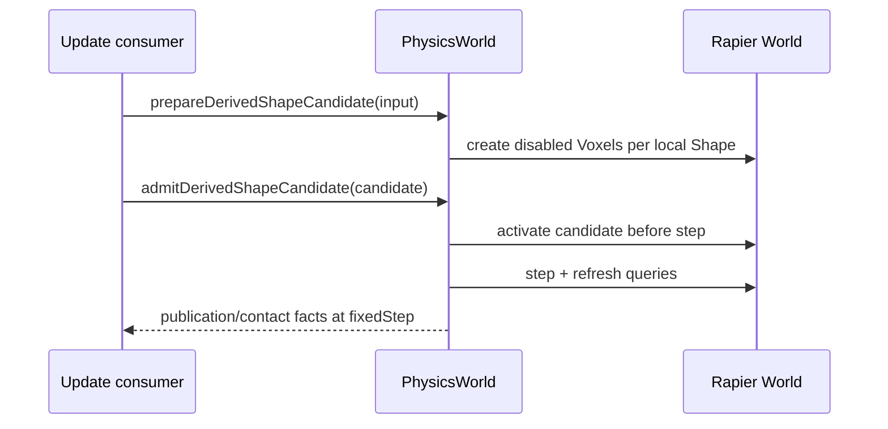

# @forgeax/engine-physics

Physics interface package: ECS component schemas, PhysicsWorld resource shape, error codes, and enum constants. Backend implementations live in `@forgeax/engine-physics-rapier3d` and `@forgeax/engine-physics-rapier2d`.

## Quick Start

Attach three components to an entity and the physics engine drives its position every frame:

```ts
import { Collider, ColliderShapeValue, RigidBody, RigidBodyTypeValue } from '@forgeax/engine-physics';
import { Transform } from '@forgeax/engine-scene';

// Dynamic body: falls under gravity, responds to forces.
world.spawn(
  { component: Transform, data: { pos: [0, 5, 0] } },
  { component: RigidBody, data: { type: RigidBodyTypeValue.dynamic, mass: 1 } },
  { component: Collider, data: { shape: ColliderShapeValue.sphere, radius: 0.5 } },
);

// Static body: immovable, ground/collision target.
world.spawn(
  { component: Transform, data: { pos: [0, 0, 0] } },
  { component: RigidBody, data: { type: RigidBodyTypeValue.static } },
  { component: Collider, data: { shape: ColliderShapeValue.cuboid, halfExtents: [5, 1, 5] } },
);
```

Enable physics by passing `physicsPlugin` to `createApp`:

```ts
import { physicsPlugin } from '@forgeax/engine-physics';

const app = await createApp(canvas, { plugins: [physicsPlugin('rapier-3d')] });
```

## Three-Phase Tick Pipeline

Three ECS systems run in order every frame (registered by `physicsPlugin` during `createApp`):

| Phase | System Name | Runs After | What It Does |
|:--|:--|:--|:--|
| 1. Sync | `physicsSyncBackend` | `propagateTransforms` | Reconciles Transform-bearing entities with Collider or RigidBody; a RigidBody-only entity creates a native body without a placeholder collider |
| 2. Step | `physicsStepSimulation` | `physicsSyncBackend` | Reads the constant `FixedTime.delta`; calls `PhysicsWorld.step()` once per bounded fixed iteration |
| 3. Writeback | `physicsWriteback` | `physicsStepSimulation` | Calls `writebackDynamicBodies()`; writes dynamic-body pose back to ECS `Transform` |

All three systems early-return safely when the `PhysicsWorld` resource is not yet available (WASM fire-and-forget load).

The ECS `World` owns host-frame recovery. It clamps `Time.delta` to the configured
`maxDeltaSeconds`, advances at most `FixedTime.maxStepsPerUpdate` fixed steps,
records discarded whole fixed intervals in `FixedTime.droppedSeconds` and
`FixedTime.droppedUpdates`, and retains only the fractional `overstep`. A later
healthy frame consumes only its own fixed delta; discarded time is never replayed.
The backend `dt <= 0` / `dt > 0.1` guard remains defensive because physics receives
`FixedTime.delta`, not the host-frame gap.

### Transform Pose Projection

`Transform` is the authoring source for a Collider's world-space pose. After
`propagateTransforms`, the backend projects the resolved world translation,
rotation, and scale into Rapier. This applies at creation and on every later
sync for static and non-CharacterController kinematic bodies; dynamic bodies
own their pose after creation and write it back through the physics step.

| Shape | 3D scale projection | 2D scale projection |
|:--|:--|:--|
| `cuboid` | `halfExtents × abs(worldScale)` componentwise | `halfExtents.xy × abs(worldScale.xy)` |
| `sphere` | `radius × max(abs(worldScale))` | `radius × max(abs(worldScale.xy))` |
| `capsule` | Y-axis half-height × `abs(scaleY)`; radius × `max(abs(scaleX), abs(scaleZ))` | Y-axis half-height × `abs(scaleY)`; radius × `abs(scaleX)` |

Negative scale is treated as its absolute magnitude; it does not mirror a
Rapier collision shape. A parented Collider consumes the resolved world pose,
not its local TRS. 2D projects the resolved Z-axis quaternion rotation to its
Rapier angle; out-of-plane rotation is not represented by Rapier 2D.

## Enum Constants and Narrowing Helpers

ECS `enum` fields map to `Uint32Array` numeric columns. Use named constants to avoid magic numbers:

### RigidBodyType

```ts
RigidBodyTypeValue.static    // 0
RigidBodyTypeValue.dynamic   // 1
RigidBodyTypeValue.kinematic // 2
```

Narrowing helper: `rigidBodyTypeFromF32(n: number): RigidBodyType` returns `'static' | 'dynamic' | 'kinematic'`.

### ColliderShape

```ts
ColliderShapeValue.cuboid  // 0
ColliderShapeValue.sphere  // 1
ColliderShapeValue.capsule // 2
```

Narrowing helper: `colliderShapeFromF32(n: number): ColliderShape` returns `'cuboid' | 'sphere' | 'capsule'`.

Backend implementations use the narrowing helpers in `switch` statements for exhaustive matching (no default arm).

## Component Schemas

### RigidBody

| Field | Type | Default | Description |
|:--|:--|:--|:--|
| `type` | `enum` | `1` (dynamic) | `static` / `dynamic` / `kinematic` |
| `mass` | `f32` | `1` | Additional mass (dynamic only; collider mass comes from density) |
| `linearDamping` | `f32` | `0` | Velocity damping per second |
| `angularDamping` | `f32` | `0` | Angular velocity damping per second |
| `gravityScale` | `f32` | `1` | Multiplier for world gravity |
| `ccdEnabled` | `bool` | `false` | Continuous collision detection |

### Collider

| Field | Type | Default | Description |
|:--|:--|:--|:--|
| `shape` | `enum` | `0` (cuboid) | `cuboid` / `sphere` / `capsule` |
| `halfExtents` | `array<f32, 3>` | `[0.5, 0.5, 0.5]` | Cuboid half-width/height/depth |
| `radius` | `f32` | `0.5` | Sphere radius or capsule radius |
| `halfHeight` | `f32` | `0.5` | Capsule half-height (along Y) |
| `friction` | `f32` | `0.5` | Coulomb friction coefficient |
| `restitution` | `f32` | `0` | Bounciness (0 = inelastic, 1 = perfectly elastic) |
| `density` | `f32` | `1` | Mass per volume (affects dynamic body total mass) |
| `isSensor` | `bool` | `false` | Sensor-only collider (no contact response) |
| `collisionGroups` | `u32` | `0x0001ffff` | Rapier collision groups bitmask |
| `solverGroups` | `u32` | `0xffffffff` | Rapier solver groups bitmask |

### CollidingEntities

| Field | Type | Default | Description |
|:--|:--|:--|:--|
| `entities` | `array<entity>` | `[]` | Set of entities currently colliding with the holder |

### CharacterController

Tuning + grounded output for the kinematic character movement primitive. Spawn
alongside `RigidBody({ type: 'kinematic' })` + `Collider` to opt an entity into
`moveAndSlide` (see below). Slope angles are in **degrees** (the backend converts
to radians). `autoStepMaxHeight === 0` disables auto-step; `snapToGroundDist === 0`
disables ground-snap — one field carries both the switch and the value. The same
component is used by 2D and 3D (every field is dimension-agnostic).

| Field | Type | Default | Description |
|:--|:--|:--|:--|
| `offset` | `f32` | `0.01` | Skin thickness; prevents penetration |
| `maxSlopeClimbDeg` | `f32` | `45` | Max climbable slope angle (degrees) |
| `minSlopeSlideDeg` | `f32` | `30` | Slope angle past which sliding starts (degrees) |
| `autoStepMaxHeight` | `f32` | `0.3` | Max auto-step height (`0` = off) |
| `autoStepMinWidth` | `f32` | `0.2` | Min step width to be steppable |
| `snapToGroundDist` | `f32` | `0.2` | Downhill ground-snap distance (`0` = off) |
| `grounded` | `bool` | `false` | **Engine-written** — true after the last `moveAndSlide` resolved a ground contact. Read-only for game code. |

> [!NOTE]
> `grounded` is a `bool` schema field; `world.get(e, CharacterController).value.grounded`
> materializes as a JS `boolean` (not `0`/`1`) — compare `=== true`, never `!== 0`.
> On a continuous slope Rapier reports `grounded === false` while sliding; the
> snap-to-ground effect shows in the resolved position (the character stays on the
> surface), not in the flag.

## Character Movement: `moveAndSlide`

`PhysicsWorld.moveAndSlide(entity, desiredDelta): Vec3` (and the symmetric
`PhysicsWorld2D.moveAndSlide(entity, desiredDelta: Vec2): Vec2`) is the engine's
unopinionated kinematic character primitive (modeled on Unity
`CharacterController.Move`). The game layer computes `desiredDelta` from input +
gravity + jump each frame; `moveAndSlide` resolves it against world geometry with
collision response, slope handling, auto-step, and ground-snap, then writes the
resolved position back to the entity's `Transform` and the contact state to
`CharacterController.grounded`. It returns the actual displacement applied.

```ts
import { CharacterController, Collider, ColliderShapeValue, RigidBody, RigidBodyTypeValue } from '@forgeax/engine-physics';

const character = world.spawn(
  { component: Transform, data: { pos: [0, 0.45, 0] } },
  { component: RigidBody, data: { type: RigidBodyTypeValue.kinematic } },
  { component: Collider, data: { shape: ColliderShapeValue.capsule, radius: 0.3, halfHeight: 0.5 } },
  { component: CharacterController, data: {} },
).unwrap();

// Per frame (e.g. inside app.registerUpdate):
const pw = world.getResource('PhysicsWorld'); // PhysicsWorld | PhysicsWorld2D
const actual = pw.moveAndSlide(character, [dx, dy, dz]); // Transform + grounded written back
```

Requirements: the entity must carry a kinematic `RigidBody`, a `Collider`, and a
`CharacterController`. There is no per-call options object and no `dt` parameter —
tuning is read from the component each call, and the delta already encodes elapsed
time. Spawn the collider at its resting height (capsule center = ground top +
radius + halfHeight); a capsule penetrating the floor has a degenerate contact and
will not auto-step or report grounded correctly.

Character entities are routed exclusively through `moveAndSlide`: the
`physicsSyncBackend` kinematic mirror skips any archetype carrying
`CharacterController` so it does not double-write the body the primitive owns.

**Readiness contract**: the Rapier body is built asynchronously by the first
`physicsSyncBackend` tick after `app.start()` (WASM fire-and-forget load). Before
that tick, `PhysicsWorld.hasBody(entity)` returns `false`. Per-frame drivers must
guard with `if (!pw.hasBody(entity)) return;` before calling `moveAndSlide` --
do not rely on catching `body-not-found` as control flow.

## Error Codes

`PhysicsErrorCode` (9 members, closed union). Exhaustive `switch` without `default`. The public re-export is `packages/physics/src/errors.ts`; the union SSOT is `packages/types/src/index.ts`.

`moveAndSlide` throws `PhysicsError` with `controller-requires-kinematic` (body is
not kinematic), `body-not-found` (no Rapier body for the entity), or
`collider-not-found` (body has no collider).

## Architecture Notes

- **Not a backend**: this package defines interfaces and schemas only. Runtime simulation requires a backend (`@forgeax/engine-physics-rapier3d` or `@forgeax/engine-physics-rapier2d`).
- **Backend selection**: the Rapier backends are optional peer dependencies because the preset is loaded dynamically; install the backend selected by `physicsPlugin('rapier-3d')` or `physicsPlugin('rapier-2d')` (the umbrella Engine package already carries both).
- **ECS bridge**: backend packages call `registerPhysicsSystems(world, Transform)` to wire the three-phase tick pipeline into the ECS schedule.
- **Fire-and-forget**: WASM backends load asynchronously; entities spawned before load are picked up once the `PhysicsWorld` resource appears.
- **Component schemas SSOT**: `packages/physics/src/components.ts` is the authoritative definition for all physics component fields, defaults, and types.

## Simulation participant boundary

Physics backends may register one ready simulation participant with the ECS
World. The participant owns only portable backend state; ECS owns the versioned
record, atomic restore, fixed-tick trace, comparison report, tolerance, and
closed errors.

Use the minimum path: create a source World, capture its record, create a fresh
target World with the same participant version/schema fingerprint, restore, and
compare semantic collision facts. Do not pass Rapier WASM handles, native
vectors, or backend World objects through App, Preview, or Remote.

On failure, branch on `error.code`, read `expected`, `hint`, and the narrowed
`detail`, then rebuild the participant or target named by the hint. A physics
participant is not a network rollback store, RHI tape, or game replay owner.

## Derived voxel shape candidates (3D)

A Transform-bearing RigidBody can receive derived shapes without an ordinary
Collider. Adding, editing, or removing an ordinary Collider preserves committed
derived shapes on that same body. Prepared native shapes are disabled and
massless; only the admitted shape set contributes automatic density.

For paired standard geometry, pass the optional synchronous `commitGeometry`
argument to `admitDerivedShapeCandidate`. Physics invokes this once after native
staging and before step/publication; failure rolls back through the same native
old-state restoration as an admission failure. The callback performs only the
complete Renderer binding commit and returns its Result. It must not query physics,
draw, enqueue more work, or perform fallible work after a successful binding change.
The borrowed `getDerivedAdmission(entity)` proof exists only in that interval;
publications remain unavailable until the normal step/writeback boundary. See the
[paired Render example](../render/README.md#paired-physics-admission).

| Paired result | Observable state |
|:--|:--|
| Native staging fails | Geometry commit not called; old state retained or explicit rebuild required |
| Geometry refuses | Native rollback; no new physics publication; old MeshFilter retained |
| Geometry callback throws | Its ECS writes are uncertain; physics queries and rendering stop with explicit rebuild-required state |
| Geometry succeeds | Step and writeback precede physics publication; Renderer draw follows World update |
| Zero fixed steps | Both candidates stay pending and old state remains visible |

Wave 1 keeps derived geometry inside the one `PhysicsWorld`. A consumer submits
an immutable, standard-data description; the Rapier 3D owner creates disabled
native `Voxels` colliders during preparation, then admits the whole candidate at
the next fixed-step boundary. No Rapier handle, native world, worker, or second
transaction registry crosses this API.

```ts
import type { PhysicsWorld, DerivedPhysicsCandidateInput } from '@forgeax/engine-physics';

declare const physics: PhysicsWorld;
declare const candidateInput: DerivedPhysicsCandidateInput;

const prepared = physics.prepareDerivedShapeCandidate?.(candidateInput);
if (prepared?.ok) {
  const admitted = physics.admitDerivedShapeCandidate?.(prepared.value);
  if (admitted?.ok) {
    // Physics systems call step() from FixedUpdate. In an ECS-bound world the
    // publication becomes visible only after physicsWriteback and
    // physicsCollisionSync complete; direct PhysicsWorld consumers finalize in
    // step() because they have no ECS writeback phase.
    void physics.getDerivedPublication?.(candidateInput.entity);
  }
}
```

The fixed-step ownership is deliberately small:



`VoxelShapeInput.cells` is a contiguous integer `x,y,z` `Int32Array` (or a
tuple list), `voxelSize` is positive, and `origin` is local. A cell at
`[i,j,k]` occupies the local box whose center is
`((i + 0.5) * sx, (j + 0.5) * sy, (k + 0.5) * sz)`; negative coordinates stay
negative and are never rounded through a chunk index. A seam is accepted only
when both Shapes have equal voxel size, quaternion-equivalent orientation, and
an integer grid offset that matches `originB - originA` in that grid. Different
grid sizes, unaligned rotations, origin/offset mismatches, or different Body
identities return `derived-seam-invalid` rather than silently coupling shapes.

The candidate may also carry a body type, explicit mass/center of mass/principal
inertia (including its principal frame), a `preserve | reset` velocity policy,
an explicit `motion` snapshot (`centerOfMass`, `linearVelocity`, and
`angularVelocity`), and bounded spring/hinge updates. Every candidate carries a producer
`sourceKey` and revision. Every constraint endpoint carries a
`{ sourceKey, revision }` dependency; migration is rejected when either end is
stale or missing, and these dependencies are included in the portable
snapshot. Explicit mass zeros collider density before
Rapier applies the authored mass properties, so the same density is not counted
twice. With `preserve`, the committed linear velocity follows
`v_new = v_old + omega_old x (COM_new - COM_old)` and angular velocity is
retained; `reset` intentionally clears both. Constraints use the same Rapier
solver and expose only the consumer's stable `id` and revision.

Preparation and cancellation are non-visible. A stale revision, duplicate
Shape identity, invalid mass, pending duplicate, missing Body, or bounded
candidate overflow returns `DerivedPhysicsError` with `code`, `expected`,
`hint`, and narrowed `detail`; the last publication remains intact. A
PhysicsWorld bounds 32 in-flight candidates, 64 shapes/64 constraints and
8 MiB of staged candidate data (with a 262144-cell per-candidate ceiling).
If a native operation fails after admission, `getDerivedFailure(entity)` returns
a structured failure receipt and the candidate is failed/cleaned while the
prior body, shapes and constraints remain queryable; the backend never silently
swallows the native error. `getContactObservations()` contains only detached facts from the real Rapier
event drain: `fixedStep`, entity identities, optional Shape identities, and
optional sampled point/normal. It does not claim impulse or energy data.

For explicit recovery, call `captureDerivedPhysicsState()` only at a committed
boundary. The returned cells, Shape revisions, seams, mass policy, velocity
policy, committed COM/linear/angular motion, and constraint inputs are portable;
`restoreDerivedPhysicsState()` admits the complete snapshot as one dependency-
consistent batch, so a two-body constraint is never restored against a stale
endpoint and native handles/pending candidates are never serialized. A native
failure after mass/body/constraint mutation either restores the complete old
state and exposes `old-state-retained`, or reports `rebuild-required` and blocks
queries; it is never reported as a ready partial commit. Device or World teardown
invalidates pending work; the 2D `PhysicsWorld2D` contract remains unchanged and
does not pretend to support 3D voxel shapes.
