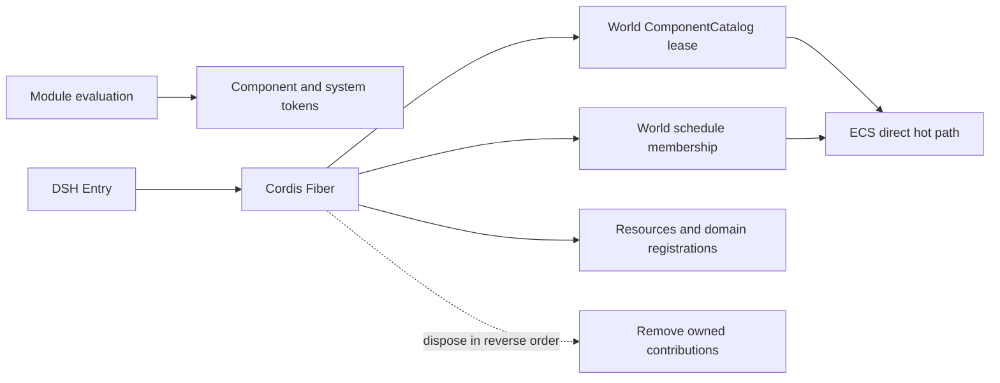

# @forgeax/engine-plugin

`@forgeax/engine/plugin` is the sole ForgeaX runtime entry to [DeepSeek Cordis](https://www.npmjs.com/package/@deepseek-ai/cordis). The main export remains a thin re-export of `@deepseek-ai/cordis@4.0.1`; the opt-in `@forgeax/engine/plugin/loader` subpath adds the exact-pinned Entry/Loader control plane plus a browser-safe static Catalog boundary.

> [!IMPORTANT]
> Cordis owns when a capability exists, what it depends on, and how it is reverted. ECS, Renderer, Assets, and Host packages own the direct data structures that execute it. Entry and Fiber work never enters per-entity, per-draw, or per-particle loops.

## The six concepts

| Concept | Meaning |
|:--|:--|
| Package | Local code and its pinned dependency version |
| Plugin module | A default-exported native Cordis plugin |
| Entry | One configured installation, identified by a stable `id` |
| Catalog | A build-generated map from module name to literal import thunk |
| Fiber | The live Cordis installation created for an Entry |
| Contribution | A system, component registration, resource, listener, or domain feature owned by that Fiber |

The Catalog is not a package scanner. Devkit emits only modules already admitted by `forge.json.plugins[]`; production does not inspect `node_modules`, evaluate YAML, or construct arbitrary dynamic import strings.

```ts
import { installCatalogLoader, projectPluginEntries } from '@forgeax/engine/plugin/loader';

const catalog = new Map([
  ['./movement.ts', { realm: 'engine', load: () => import('./movement.ts') }],
]);
const entries = [{ id: 'movement', name: './movement.ts', realm: 'engine' }] as const;

const { loader } = await installCatalogLoader(app.pluginContext, catalog, 'engine');
await loader.root.update(projectPluginEntries(entries, 'engine'));
await loader.await();
```

`loader.update(id, { disabled: true })`, `loader.update(id, { config })`, and `loader.remove(id)` use native DeepSeek Harness Entry reconciliation. A failed config update rolls back to the last working Fiber and its contributions.

## Root Group authoring

Use one public Group as the project root. Each `usePlugin` declaration carries its
configuration. A stable key is optional: when omitted, the native Plugin object is
the child's identity; an explicit key preserves identity across reorder, config
update, replacement, and retry. Reusing one Plugin object without distinct keys
is rejected when it would create ambiguous instances.

```ts
import { definePluginGroup, usePlugin } from '@forgeax/engine/plugin';
import type { Plugin } from '@forgeax/engine/plugin';

const movement: Plugin.Object<{ speed: number }> = {
  name: 'movement',
  provide: 'movementSpeed',
  apply(ctx, config: { speed: number }) {
    ctx.provide('movementSpeed', config.speed);
  },
};

const gameRoot = definePluginGroup({
  name: 'game-root',
  children: (config: { speed: number }) => [
    usePlugin(movement, { speed: config.speed }, { key: 'movement' }),
  ],
});

const rootFiber = await context.plugin(gameRoot, { speed: 6 });
await rootFiber.await();

// @ts-expect-error speed must be a number
usePlugin(movement, { speed: 'not-a-number' }, { key: 'invalid' });
```

The Group owns reconciliation while each child Fiber owns its own effect and
disposer. A rejected update leaves the prior Fiber and configuration as the
last-known-good state; repair the child owner, then retry the same Entry update.
The retry must await both the update and the Loader barrier before publishing a
new state.

```ts
import type {
  CatalogLoaderError,
  CatalogLoader,
  PluginCompositionError,
} from '@forgeax/engine/plugin';

function recoveryOwner(error: PluginCompositionError | CatalogLoaderError): string {
  switch (error.code) {
    case 'plugin-config-invalid':
      return `Group config for ${error.detail.plugin}`;
    case 'plugin-group-child-failed':
      return `child ${error.detail.child}`;
    case 'plugin-group-dependency-cycle':
      return `dependency path ${error.detail.path.join(' > ')}`;
    case 'plugin-group-key-duplicate':
      return `stable key ${error.detail.key}`;
    case 'plugin-group-key-required':
      return `stable key for ${error.detail.plugin}`;
    case 'plugin-group-provider-missing':
      return `provider ${error.detail.service}`;
    case 'plugin-catalog-missing':
      return `Catalog entry ${error.detail.name}`;
    case 'plugin-realm-mismatch':
      return `realm ${error.detail.actual} for ${error.detail.name}`;
    case 'plugin-entry-realm-mixed':
      return `Group ${error.detail.group}`;
    case 'plugin-realm-unsupported':
      return `realm ${error.detail.realm}`;
    case 'plugin-catalog-digest-mismatch':
      return `Catalog digest ${error.detail.actual}`;
  }
}

async function retryLastKnownGood(
  loader: CatalogLoader,
  entries: Parameters<CatalogLoader['root']['update']>[0],
): Promise<void> {
  await loader.root.update(entries);
  await loader.await();
}
```

`recoveryOwner` deliberately has no `default`: every closed error arm names its
owner and detail. `retryLastKnownGood` is the owner-level recovery barrier; it
does not dispose a working Fiber or fabricate a second registry.

## Native Cordis foundation

The Loader does not replace direct Cordis composition. A host that already owns the plugin set can still create one World context and dispose an individual Fiber:

```ts
import { createWorldContext } from '@forgeax/engine/ecs';
import optionalGameFeature from './optional-game-feature';
import projectPlugin from './project-plugin';

const ctx = await createWorldContext(world, [projectPlugin]);
const fiber = await ctx.plugin(optionalGameFeature);
await fiber.dispose();
```

| Cordis primitive | ForgeaX use |
|:--|:--|
| `Context` | Capability scope for one App, Worker realm, or standalone World |
| `Plugin.inject` | Declares dependencies such as `world`, `renderer`, and `assets` |
| `ctx.provide` | Publishes a domain service tracked by dependencies |
| `ctx.effect` | Registers a system, resource, listener, or host object with its inverse |
| `Fiber` | State, update, rollback, and disposal for one activation |
| `Context.isolate` | Separates same-named service scopes without another container |

`EngineContextServices` is the only ForgeaX type extension point. Domain packages augment native `Context` with services such as `world`, `input`, `audio`, and `physics`; the augmentation adds no runtime layer.

## Engine built-in profiles

Engine built-ins use the same native Plugin/Fiber contract as project entries.
App selects a small static profile for browser-main, Engine Worker, or
assemble-form execution; profile arrays express product defaults while
`inject/provide` remains the dependency authority. A test derives the bounded
first-party graph to reject missing providers, duplicate providers, and cycles.
There is no production DAG planner or per-frame plugin dispatch.

Canvas input acquisition, Renderer ownership, simulation participants, debug
draw, execution transport, remote server, and browser bridge all register their
inverse in the owning Fiber. `App.dispose()` drains that realm; it does not run
a second cleanup array. Engine Worker rebuild disposes the previous realm before
publishing the replacement.

## Component, system, and Fiber

A plugin owns reversible runtime contributions, not JavaScript module evaluation. Component and system tokens are vocabulary; installing them into one World creates lifecycle state.

`defineComponent` and `defineSystem` publish tokens as vocabulary. Unloading removes the World-local lease, schedule membership, and owned data; it does not delete imported token objects or invalidate archetypes in another World.



| Layer | Removed with the Fiber? |
|:--|:--|
| Imported module and frozen token objects | No; ESM cache is a realm concern |
| Component registration in one `World.components` catalog | Yes, through its lease |
| System membership in one schedule | Yes, through `world.removeSystem` |
| Plugin-owned entity/component value | Yes, when the Fiber owns it |
| Resource, listener, loader, Renderer feature, or host object | Yes, through its domain disposer |

Register World vocabulary and its consumers in one generator effect. Yield each inverse immediately so partial activation and normal disposal share the same reverse order:

```ts
import { defineComponent, defineSystem, Update } from '@forgeax/engine/ecs';
import type { Plugin } from '@forgeax/engine/plugin';

const Position = defineComponent('Position', { x: 'f32' });
const movement = defineSystem({
  name: 'movement',
  queries: [{ write: [Position] }],
  fn: () => undefined,
});

const plugin: Plugin = {
  name: 'movement',
  inject: ['world'],
  apply(ctx) {
    ctx.effect(function* () {
      const componentLease = ctx.world.components.register(Position).unwrap();
      yield () => componentLease.dispose().unwrap();

      ctx.world.addSystem(Update, movement).unwrap();
      yield () => ctx.world.removeSystem(Update, movement.name).unwrap();
    }, 'movement/world-contributions');
  },
};

export default plugin;
```

Disposal removes the system before releasing the component registration. The final component lease returns `component-in-use` while a live entity or registered system still references the token, preventing a half-unloaded World. The same token can be registered in two Worlds; each World owns an independent lease.

## Ownership rule

Cleanup follows ownership, not access. A plugin removes an entity or component value only if it created or exclusively owns it. Shared game state needs an explicit owner; it must not be inferred from which systems happened to read it.

For plugin-owned entities, yield `world.despawn(entity)` immediately after `spawn`; for a value added to a borrowed entity, yield only the matching `removeComponent`. Because generator effects unwind in reverse order, register data cleanup before system cleanup so the system is removed first.

## Control plane, not data plane

“Everything is a plugin” means every independently reversible capability has a Fiber. It does not turn
component schemas, system definitions, query descriptors, pure helpers, entities, or per-frame rows into
Fiber objects. A project root plugin may share the World's lifetime; replacing the whole game then
rebuilds the World instead of maintaining a second ownership graph for every entity.

A clean disposal leaves no active schedule entry, World lease, resource, listener, Host object, or
plugin-owned ECS value from that Fiber. Imported component and system tokens may remain in the ESM realm
and token vocabulary: they are inert declarations, not a live capability or unmanaged side effect.

## Failure and performance boundaries

Loader failures preserve their original Cordis/domain cause. App boundaries may project them into an App error, but there is no second generic plugin error state machine.

`createApp()` reports activation failure as `app-plugin-activation-failed` and preserves the original value in `detail.cause`.

After activation, systems remain direct schedule records, component tokens remain archetype/query identities, and services are cached references. `World.update()`, render extract/prepare/record, and audio/physics ticks do not query Loader, Entry, Context, or Fiber.

The local dependency patch for `@deepseek-ai/cordis-plugin-loader@1.0.2` removes only its Node-internal module-loader probe and shared-process environment read. Catalog imports replace that boundary in ForgeaX browser realms; Entry, EntryTree, update, rollback, remove, `await`, and Fiber behavior remain upstream code. Delete the patch when upstream exposes a browser-safe resolver seam.
