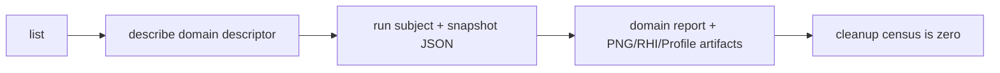

# `@forgeax/engine-preview`

This focused package owns the Engine preview substrate. It provides one lexical
`previewHost.withSession()` boundary and typed binding, frame, capture, and dispose
actions. It does not own Project writes, ToolRun execution, a catalog, or an
Editor session.

## Minimal host contract

```ts
const host = createPreviewHost(adapter);
const terminal = await host.withSession(
  {
    subject: { kind: 'mesh', guid: 'mesh:fixture' },
    snapshot: { revision: 3, digest: 'sha256:project' },
  },
  async (session) => {
    const binding = await session.loadAsset('mesh:fixture');
    await session.frame({ frame: 0, deltaSeconds: 0 });
    return { binding, capture: await session.capture() };
  },
);
```

The callback receives only POD binding and presentation actions. World, Renderer,
Canvas, GPU, and ToolRun handles remain inside the adapter. `withSession` always
disposes the lexical lease and returns a cleanup census. A non-zero `worlds`,
`renderers`, `canvases`, or `leases` count throws `PreviewCleanupError` with the
stable `preview-cleanup-live-resources` code.

## AI disclosure order

1. `list` exposes a domain descriptor and its physical realm.
2. `describe` expands the selector, `SnapshotRef`, result schema, required evidence,
   and structured errors.
3. `run` accepts JSON subject and snapshot values only.
4. The terminal carries the subject report, `ArtifactRef` values, and the cleanup
   census. A live resource or carrier handle is never portable evidence.

## Canonical domain contributions

M2 adds four peer contributions. Each request carries a `ToolSubjectRef`, a
revisioned `SnapshotRef`, and a domain binding; each terminal returns a
subject-bound report plus `rhi-tape`, `png`, and `profile-capture` artifacts.

| Descriptor | Subject | Presentation oracle | Domain falsifier |
| --- | --- | --- | --- |
| `material.preview` | `MaterialAsset` | Fixed studio sphere and lighting | Fallback sphere, disconnected program, or background-only capture |
| `mesh.preview` | `MeshAsset` | All submeshes with source AABB framing | Partial buffers or inverted framing |
| `vfx.preview` | `ParticleEffectAsset` | Fixed seed, delta, and bounded compute/draw timeline | Stale seed/delta or missing compute/draw output |
| `texture.preview` | `TextureAsset` | Aspect-correct quad and alpha checker | Replacement texture, format/color-space drift, or wrong aspect |

> [!IMPORTANT]
> `asset.preview`, `preview.run`, and `preview.offline-analysis` are not part of
> the default discoverable catalog. The old generic proof helpers remain
> private implementation utilities until their consumers are retired.



The domain files are deliberately separate so each subject can reject its own
fallback and binding substitutions. They share only the lexical host helpers;
they do not create a second registry, executor, World, Renderer, or authoring
session.
