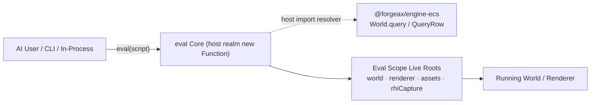
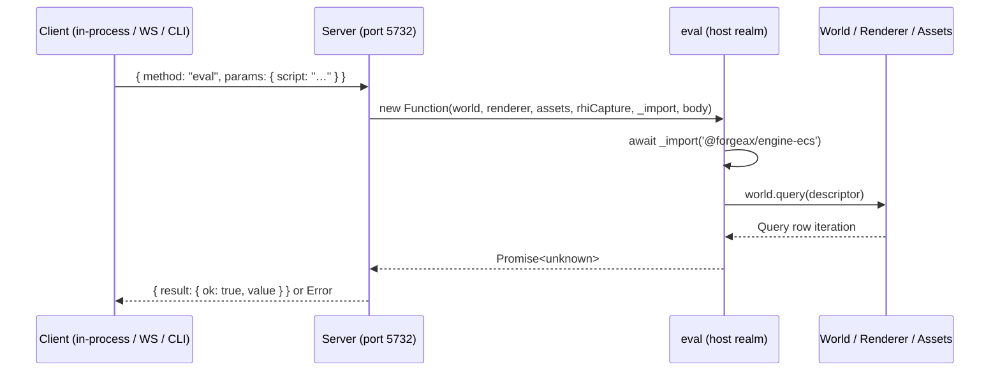
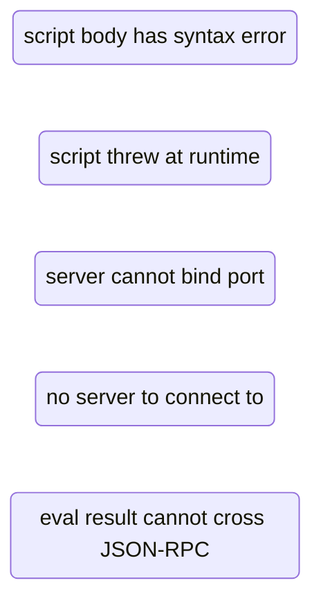
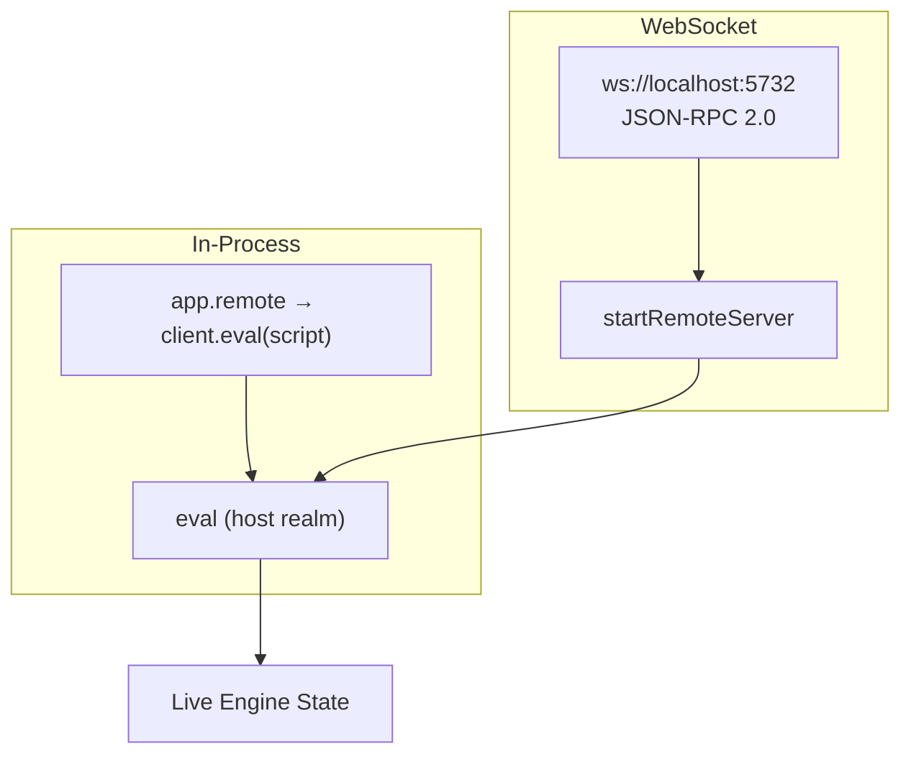

# @forgeax/engine-remote

> **Single capability — `eval` a live engine.** Send a JavaScript snippet to a running engine instance, have it executed against the live World / Renderer / AssetRegistry, and receive a structured result. Aligned with [Bevy BRP](https://github.com/bevyengine/bevy/discussions/15323) and [Unreal Remote Control](https://dev.epicgames.com/documentation/en-us/unreal-engine/remote-control-api-http-reference-for-unreal-engine) — "evaluate code against a live instance" rather than "attach a debugger UI panel." Four required roots plus the optional `profiler` root are injected into eval scope; `_import(specifier)` enables dynamic ESM imports. No Registry, no pre-built commands, no read-only sandbox. A `switch` over the closed `RemoteErrorCode` union is the only error vocabulary.



## Overview

`@forgeax/engine-remote` provides a **single execution channel**: send a script string, get a `Result<unknown, RemoteError>` back. The package ships as:

| Role | Entry | Shape |
|:--|:--|:--|
| In-process client | `client.eval(script)` | Direct `async` call within the host process — zero network overhead |
| WS JSON-RPC 2.0 server | `ws://localhost:<port>` `{"method":"eval","params":{"script":"..."}}` | Host embeds via `startRemoteServer`; external tools (CLI / AI agents) connect over WebSocket |

All three paths converge on the same `eval(script)` protocol. The `createApp` entry point wires the server by default in dev mode (`app.remote` is non-undefined, port > 0) and leaves it off in production — **the only safety boundary is whether the host starts the server.**



## Eval Recipes

### Script contract

**Your script is the body of an async function** with `world` / `renderer` / `assets` /
`rhiCapture` / `_import` in scope. Concretely:

- **A lone expression is auto-returned** — `renderer.backend` yields `"webgpu"` (a trailing
  semicolon is fine).
- **Top-level `await` is legal** — `await _import('@forgeax/engine-ecs')` works directly, no wrapper.
- **Top-level `return` is legal** — `return world.inspect().entityCount`.
- **A multi-statement script uses an explicit `return`** for its value (a statement list is not
  auto-returned): `const m = await _import('@forgeax/engine-ecs'); return Object.keys(m)`.

The historical `(async () => { ... })()` IIFE form still works (its returned Promise is awaited), but
is no longer necessary. If a returned value is a Promise it is awaited before being sent back.

### Prerequisites

Three live engine roots are always present in eval scope. Diagnostics are structural optional roots:

| Root | Type | Purpose |
|:--|:--|:--|
| `world` | `World` (from `@forgeax/engine-ecs`) | ECS read/write: `spawn`, `despawn`, `set`, `query` |
| `renderer` | `Renderer` | Renderer control: create/destroy render targets, read backbuffer |
| `assets` | `AssetRegistry` | Asset queries: `loadByGuid`, `resolveName`, `rename` |
| `rhiCapture` | `{ captureFrame(options?) } \| undefined` | Single-frame RHI capture returning one `{ kind: 'rhi-tape', digest, bytes }` artifact. **Only defined when the app was created with `FORGEAX_ENGINE_RHI_DEBUG=1`** (else `undefined` — guard before use). Browser capture uses the same `window.__forgeax.captureFrame(options?)` capability. |
| `profiler` | `Profiler \| undefined` | Bounded CPU capture: `startCapture({ frameLimit, eventLimit })`. **Only defined when the host passes `profiler` to `createApp` or `startServer`.** |
| `execution` | `{ report(): unknown; rebuild(): Promise<unknown> } \| undefined` | App-owned execution report and explicit poisoned-World rebuild. Remote imports no App or ECS execution type. |

The `_import(specifier)` injection enables dynamic ESM imports inside eval scope. **Plain `import` keyword is NOT available**; scripts use `await _import('@forgeax/engine-ecs')` to pull in engine packages.

The App host's ECS import resolver is explicit: when the host exposes
`@forgeax/engine-ecs`, it projects only `World`, `Entity`, `Update`,
`FixedUpdate`, `Time`, and `FixedTime`. The remote transport owns no engine
package vocabulary; another host can inject a different resolver through
`startServer({ importModule })`. Other package exports are not transported by
the App ECS projection; use the owning package's public import when a script
needs another domain token.

> [!NOTE]
> `rhiCapture`, `profiler`, and `execution` are conditional capabilities. Guard each before use. `world`, `renderer`, and `assets` are always present.

### Handle and component discovery

The World-owned row iterator is available directly in eval scope. An empty descriptor visits every enabled entity; component tokens grant typed data access.

```js
const handlesQuery = world.query({});
if (!handlesQuery.ok) throw handlesQuery.error;
const handles = Array.from(handlesQuery.value, (row) => row.entity);

const { MeshRenderer } = await _import('@forgeax/engine-render');
const { Transform } = await _import('@forgeax/engine-scene');
const visibleQuery = world.query({ read: [Transform], with: [MeshRenderer] });
if (!visibleQuery.ok) throw visibleQuery.error;
const results = Array.from(visibleQuery.value, (row) => ({
  entity: row.entity,
  position: Array.from(row.get(Transform).pos),
}));
```

`Transform.pos` is the flat `array<f32, 3>` column, so row `i` starts at
`i * 3`; the same stride rule applies to `quat` (4), `scale` (3), and other
fixed-array fields.

### Write / Lifecycle

```js
// Spawn with components
const scene = await _import('@forgeax/engine-scene');
const h = world.spawn({
  component: scene.Transform,
  data: { pos: [0, 5, 0], quat: [0, 0, 0, 1], scale: [1, 1, 1] },
}).unwrap();

// Set — mutate existing component values
world.set(h, scene.Transform, { pos: [1, 2, 3] });

// Despawn
world.despawn(h);
```

> [!IMPORTANT]
> Eval is full-access — no write interception, no `inspector-write-denied` error code, no `ECS_MUTATING_METHODS` blacklist. `spawn` / `set` / `despawn` execute directly. See [Transport and Security](#transport-and-security) for the safety model.

### Frame Capture via rhiCapture

```js
// Capture the current steady-state frame
if (rhiCapture === undefined) return { ok: false, error: { code: 'capture-unavailable' } };
const capture = await rhiCapture.captureFrame();
if (!capture.ok) return capture;
// Pass this single artifact to `forgeax debug rhi summary` or `rhi.inspect`.
return { kind: capture.value.kind, digest: capture.value.digest };
```

Offline operations (`rhi.summary` and `rhi.inspect`) do not connect over WebSocket and are not routed through eval. See `@forgeax/engine-rhi-debug` README for the full capture/summary/inspect workflow.

### CPU profiling via profiler

When the host opts in, use the existing `eval` method to start and finish a bounded CPU capture.
There is no profiler-specific JSON-RPC method and no new transport:

```js
if (profiler === undefined) {
  return { ok: false, error: { code: 'profiler-not-enabled' } };
}
const started = profiler.startCapture({ frameLimit: 120, eventLimit: 1024 });
if (!started.ok) return started;
const finished = started.value.finish();
return finished;
```

The returned `ProfileCapture` is suitable for `@forgeax/engine-profiler` validation and offline
CLI analysis. The root does not add ECS, GPU, UI, or network-trace behavior to the remote package.

## RemoteErrorCode

`RemoteErrorCode` is a **5-member closed union**. TypeScript `switch (err.code)` exhaustiveness is enforced at compile time — no `default` branch. The JSON-RPC 2.0 numeric segment `-32001..-32005` maps 1:1 to the 5 members.

| code | JSON-RPC | `.expected` | `.hint` |
|:--|:--|:--|:--|
| `script-syntax-error` | -32001 | `'script body is valid JavaScript'` | `'check syntax position in errMessage; fix and resubmit'` |
| `script-runtime-error` | -32002 | `'script executes without throwing'` | `'inspect error; verify symbol availability; eval has full access to world/renderer/assets'` |
| `server-startup-failed` | -32003 | `'server starts successfully on requested port'` | `'check if port is already in use (default 5732); pass different port; or kill existing process holding the port'` |
| `server-not-running` | -32004 | `'server is reachable at ws://localhost:<port>'` | `'start the demo first; verify app.remote is wired; pass --port to override default 5732'` |
| `eval-result-not-serializable` | -32005 | `'eval result is JSON-serializable'` | `'return a JSON-safe value; BigInt and cyclic objects are unsupported over JSON-RPC'` |

Each `RemoteError` instance carries the structured triple (`.code` / `.expected` / `.hint`) plus an optional bounded `.detail` and an auto-composed `.message` for human stack traces. For `eval-result-not-serializable`, `.detail` contains only `{ code, shape }` where `shape` is `bigint`, `cyclic-object`, or `unsupported`; returned object contents never cross the error boundary. AI users consume via property access — never by parsing `.message`.

```ts
import { RemoteError, type RemoteErrorCode } from '@forgeax/engine-remote';

function recover(code: RemoteErrorCode): string {
  switch (code) {
    case 'script-syntax-error':   return 'fix script body syntax and resubmit';
    case 'script-runtime-error':  return 'inspect stack trace; verify symbol availability';
    case 'server-startup-failed': return 'pick a different port or free port 5732';
    case 'server-not-running':    return 'start demo dev or wire app.remote';
    case 'eval-result-not-serializable': return 'return a JSON-safe eval result';
  }
}
```

The SSOT split: the **type alias** `RemoteErrorCode` and **structural interface** `RemoteError` live in `@forgeax/engine-types` (parallel to `ShaderErrorCode`). The **runtime class** (`RemoteError extends Error implements RemoteErrorShape`) lives in `packages/remote/src/errors.ts`.



## Transport and Security

### Transport Paths



| Path | Method | Use Case |
|:--|:--|:--|
| In-process | `const result = await client.eval('world.inspect().entityCount')` | Host self-inspection; zero network cost |
| WebSocket | `ws://localhost:5732` send `{"method":"eval","params":{"script":"..."}}` | External AI agents / CLI tools attaching to a running **Node / dawn-node** app |
| Persistent DevKit owner (**`forgeax dev`**) | `forgeax dev eval --root <project> --instance-id <id> --world-identity <id> --code "..."` | Driving a **live browser** engine while preserving one Page and one actual World |

> **Browsers cannot host a WS server.** `startServer` remains a Node/dawn-node transport. Browser development uses the DevKit owner: `forgeax dev start` keeps the project process and controlled Page, and its App bridge evaluates code in the actual main or Worker realm. `forgeax dev status` is the readiness and identity authority; stale `instanceId`, `loadId`, or `worldIdentity` requests fail instead of silently switching pages.

The wire protocol exposes **two** JSON-RPC methods: `eval` (the single capability above) and `introspect`. Send `{"method":"introspect"}` to get an OpenRPC L2 subset document listing the available methods (`eval` / `introspect`) and the eval-scope live roots — an AI agent can self-describe the surface without reading source. Recoverable failures map to JSON-RPC error codes `-32001..-32005` (the 5-member `RemoteErrorCode` union; see above).

### Security Model

> [!IMPORTANT]
> **The only safety boundary is whether the host starts the server.** Eval is full-access — no code-level interception, no method blacklist, no read-only proxy. Dangerous APIs (`renderer.dispose()` destroys GPU context and crashes the app; `world.despawn` can wipe all entities; `AssetRegistry.clear()` etc.) are executable inside eval.

| Mode | `app.remote` | Server running? | Safety |
|:--|:--|:--|:--|
| Dev (`import.meta.env.DEV`) | `RemoteHandle` (non-undefined, port > 0) | Yes — auto-started by `createApp` | **Developer's responsibility** — do not eval scripts containing destructive API calls |
| Production | `undefined` | No — `createApp` skips server startup | **Safe by default** — no eval entry point exists |
| Headless / dawn-node | `undefined` (default) | No — unless `FORGEAX_REMOTE_SERVER=1` opt-in | **Safe by default** — explicit opt-in required |

> [!CAUTION]
> **Dangerous API NOTE** — eval is full-access, read/write. Scripts can call `renderer.dispose()` (destroys GPU context, crashes the app), `world.despawn` (bulk-removes entities), `AssetRegistry.clear()`, and other destructive operations. The engine applies no code-level guard. Production safety comes from the server being off by default; dev safety relies on developer discipline. AI users: verify scripts do not contain destructive API calls before eval in dev mode.

## Physical Isolation

The engine bundle is physically isolated from the remote package — `@forgeax/engine-remote` never imports `@forgeax/engine-{runtime,ecs,pack,gltf}`, and the engine bundle never references `@forgeax/engine-remote`. Six grep gates enforce this bidirectionally:

| Gate Script | Direction | What It Guards |
|:--|:--|:--|
| `check-engine-no-console-dep.mjs` | Engine -> Remote | Engine bundle (runtime/*) must not contain `@forgeax/engine-remote` literal or named leaks (`RemoteHandle`, `RemoteError`) |
| `check-console-not-in-engine-bundle.mjs` | Engine -> Remote | Engine dist bundle must not carry remote package literals |
| `check-console-not-import-engine.mjs` | Remote -> Engine | Remote package must not import `@forgeax/engine-{runtime,ecs,pack,gltf}` (4 surfaces: deps, peerDeps, src imports, literals) |
| `check-no-string-sugar.mjs` | Remote internal | No `buildXxxScript` string-sugar identifiers in remote `src/` |
| `check-no-cli-deps.mjs` | Remote internal | No commander/yargs/cac/sade deps in remote `package.json` |
| `check-readme-sections.mjs` | Remote internal | This README's 5 H2 section headings are character-exact present |
## Injected component schemas

Quick start: call the existing `introspect` method, find
`components.schemas.Visibility`, then use the existing `eval` method with
`_import('@forgeax/engine-render')` and `_import('@forgeax/engine-ecs')` to
inspect a live entity.

The schema is host data projected from the app's registered ECS components. The
remote package merges it into OpenRPC `components.schemas` while preserving the
existing `eval` / `introspect` methods and the closed remote error mapping.

| Diagnostic | Meaning | Recovery |
|:--|:--|:--|
| Missing `Visibility` schema | The host did not inject post-plugin registry data | Start the app with remote enabled and inspect the host wiring |
| `current` differs from `effective` | Parent inheritance changed the render decision | Read `resolveVisibility(world).diagnostics` and `source` |
| Invalid write | ECS rejected a field value | Switch on the returned error `code`, then follow `expected`, `hint`, and `detail` |
| `visibilityStats` unchanged | No eligible render candidate was counted | Inspect the real entity and renderer path; do not add a remote method |

This is a JSON-safe reflection boundary, not a component registry in remote.
Remote production has no imports from ECS, render, or runtime and adds no RPC,
CLI, or MCP method. Camera, picking, lifecycle, assets, and VFX shadow policy
remain out of scope.
