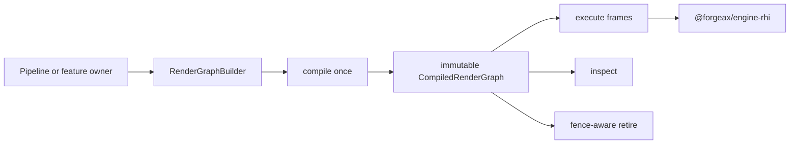
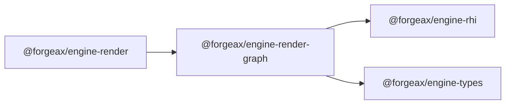

# @forgeax/engine-render-graph

> RHI-pure frame-graph kernel with typed resources, explicit accesses, graph-owned raster/compute/copy encoding, and immutable compiled graphs.

## Proposition

A graph author declares four facts once:

1. whether a resource is graph-created or imported;
2. which texture subresource or buffer a pass accesses;
3. the exact access mode;
4. the pass kind and declaration order.

The compiler derives physical usage, RAW/WAR/WAW dependencies, lifetime bounds, capability requirements, and pass-local resource visibility from those facts. It does not invent backend barriers or reorder a future writer before an earlier reader.



> [!IMPORTANT]
> Declaration order is the observable v1 execution order. An imported resource may be read first; a graph-created resource must be initialized before its first read.

## Primary API

```ts
import { RenderGraphBuilder } from '@forgeax/engine-render-graph';
import type { Buffer, RhiCommandEncoder } from '@forgeax/engine-rhi';

interface Frame {
  readonly encoder: RhiCommandEncoder;
  readonly particles: Buffer;
}

const builder = new RenderGraphBuilder<Frame>();
const particles = builder
  .importBuffer(
    'particles',
    { size: 64 * 1024, usage: GPUBufferUsage.STORAGE | GPUBufferUsage.VERTEX },
    (frame) => frame.particles,
  )
  .unwrap();

builder
  .addComputePass('simulate', {
    accesses: [{ resource: particles, usage: 'storage-read-write' }],
    encode: ({ pass }) => {
      pass.setPipeline(simulatePipeline);
      pass.setBindGroup(0, simulateBindings);
      pass.dispatchWorkgroups(256);
    },
  })
  .unwrap();

const compiled = builder
  .compile({ device, surfaceSize: { width: 1280, height: 720 } })
  .unwrap();

compiled.execute({ encoder, particles }).unwrap();
console.log(compiled.inspect());
await compiled.retire();
```

### Resource declaration

| Method | Ownership | Physical usage |
|:--|:--|:--|
| `createTexture` / `createBuffer` | Graph allocates and retires the handle | Derived from every declared access |
| `importTexture` / `importBuffer` | Caller resolves and owns the handle | Supplied usage must contain derived usage |
| `view` | Typed texture subresource | Mip, layer, aspect, dimension, and optional format are explicit |

Resource and pass labels are unique diagnostics. Handles are opaque and builder-scoped; passing a foreign handle is a structured error.

### Access vocabulary

| Buffer | Texture |
|:--|:--|
| `uniform-read` | `sampled-read` |
| `storage-read` | `storage-read` |
| `storage-write` | `storage-write` |
| `storage-read-write` | `storage-read-write` |
| `indirect-read` | `storage-read-write` |
| `vertex-read` | `color-attachment` |
| `index-read` | `depth-stencil-read` |
| `copy-src` / `copy-dst` | `depth-stencil-write` |
|  | `copy-src` / `copy-dst` |

A raster attachment with `loadOp: 'load'` is a read/write access. A clear attachment is the first write. The compiler checks overlapping texture mip/layer/aspect ranges rather than treating unrelated subresources as one hazard.

### Pass declaration

| Method | Encoder ownership |
|:--|:--|
| `addRasterPass` | Graph resolves attachments and owns `beginRenderPass` / `end` |
| `addComputePass` | Graph owns `beginComputePass` / `end`; optional `begin(frame)` supplies the descriptor and `after(frame)` runs after `end` |
| `addCopyPass` | Graph lends the frame command encoder for copy commands |

Each encode callback receives a pass-local resolver. Resolving a resource not declared in that pass is rejected.
Compute pass descriptors such as `timestampWrites` come from `begin`; the graph keeps the diagnostic
label. Compute work that targets the parent command encoder, such as resolving timestamp queries,
belongs in `after`; pass commands remain in `encode`. `onBeginError` lets the pass owner terminalize
feature-local evidence before the graph returns `pass-encode-failed`.

### Pass instrumentation

Renderer-owned instrumentation may be supplied as the third argument to
`compiled.execute(frame, runPass, instrumentation)`. The graph calls
`instrumentation.begin` immediately before each executable pass and applies the
returned descriptor decorator at the actual `beginRenderPass` or
`beginComputePass` boundary. This is the single seam for pass-level timestamp
queries and similar graph-neutral observation; it preserves pass name, kind, and
execution index without moving timing policy into the graph.

```ts
compiled.execute(frame, undefined, {
  begin: (pass) =>
    pass.kind === 'compute'
      ? {
          computePassDescriptor: (descriptor) => ({
            ...descriptor,
            timestampWrites: {
              querySet,
              beginningOfPassWriteIndex: 0,
              endOfPassWriteIndex: 1,
            },
          }),
        }
      : undefined,
});
```

The graph never calls a backend-specific command-encoder timestamp helper.
Pass instrumentation must preserve any producer-owned descriptor facts; a
policy owner that cannot merge an existing `timestampWrites` pair should fail
closed instead of overwriting it. Copy passes expose `beforeCopy`/`afterCopy`
hooks for non-timing instrumentation, but WebGPU has no portable copy-pass
timestamp descriptor.
> [!NOTE]
> `timestampWrites` and an `after(frame)` callback are neutral graph seams. They
> let a pipeline owner place a backend command at a declared pass boundary, but
> Render owns the `GpuPassTiming` session, decimal tick parser, bounded facts,
> four-status observation, and benchmark validator. RenderGraph must not import
> that timing contract, name a timing status, or decide whether a measurement is
> accepted. The public route is documented in
> [`@forgeax/engine-render`](../render/README.md).

## Compile and execution

`compile({ device, surfaceSize })`:

- seals the builder;
- validates descriptors, access conflicts, initialization, import usage, and capabilities;
- derives created-resource usage and lifetime intervals;
- allocates transactionally, rolling back all staged handles on failure;
- returns a separate immutable `CompiledRenderGraph`.

`execute(frame)` resolves imported handles for that frame and encodes passes in declaration order. `inspect()` returns a frozen projection of pass kinds, accesses, dependencies, resource origin, derived usage, and lifetime bounds.

`retire()` first waits for `device.queue.onSubmittedWorkDone()`, then destroys graph-created resources exactly once. Imported resources are never destroyed by the graph.

The older string-key `RenderGraph` descriptor surface remains limited to
feature-local staging and isolated legacy tests. Renderer frame ownership uses
`RenderGraphBuilder`; new pipeline and compute work must not add string resource
keys or call the facade's compile/execute path.

## Ordering and hazards

The compiler scans each resource/subresource in declaration order.

| Current access | Prior overlapping state | Dependency |
|:--|:--|:--|
| read | latest write | RAW |
| write | latest write | WAW |
| write | reads since latest write | WAR |

A later write never becomes the producer of an earlier read. This makes temporal multi-writer and ping-pong sequences unambiguous without a public resource-version type.

The RHI remains responsible for backend state transitions and synchronization. The graph exposes dependency evidence; it does not claim to insert a barrier that no RHI command executes.

## Capabilities

A compute pass requires `caps.compute`. Storage accesses require the matching storage-buffer or storage-texture capability, and indirect access requires indirect drawing support. Capability absence fails compilation with `capability-missing`; the pipeline or feature owner selects a fallback lane before graph construction.

v1 uses one command encoder and one primary queue. There is no `asyncCompute` option until the RHI exposes a real second queue, fences, and measured overlap evidence.

## Error model

All expected builder, compile, execute, and retire failures use `Result<T, RenderGraphError>`. Every error carries `code`, `expected`, `hint`, and code-correlated `detail`.

The closed union covers these groups:

| Phase | Codes |
|:--|:--|
| Declaration | `duplicate-pass-name`, `duplicate-resource-label`, `builder-sealed`, `foreign-resource-handle`, `alias-source-missing` |
| Access analysis | `resource-not-declared-by-pass`, `uninitialized-read`, `access-conflict`, `import-usage-mismatch` |
| Compile | `capability-missing`, `resource-descriptor-invalid`, `resource-allocation-failed` |
| Execute | `resource-resolution-failed`, `pass-encode-failed`, `compiled-graph-retired` |
| Retire | `resource-retire-failed` |

The package still contains the existing string-key `RenderGraph` facade while standard renderer raster consumers move to the typed builder. New compute paths and external callers use `RenderGraphBuilder`; no new feature should add boolean `compute` flags or record a whole compute pass outside graph ownership.

## Package boundary



The package does not import runtime, ECS, renderer policy, a concrete backend, or math. Color-domain policy and frame-observation policy belong in `@forgeax/engine-render`.

## Verification

Run from this package:

```bash
../../node_modules/.bin/vitest run
```

The suite covers declaration order, temporal multi-writer chains, imported first reads, typed subresource hazards, duplicate labels, builder sealing, capability rejection, transactional allocation rollback, pass-local resolution, graph-owned compute encoding, real RHI-null integration, and fence-aware retirement. Render-owned Dawn and Chromium tests additionally prove compute-generated indirect dispatch/draw args, storage-buffer ping-pong, storage-texture-to-raster pixels, imported persistent GPU Scene cull/compact work, and an HZB mip chain whose dependencies follow exact subresources.
