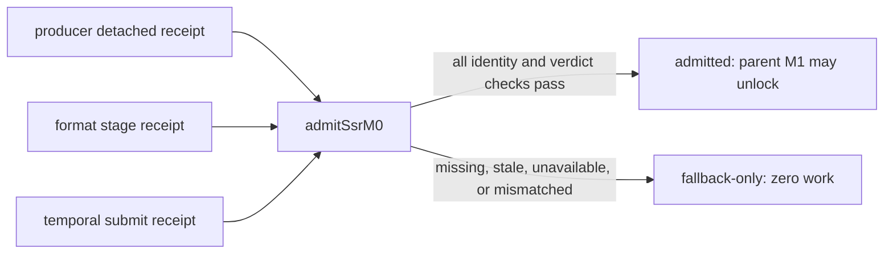
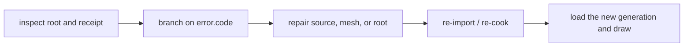
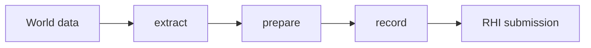
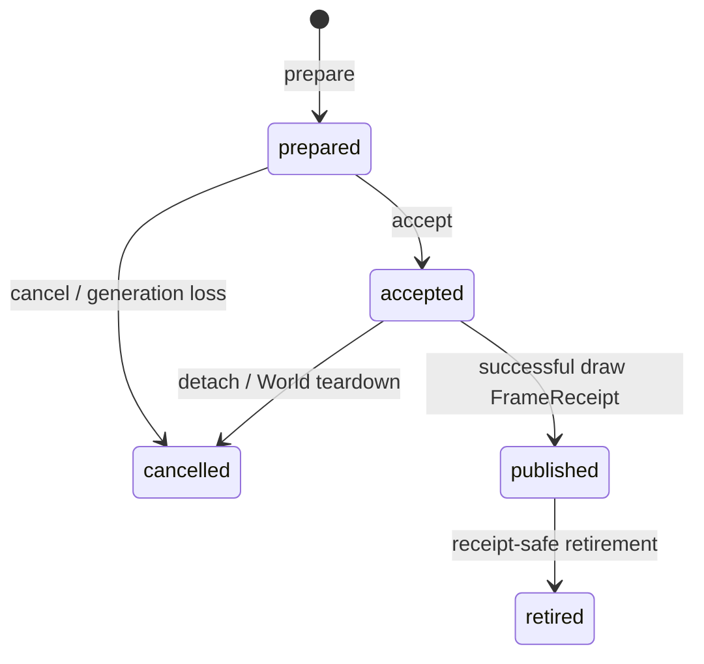

# `@forgeax/engine-render`

> [!IMPORTANT]
> The Standard pipeline keeps dark-gradient color in `rgba16float` until one
> `outputTransform` reaches the `surface.storage.raw` endpoint; `inspect()` and
> `observe()` expose stable graph/backend identity facts, while pixel metrics
> belong exclusively to the Engine-owned hello-fxaa fixture report.

## Public frame contract

## 灯光最短入口

三条最短入口：

1. `RectAreaLight`：在现有 `Transform` 上声明单面矩形发光体，尺寸由 `width` 与 `height` 持有。
2. `SpotLight`：用 `iesProfile` 和 `cookie` 绑定现有资产，用 `rollDeg` 共享方位角；缺席 handle 是乘法单位元。
3. `LightProbe`：声明 27 个 `irradiance` 值和唯一的 `radius`，位置与朝向仍来自 `Transform`。

这些是 authored/render 输入，不是 GPU slot、LTC、probe asset 或第二个 Renderer API。尺寸、半径和 `rollDeg` 在场景序列化中保留；资产 GUID 通过 Pack/Catalog 的 `refs` 往返，不能从 URL 或数组位置推断身份。

### Extended-lighting consumer route

The three smallest public examples are `RectAreaLight(width, height)`,
`SpotLight(iesProfile, cookie, rollDeg)`, and `LightProbe(irradiance, radius)`.
Probe diffuse uses `A={admitted && d<r}`, `c=1-(d/r)^2`, scaled finite `qhat`,
`alpha=q/Q`, `C=1-prod(1-c)`, and `S=1-C`; Sky is only
`S*E_sky(N)`. It never enters probe admission, `Q`, `alpha`, specular, or
`DirectLightSlot`. `recordByteLength=160` is the per-object ABI receipt.

Recovery is inspected as data: read `code`, `expected`, `hint`, and typed
`detail`; keep the current LKG until the replacement generation is accepted.
GPU, Browser, and Dawn evidence that cannot execute is `not-run` or
`unavailable`, never a verified structural substitute.

The public frame vocabulary is intentionally small. `Camera` is the authoring
owner for tone, antialiasing, bloom, and `historyVersion`; `Atmosphere` and
`Fog` are independent ECS components. The renderer extracts these facts into
an immutable `FramePlan`, records one frame, and returns a `FrameReceipt`.
`FrameReceipt` is the only successful synchronous proof that the host submit
reached the queue. Use `Renderer.inspect()` for detached lifecycle and
capability facts, then `observe(receipt, request)` for receipt-bound evidence.

### AI cold-start route

An AI consumer can start with the public sequence `state -> inspect -> recover
-> FrameReceipt`. `Renderer.state()` is the closed lifecycle union: only
`alive` admits a frame; `device-lost` permits one explicit recovery flight;
`recovering` shares that flight; `faulted` requires a new Renderer; and
`disposed` is terminal. `inspect()` is detached POD evidence for the current
state and recovery attempt. After `recover()` succeeds, submit the unchanged
draw input and use the new `FrameReceipt` as the proof for that generation.

`inspect().recovery` is always present. Its `phase` is `null` outside an active
attempt and otherwise follows `quiesce`, `acquire-adapter`, `acquire-device`,
`rehydrate`, `compile-graph`, `publish`, and `cleanup`. The projection also
reports the `fromGeneration`/`candidateGeneration` fence, monotonic `attempt`,
`lastOutcome`, committed `rehydratedRoots`, and bounded `staleLossEvents`.
These are detached facts; they never expose devices, graphs, textures, or
mutable resource collections.

During `device-lost` or `recovering`, the App keeps its host heartbeat but does
not advance the World or submit a frame. A failed `Result` is repaired from
`error.code`, `expected`, `hint`, and typed `detail`: wait for the shared
recovery flight, explicitly retry, repair the named owner, or create a new
Renderer according to the closed error. Do not parse `message`. Target and
history tokens retain logical identity, but their new-generation contents are
uninitialized until a successful receipt; a neutral target or last-known-good
fallback is not proof of real recovery. Public consumers never receive graph
nodes, devices, history textures, or prepared handles.

 The current-source manifest and schema identify `source`, `build`, `backend`,
 `runner`, and `frameIdentity`. Structural graph receipts, Browser/Dawn
 readback or PNG evidence, and historical oracle data are separate evidence
 classes. An unavailable backend is reported as unavailable.

## RenderFeature: the producer seam (first-read index)

### Material contract projection

Render consumes only the Pack-owned material publication projection. Its
inputs are runtime bool/value data, composed module slots, and the closed
compiler context; render never authors, cooks, writes DDC, or selects a
fallback material. The projection preserves `layoutIdentity`,
`programIdentity`, `cookIdentity`, and `materialPublicationIdentity` so a
stale draw can be traced to the first producer divergence.

The public route is one `RenderFeature<FrameData>` through the Standard
Pipeline and the active RenderGraph pass. In the examples below, `type FrameData`
is the producer-owned extracted value. A feature extracts one frame value,
then its mandatory `plan(data, context)` declares named resources and passes;
the host derives graph access, preparation, recording, and recovery from that
plan. Register it at construction with
`createRenderer(canvas, { features: [feature] })`. A feature never receives a
device, queue, encoder, staging builder, or submit callback.

## RenderFeature: the producer seam (first-read index)

The public route is one `RenderFeature<FrameData>` through the active RenderGraph
and `Standard Pipeline`. Here `type FrameData` is the
producer-owned extracted value; `plan(data, context)` declares named resources and passes.
Register it with
`createRenderer(canvas, { features: [feature] })`. The renderer derives graph
access, preparation, recording, and recovery; the feature never receives a
device, queue, encoder, or submit callback. Each declaration becomes a
`RenderGraph pass` inside the active frame submit boundary.

### Material contract projection

Render consumes only the Pack-owned material publication projection. Its
inputs are runtime bool/value data, composed module slots, and the closed
compiler context; render never authors, cooks, writes DDC, or selects a
fallback material. The projection preserves `layoutIdentity`,
`programIdentity`, `cookIdentity`, and `materialPublicationIdentity` so a
stale draw can be traced to the first producer divergence.

### Directional shadow quality: author → inspect → recover

`DirectionalLight` is the only authoring entry for directional shadow quality.
Set `shadowFilter` with the numeric constant for one of the five closed labels
below; it is an ECS enum field, not a label string. Do not invent a numeric
label or a compatibility alias. The default is `pcf3`. The two PCSS fields
are read only when `shadowFilter` is `pcssMedium` or `pcssHigh`:

```ts
import { DirectionalLight, DirectionalShadowFilterValue } from '@forgeax/engine-render';

world.spawn({ component: DirectionalLight, data: {
  direction: [0.2, -0.98, 0],
  shadowFilter: DirectionalShadowFilterValue.pcssHigh,
  shadowAngularRadius: 0.00465,
  maxPenumbraTexels: 32,
} });
```

| Author field | Valid values / units | Default | Effective meaning |
|:--|:--|:--|:--|
| `shadowFilter` | `pcf1`, `pcf3`, `pcf5`, `pcssMedium`, `pcssHigh` | `pcf3` | Requested directional filter profile |
| `shadowAngularRadius` | Radians, finite range `[0.0001, 0.05]` | `0.00465` | PCSS light angular radius |
| `maxPenumbraTexels` | Texels, finite integer range `[1, 64]` | `32` | PCSS penumbra ceiling |

The remaining CSM fields keep these public units and defaults: `cascadeCount`
is an integer in `[1, 4]` (default `4`), `splitLambda` is `[0, 1]` (default
`0.75`), `cascadeBlend` is `[0, 0.5]` (default `0.2`), `mapSize` is a positive
map resolution (default `2048`), `depthBias` is a depth value (default
`0.005`), `normalBias` is a world-space offset (default `0.05`), and
`shadowDistance` is a positive world-unit distance in meters (default `200`).

After `draw`, read the single `renderer.inspect().directionalShadow` projection.
It is JSON-safe and bounded: `requested` is author intent, `effective` is the
admitted profile, `status` is `accepted | fallback | rejected`, and
`fallbackReason` explains `webgl2-unsupported`, `rhi-null-structural`, or
`candidate-failed`. `lastKnownGood` identifies retained output and
`pixelEvidence` distinguishes real pixel evidence from `not-available`.
`cascadeCount`, `mapSize`, `atlasBytes`, `writerPasses`, `blockerTaps`,
`filterTapUpperBound`, `seamTapUpperBound`, `deviceGeneration`, and
`graphGeneration` are inspection facts, not additional author controls.

If author validation returns `error.code === 'shadow-invalid-config'`, do not
parse `error.message`. Read `error.expected`, `error.hint`,
`error.detail.field`, `error.detail.actual`, `error.detail.bound`, and
`error.detail.reason`; repair the named `DirectionalLight` field and retry the
same request. For a rejected candidate, retain `lastKnownGood` from inspection,
repair or rebuild the named producer, then call the existing `renderer.recover()`
boundary and retry. WebGL2 reports its explicit PCF lane; RhiNull reports
`rhi-null-structural` only, so neither is PCSS pixel evidence.
Missing or `not-run` Browser/Dawn/PNG/timing evidence remains missing or
`not-run`, never a pass. The authoritative labels and validation remain in
[`directional-light.ts`](src/components/directional-light.ts) and
[`light-helpers.ts`](src/components/light-helpers.ts); this section is an AI
index path, not a second schema.

```ts
import {
  ANTIALIAS_TAA,
  Atmosphere,
  Camera,
  Fog,
  type FramePlan,
  type Renderer,
} from '@forgeax/engine-render';

void ANTIALIAS_TAA;
void Atmosphere;
void Camera;
void Fog;
declare const renderer: Renderer;
declare const plan: FramePlan;
void renderer.inspect();
void plan;
```

Environment selection is a closed `none | image | atmosphere` fact. Multiple
environment owners or multiple fog owners return structured errors with a
code-specific `detail`; they do not create a second registry or silently pick
the first entity. Frame facts contain IDs, revisions, and POD values only, not
textures, buffers, devices, or other live GPU objects.
## GPU pass timing: opt in, draw, observe, branch on status

GPU pass timing is disabled by default. Opt in once on `createRenderer`, keep the
returned `FrameReceipt`, and request facts only for that receipt. The pass
duration is a bounded GPU fact; it is not frame latency.

```ts
import { createRenderer } from '@forgeax/engine-runtime';

const created = await createRenderer(canvas, { gpuPassTiming: {} });
if (!created.ok) throw created.error;
const renderer = created.value;
const attached = renderer.attach(world);
if (!attached.ok) throw attached.error;
const drawn = renderer.draw({
  leases: [attached.value],
  camera: { lease: attached.value },
  environment: { lease: attached.value },
});
if (!drawn.ok) throw drawn.error;

const observed = await renderer.observe(drawn.value, { include: ['timings'] });
if (!observed.ok) throw observed.error;
const timings = observed.value.timings;
if (timings === undefined) throw new Error('timings were not requested');
switch (timings.status) {
  case 'complete':
    console.log(timings.frame.passes);
    break;
  case 'partial':
    console.log(timings.reason.code, timings.frame.passes);
    break;
  case 'unavailable':
    console.log(timings.reason.code, timings.capability);
    break;
  case 'failed':
    console.log(timings.error.code, timings.latestKnownGood);
    break;
}
```

The [bounded fact contract](src/record/gpu-pass-timing/contract.ts),
[recovery errors](src/record/gpu-pass-timing/errors.ts), and
[validator](bench/gpu-pass-timing/validator.ts) are the source-linked
references for the four status branches and the fail-closed benchmark verdict.
A timing error exposes the closed `code` union plus `expected`, `hint`, and
`detail`; follow the producer-owned recovery action in the error before
observing a later receipt. `latestKnownGood` is a separate reference and never
changes the current status or completeness. Omitting `timings` from `include`
returns receipt metadata without materializing timing facts.

Run the paired real-GPU benchmark with the Dawn host:

```sh
FORGEAX_GPU_PASS_TIMING_HOST_MODULE="$PWD/packages/render/bench/gpu-pass-timing/dawn-host.ts" \
  pnpm gpu-pass-timing:bench -- --output=/tmp/forgeax-gpu-pass-timing.json
```

The command exits `0` only for a complete accepted report and exits `2` for a
blocked report. When an observation is `partial`, branch on
`timings.reason.code === 'timestamp-write-unavailable'`, retain the
unmeasured pass and its structured `detail.cause`, then observe the next
receipt after the producer-owned recovery action. Do not turn that pass into a
zero-duration sample or accept the benchmark until all paired windows are
complete.

An accepted report retains `frameFacts`: one complete on-path frame fact per paired
group, including the frame identity, raw decimal ticks, each measured pass duration,
and `measuredPassNanoseconds`. If a real run is blocked by partial observations, the
blocked JSON keeps the observed representative facts under `evidence.frameFacts` so
the measured values remain inspectable without weakening the verdict. If complete
windows fail the paired overhead gate, `evidence.windows` retains the raw samples and
`evidence.pairedOverhead` retains each group p95, group overhead, and reported median.

Measured entries expose `measurementSource`: raster and compute entries use
`pass-boundary`; copy entries use `copy-boundary-envelope`, the interval between
timing-only marker passes, and must not be read as exact copy duration.

## Fog and point-shadow observations

`Fog` is a one-per-World environment input. Extract validates its parameters
before publication; an invalid update keeps the renderer's last-known-good
fog frame and exposes the structured failure through the existing inspection
path. There is no app-local fog state.

Point shadows use one renderer-owned cube-array `ShadowAtlas`. The public
`SHADOW_ATLAS_DEFAULT_FACE_SIZE` and `SHADOW_ATLAS_DEFAULT_LAYERS` constants
are the only capacity owner; extract assigns `shadowAtlasLayer: -1` to
requests beyond that capacity while retaining them for inspection. After a
successful frame, `renderer.inspect().pointShadow` reports `requested`,
`admitted`, `shadowed`, `shadowAtlasOccupancy`, and `shadowAtlasCapacity`.
The App `pointShadowPlugin()` consumes that renderer capability and provides
structured preflight failures for missing-storage-buffer, invalid, or
over-budget requests. A World with no `PointLightShadow` remains `inactive`;
there is no pseudo-disabled shadow mode. Directional CSM remains a separate
shadow owner; PointLightShadow is not a second directional-light path.

## Render happy path

`RenderScene -> Standard Pipeline -> DeviceScope -> FrameReceipt` is the only frame
model. The host calls `createRenderer`, `attach(world)`, and `draw(request)`; diagnostics use
`inspect`, `observe(receipt, request)`, and `recover`. `FrameReceipt` is the synchronous proof that
submit completed. A failed `Result` carries `code`, `hint`, and `detail`; repair the named owner,
rebuild or cold-cook its source, then retry the same request.

```ts
const created = await createRenderer(canvas);
if (!created.ok) throw created.error;
const renderer = created.value;
const attached = renderer.attach(world);
if (!attached.ok) throw attached.error;
const frame = renderer.draw({
  leases: [attached.value],
  camera: { lease: attached.value },
  environment: { lease: attached.value },
});
if (!frame.ok) throw frame.error;
const observation = await renderer.observe(frame.value, { include: ['timings'] });
```

The Standard pipeline uses one Cluster transport for every local light on storage-capable devices
and keeps shadow, PBR, IBL, SSAO, bloom, tone, antialiasing, sky, material, VFX, and debug feature
ownership inside the same graph and submit boundary. CPU and WebGL2 remain capability lanes for the
Cluster membership producer or for mesh/instance storage fallback; they do not reintroduce a
PointLight/SpotLight buffer or a fixed four-light ABI.
## SSR M0 admission: inspect owners, then decide

> [!IMPORTANT]
> SSR M0 is a consumer-only admission boundary. It reads detached producer,
> r32float format, and temporal receipts with one four-field integration
> identity. Any missing, stale, structural-only, or mismatched receipt stays
> `fallback-only` and emits zero SSR work; this section does not describe SSR
> capture, ray tracing, Hi-Z, temporal resolve, composition, or history.



The inspection route is deliberately progressive:

| Layer | Read first | Owner action on failure |
|:--|:--|:--|
| Status | `status`, `failure.code`, `failure.expected` | branch on the closed failure code |
| Identity | `sourceHead`, `sourceTree`, `lockSha256`, `buildSha256` | rebuild the owner receipt for the current identity |
| Generation | producer `generation`, format `deviceGeneration`, temporal `generation` | discard stale completion and reinspect |
| Recovery | `failure.hint`, typed `detail.owner`, `detail.action` | use LKG/Skylight/neutral, recapture, rebuild, or retry through that owner |
| Work | attachment/pass/binding/resource/history/temporal counters | require exact zero on every blocked path |

```ts
const admission = admitSsrM0({ requested, identity, reflectionFallback, format, temporal });
if (admission.status === 'fallback-only') {
  // Read admission.failure.code and route recovery to its owner.
  console.log(admission.work); // every SSR counter is zero
}
```

Use `inspect -> owner recovery -> matching submit -> reinspect` as the complete
AI route. No returned field is a device, graph node, texture, buffer, encoder,
or other live handle. A stable generation keeps `resetCount`, `rebuildCount`,
and additional format probe work at zero; a changed generation must be
reinspected before admission can be considered again.

`inspect()` is a synchronous snapshot. The first snapshot after binding may show
an absent format or temporal receipt while the owner probe and first submit are
still in flight; it is not a `pending` verdict. Run the ordinary owner frame,
await `FrameReceipt.completed`, then inspect again before routing recovery.

There are two action projections. `admission.failure.detail.action` is the coarse
M0 gate instruction (`retry` for demand/readiness and `rebuild` for a missing or
mismatched receipt). `reflectionFallbackInspection.recoveryAction` is the
producer's more specific source/recapture instruction. Neither is a second SSR
API; use the existing owner operation shown here, then submit and inspect again:

| Action field | Owner operation | Next observation |
|:--|:--|:--|
| `reflectionFallbackInspection.recoveryAction = use-LKG` | Keep the compatible probe row and draw the next frame | Read the committed row and matching temporal receipt |
| `reflectionFallbackInspection.recoveryAction = use-Skylight` / `use-neutral` | Change the World-owned probe/`Skylight` source, then draw | Confirm selected source and committed generation |
| `reflectionFallbackInspection.recoveryAction = recapture` / `rebuild` / `retry` | Draw again so the producer/RHI owner retries pending work | Await completion and inspect the owner receipt/failure |
| `admission.failure.detail.action = retry` / `rebuild` | Retry the consumer frame, or rebuild the named owner receipt | Reinspect admission and all three receipt generations |
| device-loss recovery | `await renderer.recover()` before the next draw | Confirm the replacement `deviceGeneration`, then re-probe |

SSR never invokes these operations or mutates producer/device state; this table
maps the typed action to the existing public World and Renderer seams.

## Target and probe lifecycle index

The public target route is one Renderer owner: create a typed `RenderTarget`, create a
`RenderTargetTextureSource` for the material slot, request a readback ticket, draw once, await
`FrameReceipt.completed`, then call `observe(receipt, ...)`. `CubeCamera` contributes six real
face views to the existing frame graph; a candidate becomes active only after its completed
receipt. `ReflectionProbe` adds bounded PMREM face/mip work, local box projection, and Skylight
irradiance fallback through the same Standard material binding path.

Use `inspect()` for bounded target/probe counts, pending work, and the last structured failure.
`inspection.reflectionProbes.selection` identifies the selected probe by `worldId` and `entityKey`,
or reports `{ kind: 'skylight' }` for the explicit fallback. `recover()` is meaningful only from `device-lost`; on a healthy renderer its structured
`renderer-state-invalid` result is a guard. Device recovery invalidates old generations and
rebuilds producer-owned physical resources, so old tickets and sources must not be reused.
For the SSR dependency producer, `inspection.reflectionProbes.reflectionFallbackInspection`
is the bounded recovery projection: its `receipt` is the committed source row selected for
the current lighting selection, while `failureStage`, `failureCode`, `expected`, and
`recoveryAction` describe the latest closed failure without exposing a texture, graph, or
device handle. `reflectionFallbackReadback` is the separate completed attachment fact; it
must match the committed row's frame and device generation before it is used as evidence.
The exact public names and stable consumer IDs are machine-readable in
`src/__tests__/render-target-public-schema.json`.

## Stable inspection and dark-gradient evidence

Progressive disclosure is intentional: read Camera configuration first, then
the graph facts, backend facts, and finally the stable observation identity.
The JSON-safe `RenderInspection` projection names the output contract directly:

| Field | Meaning | Owner |
|:--|:--|:--|
| `outputTransform` | `forgeax::standard::output-transform` | Standard post chain |
| `displayEncoded` | final output is display encoded | Output Transform |
| `intermediateFormat` | linear intermediate format (`rgba16float`) | Standard target owner |
| `surfaceStorage` / `surfaceDisplay` | raw storage and display surface formats | surface adapter |
| `endpoint` | `surface.storage.raw` | backend adapter |
| `capability` / `error` | structured availability and recovery facts | RHI/render surface |
| `observation.observationId` / `frameId` | stable correlation refs | renderer observation owner |

`renderer.inspect()` and `renderer.observe()` never carry ROI pixels, scanlines,
brightness or level metrics. The hello-fxaa `hello-fxaa/dark-gradient/v1`
fixture report owns those fields and records the fixed camera, low-light scene,
800x600 resolution, 300-frame schedule, ROI, scanline, backend/lane, surface
formats, pixel hash, validation errors and mutation falsifiers.

The report gates are explicit: unique-color ratio $r_U \ge 0.75$, level ratio
$\ge 0.70$, mean absolute channel delta $\le 2/255$, parity $\ge 0.95$, and
non-black pixels with zero validation errors. The three local-only falsifiers
(`eight-bit-intermediate`, `missing-oetf`, `duplicate-oetf`) must each fail their
expected gate. Missing Browser, Dawn or WebGL2 evidence remains
`insufficient-evidence`; a screenshot, RhiNull topology result or M3 surface
contract is not a pixel proof.

## Direct-light parity contract

The direct-light proposition is: one public `DirectionalLight`/`PointLight`/
`SpotLight` semantic snapshot must produce the same analytic result in every
Standard capability lane. The authority is the revision-pinned
[`three-r184-finite-range-authority.json`](../../apps/parity/color-lighting/cases/direct-light/calibration/three-r184-finite-range-authority.json).
It is `ready` only when its Three revision, source hash, config, and expected
samples are present. Missing authority or paired GPU captures is `blocked`; do
not repair that state with a multiplier, a backend profile, or a demo asset.

Run the focused contract checks with:

```sh
pnpm exec vitest run apps/parity/color-lighting/src/analytic/__tests__/three-r184-finite-range.test.ts
pnpm exec vitest run apps/parity/color-lighting/src/integration/__tests__/light-snapshot.test.ts
```

The public mapping is deliberately small:

| Fact | Contract | Owner or evidence |
|:--|:--|:--|
| World scale | `1` world unit is `1` meter | Light components and glTF bridge |
| Exposure | `1` by default; applied after lighting at tone/output | Camera tone contract and paired capture |
| Intensity | Directional uses lux; point and spot use candela | `DirectionalLight`, `PointLight`, `SpotLight` |
| Color | Linear RGB; no hidden global multiplier | Light snapshot and buffer layout |
| Range and decay | Positive range is meters; `Infinity` means no cutoff; runtime uses `e=2` | Three r184 authority |
| Cone | KHR radians import to component degrees; snapshot stores `cosInner` and `cosOuter` | glTF bridge and extract |
| Direction | KHR local `-Z` after world rotation; extract normalizes once; downstream shaders consume the result | Extract snapshot and Standard shaders |

The runtime finite-range factor is the Three r184 squared window:
`clamp(1 - (d / c)^4, 0, 1)^2`. The KHR
[`three-r184-khr-calibration.json`](../../apps/parity/color-lighting/cases/direct-light/calibration/three-r184-khr-calibration.json)
curve is an explicit unsquared import/reference curve only; it is not a
substitute for the runtime authority. The squared and unsquared samples are
kept separate so a replacement remains a visible falsification.

For a blocked case, inspect the authority fixture first, then the normalized
light snapshot and the independent Forge/Three captures. The parity report
must retain `provenance`, `captures`, `raw hash`, `analyticMax`, `roiMax`, and
`verdict` for each backend x pipeline x case. A same-canvas self-comparison or
analytic-only green result is not direct-light parity evidence.

## Transmission and refraction route

Standard material transmission is consumed through the existing renderer path. The renderer owns one
`TransmissionBackdrop` copy and optional rough-mip chain per active view, then records transmission
before ordinary transparent work and publishes detached facts through `renderer.inspect().transmission`.
Use the returned `extent`, `format`, `mipCount`, `bytes`, capability, lifecycle, and recovery fields as
the evidence source; do not create an app-local backdrop or parse diagnostic messages.

Smooth and rough refraction share the same Standard material contract. Roughness selects the renderer
owned mip path, while edge/TIR fallback resolves to environment and then unrefracted color. The direct
and clustered lanes consume the same topology and one submit.

## Particle feature boundary

Particle rendering is provided by
[`@forgeax/engine-vfx-render`](../vfx-render/README.md). This package owns the
generic RenderFeature host, prepared graphics resolver, pipeline readiness
contract, and structured renderer errors; it does not own VFX simulation or
particle asset authoring.

## Deferred lighting evidence

Deferred lighting validation is consumer evidence, not a Render production
subsystem. The learn-render smoke exercises the Standard clustered path and
the profiler captures bounded CPU ownership evidence; the WebKit fallback
gate exercises the browser delivery path. Runtime inspection uses the public
`inspect` and `observe` projections, while any future timestamp benchmark
belongs in `packages/render/bench` and its dev-verify producer. Render does
not expose a timing controller or a second membership-specific API.

## Motion Blur temporal consumer

The Standard camera may carry the presence-enabled `MotionBlur` component. Its
validated parameters are `shutterAngle` in `[0, 360]`, `maxRadiusPixels` in
`[0, 64]`, and integer `sampleCount` in `[4, 16]`. Zero shutter is an explicit
zero-work case. The feature reads the shared `scene-data-temporal` sampled token
and contributes one raster pass after optional TAA and before Bloom. It does
not own a previous frame, write TAA history, allocate storage/compute state, or
cache an RHI handle.

`renderer.inspect()` exposes only detached Motion Blur POD facts when the
component is active: status, bounded parameters, demand, pass identity, and
the invariant `historyWrites: 0`. Invalid parameters and unavailable temporal
data are structured failures with owner-specific recovery; callers should fix
the component or capability and retry the same frame. The hello-taa carrier
contains the four-lane smoke and falsifier evidence.

> [!IMPORTANT]
> Render consumes the effective MaterialAsset snapshot produced by extract. Each texture slot carries its own coordinate set and transform into the built-in PBR binding layout; render records do not reinterpret authoring fields or manufacture shader artifacts. The effective `passes` are already validated.

## MaterialAsset render contract

`MaterialAsset` render input is an effective `passes` + `values` snapshot:
`parent` inheritance and texture `coordinates` resolve before `cook`; render
consumes validated cook output and returns structured `recovery` to its owner.

Material parameter slots are uploaded before graph execution so depth and color
passes consume the same frame's root storage. Each shadow submesh selects its
program entries, pipeline, material bind group, and slot offset together;
interleaving a canonical caster restores its canonical binding. Pending authored
pipelines do not fall back to a different caster, and an incomplete directional
shadow render is not admitted to the persistent shadow cache. Pipeline cache
identity includes authored entry selection while shader modules remain reusable.

Render owns this consumption route:

| Input | Render responsibility |
|:--|:--|
| `passes` and `values` | Consume the effective snapshot; do not reinterpret authoring data. |
| `parent` | Consume the already-resolved inheritance result. |
| texture `coordinates` | Bind the selected coordinate set and transform. |
| `cook` output | Record only validated shader artifacts. |
| `recovery` | Preserve the structured failure so the source contract or cooked module can be repaired. |

## Standard physical material authoring

`Materials.standard` is the public authoring entry point for the Standard
root. It emits one `MaterialAsset.parameters` contract; values and texture
coordinates are projections of that contract, not a second feature mask. A
base-only root keeps `forward + deferred + shadow`, while declaring any
second-stage layer or physical texture selects `forward + shadow`.

```ts
import { Materials } from '@forgeax/engine-render';

const material = Materials.standard({
  baseColor: [0.72, 0.48, 0.22, 1],
  metallic: 0,
  roughness: 0.34,
  clearcoat: 0.7,
  clearcoatRoughness: 0.18,
  anisotropyStrength: 0.35,
  anisotropyRotation: Math.PI / 2,
  sheenColor: [0.08, 0.03, 0.02],
  sheenRoughness: 0.25,
  iridescence: 0.5,
  iridescenceIor: 1.4,
  iridescenceThicknessMinimum: 120,
  iridescenceThicknessMaximum: 380,
  specular: 0.9,
  specularColor: [1, 0.92, 0.8],
  ior: 1.5,
});
```

The layer contract and texture semantics are fixed at the root:

| Layer / slot | Defaults | Texture facts | Pass / frame rule |
|:--|:--|:--|:--|
| `clearcoat`, `clearcoatRoughness` | `0`, `0` | `clearcoatTexture.R`, `clearcoatRoughnessTexture.G`, `clearcoatNormalTexture.RG` | coat normal needs `NORMAL + UV + tangent`; coat energy attenuates the base |
| `anisotropyStrength`, `anisotropyRotation` | `0`, `0` radians | `anisotropyTexture.RG` direction, `.B` strength | always needs a tangent frame; rotation changes the GGX highlight axis |
| `sheenColor`, `sheenRoughness` | `[0,0,0]`, `0` | color RGB is sRGB; roughness A is linear | Charlie lobe stays below clearcoat and uses existing IBL resources |
| `iridescence`, `iridescenceIor`, `iridescenceThickness*` | `0`, `1.3`, `100..400 nm` | strength R, thickness G; min may exceed max | bounded thin-film Fresnel modifies base reflection |
| `specular`, `specularColor`, `ior` | `1`, `[1,1,1]`, `1.5` | `specularTexture.A` and `specularColorTexture.RGB` (sRGB for color) | dielectric F0 uses valid IOR; metallic uses the base metal response |

> [!CAUTION]
> A missing or conflicting anisotropy tangent input returns the structured
> `material-tangent-required` error. Repair the mesh producer by supplying a
> finite `TANGENT : vec4` (including `.w` handedness), or by supplying
> `NORMAL`, the selected UV set, and triangle topology so the importer can
> generate and persist the frame. Do not substitute an identity or derivative
> fallback.

For a texture, pass a `MaterialTextureValue` when the slot needs a sampler or
non-default coordinates; `coordinates.set` and `coordinates.transform` stay
with that slot. glTF authors use the same fields through the importer, which
preserves the chain `parse → MaterialAsset → cook → Pack refs → load`.

The public recovery path is:



### Mesh material binding resolution

Render resolves one effective material table per logical mesh slot before
recording submesh draws. `MeshRenderer.materials[]` is a sparse per-instance
override vector: a missing entry or `0` inherits the corresponding
`MeshAsset.materialSlots[]` default. A slot without a declared mesh default
uses the neutral engine material.

> [!IMPORTANT]
> A declared mesh default is a required asset dependency. If it is unavailable,
> extract fails closed with the mesh GUID, slot index, and material GUID instead
> of silently painting the mesh gray. Invalid instance overrides fall back with
> a structured diagnostic; entries beyond the slot table are ignored and
> diagnosed.

The render path is `MaterialAsset` -> extract snapshot -> prepare resources -> record the per-slot `coordinates` and values. The effective `parent` is already resolved before extract. If a material contract or reflection binding fails, preserve the structured error and repair the source contract or cooked module before drawing again; that is the recovery route. The render package owns consumption, not material import or cook policy.

### Materials factory color inputs

The high-level `Materials.standard` and `Materials.unlit` factories normalize
authored colors at their boundary. Numeric RGB/RGBA tuples are linear-sRGB and
are copied unchanged; CSS/Hex strings and `0xRRGGBB` integers are sRGB inputs
and are decoded once. Use `Materials.srgb(tuple)` when a numeric tuple is known
to be sRGB. Generated assets carry `colorSpace: 'linear'`, so extraction does
not decode them a second time. The low-level `MaterialAsset` contract remains
authored-sRGB by default for serialized `type: 'color'` values; mark those
values `colorSpace: 'linear'` when they are already linear. Texture color space
continues to come from each texture asset and is not overridden by material
array metadata.

```ts
const linear = Materials.standard({ baseColor: [0.5, 0.5, 0.5, 1] });
const css = Materials.standard({ baseColor: '#808080' });
const explicitSrgb = Materials.unlit(Materials.srgb([0.5, 0.5, 0.5, 1]));
```

### Resident material observation

`renderer.inspect().meshMaterialBindings[]` is the detached observation of the
binding that the renderer actually consumed. Its `residency` projection records
`ready`, `pending`, `failed`, or `last-known-good`, plus the resolved sampler
handles, texture handles, mip counts, and the nearest structured preparation
failure when one exists. The observation is recomputed from the asset/runtime
owner during preparation; render does not keep a second readiness ledger,
infer state from URLs, or repair a producer failure. Aggregate counts are
derived from the observations, so an AI can inspect first, repair or recook the
producer, and retry without guessing at hidden renderer state.

### Large Instances ownership

> [!IMPORTANT]
> World owns `Instances.transforms`. Create, replace and read instance matrices
> through ECS without constructing a Renderer. A scene remains usable by another
> Renderer after the first is disposed; glTF SceneAssets retain their matrices.

| Data | Owner |
|:--|:--|
| Instance matrices and entity lifecycle | World component storage |
| Detached instance snapshot and content revision | Per-renderer projection |
| GPU allocation, binding-sized chunks and uploaded revision | Existing renderer device generation |

Small managed arrays keep the existing BufferPool size classes. Arrays larger
than the largest pooled class use dedicated allocations and are released instead
of retained in a large free bucket. The same authoring path supports 1,500,
10,000 and 20,000 instances without application chunking.

Each renderer compares complete extracted matrices against its own prior
projection. Identical input retains the projection revision; a changed input
publishes a complete new snapshot. Upload completion belongs to each GPU
resident, not to a shared authoring dirty-range or a snapshot read. Stable
residents skip upload; changed or new residents upload the complete applicable
binding chunk. A renderer that skips frames still receives every latest value.

`renderer.inspect().instanceCollections` reports derived projection identity,
count, revision and upload/residency facts. These IDs never appear in components
or SceneAssets and cannot be used to author a scene. Residency here describes
the direct/chunked instance buffers; GPU-driven primary rendering is reported
by `inspect().renderScene` and does not retain those unused buffers.

Device loss uses the existing `renderer.recover()` candidate-generation protocol.
The World stays authoritative; candidate preparation initializes replacement
instance buffers from the complete snapshot before publication. Main and shadow
passes share these residents, so the first recovered frame performs no cold
instance upload for the prepared visible workset. Instances
introduce no additional recovery API or lifecycle.

Shader preparation, layouts and uploads all consume `RhiDevice.caps.storageBuffer`.
Material boot variants include only axes declared by the material manifest.
The Dawn gate restricts the advertised capability on a real WebGPU device and
verifies uniform bindings below and above 128 instances with material pixels,
GPU validation and stable-upload receipts.

Population checks use the same World component route:

```bash
pnpm exec vitest run --config vitest.browser.config.ts --project=browser apps/parity/instancing-static/src/__tests__/instances.browser.test.ts
INSTANCE_COUNT=20000 SMOKE_MIN_FRAMES=600 SMOKE_DURATION_MS=0 pnpm --filter @forgeax/parity-instancing-static smoke
```

### Instances CPU bounds contract

`Instances` remains author data containing only packed local transforms. The
renderer derives a CPU union bound from each mesh AABB, entity world matrix,
and every instance matrix. The union cache is scoped by World/entity and
invalidated by mesh, entity-transform, instance-array, slot removal, and
generation changes. Missing, malformed, or empty instance data is a
conservative no-cull result; it never creates a synthetic identity instance.
The GPU path keeps the mesh-local AABB and performs per-instance visibility,
while the CPU path uses the derived union only to avoid dropping an entity
whose origin is outside the view. Do not add `bounds` to the public
`Instances` component or duplicate this renderer fact in Pack/asset state.

## Points and Lines authoring (M1)

Points and Lines are first-class render components. Their geometry remains a
normal `MeshAsset`, and their material remains the engine-owned
`Materials.unlit` asset. The M1 path validates the complete candidate before
any render publication; it does not add a second mesh, material, CLI, RPC, or
manifest authority.

```ts
import { Lines, Materials, PointShapeValue, Points, admitPointsLines } from '@forgeax/engine-render';
import { World } from '@forgeax/engine-ecs';
import type { MeshAsset } from '@forgeax/engine-types';

const positions = new Float32Array([0, 0, 0, 1, 0, 0, 2, 0, 0]);
const pointMesh = {
  kind: 'mesh',
  vertices: positions,
  attributes: { position: positions },
  submeshes: [{
    indexOffset: 0,
    indexCount: 0,
    vertexCount: 3,
    topology: 'point-list',
    materialSlot: 0,
  }],
  materialSlots: [{ slotName: 'default' }],
} satisfies MeshAsset;
const material = Materials.unlit([1, 0.5, 0.25, 1], { castShadow: false });
const world = new World();
const entity = world.spawn({
  component: Points,
  data: { sizePx: 4, shape: PointShapeValue.circle },
}).unwrap();
const admitted = admitPointsLines({
  entity,
  points: { sizePx: 4, shape: PointShapeValue.circle },
  mesh: pointMesh,
  material,
});
if (!admitted.ok) throw new Error(admitted.error.hint);

world.spawn({ component: Lines, data: { widthPx: 2 } }).unwrap();
```

The style vocabulary is deliberately small in M1:

| Component | Field | Default | Accepted values |
|:--|:--|--:|:--|
| `Points` | `sizePx` | `4` | finite number greater than `0` |
| `Points` | `shape` | `square` | `square` or `circle` |
| `Lines` | `widthPx` | `1` | finite number greater than `0` |

Admission consumes one style component, one ordinary mesh topology, and one
unlit forward material. Indexed and non-indexed `point-list` meshes are valid
for `Points`; indexed and non-indexed paired `line-list` meshes are valid for
`Lines`.

| Candidate | M1 result | Reason |
|:--|:--:|:--|
| `Points` + `point-list` + finite positive `sizePx` + unlit forward material | supported | `square` and `circle` are the only point shapes |
| `Lines` + paired `line-list` + finite positive `widthPx` + unlit forward material | supported | each pair is one line segment |
| `line-strip`, triangle topology, mixed submeshes, or an odd line-list tail | refused | topology cannot be inferred or admitted atomically |
| both `Points` and `Lines` on one candidate | refused | one entity has one style lane |
| `Materials.standard`, shadow-caster, deferred, or another shader module | refused for this Points/Lines lane | M1 admits only one engine-owned unlit forward pass here |
| candidate count over `maxPoints` or `maxSegments` | refused | bounded admission prevents partial publication |

When admission refuses a candidate, consume the structured result rather than
parsing its message. The result exposes `.code`, `.expected`, `.hint`, and a
code-specific `.detail` containing the relevant entity, component, mesh,
material, submesh, lane, generation, or stage facts:

```ts
const result = admitPointsLines({ entity, points: {}, mesh: pointMesh, material });
if (!result.ok) {
  console.error(result.error.code);
  console.error(result.error.expected);
  console.error(result.error.hint);
  console.error(result.error.detail);
}
```

## Standard lighting contract

`forgeax::standard` is the only built-in lighting identity. Every finite point
and spot light enters the shared Cluster membership path; `DirectionalLight`
remains global and does not consume local-light membership. `renderPath` only
selects Forward or Deferred graph topology. The derivation chain is
`LightFrame -> PreparedStandardLighting -> StandardClusterTransportPlan`, with
`packages/render/src/pipeline/standard-lighting/layout.ts` as the storage-size
and light-index budget SSOT.

Transport capability is explicit: compute/storage or CPU/storage. Cluster has
no uniform-backed downlevel ABI; when `storageBuffer` is absent, admission
returns the structured `standard-cluster-transport-unavailable` result with
`requested` and `admitted`. Never invent a four-light fallback. Read
`expected`, `hint`, and `detail` before repairing the device capability or the
producer input. Both lanes consume the same complete CPU canonical corpus;
the compute lane materializes the GPU index list, while the CPU lane uploads
that list. A Dawn readback that compares the GPU list with the canonical
corpus is the proof of GPU membership; until that readback runs, evidence is
`not-proven`, never a synthetic completion state.

M1 intentionally refuses strip expansion, joins, caps, dashes, picking, and
visible point/line draw preparation. Those are later implementation lanes, not
implicit fallbacks in authoring code.

## Standard Surface authoring

`Materials.standard` is the import-first material entry for lit content. A
default call uses the built-in Surface; a custom call names one imported WGSL
Surface and provides only its root parameter contract:

```ts
import { Materials } from '@forgeax/engine-render';

const material = Materials.standard({
  surfaceModule: 'game_3d::rusted_iron_surface',
  parameters: [
    { name: 'ironColor', type: 'color' },
    { name: 'rustDark', type: 'color' },
    { name: 'rustBright', type: 'color' },
    { name: 'noiseScale', type: 'f32', default: 1.85 },
  ],
  values: {
    ironColor: [0.4, 0.45, 0.47, 1],
    rustDark: [0.42, 0.085, 0.018, 1],
    rustBright: [0.95, 0.34, 0.055, 1],
    noiseScale: 1.85,
  },
});
```

The helper publishes the complete Standard base declarations together with
the custom parameters on the returned root MaterialAsset. Compiler and loader
project that published contract without adding fields based on a Pass module.
Physical layer declarations remain sparse. A custom full-shader material does
not acquire Standard semantics by adding a shadow Pass or a `surface` slot.

The custom WGSL implements only `evaluate_surface`; it does not declare
stages, bindings, lighting, or output code. The Engine composes the result
with its Standard shader and derives the pass family: opaque base-only
materials receive Forward, Deferred, and ShadowCaster; a physical second
layer or transmission receives Forward and ShadowCaster; blending follows the
same forward-only policy. This section is about the Standard lane, not the
separate Points/Lines admission rule above. See the
[`shader Surface contract`](../shader/README.md#standard-surface-contract) and
the [`game-3d` import example](../../templates/game-3d/README.md#import-first-surface-material-example)
for the source and Pack route.

The compiler and renderer share one pure `StandardLayerPlan`:
`deriveStandardLayerPlan(effectiveParameters)`. It is the only derivation used
for the composed source closure, pass projection, and program identity, so a
consumer never re-infers physical layers from `SurfaceData`.

| Root contract | `StandardLayerPlan` result | Render projection |
|:--|:--|:--|
| base-only Standard | no second physical layer | Deferred plus Forward and ShadowCaster |
| Standard with a physical layer | physical layer present | Forward plus ShadowCaster |
| full-custom escape hatch | no Standard plan | authored custom pass contract |

## Points and Lines runtime contract

The complete public closure is `MeshAsset` topology, one `Points` or `Lines`
component, `Materials.unlit`, and the Standard renderer. The owner retains the
source view, derives expanded geometry during prepare, and records the dedicated
points-lines pipeline in the active main geometry pass. Applications do not
create a second mesh, GPU buffer, shader module, cache, recovery ledger, or
backend branch.

| Surface | Supported contract | Refused or not claimed |
|:--|:--|:--|
| topology | indexed or non-indexed `point-list` and paired `line-list` | strips, triangles, mixed topology, and odd line tails |
| style | finite positive `Points.sizePx` and `Lines.widthPx`; circle or square points | negative, non-finite, or lane-conflicting values |
| material | engine-owned `Materials.unlit` forward material | standard/PBR, deferred, shadow-only, or custom runtime shader |
| capability lane | direct WebGPU runtime; clustered unlit preserves the same authoring contract | CPU and WebGL2 require their declared capability route; no pixel result is inferred from RhiNull |
| structural lane | RhiNull records retained projection, preparation, bindings, and draw shape | RhiNull is never hardware or pixel evidence |

Prepare and record remain one lifecycle. A failed result is an owner fact, not a
request to fall back to a generic mesh draw. Inspect the structured error and
repair the source or producer, then retry the same renderer:

```ts
const inspection = renderer.inspect();
const pointsLines = inspection.renderScene.pointsLines;
// Repair the named source or producer, then retry inspection and draw.
report(pointsLines);
```

Inspection reports source bytes, derived bytes, vertex/index counts, cache
state, upload state, draw count, lane, and the retained `lastKnownGood` state.
Recovery is `inspect -> producer rebuild or cold-cook -> prepare -> record`.
It never publishes a partial expansion and never hides a stale-generation or
missing-resource error.

For visual evidence, use the topology probe and retain its raw screenshot,
readback, source/derived byte counts, draw count, and validation errors. A
focused direct-WebGPU probe is evidence for that lane only. The repository-wide
`pnpm test:browser` gate was explicitly skipped by human override in this
milestone and must not be reported as passed; the controlled Dawn attempt
timed out during environment build before Dawn Vitest ran.

The M5 boundary does not include strip joins, caps, dashes, picking, a new CLI
or RPC operation, application-local WGSL, a second Geometry factory, or a
separate cache/recovery authority.

> [!IMPORTANT]
> Owner: render vocabulary and the extract → prepare → record frame boundary. Runtime selects concrete services and calls this package; it does not re-own these tokens.

```ts
import { Camera, MeshFilter, MeshRenderer } from '@forgeax/engine-render';
import { createRenderer } from '@forgeax/engine-runtime';

const renderer = await createRenderer(canvas);
const attached = renderer.attach(world);
if (attached.ok) {
  world.update(1 / 60).unwrap();
  renderer.draw({
    leases: [attached.value],
    camera: { lease: attached.value },
    environment: { lease: attached.value },
  });
}
```

`attach` installs renderer-required derived-state systems once. Hosts built
with `createApp` get this wiring automatically. A custom loop attaches each
World before its first update, then keeps `draw` as a read-only consumer of the
state published by `World.update()`.

## Persistent render scene

The ordinary single-World path bootstraps one renderer-owned CPU projection,
then drains the World's bounded change journal. A no-change frame reuses the
last visible snapshot without traversing renderable archetypes; transform
changes update only their stable projection slots. Unrelated gameplay
component writes do not invalidate render state.

Mutable shared payloads use the same explicit-dirty rule: mutate the resolved
payload, then call `world.sharedRefs.markChanged(handle)`. The renderer compares
one monotonic shared-ref epoch on the no-change path, drains the bounded exact
mutation journal when it advances, and refreshes only projection slots indexed
by the changed material handle. Journal overflow and topology-changing material
edits remain explicit full-reconcile reasons rather than silent partial state.

When `RhiCaps.storageBuffer` is available, the same projection owns persistent
Primitive, Instance, Transform, DrawTemplate, and Material GPU tables. The
tables use independent stable ranges: one primitive can reference ordinary
instance-local transforms, multiple draw items, and multiple prepared material
records. The schema in `src/gpu-scene-schema.ts` derives byte offsets, signed
and unsigned scalar forms, strides, and WGSL declarations; dirty ranges become
coalesced `queue.writeBuffer` writes and no-change frames upload zero scene
bytes. Device recovery discards only device-owned tables and rebuilds them from
the retained CPU projection.

The typed render-graph evidence path imports those persistent tables without
transferring ownership, runs compute cull → compact → indirect args, and consumes
the result through a graph-owned raster pass. Companion Dawn and Chromium gates
also cover storage-buffer ping-pong, compute-generated indirect dispatch and draw
arguments, storage-texture sampling in raster, and per-mip HZB reduction. These
are real driver/pixel proofs for the GPU-driven boundary; they do not make
RhiNull a pixel backend or make the CPU projection cease to be the scene
authority.

Inspect the current path through `renderer.inspect()`. Its detached CPU snapshot exposes
full rebuilds, no-change and delta frames, transform/material/instance updates,
removals, the consumer-owned read version, projection cardinality, and the last resync
reason. The nested `gpu` status is one of `inactive`, `unsupported`, `resident`,
`rebuild-pending`, or `error`; resident state additionally reports capacity,
upload ranges and bytes, grows, clears, rebuilds, and no-change frames. The
`gpuDriven` inspection reports whether stable frames materialized or validated
GPU-owned rows and whether candidate or batch topology bytes were uploaded.
GPU and renderer contract errors arrive through the single `renderer.subscribe`
event stream (`event.kind === 'error'`); the renderer does not expose a second
error listener registry.

## GPU-driven view kernel

`BatchTopology` groups eligible rigid draw items by immutable geometry,
material, render-state, and command compatibility. One primitive can contribute
multiple submesh draw items, and each draw item uses a closed indexed or
non-indexed five-word indirect command. A per-view typed graph records
`reset -> frustum/compact -> finalize` over persistent candidate and batch
buffers. The compute path validates generation and active flags, composes the
primitive world transform with each ordinary instance-local transform, writes a
compact `(instanceIndex, materialIndex)` stream, sets explicit overflow flags,
and emits indirect arguments with `firstInstance = 0`.

The Standard frame activates the production raster lane when compute, storage
buffers, and indirect drawing are available. The current lane accepts opaque,
rigid default-unlit triangle-list passes with batch-stable render state,
ordinary instances, indexed or non-indexed geometry, multiple submeshes and
material slots, and the canonical `12F` vertex layout. It also accepts persistent rigid multi-World
composition. Candidates come from the complete persistent projection rather
than the CPU-visible snapshot. The same typed graph imports the scene and mesh
buffers, runs the three compute passes, and consumes generated arguments with
`drawIndexedIndirect` or `drawIndirect`. Entities accepted by that lane are not
also validated, uploaded, or recorded by the CPU forward loop on a stable
frame.

clustered, PBR and custom shader variants, texture/sampler/video resource bindings,
transparent meshes, skinning, morphing, non-canonical layouts, and shadow views
keep explicit CPU or specialized lanes. WebGL2 selects capability fallback from
the same persistent projection; it does not emulate compute. Visibility and
hierarchy changes, non-rigid multi-World composition, and some prepared-resource
changes still require bounded reconcile work. The implemented lane proves a
zero-upload stable data path and broad rigid geometry coverage, but hardware
100k timing, schema-derived material variants, stable world identities, and
GPU-driven shadows remain required before declaring P3 complete.

The bounded inspection reports topology revision, candidates, batches, visible
capacity, buffer capacities, update count, upload bytes, rebuild count, and CPU
fallback rows. RhiNull verifies graph dependency order and stable-frame zero
work; Dawn and Chromium verification consume indexed, non-indexed,
multi-submesh, and instanced arguments, read persistent scene tables in the
vertex path, and compare the resulting pixel. The renderer-level RhiNull
integration also proves that the built-in Standard graph contains the compute chain
before `main`, including rigid multi-World composition, without GPU plus CPU
duplicate draws. The renderer retains one graph, one compile owner, one
encoder, and one submit route.

> [!NOTE]
> Non-rigid multi-World composition, skinned lanes, visibility/hierarchy
> changes, and unsupported render-relevant structural changes currently take
> an explicit reconcile path. The projection and GPU tables already define
> stable slot, generation, create, update, remove, grow, clear, and rebuild
> semantics; later coverage can make those changes entity-local without adding
> another scene authority.

Features are supplied through the construction options (`features: [...]`) and
enter the same host-owned extract → plan → graph projection path. The public
`Renderer` intentionally has no install/uninstall methods: optional capability
lifetime belongs to the App host, while recovery re-runs the plan against the
replacement device generation.

| This package owns | Excluded concepts |
|:--|:--|
| Camera/light/mesh vocabulary, `Renderer`, render errors, documented pipeline operations | Backend selection, asset import, ECS scheduling, animation playback, optional text/tile/sprite authoring |

The stable surface is [`src/index.ts`](src/index.ts). `RenderError` is closed and carries actionable detail. Runtime alone owns host assembly and its `EngineEnvironmentError` rejection contract; render's construction seam is internal to that dependency path.

## Tone mapping output contract

The public mode names are the same names used by the Three r184 oracle:

| Mode | Public constant | Output behavior |
|:--|:--|:--|
| `linear` | `TONEMAP_LINEAR` | Exposure, then clamp to LDR |
| `reinhard` | `TONEMAP_REINHARD` | Per-channel Reinhard |
| `cineon` | `TONEMAP_CINEON` | Cineon filmic curve |
| `aces-filmic` | `TONEMAP_ACES_FILMIC` | ACES filmic curve |
| `agx` | `TONEMAP_AGX` | AgX curve |
| `neutral` | `TONEMAP_NEUTRAL` | Khronos neutral curve |

`TONEMAP_REINHARD_EXTENDED` is the existing ForgeaX luminance-domain curve. Its
separate `reinhard-extended` name is intentional: it is not a second formula
hidden behind the Three `reinhard` name.

Tone-enabled cameras use one output contract:

```text
linearHdr -- exposure + named tone curve --> linearLdr --> displayEncoded
```

The final capture is the encoded surface result. A linear capture, when a
parity adapter exposes one, remains a separate `linearHdr` or `linearLdr`
sample and must not be compared as if it were the final display capture. The
contract is available as `resolveToneOutputContract(camera.tonemap)` from the
render package. The camera remains the runtime entry point:

```ts
import { Camera, TONEMAP_AGX, perspective } from '@forgeax/engine-render';

world.spawn({
  component: Camera,
  data: {
    ...perspective({ fov: Math.PI / 4, aspect: 1 }),
    tonemap: TONEMAP_AGX,
    exposure: 1,
  },
}).unwrap();
```

The built-in Output Transform samples the linear scene target and writes the
display-encoded result before FXAA, post effects, and present. Shader source authority is
[`packages/shader/src/tonemap.wgsl`](../shader/src/tonemap.wgsl); the render
package does not duplicate those formulas.

## Optional CPU profiling

Render accepts the host-owned `Profiler` capability through App assembly. It writes bounded CPU
phase evidence only while a capture is active; it does not add GPU timestamps, ECS spans, a UI, or
a remote method. The artifact and its owner-declared catalog are documented by
[`@forgeax/engine-profiler`](../profiler/README.md).

```ts
import { createProfiler, type Profiler } from '@forgeax/engine-profiler';
import { createRenderer } from '@forgeax/engine-runtime';

const profiler: Profiler = createProfiler();
const renderer = await createRenderer(canvas, { profiler });
```

Use the package's `validateProfileCapture` and `buildProfileModel` entries for offline analysis.
The render package remains the owner of render vocabulary and extract/plan/record execution.

## RenderFeature: the producer seam

Register one producer-owned feature at the renderer assembly boundary. The
same `FrameData` type flows through `extract` and the mandatory `plan`; the
host derives preparation, graph access, recording, and lifecycle isolation
from that one plan. Both paths execute inside the active RenderGraph and the
frame's single execute/submit boundary.

The smallest feature returns a closed plan with named resources and passes.
Graph access is derived from those declarations; there is no staging object or
second contribution API:

```ts
plan: (frame, context) => ok({
  resources: [
    { kind: 'compute-program', name: 'compact.program', program },
    { kind: 'compute-bindings', name: 'compact.bindings', program: 'compact.program', entries },
  ],
  passes: [{
    kind: 'compute', name: 'compact', program: 'compact.program',
    bindings: 'compact.bindings', dispatches,
  }],
})
```

The plan contains cooked program descriptors, named buffers and bindings, logical
targets, and draw/dispatch commands. Graph buffer and texture access is derived
from those roles; producers never author a second `reads`/`writes` ledger and
never receive an encoder or submit authority.

### Five render terms

| Term | Meaning | Owner |
|:--|:--|:--|
| `RenderFeature` | Producer-owned extract/plan callbacks and frame data | Feature producer |
| `Standard Pipeline` | The single frame policy containing the supported capability/profile lanes | Render host |
| RenderGraph pass | One declared graph execution node in the active Standard Pipeline | Graph host |
| Material pass | One shader-facing pass in a `MaterialAsset` | Material asset |
| RenderFeaturePlan | One executable declaration of resources, bindings, targets, and commands | Feature producer |

### Prepared compute resources

`RenderFeature` producers declare cooked compute pipelines, reflected name-based bindings,
uniform/storage buffers, and dispatches. The renderer prepares those declarations,
imports the persistent buffers into the render graph, and derives `uniform-read`,
`storage-read`, or `storage-read-write` access. Producers do not repeat a string `reads/writes`
ledger and do not receive an encoder.

Compute and graphics passes use the same plan projection and submission boundary. The graph
owns `beginComputePass` / `end`; the plan records only named pipeline, bind group, and dispatch
commands. Persistent buffers retain device identity across frames,
rebuild with the feature-host generation, and retire only after queue completion. A storage buffer
may also be consumed as renderer-declared vertex data.

Feature contexts never expose raw GPU graphics state, a complete pipeline
context, submit authority, or a command encoder. They expose immutable
capabilities and logical targets for plan construction. The active RenderGraph
owns the frame boundary; do not cast a plan context to a backend object or
encoder. The executable contract examples live in the plan-focused tests under
`src/record/__tests__` and `src/features`.

### Failure and recovery

`RenderError` is a closed union. Switch on `error.code`, then read
`error.expected`, `error.hint`, and the code-specific `error.detail`.

Feature capability checks are based on `Readonly<RhiCaps>`, and recovery actions
consume the structured `error.detail` context.

| Diagnostic state or code | Recovery action |
|:--|:--|
| `active` | Continue the next frame |
| `failed` / `render-feature-stage-failed` | Correct producer data and retry on the next frame |
| `disabled` / `render-feature-capability-missing` | Provide the capability on a replacement device; after device-loss recovery call `await renderer.recover()`. On a live renderer, the public recovery boundary returns a structured renderer-state-invalid result, so rebuild on a capable device instead. |
| `render-feature-registration-conflict` | Fix identity/order at registration |
| `render-feature-pass-order-conflict` | Reorder the declared dependency and re-plan on the next frame |
| `render-feature-preparation-failed` | Repair the named prepared resource and retry on the action in `error.detail.recovery`; after device loss, verify that the feature's declared shader was included in the recovery prewarm set |
| `render-feature-prepared-state-mismatch` | Read the discriminated `error.detail.reason`, repair the generation/layout/format mismatch, and retry |
| `render-feature-draw-recording-failed` | Read `error.detail.backendReason`, then retry after the host reports renderer recovery |
| `disposed` | Terminal; create a new renderer/feature registration |

Use `renderer.inspect()` for a read-only snapshot. Call `renderer.dispose()`
once or repeatedly; disposal is idempotent. Feature plans are assembled once
and the Standard host owns graph replacement and last-known-good recovery.

For a temporary presentation-owner handoff, call `renderer.releaseSurface()`.
It unconfigures the canvas and makes `draw()` fail closed without disposing the
Renderer, AssetRegistry, or GPU declarations. After the temporary owner is
gone, `renderer.restoreSurface()` re-enables lazy surface configuration on the
next draw. Both calls are idempotent; `dispose()` remains the terminal path.

For the complete declaration shape, read
[`features/types.ts`](src/features/types.ts) and
[`features/plan.ts`](src/features/plan.ts). For Standard profile and lane
selection, read the internal pipeline implementation through the host seam;
there is no public full-pipeline registration API. The producer
asset contract is [`@forgeax/engine-vfx`](../vfx/README.md), while graph
ownership is [`@forgeax/engine-render-graph`](../render-graph/README.md).

> [!WARNING]
> Wave 2 delivered this generic prepared public seam. A downstream Wave 3 VFX
> integration owns visible particle draws; render must not gain a
> particle-kind switch or VFX production dependency. See the
> [VFX Wave 3 handoff](https://github.com/ForgeaXGame/forgeax-engine-harness/blob/main/docs/vfx-particle-runtime-design.md).

Dynamic consumers use the same boundary explicitly:

```ts
const { Camera, MeshFilter, MeshRenderer } = await import('@forgeax/engine-render');
```

`@forgeax/engine-runtime` remains the host assembly entry for `createRenderer` and backend policy. Import `Materials` from this package. Runtime is not a compatibility barrel for render components.

Optional text, tilemap, and sprite authoring is intentionally isolated from the
base vocabulary:

```ts
import {
  GlyphText,
  SpriteAnimation,
  Tilemap,
  TransparentSort,
} from '@forgeax/engine-render/authoring';
```

`authoring` also owns the grouped transparent-bucket configuration values. A
consumer that composes sprites with an existing 3D game can call
`TransparentSort.configure(world, { mode: TransparentSort.layerY, yzAlpha: 1 })`;
it should not reach into `/internal`.

The root barrel does not expose frame stores or extract/plan/record owners.
Applications contribute work through `RenderFeature` plans; the Standard
renderer owns graph compilation and submission.

The render package has one narrow construction seam owned by the host. It is
not an application API or a compatibility route. Standard profile and
capability lanes own MSAA target selection and resolve; applications do not
replace the frame topology.



## Visibility contract

Quick start:

```ts
import { Visibility, VisibilityStateValue, resolveVisibility } from '@forgeax/engine-render';

world.spawn({
  component: Visibility,
  data: { state: VisibilityStateValue.hidden },
}).unwrap();
const snapshot = resolveVisibility(world);
```

| Stage | Truth | Diagnostic |
|:--|:--|:--|
| Author intent | `Visibility.state` is `inherited`, `hidden`, or `visible` | Read the ECS field or reflected `labels` |
| Effective state | `resolveVisibility(world).effective(entity)` applies valid scene parents | Inspect `snapshot.diagnostics` and `VisibilityResolution.source` |
| Render result | Render producers skip hidden candidates before material work | Read `renderer.inspect().visibilityStats`; it is not a frustum or picking metric |

If the state write returns an error, preserve `code`, `expected`, `hint`, and
`detail`, correct the enum value, and retry through `world.set`. If hierarchy
diagnostics are present, repair the scene relation and resolve again. Do not
hide the issue with a custom mesh, camera workaround, or material substitute.

Out of scope: camera frustum policy, picking, app lifecycle, asset import, and
VFX shadow behavior. `@forgeax/engine-vfx-render` remains the producer-owned
particle bridge and consumes the same effective visibility boundary.

## Semantic scene data

Temporal consumers request the producer-owned `forgeax::scene-data::temporal-v1`
schema through `createSceneDataCatalog`. The catalog returns an opaque,
sampled-read-only `SceneDataTarget`; consumers place that token in
`RenderFeaturePlan` `sampledTargets` and never author an attachment, raw GPU
handle, private velocity buffer, or parallel graph ledger.

```ts
const catalog = createSceneDataCatalog({
  featureIdentity: 'taa',
  generation: 1,
  planIdentity: 'taa:1',
  rgba16floatRenderable: true,
});
const temporal = catalog.require('forgeax::scene-data::temporal-v1');
```

`catalog.inspect()` is the bounded inspection surface. If the schema is not
available, `SceneDataUnavailableError` exposes the closed `reason`, missing
producer IDs (at most 32 plus an omission count), and explicit `recovery`.
Repair capability or producer coverage at its owner, then retry the next frame.

## AI-readable SSR fallback route

For the reflection fallback dependency evidence, call `renderer.inspect()` first
and run the paired fixture. The fixture writes the current Browser/Dawn manifests;
the collector then seals a fresh joint M0 guard for the current checkout:

```bash
pnpm --filter @forgeax/app-learn-render-6-pbr-4-render-target-reflection smoke:ssr-fallback
pnpm --filter @forgeax/app-learn-render-6-pbr-4-render-target-reflection smoke:browser
node scripts/forgeax/collect-ssr-dependency-report.mjs \
  --input artifacts/ssr-fallback/dawn/ssr-dependencies-input.json \
  --build-summary packages/render/dist/index.mjs \
  --output artifacts/ssr-fallback/ssr-dependency-report.json
```

Each smoke writes its own detached `ssr-dependencies-input.json` beside the lane
manifest; the command above uses the just-completed Dawn input (use the Browser
path when inspecting that lane separately). The collector signs the output with
the current source/tree/lock/build identity; it never promotes a stale
sibling-loop report or an authored manifest. Read identity, generation, evidence
level, and closed failure fields before following the named owner recovery action.
Submit the same consumer request and reinspect after recovery. The route returns
detached facts only: no live GPU handle, second owner, or second ledger is exposed.
Missing or mismatched receipts remain
`fallback-only` with zero SSR work; SSR v1, Hi-Z, ray marching, temporal resolve,
compose, and history are out of scope.
## Standard dynamic MeshAsset candidates

The Renderer owns one bounded candidate lifecycle for geometry produced by an
external consumer. The payload is the existing `MeshAsset` contract, not a
voxel-specific asset kind. The consumer remains the World shared-reference
owner and publishes `MeshFilter` / `MeshRenderer` through the ordinary ECS
write barrier; the Renderer owns GPU residency, device generation, frame
receipt, and delayed retirement.

```ts
import type { MeshAsset } from '@forgeax/engine-types';
import { FixedTime, type World } from '@forgeax/engine-ecs';
import { Transform } from '@forgeax/engine-scene';
import { MeshFilter, MeshRenderer } from '@forgeax/engine-render';
import type { FrameCamera, FrameEnvironment, Renderer } from '@forgeax/engine-render';

declare const renderer: Renderer;
declare const world: World;
declare const mesh: MeshAsset;
declare const camera: FrameCamera;
declare const environment: FrameEnvironment;

// Attach first: the Renderer owns the lease/generation boundary, while the
// World remains the MeshAsset handle and ECS scene owner.
const attached = renderer.attach(world);
if (!attached.ok) throw attached.error;
const meshHandle = world.allocSharedRef('MeshAsset', mesh);
const entity = world
  .spawn(
    { component: Transform, data: {} },
    { component: MeshFilter, data: { assetHandle: meshHandle } },
    { component: MeshRenderer, data: { materials: [] } },
  )
  .unwrap();
const fixedStep = world.getResource(FixedTime).tick;
const prepared = renderer.prepareDynamicGeometry({
  world,
  entity,
  mesh,
  meshHandle,
  // Must match a live material handle/source slot; this mesh uses its default.
  materialIdentity: 'default',
  revision: 4,
  topologyRevision: 2,
  // For paired physics use the admission example below, not this draw-only path.
});
if (!prepared.ok) {
  // Branch on prepared.error.code; the previous visible mesh is retained.
} else {
  // ECS FixedTime is the ordering proof for this render-only revision.
  const accepted = renderer.acceptDynamicGeometry(prepared.value, {
    world,
    fixedStep,
  });
  if (accepted.ok) {
    const frame = renderer.draw({
      leases: [attached.value],
      camera,
      environment,
      fixedStep,
    });
    if (frame.ok) {
      const geometryReceipt = renderer.dynamicGeometryReceipt(accepted.value);
      // geometryReceipt.frame.frameId === frame.value.frameId for this
      // generation; geometryReceipt.frame.completed fences GPU retirement.
      void geometryReceipt;
    }
  }
}
```

The entity must already carry `Transform`, a live `MeshFilter`, and a
`MeshRenderer` when the candidate is prepared and accepted; these are the same
ECS prerequisites used by the render extraction query. Preparation records the
old `MeshFilter.assetHandle` and stages the new standard handle without changing
the visible ECS binding. Acceptance is the one ECS write-barrier that swaps in
the candidate. If acceptance or GPU preparation fails, the old binding remains;
cancelling an accepted candidate swaps that old handle back, and refuses to
overwrite a newer external binding. The Renderer host reads
`World.FixedTime.tick` itself; a caller-supplied `{ world, fixedStep }` object
cannot bind an unrelated World or step. Preparation may precede acceptance by
multiple fixed steps; acceptance records the actual current tick. If
`physicsEntity` is supplied, acceptance requires that entity's active paired
`PhysicsWorld` admission to match the revision and current step. An already
published physics result is deliberately insufficient: it cannot roll back if
geometry now fails. A
candidate that is not present in the ECS render snapshot at the successful draw
is left accepted without a receipt; the receipt is issued only after the
submitted record stage consumed the live binding.

### Paired physics admission

Prepare both domain candidates invisibly, with matching revision and the geometry
candidate's `physicsEntity` naming the physical parent. Queue the physical candidate
with one synchronous geometry commit. The existing Physics fixed-step owner runs it
after native staging and before step/writeback/publication; no second clock or queue
is created. A refused geometry commit restores the old native state. Physics queries,
mutations and Renderer draw are refused during this borrowed admission interval.

```ts
import { err, ok } from '@forgeax/engine-types';
import { FixedTime } from '@forgeax/engine-ecs';

physics.admitDerivedShapeCandidate(physicsCandidate, () => {
  const admitted = renderer.acceptDynamicGeometry(geometryCandidate, {
    world,
    fixedStep: world.getResource(FixedTime).tick,
  });
  if (!admitted.ok) return err(admitted.error);
  acceptedGeometry = admitted.value;
  return ok(undefined);
}).unwrap();
// Normal World FixedUpdate performs admission, physics step and writeback.
// After World.update succeeds, inspect Physics publication/failure and draw.
```

The commit must return immediately after its complete binding change, without
additional fallible work. On physical preparation/native failure it is not called;
cancel the still-prepared geometry using its normal owner. On a refused commit,
inspect `getDerivedFailure` and cancel that prepared geometry. Success publication
remains after physics writeback and the real Renderer submission, not callback return.

`meshHandle` is mandatory on the public Renderer path. The pure
`createDynamicGeometryLifecycle` helper may omit it for CPU-only validation, in
which case `gpuReady` is false and no Renderer receipt can be produced. The
attached Renderer uses the existing `GpuResidencyCache.ensureResident` path
before acceptance; its failure is `dynamic-geometry-gpu-failed`, while a
missing handle is the distinct `dynamic-geometry-gpu-not-ready` error. The
handle is never minted by the Renderer and no RHI buffer or queue escapes the
host. A supplied `materialIdentity` must match a live MeshRenderer slot or the
MeshAsset material-slot source key; otherwise the host returns structured
`dynamic-geometry-invalid`. The normal draw path consumes the accepted standard
handle from `MeshFilter`, so main, depth, shadow, and motion/history share one
committed geometry identity. The lifecycle also bounds aggregate typed-geometry
bytes (`inspect().meshBytes` / `maxMeshBytes`) in addition to candidate count.



`DynamicGeometryCandidate` is a short-lived credential bound to the attached
World object, live ECS entity, lifecycle owner identity, candidate revision,
copied MeshAsset, material identity, and active device generation. A Renderer
acceptance records the attached World's `FixedTime` ordering and performs the
binding swap; a candidate with `physicsEntity` also records that entity's
PhysicsWorld admission step. A frame publishes only candidates for the
drawn lease Worlds whose candidate step is no newer than the actual World
`FixedTime.tick`, and whose PhysicsWorld publication has the exact candidate
revision. The optional frame `fixedStep` is checked against that World tick; it
is an assertion, not a second clock. Thus a multi-fixed-step host frame can
issue one receipt for the latest submitted frame without dropping an accepted
candidate, while a successful draw for another World cannot publish an
arbitrary credential. The public attached-Renderer receipt carries
`recordStageConsumed: true` and the embedded `frame.completed` fence, making it
a real record/submit proof, not a non-empty handle or counter. The detached
`createDynamicGeometryLifecycle` helper may intentionally publish a CPU-only
receipt with `recordStageConsumed: false`; that helper is not a Renderer draw
path and must not be used as GPU evidence.

`dynamicGeometryReceipt(candidate)` is present only after the accepted candidate
is published by a successful `FrameReceipt`; it carries the same `frameId`,
`deviceGeneration`, preparation fixed step, and actual publication fixed step.
A topology revision invalidates lower-revision prepared/accepted candidates for the same entity and
marks older published history invalid, but retains each published receipt's
completion fence; an already-published credential remains until an explicit
retire can release its GPU owner after that fence resolves. Each later
record-stage consumption emits a refreshed receipt and adds its
`FrameReceipt.frame.completed` fence, so retirement waits for every observed
in-flight frame (resolved or rejected), not only the latest receipt. The
attached host revalidates the live `(World, entity, MeshFilter)` binding for
each candidate, so a topology change on entity B does not suppress a real
record-stage use of still-live entity A; only the candidate/entity whose
binding changed is refused.
The shared `GpuResidencyCache` owns allocation leases and submission fences.
A lease captures the concrete GPU allocation, not a reusable World handle slot;
cancelling B cannot invalidate a resource still used by A. Every submitted
frame conservatively fences all resident meshes, including ordinary, shadow-only
and cached GPU-driven uses, independently of publication or history validity.
In-place mesh invalidation immediately allows a new upload while old submitted
buffers retire behind their own completion. An accepted topology change resets
the existing temporal history owner before the next draw. The candidate's World
reference is also retained through completion so its handle slot cannot be reused.
The detached inspection reports both history invalidation and concrete
candidate invalidation. Stale revisions, cross-World/lifecycle candidates, old
generations, invalid GPU readiness, invalid ordering, duplicate acceptance,
unknown retirement, and bounded in-flight count/byte overflow are structured
`DynamicGeometryError` results. Cancelling or invalidating work leaves the last
published candidate untouched, cleans candidate-only residency when no other
ECS entity or candidate shares the handle, and never releases a caller-owned
shared reference. Call `retireDynamicGeometry` only after the receipt-bound
consumer no longer needs the old geometry, then release the World shared
reference through its normal owner. Retirement is a logical state transition
first: the attached host keeps the candidate count and typed mesh bytes in the
bounded budget until all receipt fences resolve and the candidate's shared GPU
lease is released. If the candidate is still the live `MeshFilter`, retirement
returns `dynamic-geometry-invalid` without deleting its receipt or GPU owner;
swap the binding through ECS first so the completion fence can safely retire it.
The pure lifecycle exposes `finalizeRetirement` for its owner to release that
deferred count/byte reservation after cleanup.

This seam intentionally does not add a second asset registry, Pack kind,
RenderFeature, worker, or frame clock. Asset ownership is SSOT: the producer
owns sourceKey/GUID and Cooked Pack payloads, Catalog is only the projection,
the runtime `AssetRegistry` resolves GUIDs, and the World owns the shared
`MeshAsset` handle. `world.allocSharedRef` is the only handle creation in this
example; Renderer never registers or mints an asset. Provider/Catalog/GUID cold
loading therefore continues through the existing route; a producer that needs
a custom voxel artifact owns that schema and loader outside the Engine, while
its projected standard mesh enters this candidate path.
