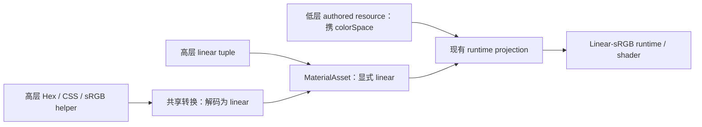

# ForgeaX 颜色入口与正交参数对齐设计

> 状态：提案（2026-09-07），未表示实现或验收已完成。
> 调查基线：ForgeaX `dd521aaad61ca21f2d45f34ca024e0b4cf9902e2`；Three.js r184（`three@0.184.0`）；Unity 对照采用 6.0 文档。

## 1. 范围与决策

本轮只落实两个变化：Three-like 材质颜色入口归一化，以及 orthographic 位置参数重排。Forge 自己的 API 直接表达目标合同，不建立 Three importer、交换层或全局兼容开关。外部 Three/glTF 数据接入不在范围内。

| 改动 | 当前事实 | 目标 |
|:--|:--|:--|
| 高层材质颜色 | `Materials.standard/unlit` 的数组默认 sRGB | 数值 RGB(A) tuple 默认 linear；Hex/CSS、显式 sRGB helper 在边界解码 |
| 低层材质资源 | authored `type:'color'` 默认 sRGB | 保留，供序列化作者数据使用；高层生成的线性资产显式标 linear |
| Hex 数学入口 | `fromHex` 只做 byte 归一化 | 返回线性颜色；`toHex` 从线性颜色编码 |
| 正交位置参数 | `(left,right,bottom,top,near,far)` | 统一为 `(left,right,top,bottom,near,far)` |
| Camera helper | `orthographic(opts)` 为命名对象 | 保留对象形式，内部与 math 合同一致 |

本轮不改 `Camera.fov` 弧度单位、near/far 默认值、世界轴、矩阵存储、NDC/depth 模式、曝光或 tone mapping。也不改灯光方向、强度单位、range、Spot cone 字段、castShadow 默认、bias/normalBias、CSM/PCSS/VSM/PMREM 合同。此前调查发现的阴影域问题不在本轮顺带修复。

## 2. Three 与 Unity 对照：采用语义，不复制包袱

Three r184 的 `Color.setHex/setStyle` 默认把 sRGB 输入转到 working Linear-sRGB；`setRGB` 的数值参数默认已经 linear，只有显式传 `SRGBColorSpace` 才解码。关闭 `ColorManagement` 会跳过转换，但 Forge 不引入这种全局解释开关。[Color r184](https://raw.githubusercontent.com/mrdoob/three.js/r184/src/math/Color.js)、[颜色管理](https://threejs.org/manual/en/color-management.html)

Unity 提供 `Color.linear` 显式转换，并区分项目的 Gamma/Linear 工作流。它说明“作者输入”与“渲染工作空间”可以分开，但不能据此推断所有 Unity 数值 Color、材质 setter 或 HTML 解析都会自动线性化。Forge 采用下文明确的入口合同，不复制项目级 Gamma runtime。[Unity Color.linear](https://docs.unity3d.com/6000.0/Documentation/ScriptReference/Color-linear.html)、[Unity 色彩工作流](https://docs.unity3d.com/6000.0/Documentation/Manual/set-project-color-space.html)

正交顺序并非行业唯一标准：Three `makeOrthographic` 是 top-before-bottom；Unity `Matrix4x4.Ortho` 是 bottom-before-top。本轮明确选择 Three 顺序，属于 API 一致性决策，不是修正矩阵数学错误。[Three Matrix4](https://raw.githubusercontent.com/mrdoob/three.js/r184/src/math/Matrix4.js)、[Unity Ortho](https://docs.unity3d.com/6000.0/Documentation/ScriptReference/Matrix4x4.Ortho.html)

| 行为 | 分类 | 本轮处理 |
|:--|:--|:--|
| Linear-sRGB 照明、颜色/数据纹理区分 | 稳定语义 | 保留 |
| Hex/CSS 与数值 RGB 的不同输入约定 | 稳定且有用的 API 语义 | 在高层入口采用 |
| r152 encoding→colorSpace、r155 legacy lighting 迁移 | 版本迁移资料 | 不添加旧枚举、legacy lights 或统一 π 补偿 |
| 可关闭的全局颜色转换 | 对 Forge 无需继承的历史兼容机制 | 不作为目标 |
| WebGL NO / WebGPU ZO、reversed depth | 必要的 renderer 差异 | 保持现状，不当成历史包袱删除 |
| Object3D 自动更新、target 对象、shadow 默认及滤波细节 | 源 API/实现策略 | 不迁入 Forge，不扩大本轮范围 |

历史版本判断以 [Three Migration Guide](https://github.com/mrdoob/three.js/wiki/Migration-Guide) 为依据；像素参考仍固定 r184，不能用浮动 latest 覆盖既有结果。

## 3. 颜色入口合同

### 3.1 当前默认是否合理

[material/color-space.ts](../../types/src/material/color-space.ts) 将 authored `color` 默认解释为 `'srgb'`；未标记为 color 的数值向量不做转换。`materialValuesToLinearRuntime` 生成线性副本，不修改资源原值。[materials.ts](../src/materials.ts) 的高层入口已把 tuple 与字符串/Hex 分开处理，并将生成资源明确写为 `'linear'`；低层资源缺省仍由 metadata 合同保持 `'srgb'`。

资源缺省对 UI/颜色选择器等序列化作者数据是合理的，保留可避免把现有 authored 资源整体重新解释。但程序中的 `[0.5,0.5,0.5]` 常来自线性计算，继续静默解码会变成约 `0.214`；高层应采用 Three-like 输入形式，而非要求每次写 colorSpace。

### 3.2 高层归一化、低层保留 metadata

| 输入/入口 | 解释 | 写入或运行时结果 |
|:--|:--|:--|
| 高层 RGB/RGBA tuple | Linear-sRGB | 数值不变；缺省 alpha=1 |
| 高层单个 numeric integer | Three-like `0xRRGGBB`，范围 `0..0xffffff`，按 sRGB Hex 解释 | RGB 解码，alpha=1；不是线性灰度，非整数或越界值拒绝 |
| 高层 Hex/CSS 字符串 | sRGB | RGB 解码，alpha 不变 |
| 显式 sRGB 数值 helper | sRGB 数值 | 返回线性颜色，后续当普通 linear tuple |
| 低层 authored `type:'color'`，未标空间 | sRGB | 现有 runtime projection 解码一次 |
| 低层已经线性的 color | 显式 `colorSpace:'linear'` | runtime projection 不解码 |
| 未标 color 的向量/数据参数 | 数据 | 不套用颜色传递函数 |

高层 `Materials.standard/unlit` 先将自身颜色输入统一为线性，再把生成的 MaterialAsset 颜色 metadata 显式写为 `'linear'`。资源与程序入口使用同一 runtime；不同的是作者值何时被解码。HDR tuple 允许大于 1，不按数值范围猜空间。

`baseColor`、`emissive`、`specularColor` 等颜色字段共用入口规则，不能只修 baseColor。保留已有 `attenuationColor` 等专属参数合同，不把所有 vec3 泛化为颜色。低层 metadata 优先级仍由现有解析函数持有，不能再加一套 renderer 判定。

`colorSpace` 留在低层资源合同；高层用输入形式和显式 sRGB helper 表达意图，不再用一个全局选项重新解释混合的字符串/tuple。旧高层 `colorSpace:'srgb'` 调用迁移到显式 sRGB helper，旧 `'linear'` tuple 直接使用；不保留两套可冲突的入口规则。

### 3.3 共享转换与纹理边界



RGB 使用现有 IEC 61966-2-1 分段函数：

```math
C_{linear}=\begin{cases}C_{srgb}/12.92,&C_{srgb}\le0.04045\\((C_{srgb}+0.055)/1.055)^{2.4},&\text{otherwise}\end{cases}
```

[math/color.ts](../../math/src/color.ts) 的 `fromHex` 当前只除以 255；目标改为 Hex→linear，`toHex` 改为 linear→Hex。实现共用现有传递函数 owner，避免新增不同常数或截断规则；若共享需要调整依赖，先核对 package DAG，不能产生循环依赖。

本设计中的 CSS 是以下有限子集，不承诺完整 CSS Color。解析为 Node/Worker/browser 共用的纯函数，不依赖 DOM/canvas；首尾空白忽略，函数名、颜色名和 Hex 大小写不敏感。

| 形式 | 支持范围与可测试规则 |
|:--|:--|
| Hex | `#RGB`、`#RGBA`、`#RRGGBB`、`#RRGGBBAA`；短形式逐位重复，缺省 alpha=1 |
| named color | 固定 20 项：black、blue、cyan、fuchsia、gray、green、grey、lime、magenta、maroon、navy、olive、orange、purple、red、silver、teal、transparent、white、yellow；transparent=(0,0,0,0) |
| rgb/rgba | 逗号形式 `rgb(r,g,b)` / `rgba(r,g,b,a)`，或空格形式 `rgb(r g b / a)`（alpha 可省略，rgba 同义）；RGB 为 0..255 数值或百分比，alpha 为 0..1 数值或百分比 |
| hsl/hsla | 同样的逗号或空格/slash 分隔；h 为无单位度数或 deg/grad/rad/turn，周期折回；s/l 必须为百分比，alpha 同上 |
| 数值边界 | 接受有符号有限十进制小数；RGB、s/l、alpha 按其范围 clamp；alpha 不做 sRGB 解码。token 必须完整匹配，禁止用 parseFloat 忽略尾随垃圾 |

不支持其他颜色名、currentColor、var/calc、color()、lab/oklab/lch/oklch、相对颜色或混合分隔语法。未知名称、错误 Hex 长度、非有限数、缺少分量、多余分量/斜杠或尾随字符均为非法输入：`fromCss` 按 math 退化合同返回不透明黑 `(0,0,0,1)`，不抛异常；材质字符串入口沿用该结果，不留下部分解析值。上述子集的边界与反例必须入测。

颜色纹理按自身 metadata 解码，normal/roughness/metallic/AO 等数据纹理不解码；材质数组的 metadata 不覆盖纹理。HDR 环境保持线性。alpha 不参与 sRGB 转换，runtime、BRDF、曝光和输出仍按现有线性合同运行。

> [!WARNING]
> 已有 `srgbToLinear(fromHex(...))` 在 fromHex 改语义后会双解码；已解码的高层资产若遗漏 linear metadata，也会在 extract 再解码。两类调用必须和实现一起迁移，不能靠改曝光掩盖。

## 4. Orthographic 参数重排

三条位置参数数学入口统一：

```ts
mat4.orthographic(out, left, right, top, bottom, near, far)
mat4.orthographicNO(out, left, right, top, bottom, near, far)
mat4.orthographicReverseZ(out, left, right, top, bottom, near, far)
```

这是一次 breaking migration：同步函数签名、实现、JSDoc、测试与所有位置参数调用。按变量语义交换调用位置，不按正负号猜 top/bottom；不建立 wrapper、旧签名别名或交换层。

`orthographic(opts)` 接收命名对象，没有位置参数顺序问题。保留对象形状，仅同步类型/文档排列和最终 math 调用；无需机械改写全部对象字面量。

右手系、列主序、列向量以及现有 NO/ZO/reversed-Z 深度公式不变：

```math
p_{clip}=PVMp_{local},\qquad y_{top}\mapsto+1,\quad y_{bottom}\mapsto-1
```

这里 top/bottom 是投影边界名；屏幕坐标案例 `top=0,bottom=600` 合法，不新增 `top>bottom` 校验。测试要使用非对称 bounds，避免只检验 z 而遗漏 Y 翻转。

Camera、picking、debug draw、tilemap、temporal、GPU-driven 和 CSM 都消费此数学入口，必须一起迁移。CSM 中 `minY,maxY` 要改为 `maxY,minY`，但 near/far 及阴影行为保持原义。

## 5. Owner 与修改面

| Owner/文件 | 本轮责任 |
|:--|:--|
| [math/mat4.ts](../../math/src/mat4.ts) | 三条正交函数参数顺序；数学含义不变 |
| [math/color.ts](../../math/src/color.ts) | Hex↔linear 和显式颜色转换入口 |
| [types/material/color-space.ts](../../types/src/material/color-space.ts) | 保留 authored metadata 与 runtime projection 合同 |
| [render/materials.ts](../src/materials.ts) | 高层输入归一化，生成明确 linear metadata |
| [render/components/camera.ts](../src/components/camera.ts) | 保留命名对象 helper，更新 math 调用说明 |
| render/picking/runtime/apps 调用点 | 一次迁移位置参数与旧颜色意图 |
| shader/runtime | 验证消费结果；不增加颜色空间猜测或灯光政策 |
| 既有 parity 与单测 | 独立解析值、像素和反证，不生产补偿系数 |

已定位的正交消费者包括 render 的 `render-system-extract`、`scene/render-scene`、`record/helpers`、`debug-draw-glue`、`tilemap-chunk-extract-system`、`temporal/temporal-view`、`gpu-driven/production-raster`，以及 picking、brotato-3d、game-capability-lab。实施时重新全仓搜索，不能把这份名单当作永久完整清单。

材质继续走 `MaterialAsset.parameters → deriveStandardLayerPlan → compose/reflect → cook → runtime`。Surface 只返回表面事实；本轮不改变物理层、pass、BRDF 或资产加载 owner。

## 6. 迁移与验收

| 路径 | 最小有效案例 | 反证/失败条件 |
|:--|:--|:--|
| 高层颜色 | tuple .5 保持 .5；sRGB .5 约为 .214041；Hex #808080 | tuple 被静默解码；不同入口不收敛 |
| numeric integer | `0x808080` 与 `'#808080'` 相同；tuple `[0.5,0.5,0.5]` 保持线性 | 非整数/越界被接受；把单数当灰度。灰度意图迁移为显式 RGB tuple |
| 资源投影 | 高层 metadata=linear；低层默认 sRGB；重复 extract | 二次解码、原 authored values 被修改 |
| 其他颜色字段 | emissive/specularColor、alpha、HDR、数据向量 | 只修 baseColor、alpha 被解码、HDR 截断 |
| 解析与 API | RGB/RGBA 类型、公开 CSS 语法、非法输入；Node/Worker | 依赖 DOM、旧 colorSpace 与输入形式冲突 |
| 正交数学 | left=-2,right=5,top=7,bottom=-3；ZO/NO/reversed-Z | 四边投影错误、深度合同变化 |
| 屏幕/拾取 | top=0,bottom=600；screenToRay 与可见物体 | 新增方向限制、拾取与画面倒置 |
| 实际消费者 | 正交相机、tilemap、debug draw、CSM 连续帧 | 漏迁移调用、阴影反转、抖动 |
| 像素 | 同一材质输入的线性 ROI 与显示输出 | 调曝光掩盖输入错误、缺失后端证据 |

旧 tuple 的 sRGB 意图要逐处确认；颜色数组数值和光照参数不应同时调整。不可通过更新所有黄金图把输入回归变成“通过”。保留资源默认值测试，并将旧 convenience 默认 sRGB 的断言改为新入口合同。

优先扩展既有 math 单测、types 的 `material-color-space.unit.test.ts`、runtime 的 `materials.unit.test.ts`、render 的 `material-cooked-projection.unit.test.ts` / `material-snapshot-mutation.integration.test.ts`，以及 picking、CSM 和正交 smoke。新增类型测试覆盖输入形式，不增加镜像实现的测试层。

快速反馈命令：

```sh
pnpm exec vitest run packages/math/__tests__/math.unit.test.ts packages/types/src/__tests__/material-color-space.unit.test.ts packages/runtime/src/__tests__/materials.unit.test.ts packages/runtime/src/__tests__/systems.unit.test.ts packages/picking/src/__tests__/pick-vertex.unit.test.ts packages/render/src/__tests__/material-cooked-projection.unit.test.ts packages/render/src/__tests__/material-snapshot-mutation.integration.test.ts
pnpm build:engine
pnpm typecheck
git diff --check
```

必须核对实际测试文件数，避免 `passWithNoTests` 将未匹配文件误报成功。最终交付还需相关 lint、`pnpm test:browser`、`pnpm test:dawn` 和全部 hello/learn-render 300 帧 smoke；快速反馈不能替代它们。缺少实际后端/像素证据仍是未完成验证，本文本身不提供通过结论。
