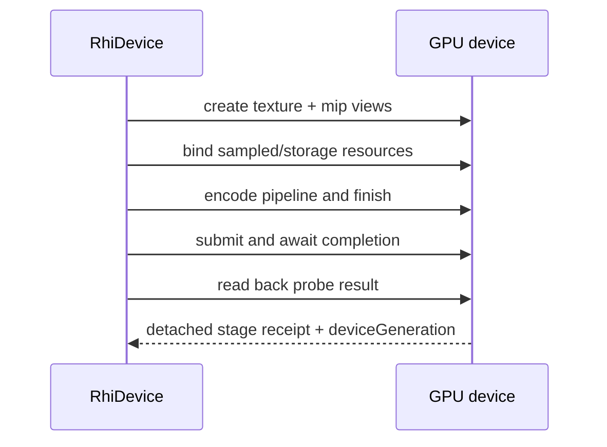

# @forgeax/engine-rhi

> Pure-interface RHI; zero impl. spec-aligned with `@webgpu/types`; wgpu-superset op-set capability-gated; 14 opaque handles; math-free.

## Charter propositions (顶部命题 / AI users read AGENTS.md §RHI first)

| Proposition | This package's contract |
|:--|:--|
| 1 渐进披露 | Single `import { rhi } from '@forgeax/engine-rhi-webgpu'` reaches 14 opaque handles + 7 main interfaces + descriptor projections + 23 `RhiErrorCode` members in one read. Top-level table of contents below precedes detail. |
| 2 业界实践 | Descriptor projections use `Pick<GPUXxxDescriptor, ...>` byte-aligned with `@webgpu/types`; mirrors typescript-eslint / `@microsoft/api-extractor` selection patterns (S-2 ts-morph). |
| 3 机读 union > 散文 | `RhiErrorCode` is a closed string-literal union (23 members); AI users `switch (err.code)` is TypeScript-exhaustive with no `default` fallback. Tables below are machine-readable, not paragraphs. |
| 4 显式失败 | Every method returns `Result<T, RhiError>`. Errors carry `.code` + `.expected` + `.hint` (and optional `.detail` for compile-failed). QuerySet creation, occlusion begin/end, resolve, and timestamp writes are implemented or capability-gated; only `executeBundles` remains a structured `'rhi-not-available'` public placeholder because no RenderBundle handle/creation owner exists. |
| 5 一致抽象 | 14 opaque handles use brand-only `Id<T>`; the shim never renames fields; `caps.X = false` is the same signal shape as a value field. Single hatch: `_internal_getRawDevice` (D-S1; no other escape). |
| 6 (candidate) mock vs real-GPU | dawn.node integration tests trigger the 4 D-S3 error codes against a real GPU adapter (`packages/rhi-webgpu/src/__tests__/dawn-real-gpu.dawn.test.ts`); mock-only coverage is monitored as a silent-pass blind spot (plan-strategy R-7). |

> AI users: read [AGENTS.md §RHI / WebGPU](../../AGENTS.md) first; the铁律 (spec-alignment / capability-gated / opaque handle / math-free) is the SSOT and supersedes any divergence in this README.

## Query capability matrix

The query surface is split by the fact that can actually gate it: occlusion
queries are ordinary WebGPU operations and do not need a new capability bit;
timestamp queries require the existing `caps.timestampQuery` gate and a
positive `timestampPeriodNanoseconds`. Every row below has an interface,
implementation, and test owner; the browser-specific query artifact is not
silently promoted from a Dawn or mock result.

| Operation | Gate / constructibility | WebGPU shim and evidence | RhiNull boundary |
|:--|:--|:--|:--|
| `createQuerySet` / `destroyQuerySet` | `type: 'occlusion'` has no optional-cap gate; `count <= 4096`; `type: 'timestamp'` requires `caps.timestampQuery` | [`RhiDevice`](./src/index.ts#L1433), [`device.ts`](../rhi-webgpu/src/device.ts#L1837), [Dawn create tests](../rhi-webgpu/src/__tests__/dawn-real-gpu.dawn.test.ts#L381) | [`createQuerySet`](../rhi-null/src/device.ts#L211) rejects timestamp sets with `feature-not-enabled`; occlusion produces a structural handle |
| Pass `occlusionQuerySet` + `beginOcclusionQuery` / `endOcclusionQuery` | Query set supplied in [`RenderPassDescriptor`](./src/index.ts#L794); index/range and non-nesting state are validated | Stateful forwarding and validation in [`device.ts`](../rhi-webgpu/src/device.ts#L542); [Dawn state/round-trip tests](../rhi-webgpu/src/__tests__/dawn-real-gpu.dawn.test.ts#L619) | Pass methods return structural `ok`; this is not GPU visibility evidence |
| `resolveQuerySet` | Destination offset is 256-byte aligned, destination has `QUERY_RESOLVE`, and query range fits the set | Validation/forwarding in [`device.ts`](../rhi-webgpu/src/device.ts#L966); [Dawn validation and round-trip tests](../rhi-webgpu/src/__tests__/dawn-real-gpu.dawn.test.ts#L820) | Returns structural `ok` and never creates timing evidence |
| Timestamp QuerySet + pass `timestampWrites` | Required feature requested; `caps.timestampQuery === true` and period is positive | Mapping in [`device.ts`](../rhi-webgpu/src/device.ts#L745); [Dawn admission/readback test](../rhi-webgpu/src/__tests__/dawn-real-gpu.dawn.test.ts#L1233) | `timestampQuery=false`, timestamp creation is refused; no synthetic ticks |
| Pass descriptor `timestampWrites` | Capability-positive devices attach timestamp pairs to real render/compute pass boundaries; unavailable periods remain fail-closed | [`RenderPassDescriptor`](./src/index.ts#L794), [`device.ts`](../rhi-webgpu/src/device.ts#L745); [Dawn admission/readback tests](../rhi-webgpu/src/__tests__/dawn-real-gpu.dawn.test.ts#L1233) | `timestampQuery=false`, timestamp creation is refused; no ticks are fabricated |
| `executeBundles` | No public `RenderBundle` handle, encoder, or creation path exists in this RHI | [`device.ts`](../rhi-webgpu/src/device.ts#L533) returns `rhi-not-available`; no browser query claim is made | `RhiNull` may return structural `ok` for its empty ledger, which does not close the public GPU surface |

> [!IMPORTANT]
> `RhiNull` is structural evidence only. Its successful occlusion/resolve/no-op calls do not turn `executeBundles` into a public implementation or timestamp refusal into GPU timing. Read the source and the linked backend evidence before choosing a recovery path.

## 14 opaque handles (no prefix)

| Handle | Purpose |
|:--|:--|
| `Buffer` | GPU buffer (vertex / index / uniform / storage / indirect) |
| `Texture` | GPU texture (2D / 3D / cube / array) |
| `TextureView` | Texture view (mip range / aspect select) |
| `Sampler` | Sampler (filter / wrap / compare) |
| `BindGroup` | Resource binding group |
| `BindGroupLayout` | Resource binding layout (declares binding kinds) |
| `PipelineLayout` | Pipeline layout (aggregates BindGroupLayout) |
| `RenderPipeline` | Render pipeline (vertex/fragment shader + state machine) |
| `ComputePipeline` | Compute pipeline (compute shader) |
| `ShaderModule` | Compiled shader module (WGSL / SPIR-V) |
| `QuerySet` | Query set (occlusion / timestamp) |
| `Fence` | Sync barrier (GPU<->CPU) |
| `CommandEncoder` | Command recorder (single-shot) |
| `CommandBuffer` | Command buffer (submit to Queue) |

## 7 main interfaces (Rhi-prefixed) — operation verb mixins

| Interface | Methods (mixin grouping) |
|:--|:--|
| `RhiDevice` | resource create: `createBuffer` / `createTexture` / `createSampler` / `createBindGroupLayout` / `createPipelineLayout` / `createBindGroup` / `createRenderPipeline` / `createComputePipeline` / `createQuerySet` / `createCommandEncoder`; resource destroy: `destroyBuffer(buf): Result<void, RhiError>` / `destroyQuerySet(querySet): Result<void, RhiError>` / `destroyTexture(tex): Result<void, RhiError>`; readonly: `caps` / `features` / `limits` / `queue` / `lost` |
| `RhiQueue` | submit: `submit(commandBuffers)`; copy: `writeBuffer(buffer, offset, data, dataOffset?, size?)` (real-path forwarding to `GPUQueue` w/ bounds guard, D-S3 #4) |
| `RhiCommandEncoder` | pass open: `beginRenderPass` / `beginComputePass`; copy: `copyBufferToBuffer` (3-arg + 5-arg overloads) / `copyBufferToTexture` / `copyTextureToBuffer` / `copyTextureToTexture`; query: `resolveQuerySet` (validated forwarding); misc: `clearBuffer` / `pushDebugGroup` / `popDebugGroup` / `insertDebugMarker`; lifecycle: `finish() -> Result<CommandBuffer, RhiError>`; plus the ForgeaX compound `encodeEmptyComputePass(desc)` |
| `RhiRenderPassEncoder` | bind: `setPipeline` / `setBindGroup` / `setVertexBuffer` / `setIndexBuffer`; draw: `draw` / `drawIndexed` / `drawIndirect` / `drawIndexedIndirect`; state: `setViewport` / `setScissorRect` / `setBlendConstant` / `setStencilReference`; query: `beginOcclusionQuery` / `endOcclusionQuery` (stateful forwarding); debug: `pushDebugGroup` / `popDebugGroup` / `insertDebugMarker`; lifecycle: `end()`; `executeBundles` is the only unavailable public entry (return `'rhi-not-available'`) |
| `RhiComputePassEncoder` | `setPipeline` / `setBindGroup` / direct `dispatchWorkgroups` / buffer-driven `dispatchWorkgroupsIndirect` / `end` |
| `RhiRenderPipelineOps` | render-pipeline cache + dispatch helpers (op-set scoped to render path) |
| `RhiComputePipelineOps` | compute-pipeline cache + dispatch helpers (op-set scoped to compute path) |

> 14 opaque handles are no-prefix; 7 main interfaces are `Rhi`-prefixed. AI users grep `Rhi` to enumerate the operation verb set; grep handle name (e.g. `Buffer`) to enumerate handle uses. The two namespaces never overlap (charter proposition 5).

`encodeEmptyComputePass(desc)` is an engine compound recording operation: it
records `beginComputePass(desc)` and immediately ends that pass. It is not a
native `GPUCommandEncoder` method and must not be described as direct copy
timestamp writing; timestamp-enabled callers still use two real compute-pass
markers when they need an encoder-level copy envelope.

## Descriptor projections (`Pick<GPUXxxDescriptor, ...>` + `ExplicitUndefined<>`)

| Descriptor | spec source |
|:--|:--|
| `BufferDescriptor` | `Pick<GPUBufferDescriptor, 'label' \| 'size' \| 'usage' \| 'mappedAtCreation'>` |
| `TextureDescriptor` | `Pick<GPUTextureDescriptor, 'label' \| 'size' \| 'mipLevelCount' \| 'sampleCount' \| 'dimension' \| 'format' \| 'usage' \| 'viewFormats'>` |
| `SamplerDescriptor` | `Pick<GPUSamplerDescriptor, 'label' \| 'addressModeU' \| ... \| 'compare' \| 'maxAnisotropy'>` |
| `BindGroupLayoutDescriptor` | `Pick<GPUBindGroupLayoutDescriptor, 'label' \| 'entries'>` |
| `RenderPipelineDescriptor` | `Pick<GPURenderPipelineDescriptor, 'label' \| 'layout' \| 'vertex' \| 'primitive' \| 'depthStencil' \| 'multisample' \| 'fragment'>` |
| `CommandEncoderDescriptor` | `Pick<GPUCommandEncoderDescriptor, 'label'>` (D-S5) |
| `QuerySetDescriptor` | `Pick<GPUQuerySetDescriptor, 'label' \| 'type' \| 'count'>` (query resource creation) |
| `RenderPassDescriptor` | `Pick<GPURenderPassDescriptor, 'label' \| 'colorAttachments' \| 'depthStencilAttachment' \| 'occlusionQuerySet' \| 'timestampWrites' \| 'maxDrawCount'>` (D-S5; `view` field tightened to `Texture`) |
| `RenderPassColorAttachment` | spec-aligned color attachment slot (`view` = `Texture`, `resolveTarget` = `Texture` when present, `clearValue` / `loadOp` / `storeOp`) |
| `RenderPassDepthStencilAttachment` | spec-aligned depth-stencil slot (`view` = `Texture`, `depthClearValue` / `depthLoadOp` / `depthStoreOp` / `depthReadOnly`, similar for stencil) |

### ExplicitUndefined<> 桥接

The descriptor projections above are wrapped by an internal `ExplicitUndefined<T>` mapped type that converts every `?: T` optional field into `?: T | undefined`. This is the **shape bridge** between `@webgpu/types` (W3C spec form) and the forgeax RHI surface.

| Concern | spec form (`@webgpu/types`) | forgeax form (this package) |
|:--|:--|:--|
| optional field syntax | `label?: string` (omit-or-string) | `label?: string \| undefined` (omit, `undefined`, or string) |
| `tsconfig` interaction | passes with `exactOptionalPropertyTypes` off | passes with `exactOptionalPropertyTypes` on (forgeax invariant) |
| `{ label: undefined }` write | rejected by tsc when spec is consumed under strict mode | accepted (writers may omit OR pass explicit `undefined`) |
| missing vs explicit-undefined | indistinguishable to consumer | M2 shim distinguishes via `'x' in src` runtime guard (research F-3 anti-pattern 2) |

**Three SSOT anchors**:

1. Mapped type definition — [`packages/rhi/src/index.ts:118-143`](./src/index.ts) (`type ExplicitUndefined<T> = { [K in keyof T]: T[K] | undefined }`).
2. AGENTS.md `§RHI / WebGPU` 形态铁律 #1 (`spec 对齐` — optional fields uniformly `?: T | undefined`, decision S-7 / research F-3).
3. Shim runtime guard — `@forgeax/engine-rhi-webgpu` shim uses `'x' in src` to forward only fields the writer actually set (avoids leaking spurious `undefined` into native `GPUDevice.createXxx(...)` calls).

**Upgrade path**: once upstream `@webgpu/types` v0.2.x ships `?: T | undefined` uniformly (L-P4 widening contract), `ExplicitUndefined<>` can be removed without changing forgeax's public descriptor types.

## Error model — 23-member closed `RhiErrorCode`

> [!NOTE]
> **RHI contract SSOT** — this section is the closed-union contract source. The sibling table in [`packages/engine/README.md`](../engine/README.md) mirrors the `rhi-not-available` trigger for the engine-entry quickstart audience. The executable union, detail types, and factories remain owned by [`packages/rhi/src/errors.ts`](./src/errors.ts); this table is the AI-facing deep index.

| code | trigger | spec anchor |
|:--|:--|:--|
| `'adapter-unavailable'` | `navigator.gpu.requestAdapter()` returns null | W3C 4.2 GPU.requestAdapter |
| `'feature-not-enabled'` | calling a method that requires a feature not in `device.features` | W3C 5.6 GPUDevice.features |
| `'limit-exceeded'` <!-- limit-exceeded detail shape evolving in feat-20260513-instanced-mesh --> | input exceeds `device.limits.<name>` | W3C 5.7 GPUSupportedLimits |
| `'shader-compile-failed'` | WGSL / SPIR-V compile error; `.detail.compilerMessages` carries `GPUCompilationMessage[]` | W3C 7.2 GPUShaderModule.getCompilationInfo |
| `'rhi-not-available'` | public entry point whose required handle/owner is not constructible in this closure (currently `RhiRenderPassEncoder.executeBundles`); also reserved as `device.lost reason='destroyed'` / real-adapter null sub-classification (R1 fallback / R10). AI users read `.code === 'rhi-not-available'` to detect "not available in this closure" and follow `.expected` / `.hint`. | placeholder marker (charter proposition 4) |
| `'webgpu-runtime-error'` | silent-skip fan-out from `webgpu-backend.ts` / `createRenderer.ts` (verify-gpu-smoke-gate K-9) | engine-internal fault root |
| `'command-encoder-finished'` | `encoder.finish()` after a prior `finish()`; second `finish()` returns this code (void-recording APIs throw the structured error) | W3C 22 GPUCommandEncoder lifecycle |
| `'render-pass-not-ended'` | second `beginRenderPass` while a previous pass is unfinished, or `encoder.finish()` while a pass has not been `end()`-ed | W3C 22.7 Render pass |
| `'queue-submit-failed'` | `queue.submit([buf])` real-GPU rejection (validation error / destroyed reference) | W3C 23 Queue |
| `'queue-write-buffer-out-of-bounds'` | `writeBuffer(buf, offset, data)` offset alignment or bounds violation; `.hint` carries concrete `got X` / `got Y` / `got Z` numbers | W3C 23.2 writeBuffer |
| `'render-system-no-camera'` | RenderSystem found 0 entity matching `(Transform + Camera)`; the frame is skipped (no GPU commands recorded). Distinct from `'rhi-not-available'` because the RHI surface itself is functional — it is the ECS world that lacks a Camera entity (engine-internal phase, feat-20260509-ecs-render-bridge-mvp D-S7) | engine-internal RenderSystem |
| `'render-system-multi-camera'` | RenderSystem found N>1 entities matching `(Transform + Camera)`; the first archetype iteration hit is rendered, subsequent Cameras are ignored (D-S7) | engine-internal RenderSystem |
| `'render-system-multi-light'` | RenderSystem found N>1 `DirectionalLight` entities; PointLight / SpotLight / RectArea lights are admitted through the shared Cluster corpus. 0-light + standard renders black (physically correct). `.detail = { type: 'directional', got: number }` identifies the offending bucket | engine-internal RenderSystem |
| `'asset-not-registered'` | A `MeshFilter.assetHandle` is not in `engine.assets` (`AssetRegistry.get(handle)` returned undefined); the single entity is skipped (other entities continue rendering — charter proposition 9 graceful degradation). `.detail = { assetHandle: number }` carries the offending handle | engine-internal RenderSystem |
| `'device-lost'` | `GPUDevice.lost` Promise resolved (spec 22.1 device lost flow); driver crash / power saver / extension swap. `.expected` / `.hint` template guides callers to `renderer.onError(cb)` + page reload (feat-20260511-asset-system-v1 D-P4 + R-02 §2.1) | W3C 22.1 device lost |
| `'oom'` | `GPUOutOfMemoryError` subtype — buffer / texture allocation exceeded available GPU memory. `.hint` suggests `.destroy()` prior resources / split work across submissions / check `device.limits.maxBufferSize` | W3C 22.2 GPUOutOfMemoryError |
| `'internal-error'` | `GPUInternalError` subtype — driver-bug / unrecoverable internal failure that is neither validation nor OOM. `.hint` suggests reproducing on a stable adapter + file an issue with the underlying GPU.message | W3C 22.2 GPUInternalError |
| `'hierarchy-broken'` | `propagateTransforms` system (ECS `'pre-render'` schedule) encountered a `Parent` whose referenced entity no longer exists. The single entity's subtree is skipped; other entities continue rendering (charter proposition 9 graceful degradation + architecture-principles #5 Fail Fast; feat-20260511-asset-system-v1 D-P2 + requirements §9 row 8) | engine-internal RenderSystem |
| `'destroy-after-destroy'` | A second `RhiDevice.destroyBuffer(buf)` / `RhiDevice.destroyTexture(tex)` on the same handle. The shim layer tracks per-handle `destroyed: boolean` in WeakMap-backed meta and surfaces this code on the second call rather than swallowing it (W3C / wgpu wasm both treat double-destroy as idempotent void; forgeax prefers fail-fast because double-destroy is almost always a lifecycle bug — feat-20260612 D-6 / D-7). `.expected` / `.hint`: `'GPU buffer/texture handle has not been destroyed yet'` / `'object already destroyed; track lifecycle in caller or check isDestroyed before re-destroy'` | engine-internal RHI shim |
| `'rhi-descriptor-invalid'` | A `createRenderPipeline` (or other `create*` entry) descriptor failed to parse in the wgpu-wasm backend (Rust `#[wasm_bindgen(catch)]` Err, stable prefix `[wgpu-wasm] failed to parse`). The descriptor shape passed from TS was malformed — a caller bug, not a runtime condition. Differs from `'webgpu-runtime-error'` (a valid descriptor rejected by the runtime): here the descriptor never reached the runtime because its shape was unparseable. `.hint` carries the parse-error message including the failing field index (e.g. `fragment.targets[0]`). `.expected` / `.hint`: `'caller passed well-formed descriptor data matching the wgpu-wasm serialization contract'` / `'check the descriptor field named in the error message for type mismatch or missing required fields'` (feat-20260619) | engine-internal RHI shim |
| `'instancing-exceeds-uniform-cap'` | A record-stage fold bucket carries more than 128 instances on the WebGL2 uniform-fallback path (`caps.storageBuffer === false`). The engine fires the error AND falls the bucket back to per-entity `drawIndexed` (shared fallback exit, plan D-9), so the frame is still visually correct. The 128 cap: 128 instances x 64 B/mat4 = 8192 B fits inside the WebGL2 minimum 16384 B UBO. `.detail = { requested: number, limit: 128, scope: 'sprite' \| 'tilemap-chunk' }`. Differs from `'limit-exceeded'` (static `device.limits` byte ceiling): this is a per-bucket instance-count ceiling enforced only when the backend lacks storage-buffer bindings. `.expected` / `.hint`: `'bucket instance count <= 128 (uniform fallback cap)'` / `'reduce the bucket size, switch to a WebGPU-capable backend (storage buffers lift the cap), or accept the per-cell drawIndexed fallback'` (feat-20260622) | engine-internal RenderSystem |
| `'render-system-empty-worlds'` | `renderer.draw(worlds, { cameraOwner, resourceOwner })` received an empty `worlds` array. The frame is skipped (no GPU commands recorded); validation runs at the draw entry (before any extract), so no per-world side effects fire. Distinct from `'render-system-no-camera'` (the world exists but has no Camera entity) — here there is no world at all. `.detail = undefined` (the failure is fully described by `.code`). `.expected` / `.hint`: `'worlds array has at least one world'` / `'pass at least one world: draw([world], { cameraOwner: 0, resourceOwner: 0 })'` (feat-20260708 D-5) | engine-internal RenderSystem |
| `'render-system-owner-out-of-range'` | `renderer.draw(worlds, { cameraOwner, resourceOwner })` received an owner index that is not valid for `worlds` (`owner < 0` or `owner >= worlds.length`). `.detail = { role: 'camera' \| 'resource', owner: number, worldCount: number }` identifies the invalid index and its role. The frame is skipped after the empty-worlds check. | engine-internal RenderSystem |

`RhiError` carries `.code` + `.expected` + `.hint` readonly (and `.detail.compilerMessages` for shader-compile-failed; `.detail.assetHandle` for asset-not-registered). AI users `switch (err.code)` is exhaustive — no `default` needed.

## Capabilities tri-layer

| Field | Type | Semantics |
|:--|:--|:--|
| `RhiCaps` | Readonly hardware-probe record declared in [`src/index.ts`](./src/index.ts#L859); includes backend identity, boolean features, probe-derived format capabilities, and numeric `maxColorAttachments` | Hardware feature/limit probe (proposition 5: a false capability is data, never an exception) |
| `RhiFeatures` | `readonly Set<GPUFeatureName>` | Enabled feature set (a subset of capabilities) |
| `RhiLimits` | `readonly GPUSupportedLimits` | Numeric limits (`maxBindGroups`, `maxBufferSize`, etc.) |

### Capabilities — source-backed `RhiCaps` index

> [!NOTE]
> **ROLE: RhiCaps projection**. The executable field roster is [`RhiCaps`](./src/index.ts#L859); this table mirrors its current fields without making a hand-maintained field count part of the contract. Query capability is documented separately below because occlusion is an operation surface, not a copied capability flag.

| Field | Type | Trigger / probe site | WebGPU (`navigator.gpu`) | wgpu wasm (webgl backend) | wgpu native |
|:--|:--|:--|:--|:--|:--|
| `backendKind` | `'webgpu' \| 'wgpu-native' \| 'wgpu-webgl2' \| 'null'` | Concrete backend identity | `'webgpu'` | `'wgpu-webgl2'` | `'wgpu-native'` |
| `compute` | `boolean` | compute pipelines supported (W3C 13.2 GPUComputePipeline) | `true` (spec-mandated) | `false` (no compute) | `true` |
| `timestampQuery` | `boolean` | `device.features.has('timestamp-query')` (W3C 21 query sets) | gated; off by default | `false` | gated |
| `timestampPeriodNanoseconds` | `number | null` | Backend-owned timestamp unit; positive only when timestamp queries are supported | `1` when enabled, otherwise `null` | `null` | backend-owned |
| `indirectDrawing` | `boolean` | `drawIndirect` / `drawIndexedIndirect` supported (W3C 22.4) | `true` (spec-mandated) | `false` (lacks the analogue) | `true` |
| `textureCompressionBc` | `boolean` | `adapter.features.has('texture-compression-bc')` (BC1-BC7) | adapter-dependent | `false` | adapter-dependent |
| `textureCompressionEtc2` | `boolean` | `adapter.features.has('texture-compression-etc2')` | adapter-dependent | `false` | adapter-dependent |
| `textureCompressionAstc` | `boolean` | `adapter.features.has('texture-compression-astc')` | adapter-dependent | `false` | adapter-dependent |
| `multiDrawIndirect` | `boolean` | wgpu native `multi-draw-indirect` extension (research §3 wgpu features) | `false` (not in W3C spec) | `false` | `true` when feature enabled |
| `pushConstants` | `boolean` | wgpu native `push-constants` extension | `false` (not in W3C spec) | `false` | `true` when feature enabled |
| `textureBindingArray` | `boolean` | wgpu native bindless texture array extension | `false` (not in W3C spec) | `false` | `true` when feature enabled |
| `samplerAliasing` | `boolean` | sampler aliasing across pipelines (W3C 10.3 bind group layout) | `true` (spec-mandated) | `false` (no aliasing) | `true` |
| `firstInstanceIndirect` | `boolean` | `device.features.has('indirect-first-instance')` (W3C 22.4 drawIndirect) | gated; off by default | `false` | gated |
| `storageBuffer` | `boolean` | `device.limits.maxStorageBuffersPerShaderStage > 0` | `true` on real adapters | `false` (no storage binding) | `true` |
| `storageTexture` | `boolean` | `device.limits.maxStorageTexturesPerShaderStage > 0` | `true` on real adapters | `false` (no storage texture binding) | `true` |
| `rgba16floatRenderable` | `boolean` | Device-level `rgba16float` + `RENDER_ATTACHMENT` probe | probe result | probe result | probe result |
| `rg11b10ufloatRenderable` | `boolean` | `rg11b10ufloat-renderable` feature plus device-level render-attachment probe | feature/device dependent | feature/device dependent | feature/device dependent |
| `float32Filterable` | `boolean` | `float32-filterable` feature plus filtering sampler/bind-group-layout probe | feature/device dependent | feature/device dependent | feature/device dependent |
| `maxColorAttachments` | `number` | `device.limits.maxColorAttachments` | adapter limit (fallback `4`) | raw limit (fallback `4`) | backend limit |

AI users gate optional fast paths via `caps.X` instead of try / catch (`caps.X = false` is an explicit signal, never an exception — charter proposition 4). The 3 `@reserved-for-wgpu-native-only` fields (`multiDrawIndirect` / `pushConstants` / `textureBindingArray`) plus the JSDoc-`@note` annotated fields are sourced from the `RhiCaps` interface JSDoc — `LSP hover` over any cap surfaces the per-field rationale.

Render membership timing consumes only this capability seam. It requests the
timestamp feature for explicit GPU timing, uses the existing opaque timestamp
operations, and refuses when the boolean or the positive period is absent.

Generic GPU pass timing is not an RHI API. RHI exposes only capability data and
opaque timestamp primitives; Render owns admission, pass identity, receipt
binding, parsing, retention, four-status facts, and recovery. RHI must not
return a Render status, a pass catalog, a benchmark verdict, or synthetic ticks.
`RhiNull` and unsupported backends therefore prove refusal/zero behavior only;
they are not accepted GPU timing evidence. Use the Render entry point and its
bounded validator for accepted facts.

## r32float-mip-sampled-storage receipt

> [!WARNING]
> `probeTextureFormatCapability()` is a narrow RHI probe, not an SSR policy
> switch. A `structural-only` or `unavailable` result cannot be promoted to
> pixel admission, and no backend-kind check, CPU/WebGL2 compute substitute,
> or hidden copy chain can satisfy this contract.

The probe returns one detached receipt bound to the current `deviceGeneration`.
Its stage evidence must cover the complete path below; a single missing stage
maps to the closed `rhi-texture-format-capability-unavailable` error.

| Stage | Evidence required |
|:--|:--|
| `texture-create` | `r32float`, mip count, and sampled/storage/copy usage accepted |
| `mip-view` | every required mip view is constructible |
| `sampled-storage-bind-group` | unfilterable sampled binding and storage binding agree |
| `pipeline-bind` | the real pipeline accepts both bindings |
| `finish` | command encoding finishes without validation error |
| `submit` | the command buffer reaches the queue |
| `completion` | the submitted work completes on this device generation |
| `readback` | map/readback succeeds and carries the same generation receipt |



Consumers should switch on the closed error code, then read `expected`,
`hint`, and narrowed `detail.stage`/`detail.deviceGeneration`. The per-device
cache may reuse one Promise within a generation; device replacement invalidates
the old physical verdict and permits one fresh probe for the new generation.

### AI-readable format evidence

Use the detached receipt as the only public evidence projection. Its `status`,
`profile`, `deviceGeneration`, and ordered `stages` answer whether the complete
texture-create through readback path ran. When unavailable, branch on the closed
`rhi-texture-format-capability-unavailable` error and inspect `expected`, `hint`,
and `detail.stage`; route recovery to the device owner and retry once for the new
generation. `structural-only` is an evidence level, not a pixel admission.

The SSR consumer reads this receipt but does not own the probe, a cache, or a
second report. Backend kind, CPU/WebGL2 compute, RhiNull pixels, hidden copies,
and live GPU handles are not valid substitutes.

## Remaining public placeholder: `executeBundles`

| Method | Owning future closure |
|:--|:--|
| `RhiRenderPassEncoder.executeBundles(bundles)` | `feat-future-rhi-resource-creation` (RhiRenderBundle support) |

> The public WebGPU shim returns `Result.err({ code: 'rhi-not-available', expected, hint: 'see feat-future-rhi-render-bundle' })` because no constructible `RenderBundle` owner exists yet. Do not pass an `unknown` value as a fake bundle handle; wait for the independent RenderBundle closure.

## Evolution contract

| Version bump | Allowed changes | Disallowed |
|:--|:--|:--|
| minor | add new `RhiErrorCode` member; widen a descriptor field type (e.g. broaden a single brand to a union `T -> T \| U`) | rename / delete / reorder existing members; narrow types |
| major | any breaking change with a "破坏点列表" entry | — |

**破坏点列表 — 暂无.** `feat-20260508-shader-pipeline-mvp` first defined the 9-member union; `feat-20260508-rhi-surface-completion` adds 4 D-S3 codes additively; `feat-20260612-rhi-destroy-renderer-dispose-gpu-lifecycle` adds `'destroy-after-destroy'` (18 -> 19); `feat-20260619` adds `'rhi-descriptor-invalid'` (19 -> 20); `feat-20260622-chunk-gpu-instancing-sprite-tilemap` adds `'instancing-exceeds-uniform-cap'` (20 -> 21); `feat-20260708-composited-multi-world-rendering` adds `'render-system-empty-worlds'` + `'render-system-owner-out-of-range'` (21 -> 23), all minor add-only. Future shrinkage (e.g. tightening `view` from union back to a single type) is a major bump and must register here.

## AI user trial (charter proposition 1-5 walk)

> 1-3 sentence dry run for an LLM agent landing on this package for the first time.

```ts
// proposition 1 (渐进披露): one import reaches the entire surface.
import { rhi } from '@forgeax/engine-rhi-webgpu';
// proposition 2 (业界实践): same shape as @webgpu/types descriptors.
const dr = await rhi.requestDevice();
if (!dr.ok) {
  // proposition 3 (机读 union > 散文): switch on closed RhiErrorCode is exhaustive.
  switch (dr.error.code) {
    case 'adapter-unavailable':       /* recover by suggesting RhiAdapter probe */ break;
    case 'feature-not-enabled':       /* recover by re-requesting with explicit features */ break;
    case 'limit-exceeded':            /* recover by reducing input size */ break;
    case 'shader-compile-failed':     /* fix WGSL via dr.error.detail.compilerMessages */ break;
    case 'rhi-not-available':         /* future closure not landed yet; fallback */ break;
    case 'webgpu-runtime-error':      /* silent-skip fan-out signal */ break;
    case 'command-encoder-finished':  /* recreate encoder via device.createCommandEncoder() */ break;
    case 'render-pass-not-ended':     /* call pass.end() before next beginRenderPass() */ break;
    case 'queue-submit-failed':       /* audit buffer/pipeline lifetimes before submit */ break;
    case 'queue-write-buffer-out-of-bounds': /* realign offset, re-check buffer.size */ break;
    case 'render-system-no-camera':   /* world.spawn(Transform + Camera) before draw([world], { cameraOwner: 0, resourceOwner: 0 }) */ break;
    case 'render-system-multi-camera':/* deduplicate Camera entities or wait for feat-future-multi-viewport */ break;
    case 'render-system-multi-light': /* keep one DirectionalLight; local lights use Cluster */ break;
    case 'asset-not-registered':      /* use HANDLE_CUBE / HANDLE_TRIANGLE imports; or feat-future-asset-system custom register */ break;
    case 'device-lost':               /* renderer.onError fan-out + page reload; driver / OS-side recovery */ break;
    case 'oom':                       /* release prior buffers/textures via .destroy(); shrink descriptor; check device.limits.maxBufferSize */ break;
    case 'internal-error':            /* reproduce on stable adapter; file an issue with @forgeax/engine-runtime + GPU.message */ break;
    case 'hierarchy-broken':          /* remove stale Parent via world.removeComponent before destroying ancestor; engine.assets.inspect() to audit */ break;
    case 'destroy-after-destroy':     /* track lifecycle in caller or check GpuResource.isDestroyed before re-destroy */ break;
    case 'rhi-descriptor-invalid':    /* fix the malformed descriptor field named in dr.error.hint (wgpu-wasm parse failure) */ break;
    case 'instancing-exceeds-uniform-cap': /* shrink bucket (<=128) or switch to a storage-buffer backend; dr.error.detail.requested/scope */ break;
    case 'render-system-empty-worlds':/* pass at least one world: draw([world], { cameraOwner: 0, resourceOwner: 0 }) */ break;
    case 'render-system-owner-out-of-range': /* owner in 0..worlds.length-1; dr.error.detail.owner/worldCount */ break;
  }
  return;
}
const device = dr.value;
// proposition 4 (显式失败): every step returns Result; .err carries .code/.expected/.hint.
const encR = device.createCommandEncoder({ label: 'frame' });
if (!encR.ok) return;
const enc = encR.value;
const finishR = enc.finish();
if (!finishR.ok) return;
// proposition 5 (一致抽象): submit accepts the opaque CommandBuffer; no raw GPU* leak.
const submitR = device.queue.submit([finishR.value]);
if (!submitR.ok && submitR.error.code === 'queue-submit-failed') {
  // structured recovery — no try/catch needed for expected failures.
}
```

LSP hover on any `code` in this `switch` shows the JSDoc anchor + W3C / MDN spec link + `.expected` / `.hint` template (charter proposition 1: progressive disclosure means the IDE surfaces the contract at the call site).

## Related packages

- [`@forgeax/engine-types`](../types) — POD types / enum SSOT.
- [`@forgeax/engine-rhi-webgpu`](../rhi-webgpu) — WebGPU thin shim impl (M2 introduced).
- [`@forgeax/engine-runtime`](../engine) — async factory entry (M3 injects `@forgeax/engine-rhi-webgpu`).

## Upgrade path

`@webgpu/types ^0.1.70`: caret range tracks v0.1.x patches automatically; v0.2.x triggers a major-upgrade marker (`.github/dependabot.yml` auto-PR + monthly manual review per S-4). `ExplicitUndefined<>` mapped type stays until upstream spec migrates to `?: T | undefined` (L-P4 widening contract).
