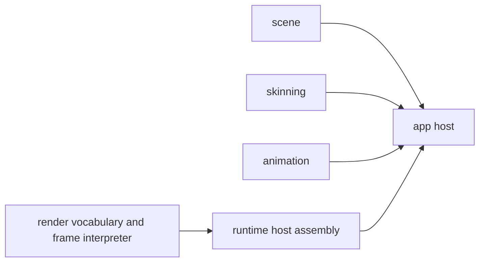

# `@forgeax/engine-runtime`

## Host entry and frame evidence

`createRenderer` is the host assembly entry. It selects the backend services
and returns the render package's single `Renderer` contract; game code does
not construct a device, graph, or second submit path. Pass the attached lease,
camera, and environment facts to `draw`, then bind diagnostics to the
returned `FrameReceipt`:

```ts
const result = await createRenderer(canvas);
if (!result.ok) throw result.error;
const renderer = result.value;
const lease = renderer.attach(world);
if (!lease.ok) throw lease.error;
const frame = renderer.draw({
  leases: [lease.value],
  camera: { lease: lease.value },
  environment: { lease: lease.value },
});
if (!frame.ok) throw frame.error;
const facts = renderer.inspect();
const observation = await renderer.observe(frame.value, { include: ['timings'] });
void facts;
void observation;
```

## Progressive recovery index

Start with the public recovery route: `state() -> inspect() -> recover() ->
FrameReceipt`. Only an `alive` Renderer accepts `World.update` plus `draw`.
`device-lost` and `recovering` keep the host alive while freezing simulation
and submit; concurrent `recover()` calls share one flight. A `faulted` Renderer
must be disposed and recreated, while `disposed` is terminal. After recovery,
retry the identical draw input and bind `observe(receipt, request)` to its new
receipt and device generation.

Use the closed `error.code` with `expected`, `hint`, and typed `detail` to
choose waiting, an explicit retry, repairing the named producer/capability, or
rebuilding the Renderer. Do not parse text or reach into graph, device, or
history state. Target and history identities survive, but new contents remain
uninitialized until a successful new-generation receipt; fallback output is
not Browser/Dawn proof. Structural inspection, real Browser/Dawn readback,
and PNG evidence remain separate evidence classes.

Carrier manifests and schemas expose current source/build provenance, backend,
runner, and frame identity. Structural graph checks are distinct from real
Browser/Dawn readback and PNG evidence; a historical oracle is reference data,
not a runtime pass. `unavailable` remains an explicit result.

`inspect()` is detached and bounded. `observe()` is receipt-bound, so a
stale receipt is a structured failure rather than an implicit read of the
current frame. Repair the owner named by `error.detail`, then retry the same
request.

## Directional shadow authoring and recovery index

The cold-AI entry is `DirectionalLight.shadowFilter`, followed by one read of
`renderer.inspect().directionalShadow` read. The closed labels are
`pcf1`, `pcf3`, `pcf5`, `pcssMedium`, and `pcssHigh`; the default is `pcf3`.
`shadowAngularRadius` is measured in radians, defaults to `0.00465`, and must
be in `[0.0001, 0.05]`. `maxPenumbraTexels` is a finite integer measured in
texels, defaults to `32`, and must be in `[1, 64]`. These are Directional
author facts; Point/Spot `pcfKernelSize` remains a separate contract.

The detached `directionalShadow` projection explains the next action without
reading renderer private state:

| Inspection field | AI interpretation |
|:--|:--|
| `requested` / `effective` | Author request and admitted profile |
| `status` | `accepted`, explicit `fallback`, or `rejected` |
| `fallbackReason` | `webgl2-unsupported`, `rhi-null-structural`, or `candidate-failed` |
| `lastKnownGood` | Whether the previous admitted profile was retained |
| `pixelEvidence` | `available` or `not-available`; structural evidence is not pixel proof |
| `deviceGeneration` / `graphGeneration` | 当前 inspection result 的 generation identity |
| `cascadeCount`, `mapSize`, `atlasBytes`, `writerPasses`, `blockerTaps`, `filterTapUpperBound`, `seamTapUpperBound` | Bounded CSM and tap-budget facts |

For `error.code === 'shadow-invalid-config'`, use the structured properties
`error.expected`, `error.hint`, and `error.detail.field`, `actual`, `bound`, and
`reason`. Set the named field to the bound described by `detail`, then retry;
the prose `error.message` is not an API. For a failed capable candidate, keep
the `lastKnownGood` projection, repair or rebuild its producer, call
`renderer.recover()`, and retry the identical draw. WebGL2 may expose only its
explicit PCF fallback, while RhiNull is structural (`pixelEvidence:
not-available`); neither state may be rewritten as PCSS support. A
`not-run` Browser/Dawn/PNG/timing receipt stays `not-run`.

The complete author → inspect → recover path is:

```ts
const renderer = (await createRenderer(canvas)).unwrap();
// Spawn DirectionalLight with a legal shadowFilter and PCSS units first.
const frame = renderer.draw(request);
if (!frame.ok) {
  // Read frame.error.code, .expected, .hint, and typed .detail.
  throw frame.error;
}
const shadow = renderer.inspect().directionalShadow;
// Repair the named owner, renderer.recover(), then retry request when needed.
void shadow;
```

The labels, units, defaults, structured error shape, and fallback vocabulary
are shared with [`@forgeax/engine-render`](../render/README.md); runtime owns
host assembly and recovery invocation, not a second Directional schema.

## Render happy path

`createRenderer -> attach -> draw -> inspect/observe/recover` assembles one
`RenderScene -> Standard Pipeline -> DeviceScope -> FrameReceipt`
path. `draw` returns `Result.ok(FrameReceipt)` only after the host finishes and
submits the frame. Bind observation requests to that receipt; repair the owner
named by `error.detail`, rebuild or cold-cook its source, and retry.

> [!IMPORTANT]
> Runtime is the sole public host-assembly entry for `createRenderer`. It selects browser/backend services, invokes render's internal construction seam, and cleans up partial construction. It does not own scene, skinning, animation, or render-domain APIs.

## Standard profile recovery

The host exposes one `forgeax::standard` profile. `lightCount` is one of
`1 | 32 | 256`, `renderPath` is `forward | deferred`, and local finite lights
are always prepared for the shared Cluster transport. Invalid profile input
returns `standard-profile-invalid` with `expected`, `hint`, and `detail`; the
failed transaction keeps the last-known-good profile and device generation.

## Point-shadow creation recipe

Point shadows stay discoverable through the App recipe while the renderer
remains the sole owner of atlas admission and frame facts. Install
`pointShadowPlugin()` beside the existing renderer provider, then preflight a
caster count and read the detached inspection after a successful frame:

```ts
import { pointShadowPlugin } from '@forgeax/engine-app';

// Include this in the same App/Worker plugin list as rendererPlugin(renderer).
const pointShadow = app.pluginContext.pointShadow;
const result = pointShadow?.admit(1);
if (result !== undefined && !result.ok) throw result.error;
const facts = pointShadow?.inspect();
void facts?.shadowed;
```

`admit()` returns a structured `PointShadowRecipeError` for missing
`storageBuffer`, an invalid request, or a count above the renderer's shared
`ShadowAtlas` capacity. A World without `PointLightShadow` is the real inactive
case; there is no pseudo-disabled mode. `inspect()` reports `requested`,
`admitted`, `shadowed`, occupancy, and capacity from the last submitted frame;
it is not a second shadow registry. Directional CSM remains the renderer's
separate global path, and Runtime does not create another provider or submit
path.

## Assemble producer features

The host receives a heterogeneous list of producer-owned
`RenderFeature<FrameData>` values through one `createRenderer` options bag.
Import the feature contract and render vocabulary from
`@forgeax/engine-render`; import only assembly from this package.

```ts
import { ok } from '@forgeax/engine-types';
import type { RenderFeature } from '@forgeax/engine-render';
import { createRenderer } from '@forgeax/engine-runtime';

type FrameData = { readonly visibleCount: number };
const feature = {
  identity: 'package.feature',
  extract: ({ owner }) => ok<FrameData>({ visibleCount: owner }),
  plan: (data, context) => {
    void data.visibleCount;
    void context;
    return ok({ resources: [], passes: [] });
  },
} satisfies RenderFeature<FrameData>;

const created = await createRenderer(canvas, { features: [feature] });
if (!created.ok) throw created.error;
const renderer = created.value;
```

`renderer.inspect()` is the machine-readable lifecycle
surface. Read `status` and `latestError?.code`; use `latestError?.hint` for
the next action. `failed` retries on the next frame, `disabled` is revisited
by `renderer.recover()`, and `disposed` is terminal. `dispose()` is
idempotent. Feature plans are fixed during host assembly; graph replacement and
last-known-good recovery stay inside the Standard host.

Prepared compute remains a render-owned projection: program reflection,
bindings, direct or indirect dispatch shape, and persistent GPU buffers become
typed graph accesses before encoding. Runtime does not open a compute pass,
submit a second command buffer, or infer fallback from a backend name. The
selected render lane must be compatible with `RhiCaps.compute`, storage, and
indirect capabilities before it reaches graph compilation.

Features are declared before host assembly. A producer returns a closed
`RenderFeaturePlan`; the host owns identity, capability, error, and lifecycle
state. The plan is the only producer execution declaration; there is no
parallel prepare/contribute route or second feature registry.

## Asset producer readiness boundary

Runtime consumes the validated Catalog and Pack/DDC projection; it does not
make a source package ready. For a missing or failed asset, the host follows
`inspect` -> producer `rebuild` or `cold-cook` -> `verify` -> retry of the same
GUID. Branch on structured asset errors and evidence details, never on console
text or a guessed file suffix.

Importer registration, source plus Meta repair, DDC persistence, receipt
creation, and Catalog publication belong to the build or dev producer host.
`createRenderer` does not add a hidden importer registry or runtime source
fallback. This keeps browser startup, player bundles, and render assembly
outside the asset authoring and cooking boundary.

## Plan execution boundary

The producer plan is compiled into the active typed graph. It declares cooked
programs, bindings, buffers, logical targets, and draw/dispatch commands; the
host derives access and owns preparation, recording, recovery, and submit.
There is no producer-side prepared-resource store and no private encoder seam.
See the detailed render contract in [`packages/render/README.md`](../render/README.md)
and the producer contract in [`packages/vfx/README.md`](../vfx/README.md).

The four concepts stay separate: `RenderFeature` is a producer callback
contract, Standard Pipeline is the single host-owned frame policy, a
RenderGraph pass is a declared execution node, and a material pass is a
shader-facing asset pass. The feature API and its structured error model are documented by
[`@forgeax/engine-render`](../render/README.md); this README documents only
the runtime assembly boundary.

## Assemble a renderer

```ts
import { createRenderer } from '@forgeax/engine-runtime';

const created = await createRenderer(canvas);
if (!created.ok) return created.error;
const renderer = created.value;
const attached = renderer.attach(world);
if (!attached.ok) return attached.error;
return renderer.draw({
  leases: [attached.value],
  camera: { lease: attached.value },
  environment: { lease: attached.value },
});
```

`createRenderer(canvas, options?, bundler?)` reports environment failures through
its structured construction error. After construction, `attach`, `draw`,
`inspect`, `observe`, and `recover` remain receipt-bound and `dispose()` is
idempotent.

## GPU pass timing forwarding

`CreateRendererOptions.gpuPassTiming` is forwarded unchanged through the
existing renderer-options projection. Runtime does not request timestamp
features, create a timing session, retain RHI handles, inspect a pass catalog,
or change `ProfileCapture`. Use the Render-owned public route: opt in, keep the
`draw()` `FrameReceipt`, call `observe(receipt, { include: ['timings'] })`, and
branch on the four statuses and structured `code`/`hint`. The accepted bounded
contract and recovery path are documented in
[`packages/render/README.md`](../render/README.md).

Membership timing is a separate producer-specific capability. Its records are
not generic accepted GPU pass evidence and must not become a second runtime
owner or controller.

### Browser backend selection and diagnosis

The default browser path prefers native WebGPU and can retry through the
`wgpu`/WebGL2 downlevel backend. Consequently, a native-channel
`adapter-unavailable` error means only that `navigator.gpu.requestAdapter()` did
not produce an adapter; it is not a verdict that the machine cannot run the
game. A thrown `requestAdapter()` failure is reported separately as
`webgpu-runtime-error` with the original name/message in `detail.error`, while a
literal `null` remains `adapter-unavailable`.

Always diagnose the final structured error rather than matching the word
“WebGPU”. Inspect `.code`, `.expected`, `.hint`, and nested backend causes. Asset,
shader, Pack, permission-policy, and application bootstrap failures belong to
their own owners and must not be repaired by replacing ForgeaX with a second
Canvas renderer or by swallowing the entry-module exception.

## Import each domain from its owner

| Need | Canonical package | Example imports |
|:--|:--|:--|
| Transforms and hierarchy | `@forgeax/engine-scene` | `Transform`, `GlobalTransform`, `ChildOf`, `scenePlugin` |
| Joint binding | `@forgeax/engine-skinning` | `Skin`, `resolveSkinJoints` |
| Graph playback | `@forgeax/engine-animation` | `AnimationPlayer`, `animationPlugin` |
| Render vocabulary and frame interpretation | `@forgeax/engine-render` | `Camera`, `MeshFilter`, `MeshRenderer`, `DirectionalLight`, `Materials`, `Renderer` |

```ts
import { GlobalTransform, scenePlugin, Transform } from '@forgeax/engine-scene';
import { Skin } from '@forgeax/engine-skinning';
import { animationPlugin, AnimationPlayer } from '@forgeax/engine-animation';
import { Camera, DirectionalLight, Materials, MeshFilter, MeshRenderer } from '@forgeax/engine-render';

void [scenePlugin, Transform, GlobalTransform, Skin, animationPlugin, AnimationPlayer];
void [Camera, DirectionalLight, Materials, MeshFilter, MeshRenderer];
```

> [!NOTE]
> `@forgeax/engine-runtime` is not a compatibility barrel. Importing those domain tokens from runtime is unsupported; follow the focused package README for each domain's roster, errors, and setup.

## Boundary



`@forgeax/engine-render` owns `Renderer`, `RendererOptions`, render components,
declarative feature plans, frame stages, and render errors. Runtime owns only
the concrete `createRenderer` host contract and `EngineEnvironmentError`; it
never re-exports the moved domain APIs.
