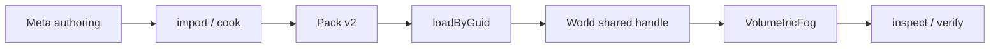
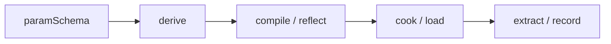

# @forgeax/engine-types

Mesh LOD author facts are part of the root `MeshAsset`: `lods` contains ordered
ordinary mesh GUIDs and absolute `screenCoverage` thresholds, while
`lodHysteresis` is an optional fractional band. There is no `LodAsset` or ECS
threshold component; importers validate and materialize these facts from their
source sidecars.

## Volumetric fog MVD contract

体纹理的公开数据只保留 `shape.extent`、`shape.viewDimension` 与 `mips`。
AI 用户应沿以下单一链路传递同一 GUID；`generation`、`digest` 和 `sourceKey`
是 producer/Pack receipt 的证据，不是 TextureAsset 的平行尺寸字段。



遇到结构化错误时先读取 `code`、`detail`、`hint`；修复 source 或 producer 后以原 GUID
重新 cook，并验证新的 receipt。

### `texture2d_array` / `texture3d` literal recipe

`paramSchema` names the sampled resource once. [`derive`](./src/derive-paramschema.ts)
then owns the sampler-first bindings and the WebGPU view dimension; the WGSL
declaration and the loaded `TextureAsset.shape` must agree with that projection.

| `paramSchema.type` | WGSL view | `TextureAsset.shape.viewDimension` / derived BGL |
|:--|:--|:--|
| `texture2d_array` | `texture_2d_array<f32>` | `2d-array` |
| `texture3d` | `texture_3d<f32>` | `3d` |

```ts
import type { ParamSchemaEntry } from './src/index.js';

const fogTextures = [
  { name: 'layers', type: 'texture2d_array' },
  { name: 'volume', type: 'texture3d' },
] satisfies readonly ParamSchemaEntry[];
```

For that schema, the material group keeps the derived uniform/coordinate entry
at binding `0`, then emits each filtering sampler before its texture view:

```wgsl
@group(1) @binding(1) var layers_sampler: sampler;
@group(1) @binding(2) var layers: texture_2d_array<f32>;
@group(1) @binding(3) var volume_sampler: sampler;
@group(1) @binding(4) var volume: texture_3d<f32>;
```

The build gate [`compareMaterialBindings`](../shader-compiler/src/compare-param-schema.ts)
returns a structured `material-shader-binding-mismatch` when a reflected view
dimension or binding differs. Read `error.code`, `error.detail`, and
`error.hint`, repair the WGSL or producer shape, and recook the same GUID; do
not infer a layer or slice from a URL.

## Material contract index

## 灯光与资产入口

三条最短入口：

1. `RectAreaLight` 通过 `@forgeax/engine-render` 声明 `color`、`intensity`、`width`、`height`、`range`。
2. `SpotLight` 通过 `iesProfile` 绑定 `IesProfileAsset`，通过 `cookie` 绑定现有 `TextureAsset`，并用 `rollDeg` 指定方位角。
3. `LightProbe` 只声明 `irradiance` 与 `radius`；运行时从同一 GUID Catalog 读取已验证的资产。

这些字段是 authored POD；Pack/producer 生成 published 记录，Catalog 只提供定位，runtime 只接受 admitted/accepted 的只读投影。`current`、`stale`、`lastKnownGood` 与 `verified` 是不同证据层，不能互相替代。

### Extended-lighting evidence layers

`authored -> published -> admitted -> accepted/LKG -> recovered -> verified` is
an evidence sequence, not a compatibility union. A missing capability remains
`not-run` or `unavailable`; it never becomes `verified` because a schema or
Null-RHI check passed. The four parity carriers use one fixture identity and
the same `linearHdr` numeric ROI contract.

`MaterialAsset` is one authored subject. `types` owns its closed vocabulary;
Pack owns publication; `shader-compiler` owns composition, reflection, and
WASM provenance; `assets-runtime` and render consume read-only projections.
The identity layers are `materialContractDigest`, `sourceClosureDigest`,
`layoutIdentity`, `programIdentity`, `cookIdentity`, and
`materialPublicationIdentity`. On failure inspect `current` against
`generation`, repair the first producer divergence, cold-cook the same GUID,
then verify receipt, artifact, and provenance before retrying.

## MaterialAsset 唯一成功路径

`paramSchema -> derive -> compile/reflect -> cook/load -> extract/record`
是从作者声明到 GPU draw 的唯一主线。`coordinateSet` 与
`physicalUvScale` 随每个纹理槽进入派生记录；`layoutIdentity` 与 cook receipt
绑定，发生 source、schema 或 WGSL 变化时必须修复 producer 并 recook。



> [!CAUTION]
> 诊断只读取结构化 `code`、`detail` 与 `hint`。先 inspect，再修复 producer
> 或 cook 输入并重跑；不要从 URL、数组位置或非结构化文本推断 material identity。

> [!IMPORTANT]
> MaterialAsset is the one authored material entry point. Author `passes`, `parameters`, `values`, `parent`, and structured texture `coordinates`; the build cooks the resolved contract and runtime loads that record by GUID. Shader source identity, pack identity, and runtime handles remain derived or injected facts.

## MaterialAsset route

Use [`MaterialAsset`](./src/index.ts) for both built-in and custom materials. A root declares `passes` and the effective parameter contract; a child changes only the values it owns through `parent`. `MaterialTextureValue.coordinates` carries the glTF texture set and transform per slot. The recovery route is: validate the payload, cook the specialization, publish the record and artifact, then call `loadByGuid` and allocate a World handle from the loaded payload.

> **Single source of truth for pure literal types and enums shared across RHI / shader / future render packages.** POD types / zero runtime constants / single-source strategy -- `export type` only, never redefine `@webgpu/types` runtime constant values (decision S-6 / research F-2 option (b)).

> **Material types: `MaterialAsset` only.** Author a root contract in `parameters` and `passes[].program.module`; a child keeps only `parent` and changed `values`. The build validates and cooks this payload, while runtime loads the cooked record by GUID. See [`packages/shader/README.md`](../shader/README.md) for module composition and [`packages/pack/README.md`](../pack/README.md) for the pack shape.

## Mesh vertex color contract

The public runtime identity for per-vertex color is the optional
`MeshAsset.attributes.color` field. It is a linear RGBA `Float32Array` with
exactly four finite values per vertex; there is no `colors0` alias,
`hasColor` ledger, or material switch. glTF `COLOR_0` and procedural mesh
authors converge on this field before rendering.

Geometry owns the immutable `VertexLayoutProjection` consumed by packing and
rendering. Its canonical host input is color `@location(13)` with
`float32x4`/16-byte storage, and existing host locations `0..12` remain
stable. Start at [`packages/geometry/README.md`](../geometry/README.md) for
the authoring example and projection/packer entry points; downstream asset
cook and runtime loaders should carry that projection rather than hand-coding
offsets or stride. Malformed or non-finite color is an expected failure and
must be fixed at its producer; absent color is the only white/no-stream path.

## AssetEvidence schema

`Asset` is the closed 17-kind durable payload union. Public consumers use the
existing names `AssetGuid`, `sourceKey`, `refs`, `artifacts`, `mediaType`, and
`programFingerprint`; owners may narrow a successful `loadByGuid<T>` result to
the concrete type without parsing error messages. Errors retain `code`,
`expected`, `hint`, and discriminated `detail` so recovery remains executable.

`AssetEvidence` is the derived, read-only join for one GUID. Its source of truth remains the producer source declaration, the catalog locator (`packageUrl` and optional `cookReceiptUrl`), the producer-owned `CookReceipt`, and Pack v2 artifact verification. This package owns the TypeScript vocabulary and closed error union; it does not infer facts from a catalog row alone.

The ScriptablePack consumer matrix is the complete durable union: `mesh`,
`material`, `scene`, `texture`, `equirect`, `sampler`, `font`,
`render-pipeline`, `tileset`, `video`, `skeleton`, `skin`, `animation-clip`,
`animation-graph`, `audio`, and `particle-effect`, and `ies-profile`. The authoritative ordered
list remains `SCRIPTABLE_PACK_ASSET_KINDS`; this paragraph is an AI-facing
index, not a second union.

Use the explicit states when presenting diagnostics: `notRequired`, `notCooked`, `failed`, `ready` with `current` or `stale` freshness, and `unknown`; artifact/package verification is separately `notChecked`, `passed`, or `failed`. `unknown` means the required evidence capability was unavailable, not that a check passed.

The schema is the SSOT in [`src/asset-evidence.ts`](./src/asset-evidence.ts). Producers and consumers should link to it instead of copying member tables. Offline callers can exercise the same chain with `forgeax asset inspect|verify --root <project> --json`. For catalog-scoped GUID evidence, use `lookup/verify --guid --project --catalog --json` through the unified CLI so the project and catalog remain explicit authorities.

> [!CAUTION]
> The built-in standard module is selected by the cooked `program.module`. Runtime lighting remains a render concern; it is not a second material discriminant.

## Shape invariants

- **POD types** -- only `type` declarations (numeric aliases / unions / pass-through alias), no `class` / `function` / `const` literal values.
- **`AssetErrorCode` 19-member closed union** -- SSOT at [`src/index.ts:993-1017`](./src/index.ts). Three codes added in feat-20260608-mesh-multi-section-primitive-multi-material-slot: `'mesh-renderer-material-count-mismatch'` (materials.length != submeshes.length), `'mesh-asset-submeshes-empty'` (submeshes array is empty), `'mesh-submesh-index-range-out-of-bounds'` (submesh index range exceeds parent index buffer). Each carries a structured `.detail` narrowed per code via the `AssetErrorDetail` discriminated union. See [AGENTS.md](../../AGENTS.md) Error model table for the full 19-member roster.
- **Zero runtime constants** -- never redefine `BufferUsage.MAP_READ` etc.; upstream callers directly consume `@webgpu/types` injected global `GPUBufferUsage.MAP_READ`.
- **Single-source strategy** -- fields exported by `@webgpu/types` (e.g. `GPUTextureFormat`) are pass-through aliased in this package, never redefined. `RhiErrorCode` and other forgeax-owned closed unions are closed within their owning packages (zero cyclic dependency with this package).

## Entry points

| Entry | Surface | Browser-safe? |
|:--|:--|:--|
| `@forgeax/engine-types` (main) | POD types + closed-union aliases (math-free, zero `ws`) | yes |
| `@forgeax/engine-types/inspector-client` | `defaultConnect` / `InspectorClient` plus `INSPECTOR_DEFAULT_HOST` / `INSPECTOR_DEFAULT_PORT` — JSON-RPC 2.0 WS client and its CLI connection defaults | **Node-only** (`exports['./inspector-client']` carries `node` condition + `default: null`; `ws` is a `peerDependencies` + `peerDependenciesMeta.ws.optional=true` — consumers must install `ws` themselves to use this sub-export) |

## API index

`export type` only on the main entry, zero runtime constants. Full main-entry export list at [`src/index.ts`](./src/index.ts).

| Category | Exports | Description |
|:--|:--|:--|
| GPUFlagsConstant alias | `BufferUsageFlags` / `TextureUsageFlags` / `MapModeFlags` / `ShaderStageFlags` / `ColorWriteFlags` | TS side collapses to `number`; runtime values provided by `@webgpu/types` injected globals |
| Enum alias pass-through | `TextureFormat` / `AddressMode` / `FilterMode` / `CompareFunction` / `PrimitiveTopology` / others | `@webgpu/types` namespace literal union pass-through |
| Pass-based material types | `ParamSchemaEntry` / `MaterialAsset` / `MaterialPass` | ParamSchema entry shape + MaterialAsset with passes[] + pass descriptor; see MaterialAsset section below |
| Asset register contracts | `register<MaterialAsset>()` / `registerWithGuid<MaterialAsset>()` / `lookupMaterialShader()` | Runtime factory functions + validation; detail in `packages/runtime/README.md` |
| Remote error model | `RemoteErrorCode` / `RemoteError` | 5-member closed union (script-syntax-error / script-runtime-error / server-startup-failed / server-not-running / eval-result-not-serializable) + structured interface/detail; runtime class lives in `@forgeax/engine-remote/errors` (`implements RemoteError`); see [`@forgeax/engine-remote` README](../remote/README.md) for the full error model |

### Asset producer contract

> [!IMPORTANT]
> Producer facts are the canonical published truth. Consumers read the fields
> below and never infer identity, provenance, or topology from a URL, filename,
> DDC location, or array position.

`AssetSubjectRef`, `ProviderProvenance`, `ResourceRevision`, `AssetRelation`,
`CatalogDiagnostic`, and `TopologyDiff` are neutral producer-owned PODs.
`CatalogEntry` carries them through one stable shape:

| Field | Role | Optional behavior |
|:--|:--|:--|
| `guid` | Asset identity | Required and stable across locator changes |
| `packageId` | Producer package identity | Omit when the producer cannot prove it |
| `provenance` | Provider and version evidence | Omit when no evidence was published |
| `revision` | Revision continuity evidence | Omit when no revision was published |
| `sourceKey` | Stable imported-output identity | Required for keyed multi-output matching |
| `sourceIndex` | Producer output position | Locator evidence only; never an identity fallback |
| `relativeUrl` / `sourcePath` | Payload locators | Replaceable; never used to reconstruct producer facts |
| `relations` / `diagnostics` | Typed edges and machine-readable signals | Preserve exactly when present |

The propagation contract is a one-way chain:

`meta declaration → DDC pack row → pack-index/delta → static or URL CatalogSource`

Each stage may add a derived legacy projection such as `relativeUrl`, but it
must not replace or reinterpret the producer-owned fields. Missing evidence
stays missing; a consumer must not synthesize a provider, package, relation,
or stable source key.

#### Structured recovery

`CatalogDiagnostic` fields are read by property, not by parsing `message`:

`validateCatalogDelta(...)` is the shared fail-closed boundary for incoming
Catalog changes. `catalogDeltaDigest(...)` canonicalizes row key order and
change ordering before deriving the semantic digest; consumers must compare
the digest rather than infer freshness from arrival order.

| Field | Meaning |
|:--|:--|
| `code` | Stable failure category |
| `subject` | Affected asset, package, or resource |
| `expected` / `actual` | Machine-readable mismatch context |
| `hint` | Executable recovery direction |
| `authority` | Whether producer, pack, or catalog owns the signal |

When a result is not authoritative, callers should reject the update or
return to the last verified revision. Legacy arrays are projections of a
canonical result; they are not a second source of truth.

## Particle effect asset identity

`ParticleEffectAsset` is the runtime-ready `particle-effect` arm of the closed
`Asset` union. Its payload is intentionally small and JSON-safe:

```ts
interface ParticleEffectAsset {
  readonly kind: 'particle-effect';
  readonly schemaVersion: 2;
  readonly programFingerprint: string;
  readonly emitters: readonly { readonly id: string; readonly capacity: number }[];
  readonly program: {
    readonly format: 'forgeax-vfx-program-2';
    readonly fingerprint: string;
    readonly emitters: readonly {
      readonly id: string;
      readonly module: string;
      readonly capacity: number;
      readonly backend: { readonly required: 'gpu' };
      readonly space: 'local' | 'world';
      readonly schedule: object;
      readonly bounds: object;
      readonly renderers: readonly object[];
      readonly simulationWhenCulled: 'continue' | 'pause' | 'restart-on-visible';
      readonly wgsl: string;
      readonly reflection: object;
    }[];
  };
}
```

The asset-local GPU program is part of this durable Pack payload; the focused
VFX packages own authoring, compilation, host attachment, and execution.
`AssetTagMap['particle-effect']`
is `'ParticleEffectAsset'`, so loading, shared ECS handles, and
`ParticleEffectPlayer.effect` use one identity.

| Need | Public owner | Recovery signal |
|:--|:--|:--|
| Author and validate source | `@forgeax/engine-vfx` | `vfx-source-invalid` with `detail.path` |
| Compose WGSL and cook | `@forgeax/engine-vfx-compiler` | `vfx-hook-*`, `vfx-module-missing`, or `vfx-shader-invalid` |
| Locate a package by GUID | Pack v2 catalog / `AssetRegistry` | catalog and package errors with `packageUrl` |
| Load a ready payload | `loadVfxGpuEffect` | v2 artifact/fingerprint errors |
| Hand off author intent | `ParticleEffectPlayer` from `@forgeax/engine-vfx` | ECS `Result` and schema reflection |
| Simulate and render | `createVfxRuntimeHost` from `@forgeax/engine-vfx-render` | RenderFeature capability/readiness errors and runtime diagnostics |

See [`packages/vfx/README.md`](../vfx/README.md) for the short consumer path and
[`packages/pack/README.md`](../pack/README.md) for the Pack v2 envelope and
asset-local artifact contract.

### Particle runtime boundary

`@forgeax/engine-types` keeps the shared identity stable while the focused VFX
package owns runtime behavior:

| Boundary | Owner | Contract |
|:--|:--|:--|
| Asset readiness | `AssetRegistry` | Resolve GUIDs and expose validated payloads before the World receives a shared handle. |
| Clock | ECS `World` | `FixedUpdate` and `FixedTime` decide which particle ticks execute; Simulation does not privately replay dropped time. |
| Live intent | `@forgeax/engine-vfx` | Produce bounded ordered fixed-tick intents; never own RHI resources. |
| GPU state and output | `@forgeax/engine-vfx-render` | Persist simulation buffers and project directly into indirect billboard/mesh draws without readback. |
| Compiler boundary | `@forgeax/engine-vfx-compiler` | Produce the asset-local program at build time; never become a runtime dependency. |
| Rendering boundary | `@forgeax/engine-render` | Provide a kind-free compute/external-buffer/indirect RenderFeature seam. |

This package does not define a second particle program, player, runtime
resource, renderer feature, or registry.

## Handle

> Cross-package `Handle<T,M>` single physical SSOT (feat-20260517-handle-type-unify). This section is the AI user's mid-level detail reference; top proposition at [`AGENTS.md` Breaking changes](../../AGENTS.md#breaking-changes) 2026-05-18 row; bottom-level fallback at [`src/handle.ts`](./src/handle.ts) IDE hover JSDoc.

### Brand shape

`Handle<T,M>` is a dual-axis phantom-branded `number`, zero runtime overhead (`__handle` field only exists at the type level), TS compile-time brand enforces cross-target / cross-mode non-assignability (charter P3 explicit failure + P4 consistent abstraction):

```ts
export type Handle<T extends string, M extends 'unique' | 'shared'> = number & {
  readonly __handle: { readonly target: T; readonly mode: M };
};
```

- **`T extends string`** -- asset target tag (e.g. `'MeshAsset'` / `'TextureAsset'`); cross-tag `Handle<'MeshAsset',M>` and `Handle<'TextureAsset',M>` are mutually non-assignable.
- **`M extends 'unique' | 'shared'`** -- release responsibility: `'unique'` is tracked by ECS; `'shared'` is held by an external owner such as `AssetRegistry`; cross-mode non-assignability is a TS compile-time redline.

Convenience aliases:

| Alias | Shape | Where used |
|:--|:--|:--|
| `UniqueHandle<T>` | `Handle<T, 'unique'>` | ECS-owned handle; external callers normally write `Handle<T, 'unique'>` |
| `SharedHandle<T>` | `Handle<T, 'shared'>` | `AssetRegistry.register<T>` return signature / `MeshFilter.assetHandle` column type |

### `AssetTagMap` 18-member table

`AssetTagMap` is the closed mapping SSOT from `Asset.kind` literal to brand `target` tag string literal (D-1 path (a)); adding a new Asset variant only requires adding one row to this table + one line to `Asset` union for `register<NewVariant>(asset)` to correctly return `Handle<'XxxAsset','shared'>` (charter F1 single-indexable):

| `kind` literal | `target` tag |
|:--|:--|
| `'mesh'` | `'MeshAsset'` |
| `'texture'` | `'TextureAsset'` |
| `'equirect'` | `'EquirectAsset'` |
| `'sampler'` | `'SamplerAsset'` |
| `'material'` | `'MaterialAsset'` |
| `'scene'` | `'SceneAsset'` |
| `'audio'` | `'AudioClipAsset'` |
| `'skin'` | `'SkinAsset'` |
| `'skeleton'` | `'SkeletonAsset'` |
| `'animation-clip'` | `'AnimationClip'` |
| `'animation-graph'` | `'AnimationGraph'` |
| `'shader'` | `'MaterialShader'` |
| `'font'` | `'FontAsset'` |
| `'render-pipeline'` | `'RenderPipelineAsset'` |
| `'tileset'` | `'TilesetAsset'` |
| `'video'` | `'VideoAsset'` |
| `'particle-effect'` | `'ParticleEffectAsset'` |

`MaterialAsset` is the closed material payload used by built-in and custom
passes. `TagOf<MaterialAsset>` is `'MaterialAsset'`; module identity and cook
facts are separate derived records, not authored asset variants.

Adding a 6th `Asset` closed-union member without syncing this table -> `TagOf<NewAsset>` resolves to `never`, downstream `register<NewAsset>` static failure surfaces the missing entry (charter P3 explicit failure).

### `TagOf<T>` mapping

Distributive conditional resolves an Asset variant TS type to the corresponding brand `target` tag literal:

```ts
export type TagOf<T extends Asset> = T extends { kind: infer K }
  ? K extends keyof AssetTagMap
    ? AssetTagMap[K]
    : never
  : never;
```

`AssetRegistry.register<T extends Asset>(asset: T): Handle<TagOf<T>, 'shared'>` is the primary consumer of this mapping -- AI users write `register(meshAsset)` and get `Handle<'MeshAsset', 'shared'>` without explicit generic parameter at the call site.

### Three helper signatures

```ts
export function toUnique<T extends string>(raw: number): Handle<T, 'unique'>;
export function toShared<T extends string>(raw: number): Handle<T, 'shared'>;
export function unwrapHandle<T extends string, M extends 'unique' | 'shared'>(
  h: Handle<T, M>,
): number;
```

- **`toUnique<T>(raw)`** -- brand-creation factory for ECS-owned handles.
- **`toShared<T>(raw)`** -- brand-creation factory for externally owned handles such as asset-registry entries.
- **`unwrapHandle(h)`** -- brand removal helper, runtime identity; exists to converge all "brand -> raw u32" conversion points into one function, AC-01 grep gate sweeps scattered `as unknown as number` literals (D-7 / D-8 cast collapse plan). AI users at spawn-site / register-site typically do not need to call this directly (charter P1 progressive disclosure).

Usage example:

```ts
import {
  type Handle,
  toShared,
  unwrapHandle,
} from '@forgeax/engine-types';
import { createRenderer } from '@forgeax/engine-runtime';

const rendererResult = await createRenderer(canvas);
if (!rendererResult.ok) throw rendererResult.error;
const renderer = rendererResult.value;

// Asset registries return Handle<TagOf<T>, 'shared'>; this sample uses the
// shared-handle constructor to keep the vocabulary example independent of a
// concrete registry owner.
const meshHandle = toShared<'MeshAsset'>(1);
//    ^? Handle<'MeshAsset', 'shared'>

// builtin handle u32 -> branded handle
const HANDLE_FOO: Handle<'MeshAsset', 'shared'> = toShared<'MeshAsset'>(0xdead);

// brand removal (only when interacting with underlying Map<number, ...> / data structure keys)
const raw: number = unwrapHandle(meshHandle);
```

### Cross-package re-export pattern

Same precedent as `LocalEntityId` / `SceneInstanceId`:

- Physical SSOT is one file (`packages/types/src/handle.ts`); package barrel `index.ts` pass-through via `export * from './handle'`.
- `@forgeax/engine-ecs` barrel re-exports a **narrowed subset** of the handle vocabulary; the complete brand and helper surface is available from `@forgeax/engine-types`.
- Under `verbatimModuleSyntax: true`, `export type` and `export { runtime }` are strictly separate.
- `UniqueHandle<T>` / `SharedHandle<T>` are convenience aliases; the internal string representation is not part of the public API.

### Internal conventions

- **String values are not handles** -- schema vocab `'string'` materializes as a native JS `string`; the storage representation is internal.
- **`AC-01` exemption single point** -- only the helpers in `packages/types/src/handle.ts` may contain the brand-creation cast; brand creation elsewhere must route through `toUnique` / `toShared`. `rg -n 'as unknown as Handle<' packages apps` should hit 0.
- **`unwrapHandle` is the sole channel for eliminating `as unknown as number`** -- `rg -n 'as unknown as number' packages apps` expected 0 hits (feat-20260517 M2-M4 sweep consequence).

## MeshAsset material slots

`MeshAsset.materialSlots[]` is the authoritative material topology of a mesh.
Every `Submesh.materialSlot` indexes this table; multiple submeshes may share
one slot. A slot has a unique `slotName`, an optional producer-stable
`sourceKey`, and an optional `defaultMaterial` GUID.

| Layer | Stored fact | Meaning |
|:--|:--|:--|
| `MeshAsset.materialSlots[i]` | default GUID or no GUID | Imported/shared default owned by the mesh |
| `Submesh.materialSlot` | slot index | Which logical binding a draw section consumes |
| `MeshRenderer.materials[i]` | handle, `0`, or missing | Per-instance override; `0`/missing inherits |

> [!IMPORTANT]
> Effective binding order is `renderer override → mesh default → engine default`.
> Importers emit empty `MeshRenderer.materials` arrays for canonical scene
> instances. Copying imported defaults into every scene node would create a
> second source of truth and make reimported defaults stale.

## MaterialAsset

`MaterialAsset` is the only authored material shape. Its fields are defined in
[`src/material/asset.ts`](./src/material/asset.ts) and mirrored by
[`schema/material.schema.json`](./schema/material.schema.json).

```ts
const child = {
  kind: 'material',
  parent: parentGuid,
  values: { baseColor: [0.2, 0.55, 0.95, 1] },
} satisfies MaterialAsset;
```

`parent` is an `AssetGuid`, never a runtime handle. A root owns the complete
`parameters` contract and its `passes[].program.module`; a child overrides
whole named values or whole named passes. Texture coordinates stay with each
texture value. The build resolves and cooks this graph; runtime only loads the
result by GUID and allocates a World handle from the loaded payload.

### Standard physical root projection

The Standard root uses the same `MaterialAsset` shape for base and physical
materials. Declaring a layer group in `parameters` selects its transient
`StandardLayerPlan`; `values` only supplies authored facts. These groups are
complete-or-absent contracts, so a child cannot invent a missing field:

| Group | Required parameters | Texture supplements |
|:--|:--|:--|
| clearcoat | `clearcoat`, `clearcoatRoughness` | `clearcoatTexture`, `clearcoatRoughnessTexture`, `clearcoatNormalTexture`, `clearcoatNormalScale` |
| anisotropy | `anisotropyStrength`, `anisotropyRotation` | `anisotropyTexture`; tangent frame is required even without the map |
| sheen | `sheenColor`, `sheenRoughness` | `sheenColorTexture`, `sheenRoughnessTexture` |
| iridescence | `iridescence`, `iridescenceIor`, `iridescenceThicknessMinimum`, `iridescenceThicknessMaximum` | `iridescenceTexture`, `iridescenceThicknessTexture` |
| specular / IOR | `specular`, `specularColor`, `ior` | `specularTexture`, `specularColorTexture` |

`STANDARD_MATERIAL_PARAM_SCHEMA` in
[`src/material/standard-schema.ts`](./src/material/standard-schema.ts) is the
name/type/default authority for these fields. Base-only roots remain eligible
for Deferred; a declared physical group or physical texture is Forward-only.
The recovery route is always `inspect → repair the producer/root → recook →
load the new receipt`; no runtime mask or layout patch is valid.

当参数声明为 `type: 'texture'` 时，`values` 支持直接使用纹理 GUID 字符串简写；省略
`parameters` 的默认材质也会对 `MATERIAL_TEXTURE_SLOTS` 中的纹理槽启用该简写。字符串
不会在颜色、标量、向量或其他字段上获得纹理语义。需要 sampler、强度或非默认坐标时使用结构化
`MaterialTextureValue`。坐标及其字段均可省略，运行时解析为 `set=0`、
`offset=[0,0]`、`scale=[1,1]`、`rotation=0`；cook/load 保持紧凑的字符串或结构化表达，
不把 identity 默认坐标写回创作资产。

| Field | Type | Description |
|:--|:--|:--|
| `passes` | `MaterialPassList` | Root pass contract; each pass names a `program.module`. |
| `parameters` | `readonly MaterialParameter[]` | Root parameter contract and defaults. |
| `values` | `Record<string, MaterialValue \| null>` | Child-owned values; `null` explicitly clears an inherited value. |
| `parent` | `AssetGuid` | One serialized parent edge. |

### MaterialPass fields

Each entry in `MaterialAsset.passes[]` is a `MaterialPass` with a named `program.module`.

| Field | Type | Default | Description |
|:--|:--|:--|:--|
| `name` | `string` | required | Pass identifier for by-name inheritance override |
| `program.module` | `string` | required | Build-time module identity selected by the cooked material |
| `program.vertexEntry` | `string` | `'vs_main'` | Optional vertex entry point |
| `program.fragmentEntry` | `string` | `'fs_main'` | Optional fragment entry point |
| `program.moduleSlots` | `Record<string, string>` | `{}` | Optional module-slot assignments |
| `renderState` | `Record<string, unknown>` | `{}` | Optional cooked pipeline state |

### MaterialRenderState fields

`MaterialRenderState` is the optional per-pass pipeline overrides. All fields are optional -- engine defaults apply when omitted.

> [!NOTE]
> mask fields (`stencilReadMask` / `stencilWriteMask`) live at the `GPUDepthStencilState` top level, NOT inside `stencilFront` / `stencilBack`. `frontFace` lives in `GPUPrimitiveState`.

| Field | Type | Default | Description |
|:--|:--|:--|:--|
| `depthWriteEnabled` | `boolean` | `true` | Whether depth writes are enabled |
| `depthCompare` | `string` | `'less'` | Depth comparison function |
| `stencilReadMask` | `number` | `0xFFFFFFFF` (WebGPU default) | Stencil read mask, top-level `GPUDepthStencilState` |
| `stencilWriteMask` | `number` | `0xFFFFFFFF` (WebGPU default) | Stencil write mask, top-level `GPUDepthStencilState` |
| `frontFace` | `'ccw' \| 'cw'` | `'ccw'` | Triangle front-face winding order |
| `cullMode` | `string` | `'back'` | Face culling mode |
| `blend` | `MaterialBlendState` | opaque | Blend state for alpha blending |
| `alphaToCoverageEnabled` | `boolean` | `false` | Enable MSAA alpha-to-coverage for cutout/partially covered materials |
| `stencil` | `MaterialStencilState` | no-op | Stencil test state (`StencilFaceState` per-face) |

`MaterialStencilState` (for the `stencil` field): `compare` / `failOp` / `depthFailOp` / `passOp` apply per-face (`stencilFront` / `stencilBack`). The mask fields are NOT on `StencilFaceState` -- they are top-level on `MaterialRenderState`.

Full interface source (SSOT): [`src/material/asset.ts`](./src/material/asset.ts).

### Legacy `channelMap` field (StandardMaterialAsset -- pre-feat-20260523)

`metallicRoughnessTexture` unpack four-channel index SSOT. **TS call surface** (form AI users write) is a string literal union object:

```ts
channelMap?: {
  metallic: 'r' | 'g' | 'b' | 'a';
  roughness: 'r' | 'g' | 'b' | 'a';
  occlusion?: 'r' | 'g' | 'b' | 'a';
}
```

| Field | Semantics | Default (glTF 2.0) | Shader consumption point |
|:--|:--|:--|:--|
| `channelMap.metallic` | metallic channel selection (`'r'|'g'|'b'|'a'`) | `'b'` (B channel) | `pbr.wgsl` `pick_channel(mrSample, material.channelMap.x)` |
| `channelMap.roughness` | roughness channel selection | `'g'` (G channel) | `pbr.wgsl` `pick_channel(mrSample, material.channelMap.y)` |
| `channelMap.occlusion?` | occlusion channel selection (OOS-3 reserved) | `'r'` (R channel) | Reserved OOS-3 occlusion path |

**Default behavior**: `MaterialAsset.channelMap === undefined` auto-fills glTF 2.0 default `{ metallic: 'b', roughness: 'g', occlusion: 'r' }` at `AssetRegistry.register` (feat-20260518 M3 / w16); explicit override path = caller passes `channelMap: { metallic: 'r', roughness: 'b', ... }` literal object at register.

**Validation**: `AssetRegistry.register` fail-fast rejects any value outside `'r'|'g'|'b'|'a'` -> `Result.err({ code: 'asset-invalid-value', detail: { field: 'channelMap.<key>', got: ... } })` (feat-20260518 AC-02).

> [!NOTE]
> Internal implementation note: host `AssetRegistry` maps `'r'/'g'/'b'/'a'` literals to 0/1/2/3 indices and packs into `vec4<u32>` UBO row (plan-strategy D-4); this is the host->shader UBO packing layer, **not the AI user call surface**. Shader only consumes packed scalar indices, no string vocab leaks to GPU side.

### `DirectionalLight.direction` field semantics

> feat-20260518-pbr-direct-lighting-mvp / w17.5 -- `DirectionalLight.direction` (an `array<f32, 3>` column since feat-20260709 M2) is the **outgoing direction**: light from source pointing toward the illuminated point in world space; shader fragment internally `normalize(-view.lightDir)` reverses to get the BRDF L vector. Host (`render-system-record.ts`) verbatim uploads the host-provided `direction` components to the view UBO, shader holds the reverse semantic unilaterally (single SSOT, no double-negation risk).

| Default | Meaning |
|:--|:--|
| `direction = [-0.5, -1, -0.3]` | Sun-like from upper-right-behind shining down onto forward-facing objects (M0 spike-report locked value; shared across multiple demos in `populateDemoWorld`) |
| `color = [1, 1, 1], intensity = 1` | White light unit intensity (GGX direct light SSOT default case) |

**Validation**: `AssetRegistry.register` does not validate `direction` magnitude; BRDF internally `nDotL = max(dot(n, l), 0.0)` naturally clamps back-face -> 0; `intensity = 0` is a legal case (feat-20260518 case C 0 light physically-correct black screen).

## Relationship with `@webgpu/types`

- **Dependency**: `@webgpu/types ^0.1.69` (version lock strategy detailed in repo root `AGENTS.md`).
- **Shape alignment**: All numeric aliases (`BufferUsageFlags` etc.) strictly correspond to `GPUFlagsConstant` namespace -- TS side collapses to `number`, runtime values defined by W3C CR 3.6.
- **No redefinition**: This package never writes `export const BufferUsage = { MAP_READ: 0x0001, ... }`.
- **Intentional differences**: None (this package only alias pass-through, zero shape divergence).

## Related packages

- [`@forgeax/engine-rhi`](../rhi) -- pure interface package, consumes POD types exported by this package.
- [`@forgeax/engine-rhi-webgpu`](../rhi-webgpu) -- WebGPU thin shim implementation (M2 introduced).
- [`@forgeax/engine-runtime`](../engine) -- async factory entry (M3 consumes this package indirectly via `@forgeax/engine-rhi-webgpu` injection).

### Name disambiguation (three layers)

The unqualified word "name" appears at three different semantic layers. Confusing them leads to silent bugs -- each layer has a distinct storage location, resolution rule, and consumer.

| Layer | What it is | Where it lives | How to read it | When to use it |
|:--|:--|:--|:--|:--|
| **Asset identity `name`** | The human-readable segment in `<packagePath>.<name>` -- a derived identity from the `Package` the asset belongs to, never stored on the POD | `AssetRegistry.resolveName(guid)` calls the `deriveAssetName` pure function; an explicit stored name wins for authored entries regardless of package cardinality, then a package basename or the no-package empty-string fallback is used | `reg.resolveName(guid)` | Inspector display, error messages, debug logs -- anywhere a human (or AI) needs to identify an asset |
| **Entity `Name` component** | An ECS component (`{ value: string }`) attached to spawned entities | ECS world storage (`world.get(entity, Name)`) | `world.get(e, Name).value` | Scene-graph debugging, joint-path resolution in skinning -- anything keyed off an entity's glTF node name. Unchanged by this feat (OOS-5) |
| **material module id** | Published identifier of a material shader (e.g. `'forgeax::default-standard-pbr'`) | Derived from the cooked pass program; not an authored asset field | `MaterialAsset.passes[].program.module` | Shader module lookup and pipeline selection |

> [!TIP]
> **How to choose**: when displaying an asset to a human, use `resolveName(guid)` (layer 1). When reading a spawned entity's original node name from glTF/FBX, use the `Name` ECS component (layer 2). When binding a custom material pass, use its cooked `program.module` identifier (layer 3).

**Example**: A `Hero.glb` file imports as a single-asset package (path `'hero.glb'`, 1 mesh asset) without an authored display name, so `resolveName(meshGuid)` returns `'hero.glb'` (basename of the package path; the extension is kept). A single authored entry named `NewMaterial` in `Materials.pack.json` resolves to `NewMaterial`. Entity `Name` components on nodes inside the scene read `'Helmet'`, `'Sword'`, etc. from the glTF node hierarchy. A custom PBR module published as `'forgeax::custom-stylized-pbr'` routes through the cooked pass, not through `resolveName`.

**Identity types** (new in feat-20260618): `Package` (`{ path, assetGuids, assetCount }`), `PackIndexEntry.name?` (add-only optional, build-time resolved), `InspectEntry.name` (non-optional string, runtime resolved). All discoverable via `@forgeax/engine-types` IDE autocomplete. See [`skills/forgeax-engine-assets/SKILL.md`](../../skills/forgeax-engine-assets/SKILL.md) for the full identity model.

### ShaderModule naming disambiguation

The unqualified name `ShaderModule` collides across two layers -- see [`packages/shader/README.md`](../shader/README.md) for the canonical disambiguation. In short: **wgsl ShaderModule** (from `engine-shader`, importable `.wgsl` file-level unit with `#define_import_path`) is distinct from the **RHI ShaderModule handle** (from `engine-rhi`, GPU-side compiled-shader opaque handle created by `rhi.createShaderModule`). The two are distinguished by module path only.

## FAQ

**Q: Why not directly `import type { GPUTextureFormat } from '@webgpu/types'`?**

A: Single-source strategy -- forgeax callers uniformly source from `@forgeax/engine-types`, making future spec version switches (`@webgpu/types v0.2.x` may introduce breaking changes) require adaptation only in this package.

**Q: Why not export runtime enum values (`BufferUsage.MAP_READ` etc.)?**

A: Decision S-6 / research F-2 option (b): spec at W3C CR 3.6 already defines `GPUBufferUsage.MAP_READ === 0x0001`; redefining would introduce dual-source silent breakage risk (charter proposition 4 explicit failure principle).

## Upgrade path

`@webgpu/types` upstream patches follow `.github/dependabot.yml` auto-PR + monthly human review fallback (decision S-4). v0.2.x major version switch requires a new closed loop (remove `ExplicitUndefined` mapped type and other migration steps).

## Mesh LOD contract

`MeshAsset.lods` is an ordered list of ordinary lower-detail MeshAsset GUIDs;
the owning MeshAsset is always LOD0. Each entry uses an absolute projected
height fraction, so selection thresholds decrease toward the last level.

```ts
interface MeshLodLevel {
  mesh: AssetGuid;
  screenCoverage: number; // (0, 1], strictly decreasing
}
```

The optional `lodHysteresis` is a fractional band in `[0, 1)`. LOD data is
authoring metadata, not a new asset kind: every lower GUID must be present in
the same Pack closure and in the root mesh `refs[]`.

`screenCoverage` is deliberately absolute and normalized to LOD0. This keeps
the glTF `MSFT_lod`, FBX `FbxLODGroup`, sidecar, CPU selector, and GPU row
layout on one contract. A producer that authorizes adjacent distance bands may
accumulate those bands first, then publish the resulting normalized coverage;
runtime never compares a level against a non-adjacent level.
