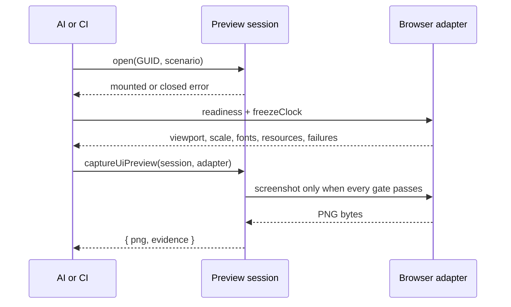
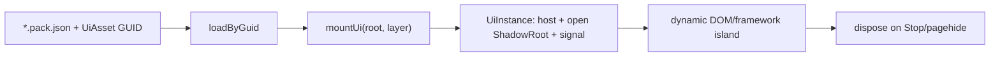

# `@forgeax/engine-ui`

Browser UI is an asset plus a small behavior island. The asset package owns the stable HTML/CSS payload; game code supplies dynamic text, template clones, input and lifecycle.

> [!IMPORTANT]
> `engine-ui` is browser-only. A headless consumer can validate/import the asset, but must not call `mountUi` without a DOM.

## Evidence and recovery

UI authoring is a producer boundary. The source declaration and its cook receipt are joined with catalog `packageUrl`/`cookReceiptUrl` and Pack v2 HTML/CSS/artifact verification as `AssetEvidence`. Preview and runtime mounting do not infer readiness from the catalog alone.

Use `notCooked`, `ready/current`, `ready/stale`, and `unknown` as distinct states; artifact/package results are `notChecked`, `passed`, or `failed`. Recover by fixing the authoring source or recooking, then run `lookup/verify --guid --project --catalog --json`. A headless probe can validate evidence, but `mountUi` still requires a DOM.

## Shortest recipe

Headless validation is available without a DOM:

```ts
import { validateUiAuthoring } from '@forgeax/engine-ui/authoring';

const checked = await validateUiAuthoring({ sourcePath: 'hud.ui.html', html, css });
if (!checked.ok) return emitJson(checked.error.detail.diagnostics);
```

Use `checked.value.category` (`native`, `normalizable`, or `runtime-bound`) and `checked.value.diagnostics` as the machine-readable authoring result. The source strings are returned byte-for-byte unchanged.

```ts
import { mountUi } from '@forgeax/engine-ui';

const loaded = assets.loadByGuid<UiAsset>(HUD_GUID);
if (!loaded.ok) return report(loaded.error);
const mounted = mountUi(loaded.value, { root: ctx.uiRoot, layer: 60 });
if (!mounted.ok) return report(mounted.error);
ctx.effect(() => () => mounted.value.dispose(), 'game/hud');
```

## Preview and deterministic capture

The public preview seam keeps browser-only work behind `@forgeax/engine-ui/preview`:

```ts
import {
  captureUiPreview,
  createDomPartScenario,
  createUiPreviewSession,
} from '@forgeax/engine-ui/preview';

const session = createUiPreviewSession({
  guid: HUD_GUID,
  assets,
  root: previewRoot,
  rect: { width: 320, height: 180 },
  scenario: createDomPartScenario({ requiredParts: ['root', 'score'] }),
});
const opened = await session.open();
if (!opened.ok) return recover(opened.error.code, opened.error.hint);
const captured = await captureUiPreview(session, browserAdapter);
if (!captured.ok) return recover(captured.error.code, captured.error.detail);
await writePng(captured.value.png);
await writeJson(captured.value.evidence);
```

When subscribing to asset changes, await the listener result. A subscribed target refresh that
rebuilds an invalid revision returns structured `preview-load-failed`; read
`error.detail.diagnostics` for each source path/range and repair hint, then call
`session.retry()` after fixing the source. Do not parse `message`.



The adapter must report `viewport`, `deviceScale`, `fonts`, `resources`, `scenario`, and `clock` as true, with empty `console`, `page`, and `request` failure arrays. Its `screenshot` seam should return the actual mounted host screenshot from the browser compositor, not a fixture byte string. `evidence` records the frozen clock, discovered `data-ui-part` names, DOM host count, focus, resource failures, and lifecycle state. Keep the PNG and evidence together; the image is visual context, while the JSON is the functional authority.

| Capture code | Recovery action |
| --- | --- |
| `capture-not-ready` | Read `error.detail.unmet`, satisfy each named gate, then retry in the same fixed browser. A failed result never has `png`. |
| `capture-failed` | Read `error.detail.stage`, repair the adapter's screenshot capability, and retry. |
| `preview-scenario-missing-part` | Restore the declared `data-ui-part` and call `retry()` or rebuild the session. |
| `preview-load-failed` | Inspect `error.detail.diagnostics` for source-located repair hints, fix the target source, then call `retry()`. |

> [!WARNING]
> Do not treat a screenshot as proof that fonts, companions, focus, or disposal succeeded. Do not parse `message`, mount a fallback into `document.body`, or replace a missing companion with a stand-in asset.



## Producer authoring descriptor

Every `kind: 'ui'` catalog row publishes the versioned `AssetAuthoringCapability.ui` descriptor from
`@forgeax/engine-types`. It is the discovery contract for AI and editor consumers: `preview` names
`createUiPreviewSession`, `mount` names the `mountUi` lifecycle and `onAction` port, and the state,
action, and read projections point to the host's JSON-shaped `gameProjection` seam. Input and
navigation use the DOM-native focus/ownership contract; font files remain producer-owned UI artifact
companions; localization currently reports a structured `missing-producer-capability` result.

This descriptor exposes existing producer seams. It does not give an editor permission to inspect a
game World or invent a second binding registry. Runtime action/read IDs and their semantic bodies stay
owned by the game bootstrap, while the Gateway and Content Browser project the catalog facts unchanged.

## Authoring and resources

### Profile and diagnostics

The versioned profile is exported as `UI_AUTHORING_PROFILE` and described by [`src/authoring/profile.schema.json`](src/authoring/profile.schema.json). Classification precedence is `runtime-bound` then `normalizable` then `native`; quality findings remain warnings and do not change an otherwise accepted result.

Blocking diagnostics use the shared import shape: `code`, `severity`, `sourcePath`, `sourceRange`, `rule`, `expected`, `actual`, `hint`, and optional `relatedLocations`. Branch on `error.code === 'source-validation-failed'` and inspect `error.detail.diagnostics`; do not parse error messages.

Normalizable surfaces (inline style, global selectors, root or parent URLs, generated classes) are reported without changing source. Runtime-bound surfaces (scripts, inline handlers, remote URLs, CSS imports, and CSS-in-JS markers) must be moved to a consumer-side framework island.

Authoring sources (`.ui.html` plus same-name `.ui.css`) remain the source-to-payload input for consumers that own an importer. The importer pairs the files and records relative image/font reads as private companions. The manifest owns exactly one public GUID; companions do not receive consumer GUIDs. Shared/demo author sources remain in the assets submodule; a consumer template may carry a small, template-owned pair under its own `assets/` root when the UI is part of that template's source closure. Use the pair for readable multiline authoring and keep the prepared `.pack.json` output generated.

The standalone DevKit host includes `createUiImporter()` in its default
build-time importer composition. A custom Vite host should register the same
self-declared `{ key: 'ui', import, finalize }` owner directly in its
`pluginPack({ importers: [...] })` list; do not maintain a second project
registry or wrap it with another key.

The sidecar's `source` names the `.ui.html` file, and the importer derives the
same-directory `.ui.css` companion. The generated Pack keeps the runtime
`UiAsset` shape (`html` and `css` strings); source readability and runtime
payload format are separate concerns.

The `*.pack.json` file remains the canonical contract for a deliberately prepared UI asset, such as a small hand-authored HUD or settings panel. It owns exactly one public GUID and stores the final HTML/CSS payload directly, so loading it does not invoke an importer, generate DDC, or require an `ImportTransport`. A consumer-owned prepared pack belongs in that consumer's `assets/ui` directory; a template that needs readable multiline UI should keep the `.ui.html` / `.ui.css` source pair and generate this Pack instead.

| Concern | Owner |
| --- | --- |
| HTML and CSS payload | UI pack |
| GUID and build transport | pack/import pipeline |
| dynamic text, events, template clones | game module |
| mount/dispose and ShadowRoot | `engine-ui` |
| run root and cleanup order | host (`apps/preview`) |

## Dynamic nodes and framework seam

Use ordinary DOM APIs inside the open shadow root. A popup can be cloned from a `<template data-ui-template>` and removed through `UiInstance.signal`. Frameworks may mount an island into an element that the asset exposes; the caller owns `createRoot`, `unmount`, and any portal target. The package does not ship React/Vue/Svelte adapters or claim framework certification.

```ts
const island = instance.host.shadowRoot?.querySelector('[data-framework-island]');
if (island) {
  const root = createRoot(island);
  instance.signal.addEventListener('abort', () => root.unmount(), { once: true });
}
```

## Input, modal and lifecycle

Interactive asset elements opt in with `pointer-events: auto`. The input package decides UI ownership from `event.composedPath()` and clears held state when ownership changes, focus leaves the window, or the run is stopped. A single settings modal owns its own inert backdrop, focus trap, <kbd>Escape</kbd> close, and focus restore. Settings in the default template are memory-only for the current run; no `localStorage` authority is implied.

`dispose()` is idempotent: it aborts `signal`, removes listeners and then removes the host. Hosts should dispose instances in reverse registration order and remove the run-scoped `uiRoot` on Stop/pagehide.

## Errors and prohibited fallbacks

Handle `UiError` by its closed `code` union and machine-readable `detail`; do not parse message strings. Do not silently mount to `document.body`, create a second UI manager, inject stable markup from TS, or hide a missing asset behind an empty root.

The independent Gallery/Preview Workbench, scenario matrix, visual baseline workflow, external design
adapters, and AI iteration workbench remain follow-up design: [`2026-07-21-html-css-ui-authoring-workflow-ecosystem-design.md`](https://github.com/ForgeaXGame/forgeax-engine-harness/blob/main/docs/specs/2026-07-21-html-css-ui-authoring-workflow-ecosystem-design.md).
