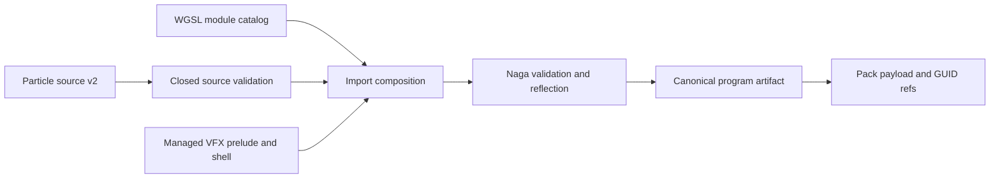

# @forgeax/engine-vfx-compiler

Build-time compiler for code-first GPU particle effects. It turns source metadata and small WGSL hooks into one deterministic, runtime-ready program artifact.

## Cook pipeline



> [!IMPORTANT]
> The compiler runs at import/build time. `@forgeax/engine-vfx`, player bundles, and shipped applications do not depend on Naga or a runtime shader compiler.

The producer entry in
[`asset-authority.schema.json`](../../asset-authority.schema.json) identifies this
package's current source owners. Its lifecycle evidence is the validated source
plus composed WGSL, the deterministic program fingerprint, and the native-cook
Pack projection. DDC and Catalog are disposable or derived; a failed or stale
cook is repaired from author source and never promoted as current runtime data.

## Public cook

```ts
import { cookParticleCodeEffect } from '@forgeax/engine-vfx-compiler';

const cooked = await cookParticleCodeEffect(source, {
  'sparks.vfx.wgsl': {
    entry: sparksWgsl,
    imports: { 'game::noise': sharedNoiseWgsl },
  },
});
if (!cooked.ok) return cooked;

// cooked.value.asset    -> particle-effect Pack payload
// cooked.value.artifact -> particle-effect/program.json
// cooked.value.refs     -> sorted material and mesh GUID references
```

Vite/Preview importers use `createParticleCodeNativeCooker(modules)`. Module discovery belongs to the bundler or asset gateway; the compiler receives an explicit catalog and performs no filesystem probing.

## Managed ABI

Author code supplies only:

```wgsl
fn vfx_spawn(ctx: VfxSpawnContext, particle: ptr<function, VfxParticle>)
fn vfx_update(ctx: VfxUpdateContext, particle: ptr<function, VfxParticle>)
```

The compiler owns compute entry points for spawn, update, hierarchical scan, stable compaction, billboard, mesh, ribbon, trail, and beam projection. It reflects each renderer's capacity and topology resources into the artifact. It also owns all runtime bindings. Author declarations that conflict with this surface fail with `vfx-reserved-surface-conflict`.

| Helper | Determinism contract |
|:--|:--|
| `vfx_integrate` | Explicit opt-in Euler integration using fixed delta |
| `vfx_random_spawn` | Addressed by seed, play cycle, particle ID, tick, sample key |
| `vfx_random_update` | Same address model; call order does not define randomness |

## Artifact contract

| Fact | Value |
|:--|:--|
| Key | `particle-effect/program.json` |
| Format | `forgeax-vfx-program-2` |
| MIME | `application/vnd.forgeax.vfx-program+json` |
| Fingerprint | SHA-256 of canonical program bytes |
| Reflection | hooks, composed imports, resources, entry points, bind-group layouts |

`reflectVfxRenderer` is the public compiler inspection helper for tooling and
tests. It returns topology, capacity, overflow policy, authored GPU inputs, and
resource identity that the runtime executes; it is not parser-only metadata.

Canonical object keys are sorted. Emitter and renderer order remain authored order. Payload emitter identities/capacities and the artifact fingerprint are checked again by the runtime loader.

## Errors

| Code | Meaning |
|:--|:--|
| `vfx-module-missing` | Source names a module absent from the explicit catalog |
| `vfx-hook-missing` | One required author hook is absent |
| `vfx-hook-invalid` | A hook name exists with the wrong signature |
| `vfx-reserved-surface-conflict` | Author code declares managed stages, bindings, or symbols |
| `vfx-shader-invalid` | Composition, Naga validation, or reflection failed; inspect `detail.cause` |

Every error carries `expected`, `hint`, and emitter/module detail. Cook never emits a partial program.
