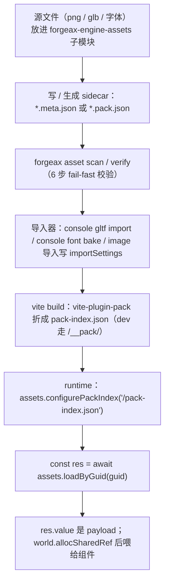
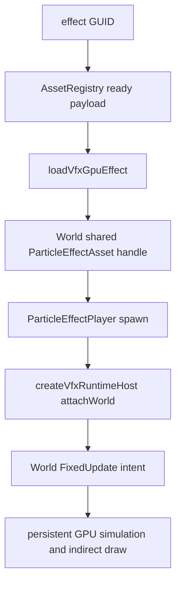

# Runtime asset and mesh contracts

Use this reference for mesh import, runtime registry calls, VFX, handles, identity,
and video assets.

## 多套 UV 导入 — glTF/FBX TEXCOORD_0..7 全保留

> [!IMPORTANT]
> **一句话价值：** glTF 和 FBX 导入器保留 `TEXCOORD_0..7`（最多 8 套 UV，对标 UE `MAX_TEXCOORDS=8`），mesh-bin v2 显式携带 uvSetCount——**AI 用户无需指定要几套 UV，导入自动保留，shader 声明即消费**。

### 导入行为

| 源格式 | 行为 | 生成 UV 套 |
|:--|:--|:--|
| **glTF**（`TEXCOORD_0..7`） | `parse-gltf.ts` 逐套解析 → `bridge.ts` 写入 interleaved + attributes `uv1Cat..uv7Cat` | 0..8 套（按源文件实有） |
| **FBX**（`FbxLayerElementUV` 多层） | `bridge.c` (ufbx WASM) for-loop 提取 `TEXCOORD_0..K` → `parse-mesh.ts` 消费 → `to-asset-pack.ts` 写入 interleaved | 0..8 套（按源文件实有） |
| **> 8 套** | 导入阶段静默截断到前 8 套 | 最多 8 套 |

> glTF 与 FBX 对**同套数 UV 产出行为一致**（AC-03：attributes 键集 + 套数一致）。interleaved buffer 的 canonical 顺序 = `position/normal/uv/tangent/skinIndex/skinWeight/uv1..uv7`，三处（glTF bridge / FBX to-asset-pack / deriveVertexBufferLayout）统一。

### mesh-bin header v2 契约

mesh-bin 格式从 16B v1 破坏性扩展到 **28B v2**（Optimal > compatible，无旧格式兼容）：

| offset (bytes) | 字段 | 类型 | 值 |
|:--|:--|:--|:--|
| 0 | version | u32 | 固定 `2` |
| 4 | uvSetCount | u32 | UV 套数（1..8） |
| 8 | floatsPerVertex | u32 | 显式 stride（12..26） |
| 12..27 | 保留字段 4 个（aabb / skin 信息） | 各 u32 | 与 v1 后 4 字段同语义 |

> `floatsPerVertex` 是显式 stride——解码器**不需要**靠 `vlen / 12` 反推（Derive：header 自描述）。`packMeshBin`（encode 出口）+ `unpackMeshBin`（decode 入口）各自校验（Fail Fast）。

### mesh-bin-contract-violation error（唯一失败路径）

当 header 的 version / uvSetCount / stride 不满足契约时，落结构化 error：

```ts
// unpackMeshBin 或 packMeshBin 入口校验失败
→ Result.err({
    code: 'mesh-bin-contract-violation',
    expected: 'version===2 && uvSetCount in [1,8] && stride self-consistent',
    hint: 're-cook the asset via importer',
    detail: { version: number, uvSetCount: number, stride: number }
  })
```

| 触发条件 | 位置 |
|:--|:--|
| `version != 2` | decode 入口 |
| `uvSetCount` 不在 [1,8] | encode 出口 / decode 入口 |
| `floatsPerVertex` 与 vlen/uvSetCount 自洽性失败（stride 不自洽或截断数据） | decode 入口 |

> [!IMPORTANT]
> **clamp 超界（shader 声明 m>mesh 实有 n）不是失败路径**——那是 M3 layout 层的静默 clamp-to-last，不触发此 error。只有真正的 header 数据损坏（version/uvSetCount/stride 格式级错误）才落 `mesh-bin-contract-violation`。

`mesh-bin-contract-violation` 是 `AssetErrorCode` 闭合联合的第 23 个成员（add-only minor）。AI 用户通过 `switch (err.code)` 穷举消费，读 `.detail` 字段定位不一致：`detail.version` / `detail.uvSetCount` / `detail.stride`。

### 错误自救

```ts
const res = await assets.loadByGuid<MeshAsset>(guid);
if (!res.ok && res.error.code === 'mesh-bin-contract-violation') {
  // res.error.hint = 're-cook the asset via importer'
  // 恢复：重新导入资产 → forgeax asset import <source>
  console.error(res.error.detail); // { version, uvSetCount, stride }
}
```

> **对 AI 用户的具体影响**：一次导入 = 数据债券已固化（mesh-bin 是 cooked artifact）。后续管网变更（如 mesh-bin 格式改版）需重新跑 importer cook（`gltf import` / `fbx import` 子命令），担当记：**.pack.json/.bin 是 import-cooked 产物，非源**。

## 统一 kind 词汇（declare 域只有 `texture`）

> [!IMPORTANT]
> **declare 域（sidecar `subAssets[].kind` + pack-index 行 `kind`）的贴图只有 `texture` 一个词，不再有 `image`**（feat-20260629 P1）。`image` 仅作为 **importer key**（`importer: 'image'`，引擎图片导入器）保留——它是"用哪个导入器"的标识，不是资产 kind。

- ✅ `subAssets[].kind: 'texture'`（贴图资产的 kind）
- ✅ `importer: 'image'`（用引擎图片导入器把 png/jpg 解码成 `texture`）
- ❌ `subAssets[].kind: 'image'`（已删除——declare 域不再有 `image` 这个 kind）

AI 用户读 schema / 本 skill 即知能力边界：贴图 kind 唯一词是 `texture`，无需在 `image` / `texture` 二义间猜。引擎自有 kind 全表见 `packages/types/src/index.ts` `Asset` union；host 自定义 kind 由 host importer + loader 自带（见上 §host 自定义 importer 注册）。

## meta `source` 双态读写协议

`source` 字段是可选的。源文件定位只有两种写法，由 sidecar 所在目录这一单一局部权威决定，项目不再维护第二套路径注册表：

1. **省略 `source`（推荐）**：同目录源文件与 meta 同名时，不写——引擎从 meta 文件名「去 `.meta.json`」自动推导
2. **相对路径**：源文件在 sidecar 子目录或其他显式相对位置时，相对 meta 所在目录解析

### 态一：省略 `source`（convention-over-configuration）

源文件与 meta 同目录、文件名一致（仅后缀差 `.meta.json`）时，**删除 `source` 键**。引擎推导规则单一：从 meta 文件名去掉 `.meta.json` 尾缀，得伴随文件名，取同目录下该文件。

```jsonc
// hero.png.meta.json — 省略 source，引擎推导同目录 hero.png
{
  "importer": "image",
  "importSettings": { /* ... */ }
}

// bleep.mp3.meta.json — 同上，推导同目录 bleep.mp3
{ "importer": "audio" }
```

```
目录布局：
  assets/
    hero.png              ← 源文件
    hero.png.meta.json    ← 省略 source → 自动推导 hero.png
    sfx/bleep.mp3         ← 源文件
    sfx/bleep.mp3.meta.json ← 省略 source → 自动推导 sfx/bleep.mp3
```

重命名源文件时同步重命名 meta 文件（保持 `basename + '.meta.json'` 对应），指针永不断。

### 态二：相对路径

```jsonc
// assets/models/hero.glb.meta.json
{ "source": "hero.glb", "importer": "gltf" }

// assets/models/hero.meta.json -> assets/models/meshes/hero.glb
{ "source": "meshes/hero.glb", "importer": "gltf" }
```

跨项目或 submodule 的文件必须作为显式 Pack/Meta root 交给 build host，并保持其 sidecar 与源文件的局部配对；Meta 内不再解析 `@name` 或读取 package.json 路径表。

### 错误码自救

源文件缺失只产生一个结构化孤儿错误——`switch (err.code)` 穷举后读 `detail` 字段自修正：

| 错误码 | 触发条件 | `.hint` | `.detail` 关键字段 | 修复动作 |
|:--|:--|:--|:--|:--|
| `pack-orphan-meta` | 省略推导或相对 source 解析后文件不存在 | remove the orphan .meta.json or add the missing source file next to it | `metaPath: string` — 孤儿 meta 路径；`expectedFile: string` — 解析后期望的绝对源文件路径 | 读 `detail.expectedFile`，补源文件到该位置，或修正 sidecar 的相对 `source` |

> [!IMPORTANT]
> **省略推导失败必报 `pack-orphan-meta`，不静默跳过**（charter P3）。省略 source 是新默认路径——engine 必须 fail-loud 而非默默忽略一个名字拼写能推导却路径无文件的 meta。

### 与 `SceneAsset.mounts[].source` 的区别

`meta.source`（string 双态，本文）与 `SceneAsset.mounts[].source`（int→refs[] 索引，见 §SceneAsset.mounts）**同名不同域**——前者是磁盘 sidecar 字段，string 类型，表示源文件路径；后者是场景嵌套的实体槽映射，int 类型，关联子 SceneAsset 的 refs[] 索引。本 feat 术语统一 **path**，避免与 `mount.source`（int）混淆。

## 核心 API 速查

| 名字 | 来源包 | 形态 | 用途 |
|:--|:--|:--|:--|
| `<source>.meta.json` | pack | `external-asset-package` sidecar | 有源转换资产的 subAssets + GUID + importSettings |
| `<name>.pack.json` | pack | `internal-text-package` sidecar | 自包含文本 / UI 资产（payload + refs，`assets[].name?` add-only）；UI 直接携带最终 HTML/CSS |
| `assets.loadByGuid<T>(guid)` | runtime | `async => Result<T, AssetError\|ImageError\|RhiError>` | 按 GUID 异步取回 payload `T`（包括 `AudioClipAsset`；feat-20260614 de-handle 后直接返 payload） |
| `decodeImageBytes(bytes, mime, opts?)` | assets-runtime | `async => Result<TextureAsset, ImageError>` | **运行时字节 → POD**：把游戏层自 `fetch` 得到的 PNG/JPEG 字节转为 `TextureAsset` POD，喂 `world.allocSharedRef('TextureAsset', pod)`。与磁盘 sidecar 路径（`loadByGuid`）职责显式分离——tweak-20260714 |
| `assets.configurePackIndex(url)` | runtime | `(string) => void` | 配置生产 `pack-index.json` URL，`loadByGuid` 用 |
| `assets.register<T>(asset)` | runtime | `=> Result<UnmanagedHandle<TagOf<T>>, AssetError>` | 编译期已知资产直接登记（无 GUID） |
| `assets.registerWithGuid<T>(guid, asset)` | runtime | `=> UnmanagedHandle<TagOf<T>>` | 带 GUID 登记（`loadByGuid` 内部入口） |
| `assets.resolveName(guid)` | runtime | `(guid) => string` | 统一解析 `<packagePath>.<name>` 的 name 段；从不抛错 |
| `assets.packageOf(guid)` | runtime | `(guid) => Package \| null \| undefined` | 查询 GUID 所属 Package（null=无 package，undefined=未注册） |
| `assets.rename(guid, newName)` | runtime | `=> Result<void, AssetError>` | 内存态改名；撞名返 `asset-invalid-value`，缺 GUID 返 `asset-not-found` |
| `assets.invalidate(guid)` | runtime | `(string) => void` | 使指定 GUID 缓存失效——清 assetCatalog 条目 + 该 GUID 的 packFileCache body + packIndexCache 条目 + 递增 per-GUID generation；下次 loadByGuid 触发全新 fetch（确实重新下载，不吃旧 body 缓存） |
| `assets.invalidateAll()` | runtime | `() => { clearedCount: number }` | 清空 assetCatalog + inFlight + packFileCache，packIndexCache 重置为 undefined（强制重 fetch index）+ 递增全局 generation；返回清空前条目数 |
| `Package` | types | interface（3 字段：path / assetGuids / assetCount） | 运行时包视图，经 types IDE autocomplete 发现 |
| `PackIndexEntry` | types | POD（含 `name?: string`） | `pack-index.json` 一行的内存形态 |
| `InspectEntry` | types | POD（含 `name: string`） | inspector `assets` root 单行 |
| `FontAsset` | types | POD | MSDF 字体资产（atlas Handle + glyph metrics） |
| `VideoAsset` | types | `{ kind: 'video', url: string }` | 世界空间视频纹理资产（运行时 kind，第 15 成员）；纯 `{url}` 描述符，`refs` 恒空孤立叶子 |
| `videoLoader` | runtime | descriptor-only Loader | 引擎自有默认 loader，注册在 `wireDefaultLoaders` 集（AI 用户无需手动 register）；同步返回 `payload as VideoAsset` |
| `rootsToSceneAsset(registry, world, roots)` | runtime | `=> Result<SceneAsset, SceneCollectEntityRefOutOfClosureError \| SceneCollectAssetGuidUnresolvedError>` | 活 entity 森林→`SceneAsset` 存回入口：沿 Children BFS 收子树，字段按 schema 派生（entity→localId、shared<>→GUID），ROOT ChildOf 剥离，任意 entity 可作 root（不要求 SceneInstance 守卫） |
| `serializeSceneAssetToPack(sceneAsset, guid?)` | runtime | `=> Result<Record<string, unknown>, SceneCollectAssetGuidUnresolvedError>` | `SceneAsset`→`.pack.json` POD 序列化：schema 派生 GUID→refs[] 索引化，遇 GUID 未命中 fail-fast |
| `GlyphText` | ecs | 组件 | world-space MSDF 文本；`glyphTextLayoutSystem` 自动加 MeshFilter+MeshRenderer |

> [!IMPORTANT]
> 取磁盘资产的方法名是 **`loadByGuid`**（不是 `load`），且 **async 返回 `Result`**——查 `.ok` 再用 `.value`。**feat-20260614 de-handle 后 `.value` 直接是资产 payload `T`**（如 `SceneAsset` / `MeshAsset` / `AudioClipAsset`），不再是 `Handle<T>`。音频行由 renderer 注入的 Web Audio loader 解码；调用方只需解析 GUID、`loadByGuid<AudioClipAsset>`，再用 `world.allocSharedRef('AudioClipAsset', value)` 绑定 `AudioSource.clip`，不手动读取 pack-index 或调用 URL decoder。用前必须先 `configurePackIndex(url)`（生产）或由 dev 的 `/__pack/` 提供索引，否则 GUID 查不到。

## 规范调用顺序



## VFX GPU program route

VFX uses the same GUID and readiness ownership as every other Pack v2 asset.
The build-time cooker composes the authored WGSL into a validated program;
runtime loads only that cooked artifact. `@forgeax/engine-vfx` owns the player
and FixedUpdate intents, while `@forgeax/engine-vfx-render` owns persistent GPU
state and indirect drawing.



The shortest public handoff is:

```ts
import {
  ParticleEffectPlayer,
  loadVfxGpuEffect,
} from '@forgeax/engine-vfx';
import { createVfxRuntimeHost } from '@forgeax/engine-vfx-render';
import type { AssetRegistry } from '@forgeax/engine-assets-runtime';

declare const assets: AssetRegistry;
declare const effectGuid: string;
declare const world: import('@forgeax/engine-ecs').World;
declare const camera: import('@forgeax/engine-vfx-render').ParticleRenderCameraSource;

const host = createVfxRuntimeHost({ camera });
const attached = await host.attachWorld({ world, assets });
if (!attached.ok) return attached;
const loaded = await loadVfxGpuEffect(assets, effectGuid);
if (!loaded.ok) return;
const effect = world.allocSharedRef('ParticleEffectAsset', loaded.value);
world.spawn({
  component: ParticleEffectPlayer,
  data: { effect, playing: true, seed: 7, timeScale: 1 },
}).unwrap();
```

Register `host.feature` when constructing the Renderer; features cannot be
added after Renderer creation. `attachWorld` installs the V2 loader and one
FixedUpdate producer. `AssetRegistry` remains responsible for GUID readiness,
the World owns the shared handle lifetime, and ordinary frames do not read
particle state back to the CPU. See [`packages/vfx/README.md`](../../../packages/vfx/README.md)
and [`packages/vfx-render/README.md`](../../../packages/vfx-render/README.md).

## idiom 代码骨架

```ts
import { createRenderer, MeshFilter, MeshRenderer, type SceneAsset } from '@forgeax/engine-runtime';

const renderer = await createRenderer(canvas);
await renderer.ready;
const assets = renderer.assets;
if (assets === null) throw new Error('backend not initialized');

// 1) point the registry at the build-time pack index
assets.configurePackIndex('/pack-index.json');

// 2) load a disk asset by its GUID -> payload T (async, Result)
const res = await assets.loadByGuid<SceneAsset>('0190a0b1-...-uuidv7');
if (!res.ok) {
  console.error(res.error.code, res.error.hint);
  throw new Error(res.error.code);
}
const scene = res.value; // directly SceneAsset, not Handle<SceneAsset>

// 3) resolveName: human-readable identity (three branches)
const name = assets.resolveName(someGuid); // "hero.glb" | "Body" | "myProcMesh" | ""

// 4) rename (in-memory only, OOS-1)
const r = assets.rename(someGuid, "Torso");
if (!r.ok) {
  switch (r.error.code) {
    case 'asset-invalid-value': // collision with another entry in same package
    case 'asset-not-found':     // GUID not registered
  }
}

// 5) instantiate a scene asset
const instance = assets.instantiate(scene);

// 6) invalidate a cached asset (scene switch / hot-reload) — clears its
//    catalogue entry + this GUID's cached pack-file body + its pack-index
//    entry, bumps per-GUID generation so in-flight loads return
//    asset-invalidated. The next loadByGuid genuinely re-fetches (no stale
//    body cache served).
assets.invalidate(someGuid);
const reloaded = await assets.loadByGuid<SceneAsset>(someGuid);
if (!reloaded.ok) {
  // error.code may be 'asset-invalidated' if in-flight was discarded — retry
  const retry = await assets.loadByGuid<SceneAsset>(someGuid);
}

// 7) invalidate everything — clears all catalogue entries + in-flight +
//    packFileCache, and resets packIndexCache to undefined so the next load
//    re-fetches the pack-index too.
const { clearedCount } = assets.invalidateAll();
```

## identity 三支 + 边界

`resolveName` 使用单一优先级规则：有显式存储名时始终使用该名称，
否则有 package 时使用路径 basename，无 package 时返回自带名或空串。
**从不抛错**，缺名时按确定降级（AC-15）：

| GUID 所属 | resolveName 返回 | 来源 |
|:--|:--|:--|
| 任意 package（entry 有显式 name，例如 `"Body"`） | `"Body"`（entry 存储；单/多 asset 均适用） | AC-01 / AC-02 |
| 任意 package（entry 缺 name，旧 pack add-only） | `"hero.glb"`（basename fallback，保留扩展名） | AC-15 |
| 无 package（catalog 内存态 / builtin） | `""`（空串，可检测"真没名"信号） | AC-03 / AC-15 2 |
| 无 package 但传入 name | 传入的 name | AC-03 |

`rename(guid, newName)` 三类行为：① null package asset → 更新自带 name；② 多 asset package → 更新 entry 存储 name（撞同 package 已有名返 `asset-invalid-value`）；③ 单 asset package → 同步更新 packagePath leaf（内存态）。始终 `Result<void, AssetError>`，结构消费不解析 `.message`。

`1->N` 自动固化：`registerPackage` 检测到 path 从 1 asset 增至 N 时，自动把原 asset 派生名写入存储 name——调用方无感无报错，固化后走多 asset 分支。幂等。

CLI 子命令（`asset scan/verify/lookup`、`gltf import`、`font bake`）经独立 plugin bin 调用——参见 [`forgeax-engine-cli`](../../forgeax-engine-cli/SKILL.md) §核心 API / bin 速查。

## 踩坑

- **`loadByGuid` 报资产不在 pack index**：没先 `configurePackIndex(url)`，或 sidecar 没被 `vite-plugin-pack` 折进 `pack-index.json`（构建期没扫到）。先 `asset verify` 过 6 步校验，再确认 build 跑了 vite-plugin-pack。
- **贴图槽纯白方块**：把 GUID 字符串直接塞进组件，而非 `await loadByGuid` 解析后的 payload（extract 阶段只认 number/asset pointer）。见 [`forgeax-engine-debug`](../../forgeax-engine-debug/SKILL.md) §贴图纯白。
- **GlyphText 不显示**：`GlyphText` 是纯 authoring 组件（来自 `@forgeax/engine-ecs`），由 `glyphTextLayoutSystem`（`createRenderer` / `createApp` 自动接）布局并补 MeshFilter+MeshRenderer；FontAsset 的 atlas 没 load 好就空白。字体先 `font bake` 再 `loadByGuid`。
- **glTF 导入后场景空**：`*.meta.json` 的 `importer` 必须是 `'gltf'`（或 `.glb` 源），build-catalog 按 `importer` 字段分派 importer 而非文件后缀。
- **导入的 mesh `pick()` 全 miss（100% 不可点选）**：`MeshAsset.aabb` 缺失时 `pick()` 的 broad-phase 静默跳过全部该 mesh 实体——32/32 网格 `tested=0 hits=0`，没有任何诊断信号。根因是 glTF / FBX producer 旧版本不 emit `aabb`。**内置 producer 已修复**（glTF / FBX / geometry 工厂全自动从 position 属性计算并填充 `aabb`），`loadByGuid` 取回的 `MeshAsset` 自带了。**手写 `MeshAsset` 的 AI 用户须自查 `aabb` 字段已填：** `MeshAsset.aabb` producer 义务语义 SSOT 在 `@forgeax/engine-types` 的 `MeshAsset.aabb` JSDoc。空顶点输入产出 inverted-infinity empty box（min=+Inf, max=-Inf），`pick()` 对其确定性返回 `undefined` 而不崩溃。
- **`loadByGuid` 返回 `asset-invalidated`**：资产在加载过程中被 `invalidate` 或 `invalidateAll` 丢弃——在途 fetch 继续完成但结果不进 catalog（generation 不匹配）。恢复路径：再调用一次 `loadByGuid(guid)` 即可（generation 已更新，新请求正常完成）。`invalidate` 同时丢弃缓存的 pack-file body，所以这次 retry 会重新下载——无 stale-bytes 风险。
- **video texture 在 dawn-node 不渲染**：dawn 环境无 `HTMLVideoElement` / `VideoFrame`——视频像素只能在 browser 环境验收。dawn structural smoke 只验证注册+负载链路不炸（退出码 0），画面可见性须走 browser e2e。**能力双缺（dawn 无 provider element + 高性能路径未实现）时返回 `status='unsupported'` + 结构化 error `{ code: 'video-upload-unsupported', hint }`**——AI 用户通过属性访问消费而非字符串解析。
- **存回「由 `instantiateScene` 实例化、仍带 `SceneInstance` 组件」的实例根时报 `scene-collect-asset-guid-unresolved`**：`SceneInstance.source`（`shared<SceneAsset>`）指向 `_resolveSceneGuids` 产的已解析副本，该副本不在 catalog，故自力反查 GUID 必失败。**当前需先 `world.removeComponent(root, SceneInstance)` 再 `rootsToSceneAsset`**（见 `apps/hello/skin/scripts/smoke-writeback-dawn.mjs`）。注意此时 error `.hint`（"先把 asset 注册进 AssetRegistry"）**不适用**——该副本无法注册，strip 才是正解。这是已登记的正交缺陷（`todos/2026-07-02-rootstosceneasset-on-entities-carrying-sceneinstance-*`，倾向后续让 collect 自动剥离 SceneInstance），修复后此坑消除。

## Handle 代际语义（staleness semantics）

**一句话价值：** `resolveAssetHandle` 现在能区分三种"拿不到资产"的根因——**stale**（槽位被复用，gen 不匹配）→ 重新获取句柄；**released**（槽位空）→ 重新加载资产；**not-found**（从未登记）→ 检查 GUID / handle 来源。不再静默读到别人的数据（feat-20260623-asset-handle-generation M1-M4）。

### 三个错误码的语义

| 错误码 | 槽位状态 | gen 匹配？ | 恢复策略 |
|:--|:--|:--|:--|
| `'shared-ref-stale'` | 活着（已被新分配占据） | 否 | **重新获取句柄**——调 `AssetRegistry` 再拿一次 handle |
| `'unique-ref-stale'` | 活着（已被新分配占据） | 否 | **重新获取句柄**——从生产系统 / 重新 spawn |
| `'shared-ref-released'` | 空（未复用） | — | **重新加载资产**——再调一次 `loadByGuid` 或重新 `register` |
| `'unique-ref-released'` | 空（未复用） | — | 同 released |
| `'asset-not-found'` | 不在 store 内 | — | GUID / handle 来源有误，检查注册链路 |

> [!IMPORTANT]
> `stale` 和 `released` 的**恢复动作完全不同**。stale 表示"句柄过期——槽被回收给了别人"（类比：你手里的工牌号没变，但那个工位已经换了人），应重新获取句柄；released 表示"资源已释放——槽空着"（类比：工位空着，没人），应重新加载资产。not-found 是更强的信号：整个 store 里根本没这个 slot 的记录，属于编程错误或未注册。

### 错误对象结构

两个 stale 错误遵循 forgeax closed-union 标准形态——属性访问消费，不解析 `.message`：

```ts
// SharedRefStaleError / UniqueRefStaleError 共享同一 shape
interface StaleError {
  readonly code: 'shared-ref-stale' | 'unique-ref-stale';
  readonly hint: string;   // 人类可读的修复建议
  readonly expected: string;
  readonly detail: {
    readonly slot: number;                // 哪个槽位
    readonly expectedGeneration: number;  // 句柄携带的 gen（旧）
    readonly actualGeneration: number;    // store 当前的 gen（新）
  };
}
```

`resolveAssetHandle`（`packages/assets-runtime/src/resolve-asset-handle.ts`）**透明转发** stale 错误——不再吞并成泛型 `asset-not-found`。`instanceof` 守卫 + `switch (err.code)` 穷举，无 `default` 分支；TS 编译期守卫新错误码加入时强制补 arm。

### 消费骨架

```ts
import { SharedRefStaleError, UniqueRefStaleError } from '@forgeax/engine-ecs';
import { resolveAssetHandle } from '@forgeax/engine-assets-runtime';
import type { MeshAsset } from '@forgeax/engine-types';

const res = resolveAssetHandle<MeshAsset>(world, handle);
if (!res.ok) {
  // instanceof 先分离 stale（因为 SharedRefStaleError 也是 Error 子类，
  // 必须先于通用 err.code 分支）
  if (res.error instanceof SharedRefStaleError || res.error instanceof UniqueRefStaleError) {
    // 槽位被复用——gen 不匹配
    const { slot, expectedGeneration, actualGeneration } = res.error.detail;
    console.warn(`stale handle: slot ${slot}, expected gen ${expectedGeneration}, actual ${actualGeneration}`);
    // 恢复：重新获取句柄
    const newHandle = /* ... re-acquire from AssetRegistry or re-spawn ... */;
    return;
  }
  // 穷举 switch，无 default（TS 编译期守卫完整性）
  switch (res.error.code) {
    case 'shared-ref-released':
    case 'unique-ref-released':
      // 槽位空——重新加载资产
      break;
    case 'asset-not-found':
    case 'builtin-slot-not-owned':
      // GUID / handle 来源有误
      break;
  }
}
```

> [!NOTE]
> `resolveAssetHandle` 内部用 `handleSlot(handle)`（低 24 bit）做 `< BUILTIN_BASE` 的 tier 判断——即使 handle 携带 gen>0，slot 提取依然正确。这意味着**句柄可以安全地携带 gen 而不影响 builtin/user-tier 分派**（feat-20260623-asset-handle-generation M5）。
