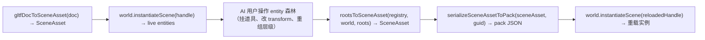

# Scene and custom asset contracts

Use this reference for video, nested scenes, SceneAsset writeback, new asset kinds,
custom loaders, and static asset evidence.

## VideoAsset -- 世界空间视频纹理

**一句话价值：** 把视频当"会动的贴图"贴进 3D 世界——`VideoAsset` 是 engine-runtime 自有 kind（`kind: 'video'`, `url: string`），经 `loadByGuid<VideoAsset>` 返回 payload，GUID 填入 `MaterialAsset.paramValues` 纹理字段（如 `baseColorTexture`）即可复用与静态贴图完全相同的材质链路。

`VideoAsset` 是 Asset 闭合联合第 15 成员（`packages/types/src/index.ts`），纯运行时 kind（OOS-1：无 import/cook 管线——视频不经过 pack build）。`url` 指向外部视频文件（`*.webm` / `*.mp4`）；引擎不解码视频字节，靠 host 侧的 `VideoElementProvider` World Resource 提供 `HTMLVideoElement`。`refs` 恒空孤立叶子（VideoAsset 不携带子资产引用）。

`videoLoader` 在 `wireDefaultLoaders` 中已注册——AI 用户无需手动 `loader.register`，`loadByGuid<VideoAsset>(guid)` 直接可用。Loader 是 descriptor-only：同步返回 `payload as VideoAsset`，不 fail-fast。

### idiom 骨架

```ts
import type { VideoAsset } from '@forgeax/engine-types';
// videoLoader is already registered in wireDefaultLoaders — no manual register needed

// 1) register the VideoAsset { url } descriptor via catalog (dev/memory path)
assets.catalog<VideoAsset>(guid, { kind: 'video', url: '/clip.webm' });

// 2) loadByGuid returns the payload directly (descriptor-only loader)
const res = await assets.loadByGuid<VideoAsset>(guid);
if (!res.ok) {
  // res.error.code is an AssetErrorCode (e.g. 'asset-not-found') or
  // runtime video code 'video-upload-unsupported'
  console.error(res.error.code, res.error.hint);
  return;
}
const videoAsset = res.value; // VideoAsset { kind: 'video', url: '/clip.webm' }

// 3) the GUID can be used in MaterialAsset.paramValues texture fields
//    (e.g. baseColorTexture) — identical to a static texture GUID. The
//    texture field takes the DASH-FORM GUID STRING (not the AssetGuid object /
//    Uint8Array — a non-string silently drops to the default white texture):
const mat: MaterialAsset = {
  kind: 'material',
  passes: [{ name: 'Forward', shader: 'forgeax::default-unlit' }],
  paramValues: { baseColorTexture: guid },  // dash-form GUID string, same texture2d slot as static
};
```

### 能力边界

| 边界 | 说明 | 自救 |
|:--|:--|:--|
| **dawn-node 不渲染视频** | dawn 环境无 `HTMLVideoElement` / `VideoFrame`，record 阶段视频上传在该环境走结构性验证（注册+负载链路不炸、双缺时 fire `video-upload-unsupported`）但像素验收**只能走 browser e2e** | dawn smoke 只验 structural-only |
| **需 host 提供 `<video>`** | 引擎绝不 `new HTMLVideoElement` / 设 `.src` / 碰 DOM。host 须实现 `VideoElementProvider` 接口并通过 `world.insertResource(VIDEO_ELEMENT_PROVIDER_KEY, provider)` 注册 | demo 范例见 `apps/hello/video-texture` |
| **高性能路径降级为钩子** | `GPUExternalTexture` 零拷贝路径引擎内未实现（OOS-5），仅保留显式 capability 探测分支。通用 `copyExternalImageToTexture` 路径已全做且端到端可用 | 通用路径满足 AC-07 可见性 |
| **无声轨** | `VideoAsset` 不含音轨字段；声音归后续 feat 或 host 自行管理 | — |
| **不 cache** | 视频帧 per-frame 上传走独立 `DynamicTextureStore`，**不进** `GpuResourceStore.ensureResident` 永久 cache（AC-08）。逐帧 transient 语义与静态贴图"一次上传/永久缓存"相反 | `invalidate` 对 video 无缓存语义 |

> [!NOTE]
> VideoAsset 的 3 处新增点全部集中在 types / loader 层（add-only）：① `Asset` union 加 `VideoAsset`；② `ASSET_BRAND` Record 加 `'video': 'video'`；③ `wireDefaultLoaders` 加 `videoLoader`。无需改 runtime 递归加载（`loadByGuid` kind-agnostic 遍历 `refs[]`）、无需碰 `collectRefs` / `storedNameOf`（已退役）、无需碰 pack build。详见 §新增 Asset kind 工作流。

### 消费路径：VideoAsset GUID + paramValues

VideoAsset GUID 填入 `MaterialAsset.paramValues` 的贴图字段（如 `baseColorTexture`）后，引擎在提取层按 `payload.kind === 'video'` 识别、走独立 transient 纹理通路——AI 用户从物料侧只需改一句 GUID，其余链路与静态贴图完全同构。详见 [`forgeax-engine-material`](../../forgeax-engine-material/SKILL.md) §世界空间视频纹理。

## SceneAsset.mounts（feat-20260608 嵌套）

`SceneAsset` 是 `AssetUnion` 第 6 成员；从 feat-20260608 起加 `mounts: SceneInstanceMount[]`，让一个 SceneAsset 嵌入另一个：

```ts
interface SceneInstanceMount {
  readonly localId: LocalEntityId;     // mount entity 自己的 slot
  readonly source: number;             // refs[] 索引 -> 子 SceneAsset GUID
  readonly memberFirst: LocalEntityId; // 子 SceneAsset 槽位窗口起点
  readonly memberCount: number;        // 必须等于 child SceneAsset.totalSlots
  readonly parent?: LocalEntityId;     // 默认 = 外层合成根 (R2/B-1)
  readonly components?: Partial<ComponentValuesMap>;
  readonly overrides?: readonly MountOverride[];  // localId 在 parent namespace
}
```

> [!IMPORTANT]
> `mount.overrides[].localId` 在**父 SceneAsset 命名空间**寻址（即 `memberFirst + offset`），不是子 SceneAsset 的局部 id。R2/F-8 cement 后此处一致：requirements / 实现 / demo 三方对齐。

### 4 个 mount-* 错误码（`PackErrorCode`，hint SSOT 在 `PACK_ERROR_HINTS`）

| code | runtime 触发点 | 语义 |
|:--|:--|:--|
| `pack-mount-localid-overlap` | `_instantiateSceneAsset` 第一道 | `entities[].localId` 与 mount 槽位（包括成员窗口）冲突 |
| `pack-mount-count-mismatch` | 子 SceneInstance.mapping 拿到后 | `mount.memberCount !== child.totalSlots` |
| `pack-mount-override-localid-out-of-range` | `_validateMountOverrides`（pre-spawn） | `override.localId` 不在窗口内 |
| `pack-mount-override-unknown-field` | `_validateMountOverrides`（pre-spawn） | `override.field` 不在 schema |

实例化合成根的 8 个 World 方法在 [`forgeax-engine-ecs`](../../forgeax-engine-ecs/SKILL.md) §SceneInstance。

## Scene save / writeback：活 entity→SceneAsset 存回闭环

**一句话价值：** `rootsToSceneAsset(registry, world, roots)` 把活的 entity 森林（任意 entity 作 root，不要求 SceneInstance 守卫）序列化为可复用的 `SceneAsset`——字段按 schema 类型自动派生（entity→localId、shared<>→GUID），引擎自力反查 GUID，无需 AI 用户手建 `handleToGuid` 表。

### load/save 闭环全链



### rootsToSceneAsset 签名与语义

```ts
// packages/runtime/src/collect-scene-asset.ts
export function rootsToSceneAsset(
  registry: AssetRegistry,
  world: World,
  roots: EntityHandle[],
): Result<SceneAsset, SceneCollectEntityRefOutOfClosureError | SceneCollectAssetGuidUnresolvedError>;
```

| 维度 | 旧 `collectSceneAsset`（已删除） | 新 `rootsToSceneAsset` |
|:--|:--|:--|
| 入口 | 单 root + SceneInstance 守卫 | 森林多 root + 任意 entity 可作 root |
| handle→GUID | 外部注入 `handleToGuid` 表 | 引擎自力反查（`resolveAssetHandle → guidForAsset`） |
| 字段转换 | 手维字段名白名单 | schema 派生（读 `comp.schema[fieldName]` 前缀匹配） |
| root ChildOf | 原样保留 | 剥离（新 scene 里 root 是顶层） |
| localId | 复用原 localId | BFS 遍历序从 0 连续重编号 |
| 返回 | 裸 `SceneAsset` | `Result<SceneAsset, ...>`（fail-fast） |

### 字段转换规则（schema-derived）

`rootsToSceneAsset` 与 `serializeSceneAssetToPack` 共用同一个 schema 分派器（内部实现），按 `comp.schema[fieldName]` 的字符串前缀决定转换：

| schema vocab | 转换行为 |
|:--|:--|
| `'entity'` | → 森林闭包内 localId（越界 → fail-fast `.code = 'scene-collect-entity-ref-out-of-closure'`） |
| `'array<entity>'` | → 逐元素 localId |
| `startsWith('shared<')` | → GUID 字符串（`resolveAssetHandle → guidForAsset`；未 catalog → fail-fast `.code = 'scene-collect-asset-guid-unresolved'`） |
| `startsWith('array<shared<')` | → 逐元素 GUID（定长变体 `array<shared<T>, N>` 同样匹配） |
| 其他 | 原样保留（不触发的 primitive 字段） |

### guidForAsset（@internal，AI 用户不直接调用）

`AssetRegistry._guidForAsset(asset: Asset): string | undefined` 是内部 SSOT——遍历 `assetCatalog` 找到 `envelope.payload === asset` 的 key (GUID)。两处已有消费方（`instantiate` 的 sceneGuidKey 查找 + `resolveSkinAsset` 的 skeleton payload 匹配）全部替换为调用此方法。方法上标 `@internal` JSDoc——AI 用户通过 API 表 discovery 即可，不需直接调用：`rootsToSceneAsset` 内部已做完 `handle → resolveAssetHandle → guidForAsset → GUID` 全链。

### 新错误码（归入 `RuntimeErrorCode` 闭合联合）

两个新增错误码在 `errors.ts` 中与 skin-* 同级，AI 用户 `switch (err.code)` 穷举消费（无 default，TS 编译期守卫）：

| code | 触发 | `.detail` 关键字段 | `.hint` |
|:--|:--|:--|:--|
| `scene-collect-entity-ref-out-of-closure` | entity 引用指向森林闭包外 | `entity: number` — 哪个 entity；`field: string` — 哪个字段；`target: number` — 引用了闭包外的哪个目标 | `'Expand roots to include the target entity, or remove the reference.'` |
| `scene-collect-asset-guid-unresolved` | shared<> 字段的 handle 解析不到 asset 或 asset 未 catalog | `field: string` — 哪个字段；`handle: number` — 哪个 handle 未解析 | `'Register the asset in AssetRegistry before collecting.'` |

### 消费骨架

```ts
import { rootsToSceneAsset, serializeSceneAssetToPack } from '@forgeax/engine-runtime';

// 1) 把选中的 entity forest 存回 SceneAsset
const result = rootsToSceneAsset(registry, world, roots);
if (!result.ok) {
  switch (result.error.code) {
    case 'scene-collect-entity-ref-out-of-closure': {
      // result.error.detail.entity / field / target 指明越界引用
      // 修复：把越界的 target entity 加入 roots，或删除该引用
      break;
    }
    case 'scene-collect-asset-guid-unresolved': {
      // result.error.detail.field / handle 指明未解析的 shared 引用
      // 修复：先 catalog / loadByGuid 注册该 asset
      break;
    }
  }
  return;
}
const sceneAsset = result.value; // SceneAsset { kind: 'scene', entities: [...] }

// 2) 可选：序列化为 .pack.json POD（含 refs[] 索引化 GUID）
const packResult = serializeSceneAssetToPack(sceneAsset, sceneGuid);
if (!packResult.ok) {
  // packResult.error.code === 'scene-collect-asset-guid-unresolved'
  // GUID 在 sceneAsset 里存在但未能映射到 refs[] 索引
  return;
}
const packJson = packResult.value; // { kind: 'scene', entities: [...], refs: [...] }
// 写入磁盘：JSON.stringify(packJson) → <name>.pack.json
```

### 踩坑

- **rootsToSceneAsset 不是 async**：与 `loadByGuid` 不同，它是纯同步函数——操作的是已经在 World 里的活 entity + 已在 AssetRegistry 里的 catalogued asset。遇 GUID 反查失败立即 fail-fast，不静默留 raw handle。
- **roots 不许空**：传 `[]` 返回 `{ kind: 'scene', entities: [] }`（空 SceneAsset），不报错。
- **root ChildOf 剥离**：作为 root 传入的 entity 若有 ChildOf（指向选区外父），产出 SceneEntity 不含 ChildOf 组件——新 scene 里它就是顶层。但这**不变动活 entity**：`rootsToSceneAsset` 是纯读操作，不改变 World 中的组件状态。

## 新增 Asset kind 工作流

feat-20260622 退役 `collectRefs()` 穷举 switch + `storedNameOf` side-table + `assetBrand()` switch 后，新增 Asset kind **只需改 3 处**（全部集中在 importer / types 层，不再需要碰 runtime 加载递归）：

1. **`Asset` union 加新成员**（`packages/types/src/index.ts`）：定义 `kind` discriminant + payload 字段
2. **`ASSET_BRAND` Record 加一行**（同文件）：映射 `kind` 到 `AssetBrand` 字面量——TS 编译期守卫：漏写 key → typecheck 报错
3. **importer 填 `refs[]`**：glTF / FBX / 未来导入器在产 `ImportedAsset[]` 时，把该 kind 的各项依赖 GUID 填入 `refs: AssetRef[]`——有 entity handle 字段填入 `sourceField`（componentName + fieldName + arrayIndex?），贴图边 `sourceField=undefined`

**不需做的**：
- ~~在 `collect-refs.ts` 加 `case 'new-kind':` arm~~——文件已删除
- ~~在 `asset-registry.recursive.test-d.ts` 加 exhaustiveness 守卫~~——文件已删除
- ~~在 `loadByGuid` 递归里加 `if (asset.kind === 'new-kind') { ... }` per-kind 分支~~——统一 for-of 循环，kind-agnostic
- ~~碰 `storedNameOf` side-table 的读写~~——name 在 envelope 内

引擎的递归加载自动遍历 `envelope.refs`，importer 填对 `refs[]` 即完成集成。

## Host 自定义 kind（开放注册）

引擎自有资产走 `Asset` 联合便利——`mesh` / `texture` / `scene` / ... 14 种 kind 由引擎导入器内置。Host 自定义数据类型（游戏配置 / 对话树 / 技能表）不走联合，走**开放注册**：`engine.assets.loaders.register({ kind, load })` 把自定义 Loader 注入 registry，`loadByGuid<MyType>(guid)` 取回精确类型 `MyType`，无需 `as` 断言。

### 两段式调用

**段一：注册自定义 Loader**

```ts
import type { Loader, LoaderOutput } from '@forgeax/engine-types';

interface MyGameConfig {
  level: number;
  maxPlayers: number;
}

function myGameConfigLoader(): Loader<MyGameConfig> {
  return {
    kind: 'my-game-config',
    load(payload: Record<string, unknown>): LoaderOutput<MyGameConfig> {
      return payload as unknown as MyGameConfig;
    },
  };
}

import { assetLoaderPlugin } from '@forgeax/engine-assets-runtime';

const loaderFiber = await app.pluginContext.plugin(assetLoaderPlugin(myGameConfigLoader()));
```

**段二：按精确类型取回**

```ts
const res = await engine.assets.loadByGuid<MyGameConfig>(guid);
if (!res.ok) {
  console.error(res.error.code, res.error.hint);
  return;
}
const cfg = res.value;  // MyGameConfig，无 as 断言
cfg.maxPlayers;          // IDE 补全直接可见

// 卸载 feature 时同步撤销 kind 注册；不会留下 stale loader。
await loaderFiber.dispose();
```

### payload 开放语义

`AssetEnvelope` / `ImportedAsset` / `Loader` 三个类型各带泛型 `<P = Asset>`：

- **`AssetEnvelope<P = Asset>`**——catalog 内每条资产信封。`P` 默认 `Asset`（引擎自有 14 种 kind 零回归）；host 自定义 kind 享用自带的 `P`。
- **`Loader<P = Asset>`**——`load(payload, refs, ctx)` 返回 `LoaderOutput<P>`（直接产出 payload `P`），不返回 envelope。
- **`ImportedAsset<P = Asset>`**——含 `payload: P` + `refs: AssetRef[]`。

`Asset` 联合**保留**——仍是引擎自有资产的便利类型与 IDE 补全；只是不再是"进 registry 的唯一门票"。

### refs 跨 kind 引用

Host 自定义 kind 的 `refs` 可跨 kind 引用（host -> engine -> host）。`refs` 不是从 `load()` 返回的——`load()` 只返回 payload `P` 本身。`refs` 经 **pack.json sidecar 的 `assets[].refs`** 或 `catalog` 的 envelope 承载；`loadByGuid` 递归时从 envelope.refs 读取，遍历加载所有引用 GUID。`Loader.load` 的 `refs` 形参传的是 sidecar 已声明该条目的 refs（`readonly string[] | undefined`）——loader 无需处理也可安全忽略。

```ts
// refs are in the sidecar, NOT in load()'s return value.
// The pack.json assets[] entry declares refs:
//
// {
//   guid: "...",
//   kind: "my-game-config",
//   payload: { kind: "my-game-config", title: "Parent", ... },
//   refs: [childGuid]   // <-- refs live here
// }
//
// load() just returns the payload P (no envelope, no refs).
function myGameConfigLoader(): Loader<MyGameConfig> {
  return {
    kind: 'my-game-config',
    load(payload: Record<string, unknown>): LoaderOutput<MyGameConfig> {
      return payload as unknown as MyGameConfig;
    },
  };
}
```

`loadByGuid` 递归遍历 `refs[]`——引擎自有 kind 与 host 自定义 kind 统一走同一循环，kind-agnostic。示例见契约测试 `packages/runtime/src/__tests__/host-custom-kind-contract.test.ts` w14 AC-03（host->host / host->engine / engine->host / cycle）。

### 错误自救：未注册 Loader

`loader-not-registered` 在**生产 / upstream 加载路径**触发——`loadByGuid` 经 pack-index 取回某 kind 但 `loaders` 无对应 loader 时：

```ts
const res = await engine.assets.loadByGuid<SomeType>(guid);
if (!res.ok && res.error.code === 'loader-not-registered') {
  // res.error.detail.registeredKinds 列出当前已注册的 kind
  await app.pluginContext.plugin(assetLoaderPlugin(myLoader));
  // retry...
}
```

**不是** throw / Promise rejection——仍是 `Result` 返回，走标准 `.ok` / `.code` / `.detail` 消费。

> [!NOTE]
> **dev / 内存态 catalog 路径不报此错。** 经 `catalog(guid, payload)` 直接登记的 host 自定义 kind，即使没注册 loader 也会**透传原始 payload** 成功返回（M2 透传语义：引擎不解析它不认识的 kind）。`loader-not-registered` 仅在需要引擎/loader 真解析 payload 的生产 / upstream 路径触发。若 host kind 走 dev catalog 直存，注册 loader 是为了让加载链对该 payload 做你自己的解析/校验，而非为了避免此错误。

> [!IMPORTANT]
> `registry.loaders.register(...)` 仍是无 App 的底层 Host 接口，并返回幂等 disposer。游戏/App capability 必须优先用 `assetsPlugin` / `assetLoaderPlugin` / `packLoaderPlugin`，让注册、卸载和 provider 缺失后的恢复都归同一个 Cordis Fiber，而不是另建 cleanup 数组。

### scope 边界

Host 自定义 kind 引擎只做**寻址 / 搬运 / 加载**——存进 catalog、走 `refs[]` 递归、按 GUID 取回。**不渲染**：`gpu-resource-store` 只认 `mesh` / `texture`，不认 host 自定义 payload。渲染行为（如把 `MyGameConfig` 展开为 Entity + component）由 host 业务层自行实现。

## 深入

- 磁盘 schema（`external-asset-package` / `internal-text-package` 字段）/ GUID 工具 / 6 步扫描器：见 `packages/pack/README.md`；源码 `packages/pack/src/cli-asset.ts`
- `AssetRegistry` 全表面（`loadByGuid` / `configurePackIndex` / `catalog` / `lookup` / `parseGuid` / `inspect` / `resolveName` / `packageOf` / `rename` / `invalidate` / `invalidateAll`）：源码 SSOT `packages/assets-runtime/src/asset-registry.ts`
- 图片导入 / `*.meta.json` importSettings（colorSpace / mipmap / cube-texture IBL / HDR equirect）：见 `packages/image/README.md`；`ImageErrorCode` 全集（勿抄）`packages/types/src/index.ts`
- 运行时字节 → `TextureAsset` POD（`decodeImageBytes`，与磁盘 sidecar 正交）：见 `packages/assets-runtime/README.md` §Runtime image bytes decoder（tweak-20260714 引入）
- 导入/加载分拆与 `ImportTransport`（DIP 第三实例，构建期 `engine-import` 不进 player bundle；dev 走 `POST /__import/:guid`，shipped 走 DDC 预导入 fail-fast）：见 `packages/import/README.md`；`ImportErrorCode`（5 成员）`packages/types/src/index.ts`
- glTF 导入器（Tier-C subset，pure-function pipeline，运行时 textured scene + 多 submesh meta sidecar；material 映射包含 `emissiveFactor` / `emissiveTexture`；2026-06-11 起 importer 出全 7 sub-asset kind: mesh / material / scene / texture / skeleton / skin / animation-clip）：见 `packages/gltf/README.md` §Importer sub-asset PODs；源码 `packages/gltf/src/cli-gltf.ts`
- FBX 导入器（ufbx WASM，7 sub-asset 同 schema，Importer key `'fbx'`，Phong→roughness Family A 公式；workspace `pnpm install` / `bun install` 的 package-local postinstall best-effort hydrate `pkg/`，缺失时可 `fetch-wasm` 或 emcc `build:wasm` 显式恢复）：见 `packages/fbx/README.md`；源码 `packages/fbx/src/fbx-importer.ts`
- 蒙皮 / 动画样例：`apps/hello/skin` -- Khronos `Fox.glb` (24 关节 + 3 clip Survey/Walk/Run) 三实例并排，走标准 `loadByGuid<SceneAsset>` + `assets.instantiate × 3` + 每实例独立 `AnimationPlayer`。资产源 `forgeax-engine-assets/khronos-gltf-samples/Fox/`（CC BY 4.0，ATTRIBUTION.md 同目录）。Bridge 在 NodeIr.skinIndex 非空时自动 emit `Skin { skeleton: <guid-string> }`；postSpawnResolveJoints 子树作用域保证 N 实例不串关节（见 `packages/runtime/src/scene-instances/post-spawn-resolve-joints.ts`）
- 字体 MSDF bake / `FontAsset` 管线 / `GlyphText` 渲染：见 `packages/font/README.md`；源码 `packages/runtime/src/glyph-text-layout-system.ts`
- `pack-index.json` 行结构 / dev `/__pack/`：`PackIndexEntry` SSOT `packages/types/src/index.ts`（含 `name?: string` add-only）；折叠逻辑源码 `packages/vite-plugin-pack/src/`
- `AssetErrorCode` / `PackErrorCode` / `GltfErrorCode` / `FontErrorCode` 全集（勿抄）：`packages/types/src/index.ts`
- Package / identity / resolveName 概念与术语三层消歧（asset name vs entity Name vs ShaderAsset.name）：见 [`packages/types/README.md`](../../../packages/types/README.md) §Name disambiguation
- inspector `assets` root 展示 resolved name（JSON-RPC 文本信道）：消费见 [`forgeax-engine-cli`](../../forgeax-engine-cli/SKILL.md) §assets root name
## Static asset evidence

> [!IMPORTANT]
> Static assets load only from Pack v2 through `packageUrl`. Runtime-only bytes remain an explicit separate exception.

`AssetEvidence` is the read-only GUID evidence view for source declaration, cook receipt freshness, package/artifact verification, and optional runtime readiness. Use `lookup/verify --guid --project --catalog --json`; `notCooked`, `stale`, and `unknown` are explicit states, and `unknown` is never a successful verification.

### Evidence probe recovery

Follow the join in this order: source inventory, catalog locator (`packageUrl` and `cookReceiptUrl`), producer `CookReceipt`, Pack v2 package/artifact verification, then optional runtime evidence. A catalog row only locates bytes; it cannot upgrade `notChecked` to `passed`.

- `notCooked`: the source declaration exists but no successful receipt exists. Fix the importer or recook.
- `ready/current`: the source input fingerprint matches the receipt. `ready/stale`: the source changed; recook before trusting the package.
- `unknown`: a required capability was unavailable. Configure the runtime evidence source or supply the offline project/catalog inputs; do not treat it as success.
- `failed`: follow the structured `.code` / `.hint`, repair the named producer or artifact, and rerun the probe.

Runtime SDK calls are `assets.inspect(guid)` and `assets.verifyByGuid(guid)` after `configureAssetEvidence(source)`. The source is host-injected; the runtime package never imports the CLI, Node filesystem, or Vite. For source-free diagnostics use the pack CLI with `lookup/verify --guid --project --catalog --json`.
