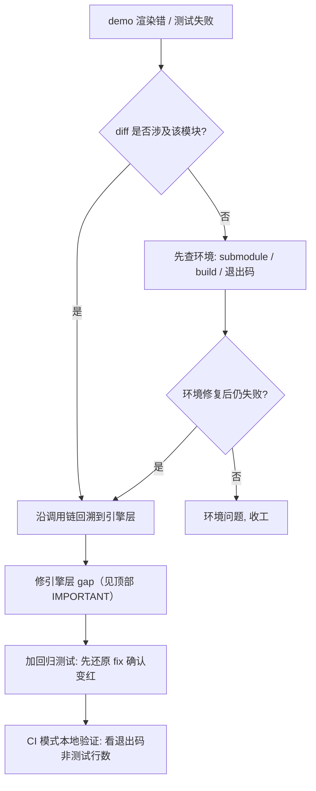

# Backend and CI troubleshooting

Use this reference for browser capability, wgpu fallback, RHI capture, and CI-form failures.

## WebGPU 提示不是整机能力判决

ForgeaX 浏览器运行时优先使用 browser-native WebGPU，并可继续尝试
wgpu/WASM 的 WebGL2 downlevel lane。`adapter-unavailable` 只描述前一条
channel；仅凭它、`navigator.gpu` 是否存在，或一条包含 “WebGPU” 的启动文案，
都不能判定用户机器无法运行 ForgeaX。

按结构化证据分流：

| 信号 | 含义 | 行动 |
|:--|:--|:--|
| `requestAdapter()` 返回 `null` / `adapter-unavailable` | browser-native WebGPU channel 没拿到 adapter | 继续观察 Runtime 的 wgpu/WebGL2 结果 |
| `requestAdapter()` 抛错 / `webgpu-runtime-error` + `detail.error.code=request-adapter-threw` | 权限策略、安全上下文或浏览器运行时错误，不等同 adapter 缺失 | 读 `detail.error.name/message`，修对应环境；不要改玩法或渲染器 |
| WebGL2 fallback 结构化失败 | 第二 channel 也失败 | 读 `.code/.hint`；区分环境、WASM 装载、cap gate 和引擎 bug |
| Asset/Shader/Pack/App 错误 | 与 GPU 能力无直接关系 | 修错误所属包；禁止 Canvas 兜底、吞入口异常或改换引擎 |
| `[object Object]` | 上游把错误对象错误地字符串化 | 保留原对象的 `name/message/code/expected/hint/detail/cause` 后重试诊断 |

DevKit 生成的宿主页会递归展示上述结构化字段，并在 WebGPU 相关文本旁明确
提示 WebGL2 fallback 的存在。发布方只校验“无未捕获异常”时，不能把该绿灯
当作 ForgeaX 渲染正确性证据；必须保留引擎身份并用真实浏览器画面/像素门禁验证。

## edge webgpu disabled

**信号**：用户在 Microsoft Edge 报 demo 全屏黑,console 出 `EngineEnvironmentError: webgpu inner=adapter-unavailable`(配的 hint 提到 `edge://flags/#enable-unsafe-webgpu`)。降级到 wgpu wasm 也失败,显示 `webgl2 not available or canvas already in use`。

**根因**:Edge `edge://flags/#enable-unsafe-webgpu = Disabled` 这档配置下,浏览器**全局禁掉所有硬件 GL contexts**(`webgl` / `webgl2` / `experimental-webgl` 全返 null);只剩 Canvas2D。**与引擎无关,也无法在引擎层修复**——wgpu wasm GL backend 没有任何 GL context 可 attach。

> [!CAUTION]
> 不要去研究 "canvas pollution" / "type-lock" / "复用 canvas" / "重 mint canvas" 假说。这些都是当时调查中走过的弯路,**经一行 devtools 实验直接证伪**。完整反向避坑见 [`docs/handover/2026-06-10-edge-webgpu-disabled-no-graceful-webgl-fallback.md`](https://github.com/ForgeaXGame/forgeax-engine-harness/blob/main/docs/handover/2026-06-10-edge-webgpu-disabled-no-graceful-webgl-fallback.md)。

**判定**:让用户在 Edge devtools 跑一行,贴回输出。

```js
const c2 = document.createElement('canvas');
console.log('webgl2:', c2.getContext('webgl2') ? 'OK' : 'null');
const c3 = document.createElement('canvas');
console.log('webgl :', c3.getContext('webgl')  ? 'OK' : 'null');
console.log('navigator.gpu:', !!navigator.gpu);
```

| 输出组合 | 含义 | 行动 |
|:--|:--|:--|
| webgl2=null + webgl=null | Edge 全栈禁 GL,与引擎无关 | 引导用户开 `edge://flags/#enable-unsafe-webgpu = Enabled`,重启浏览器 |
| webgl2=OK 但仍黑屏 | 真 bug,引擎 fallback 链有漏 | 看 EngineEnvironmentError.detail 的 wgpuError.hint,沿 wasm 链回溯 |
| navigator.gpu=true 但 demo 黑 | 单纯 WebGPU adapter 拿不到(headless / iframe / 远程桌面) | Channel 3 应自动接管;若也失败查 wasm load |

**修法**:不修(无法修)。`packages/runtime/src/create-renderer-env-classify.ts:composeEnvErrorHint` 已在两 channel 都报 `adapter-unavailable` / `rhi-not-available` 时拼接 browser-config guidance 到 `error.message`,告诉用户去开 flag。这是当前能做的最优解。

**纪律提醒**:**遇到"应该 fallback 但没 fallback"先验证浏览器有没有可降级的目标 context**,再去研究引擎逻辑。一行 devtools 命令省一晚上。

---

## wgpu-wasm webgl2 fallback cap gates

**信号**:浏览器在 wgpu-wasm Channel 3 (Edge `enable-unsafe-webgpu=Disabled` / Safari WebKit no-WebGPU)报 `panicked at .../wgpu-29.0.3/src/backend/wgpu_core.rs:N:M: wgpu error: Validation Error`,wrap 成 `RhiError [webgpu-runtime-error]` 出现在 `runShimSyncStep` 抓到的 `buildReadyWebGPU` 链路上。常见三种形态:

- `In Device::create_render_pipeline, label='pbr-pipeline-standard' ... Storage class Uniform doesn't match the shader Storage` — shader 编译走了 storage 变体但 pipeline layout 是 uniform
- `In Device::create_texture, label='msaaColor' ... Downlevel flags DownlevelFlags(VIEW_FORMATS) are required but not supported` — graph allocate 时给了 viewFormats 但 backend 不支持
- `In Device::create_texture_view ... format reinterpretation` — record 阶段试图给 fallback 路径的 texture 重建 sRGB view

**根因**:`maxStorageBuffersPerShaderStage === 0` 是 wgpu-wasm WebGL2 backend 的稳定 proxy(downlevel_webgl2_defaults 设 0),引擎在多处用这个值开/关 fallback 路径。漏一处就静默走错变体或申请不支持的能力,只在 wgpu validation 才接得住,dawn-node smoke / chromium playwright 全绿。

**典型踩坑**:

1. **写死 `definesKey = 'STORAGE_BUFFER_AVAILABLE=false'` 单 axis 字符串** — 一旦 sibling feat 把 shader 升到多 axis(PBR `+CLUSTER_FORWARD_AVAILABLE`),sorted-key 形态变了,`findVariantByKey` miss,patch 静默 no-op,引擎按默认 storage 变体编译。修法:按 `entry.variants[].defines` 字段对位筛(`v.defines.STORAGE_BUFFER_AVAILABLE === false && v.defines.CLUSTER_FORWARD_AVAILABLE === false`),不拼字符串
2. **graph addColorTarget 的 `viewFormats: [...]` 进 device.createTexture 没 cap gate** — WebGL2 backend 没 `VIEW_FORMATS` downlevel flag,任何非空 viewFormats panic。修法:`packages/render-graph/src/graph.ts allocateColorTargets` 加 `supportsViewFormats = limits.maxStorageBuffersPerShaderStage > 0` 闸,fallback 时把 viewFormats 当成空
3. **record 阶段给 graph texture 重建 sRGB view** — 底层 texture 没声明 viewFormats 时 `createTextureView({ format: '*-srgb' })` 失败。修法:fallback 路径下 `pipelineState.format === pipelineState.colorAttachmentFormat`(配的就是 sRGB 格式直挂),直接用 graph 默认 view,跳重建
4. **wgpu-wasm shim 用 `constructor.name` 派发 wasm-bindgen wrapper** — vite production build 把 `RhiWgpuSampler` / `RhiWgpuTextureView` minify 成单字母 `e` / `t`,shim 的 `if ctor_name == "RhiWgpuSampler"` 全 miss,`createBindGroup` 抛 `unsupported resource constructor 'e'`。recordFrame 每帧重抛但 onError 流被吞,fps=60 假绿。**`pnpm dev` 不 minify 不复现;`pnpm preview` 才复现**。修法:TS adapter 传明确的 `forgeaxKind: 'sampler' | 'textureView'` string literal,Rust shim 优先按 string field 派发,minify 安全。所有"按 wasm-bindgen wrapper class 名字派发"的 shim 路径都要审计

**判定 / 调试方法**(本地能复现就别等 CI):

```bash
# 1. 起 dev server(任一 hello-* / learn-render demo)
cd apps/learn-render/1.getting-started/2.hello-triangle && pnpm dev
# → http://localhost:5181/

# 2. 用 webkit playwright 跑无头浏览器(WebKit 默认没 WebGPU,自动落到 wgpu-wasm Channel 3)
URL=http://localhost:5181/ TIMEOUT_MS=20000 \
  node scripts/dev-verify/verify-webkit-hello-triangle.mjs
```

harness 输出含三段诊断:`DRAW DIAG`(globalThis 注入的 draw counter)/ `PIXEL SAMPLE`(canvas readback)/ `SCREENSHOT SAMPLE`(compositor 截图,落 `/tmp/hello-triangle.png`)+ `VERDICT`(`panic seen`/`navigation`)。WebKit 里 canvas pixel readback 经常返回 0,**真闸门是 screenshot 的 PNG**——`Read('/tmp/hello-triangle.png')` 看实际渲染。

**判定表**:

| 输出 | 含义 | 修法 |
|:--|:--|:--|
| `panic seen: true` + `runShimSyncStep` 在 stack 里 | 引擎在 wgpu-wasm 路径漏 cap gate | 沿 panic message 找 layout/format/feature flag,grep `maxStorageBuffersPerShaderStage` 看相邻代码已有的 gate 形态,补一处 |
| `panic seen: false` 但 PNG 全黑 | shader/layout 通了但渲染出错(camera/transform/depth) | 看 [DRAW DIAG] counter 是否真有 draw call;若有 draw 但黑则查 frustum/clear-color |
| `panic seen: false` + PNG 看见(灰)三角形 | 走通了 | 收工 |

**纪律**:wgpu-wasm fallback 改动**必须本地跑 webkit verify**——dawn-node 不能复现(走真 WebGPU 不走 fallback);**chromium playwright `headless: true` 默认无 GPU adapter,实际就是 wgpu-wasm Channel 3**(navigator.gpu === undefined → Channel 3 fallback)。这意味着 `metrics:run-fps`(用 plain `chromium.launch({headless:true})`)和 CI metrics-validate **同一栈**,跟 WebKit 等效;反过来,任何只在 production-build minify 后才暴露的 bug(`constructor.name` 派发坏掉等)`pnpm dev` 看不到,**只有 `pnpm preview`(= vite build minified)+ headless chromium 才复现**。

```bash
# CI metrics 等价的本地 repro:
pnpm --filter @forgeax/parity-instancing-static build      # production minified
pnpm metrics:run-fps -- --app apps/parity/instancing-static
# → p95 fps + onError detail walk(在 demo 加 renderer.onError 钩子用 Object.getOwnPropertyNames 遍历嵌套 detail)
```

参见 [`docs/handover/2026-06-10-edge-webgpu-disabled-no-graceful-webgl-fallback.md`](https://github.com/ForgeaXGame/forgeax-engine-harness/blob/main/docs/handover/2026-06-10-edge-webgpu-disabled-no-graceful-webgl-fallback.md)。

---

## 复制实体引用导致派生渲染漏体

**信号**：公开 replica state 显示 `bodyLength > 1`，但 canvas 只有蛇头；local render entity map 的数量也小于所有蛇的 body length 之和。

**判定**：先以浏览器 E2E 驱动一次增长，再同时读取公开 state 和 `data-render-entity-count`。两者不等时，录一帧 RHI tape 并 inspect RT，确认不是 UI/截图层遗漏。不要只断言 `SnakeBody.segments.length`：replica 中的 `array<entity>` 可表现为索引对象，且 entity reference 不等于 replica row ID。

**修法**：渲染归属使用稳定、可复制的业务 identity（例如 `playerNetworkId`），让每个派生 segment 自带该值；`SnakeBody.segments` 只用于长度和顺序。对每条 segment 用业务 identity 选 body material，避免用 remapped entity handle 反查 owner。回归测试必须断言 `renderEntityCount == sum(bodyLength)`，并以 RHI RT PNG 证明身体段实际画出。

## RHI tape 录制 (frame record + replay + offline inspect)

> RHI 帧录制 / replay / 离线 per-draw inspect（capture -> inspect -> dispose 工作流 + `RhiDebugError` + 跨后端确定性）见 [`forgeax-engine-rhi-debug`](../../forgeax-engine-rhi-debug/SKILL.md)（SSOT）。渲染症状（black/grey-screen / wrong-texture / wrong-binding）的 tape-driven 定位流程在那里的 §症状 -> tape -> inspect 决策流。

---

## ci form 2026-06-16

> [!NOTE]
> feat-20260616-ci-time-cut-roi-batch 把 CI 形态改成"PR vs main push 路由分叉 + cache-matched-key 兜底 prefix-match + Playwright 三 job 共享 cache + vitest-browser/dawn 拆独立 job"。下面四件事是常被误读的形态，列出来当映射表用。

**形态 1 — vitest 测试命令实际入口（PR vs main 分叉）**：

`Vitest unit (PR + main)` step 名字保留兼容旧引用，但 M1 起加了 `if: "!(github.event_name == 'push' && github.ref == 'refs/heads/main')"`——main push 不再跑 unit step（被同 job 下方的 `Vitest coverage (v8) + typecheck` 覆盖，避免双跑）。perf-budget guard 同步拆成 PR 路径读 `vitest-unit-out.json` / main 路径读 `vitest-coverage-out.json` 两 step（D-4：input source 在 yml 层级静态可见）。PR push 仍走 unit step。`vitest-browser` / `vitest-dawn` 始终跑（无 if-gate）。

**形态 2 — Playwright cache 形态（三 job 共享）**：

`primary-pnpm` / `vitest-browser` / `metrics-validate` 三 job 共享同一 cache key：
```yaml
key: playwright-${{ runner.os }}-${{ hashFiles('apps/hello/triangle/package.json') }}
path: ~/.cache/ms-playwright
```
M2 把 `playwright install --with-deps webkit` 拆成 binary（cache-miss only）+ apt deps（每跑必装，apt 包不入 ~/.cache）。改 `apps/hello/triangle/package.json` 的 `@playwright/test` 版本会失效全部三 job 的 cache。

**形态 3 — cache-tsbuildinfo 跳过条件（cache-matched-key）**：

```yaml
- name: Vitest typecheck (feat-20260608-ci-time-cut)
  if: steps.cache-tsbuildinfo.outputs.cache-matched-key == ''
  run: pnpm run typecheck
```
M4 起从 `cache-hit == 'true'` 升级为 `cache-matched-key != ''`——`cache-matched-key` 在 exact-hit 与 prefix-match 都非空，typecheck step 在 prefix-match 时也 skip（vitest --typecheck 138s 是研究 F-1 的 dominant），ROI win 集中在 main 后续 push（sibling src/** 改动只动 hash 后缀）。`cache-hit` 仅 exact-hit 真。actions/cache@v5 输出 SSOT：`.forgeax-harness/knowledge-base/2026-06-08-actions-cache-v5-readme.md`。

**形态 4 — vitest-browser / vitest-dawn 独立 job（不再嵌在 primary-pnpm 内）**：

M3 拆出来后，`primary-pnpm` 不再跑 `pnpm test:browser` / `pnpm test:dawn`；这俩是 `vitest-browser` / `vitest-dawn` 两个独立 job（PR + main 都跑）。`sticky-comment` job 的 `needs:` 数组里加了它俩，改 needs 时记得三个一起改（漏一个会让 sticky comment 在那 job 红时仍贴绿）。grep `^  vitest-browser:` / `^  vitest-dawn:` 找它俩的 job 定义。

> [!IMPORTANT]
> 这四件改动后果：(a) 改 ci.yml 后必须 `pnpm run lint && pnpm ci:channel-align`（AGENTS.md §Conventions）；(b) "为什么 main push 没跑 unit" 不是 bug，是设计；(c) "为什么 typecheck 有时 skip" 看 `cache-matched-key`，不是 `cache-hit`；(d) Playwright cache 失效要查 `apps/hello/triangle/package.json` 的 hash，不是仓根。

---

## 通用纪律



---
