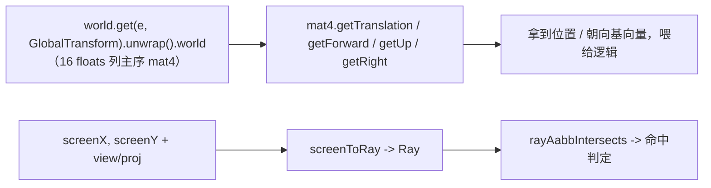

# forgeax-engine-math

> 纯函数、out-param 优先、SoA 友好的数学库。所有函数第一参是 `out`（复用 buffer，零分配热路径）。聚合 `@forgeax/engine-math`。

## 心智模型

数学库按 namespace 组织（`vec3` / `mat4` / `quat` / `color` …），全是**纯函数**且**第一参为 `out`**：`vec3.add(out, a, b)` 写进 `out` 并返回它。这是为了让热路径复用 buffer、零 GC。最常见的 AI 任务不是手算矩阵，而是**从一个实体的世界变换里读出 pose**：`GlobalTransform.world` 是引擎每帧派生的 16 floats 列主序 mat4（你写 local TRS，引擎写 derived world），用 `mat4.getTranslation/getForward/getUp/getRight` 把位置 / 朝向基向量拽出来，别自己拆矩阵。屏幕拾取则反过来：`screenToRay` 从屏幕坐标 + view/proj 造一条世界射线。

## 核心 API 速查

| Namespace / 函数 | 形态 | 用途 |
|:--|:--|:--|
| `vec3.add/sub/scale/dot/cross/normalize/lerp(out, ...)` | out-param | 向量运算（`vec2`/`vec4` 同构） |
| `vec3.smoothDamp(out, current, target, decayRate, dt)` | `=> Vec3` | 便捷组合：帧率无关的指数衰减平滑（`lerp(current, target, 1−exp(−decayRate·dt))`；对标 Bevy `Vec3::smooth_nudge` / three.js `MathUtils.damp`；`vec2`/`vec4` 同构）。平滑追踪/缓动别手写 `lerp(p, target, rate·dt)`——那是帧率**相关**的（30 vs 60 fps 行为不同，`rate·dt>1` 会过冲） |
| `vec3.catmullRom(out, p0, p1, p2, p3, t)` | `=> Vec3` | 便捷组合：过控制点的 Catmull-Rom 样条采样（张力 0.5，`t=0`→`p1`/`t=1`→`p2`；`p0`/`p3` 是设端点切线的邻居点；对标 Bevy `CubicCardinalSpline::new_catmull_rom` / three.js `CatmullRomCurve3`；`vec2` 同构）。相机路径/动画缓动路径/程序曲线别手搓三次系数矩阵。整条折线：滑动 4 点窗口 `[pts[i-1..i+2]]` 逐段循环 |
| `mat4.multiply/invert/lookAt/perspective/compose(out, ...)` | out-param | 矩阵运算 |
| `mat4.getTranslation(out, m)` | `=> Vec3` | 从 world mat4 取位置（col 3） |
| `mat4.getForward/getUp/getRight(out, m)` | `=> Vec3` | 取朝向基向量（forward = -Z） |
| `mat4.unproject(out, ndcPoint, invVP)` | `=> Vec3` | NDC → 世界坐标 |
| `quat.fromEuler/slerp/multiply/transformVec3(out, ...)` | out-param | 旋转 |
| `quat.fromLookAt(out, eye, target, up)` | `=> Quat` | 便捷组合：物体朝向四元数（local -Z 指向 target；替代 `lookAt→invert→mat3→fromRotationMatrix` 手接链） |
| `quat.rotateAxis(out, q, axis, angleRadians)` | `=> Quat` | 便捷组合：在 `q` 基础上绕世界轴 `axis` 增量旋转 `angle` 弧度并**重新归一化**——每帧自旋/动画的正确写法（对标 Bevy `Transform::rotate_y`/`rotate_axis`；delta 前乘 = 世界轴序）。别手写 `multiply(q, fromAxisAngle(...))` 循环：不归一化会累积漂移成非单位四元数 |
| `quat.right/up/forward(out, q)` | `=> Vec3` | 取旋转的局部基向量（世界方向）：right=q·+X / up=q·+Y / forward=q·−Z（对标 `mat4.getRight/getUp/getForward` 与 Bevy `Transform::local_x`/`local_y`/`forward`）。沿"自身朝向"移动/瞄准时用它，别手写 `transformVec3(out, q, [0,0,-1])` + 记 −Z 手性；单位 `q` 入 → 单位向量出 |
| `color.srgbToLinear/linearToSrgb/fromHex/toHex` | out-param / 值 | 颜色空间转换 |
| `easing.cubicInOut / smoothstep / smootherstep / elasticInOut(t)` | `=> number` | 标量时间重映射：`t` 夹到 [0,1]；`cubicInOut` / `smoothstep` / `smootherstep` 是慢进慢出，`elasticInOut` 保留弹性 overshoot（对标 Bevy `EaseFunction`）。动画/UI 过渡/相机缓动别手搓多项式；`easing` 是缓动族的可增长 namespace |
| `screenToRay(out, sx, sy, vpW, vpH, view, proj, kind)` | `=> Ray` | 屏幕坐标 → 世界射线 |
| `worldToScreen(out, worldPos, viewProj, canvasW, canvasH)` | `=> { onScreen, behind }` | 世界坐标 → 屏幕像素（screenToRay 对偶） |
| `rayAabbIntersects(ray, aabb)` | `=> RayAabbResult` | 射线 / 包围盒求交 |
| `rayTriangleIntersects(r, a, b, c)` | `=> RayTriResult` | 射线 / 三角求交（Moller-Trumbore，double-sided） |
| `mat4.computeViewProj(out, eye, target, up, fov, aspect, near, far)` | `=> Mat4` | 便捷组合：perspective * lookAt（plain 数值参数，零依赖） |

> [!NOTE]
> `Transform` 只保存 authored local TRS；独立的 transient `GlobalTransform.world` 保存解析后的世界矩阵，由引擎 `propagateTransforms` 每帧写。原始 `world.spawn` 需要同时挂载这两个组件；SceneAsset / mount helper 会自动补齐这对组件。

## 规范用法：从实体读 pose



## idiom 代码骨架

```ts
import { mat4, vec3 } from '@forgeax/engine-math';
import { GlobalTransform } from '@forgeax/engine-scene';

// read world-space pose off GlobalTransform.world (a live 16-float column-major Float32Array)
const worldMat = world.get(entity, GlobalTransform).unwrap().world;
const pos = mat4.getTranslation(vec3.create(), worldMat); // m[12..14]
const fwd = mat4.getForward(vec3.create(), worldMat);     // -Z basis
const up = mat4.getUp(vec3.create(), worldMat);           // +Y basis

// out-param idiom: allocate once, reuse across frames
const tmp = vec3.create();
vec3.scale(tmp, fwd, 5);          // tmp = fwd * 5
vec3.add(pos, pos, tmp);          // pos = pos + tmp (writes into pos, returns it)
```

```ts
import { screenToRay, rayAabbIntersects, ray as rayNs } from '@forgeax/engine-math';

const r = screenToRay(rayNs.create(), mouseX, mouseY, vpW, vpH, viewMat, projMat, 'perspective');
const hit = rayAabbIntersects(r, entityAabb); // hit.hit -> boolean
```

```ts
import { ray, mat4, vec2 } from '@forgeax/engine-math';

// world → screen: 3D 点投影到像素坐标（y-down top-left）
const vp = mat4.computeViewProj(mat4.create(), eye, target, up, fovY, aspect, 0.1, 100);
const out = vec2.create();
const r = ray.worldToScreen(out, worldPos, vp, canvasW, canvasH);
if (r.onScreen && !r.behind) {
  // out[0], out[1] = 合法像素坐标，可做 DOM overlay 定位或 HUD 锚点
}
```

```ts
import { pickVertexOnEntity, pickVertex } from '@forgeax/engine-picking';

// propagateTransforms 必须已跑当前帧（D-9 前置契约）
propagateTransforms(world);

// 单 entity 最近顶点查询，不传 limit → VertexHit|undefined
const hit = pickVertexOnEntity(world, cameraEntity, sx, sy, w, h, entity);
if (hit) {
  // hit.worldPos / vertexIndex / screenDist / worldDist / deformed
}

// 全场景查询，传 limit → VertexHit[]（按 screenDist 升序）
const candidates = pickVertex(world, cameraEntity, sx, sy, w, h, { limit: 5 });
```

## worldToScreen：世界坐标 → 屏幕像素

`ray.worldToScreen` 是 `screenToRay` 的对偶——把世界空间的 3D 点投影回屏幕像素。内部自做 `mat4 * vec4` 取透视除前的 `w` 分量（`projectPoint` 丢 `w`，所以不能复用）。

```ts
import { ray, mat4 } from '@forgeax/engine-math';

const vp = mat4.computeViewProj(mat4.create(), eye, target, up, fovY, aspect, near, far);
const out = vec2.create();
const result = ray.worldToScreen(out, worldPos, vp, canvas.width, canvas.height);
// result.onScreen  — NDC xyz 全在 clip-space 范围内
// result.behind    — 相机后方（w < 0），此时 out 无意义
// result.onScreen 为 false 但 behind 为 false → 视锥外但相机前方，out 仍为有效像素（可做屏幕边缘 clamp）
```

- **out-param**：第一参是 `Vec2`，写入 y-down top-left 像素坐标（`px = (ndc.x * 0.5 + 0.5) * w`，`py = (1 - (ndc.y * 0.5 + 0.5)) * h`）
- **返回纯数据标志**：`{ onScreen: boolean, behind: boolean }`，不分配对象
- **退化画布**：`canvasW <= 0 || canvasH <= 0` 时返回 `{ onScreen: false, behind: false }`，`out` 不动
- **barrel 导入**：`import { ray } from '@forgeax/engine-math'; ray.worldToScreen(...)`——命名空间对称于 `screenToRay`

## computeViewProj：透视 × 视图便捷组合

`mat4.computeViewProj` 一步完成 `mat4.perspective * mat4.lookAt`，收 plain 数值 / Vec3Like 参数（不依赖任何 runtime POD 类型，与 `lookAt` / `perspective` 同风格——charter P4 一致抽象）。

```ts
const vp = mat4.computeViewProj(mat4.create(), eye, target, up, fovY, aspect, near, far);
// 等价于：
// const view = mat4.lookAt(mat4.create(), eye, target, up);
// const proj = mat4.perspective(mat4.create(), fovY, aspect, near, far);
// const vp = mat4.multiply(mat4.create(), proj, view);
```

- **签名**：`computeViewProj(out, eye, target, up, fovYRadians, aspect, near, far): Mat4`
- **out-param 风格**：写入第一参，返回同一实例
- **组合语义**：非本原操作（JSDoc 注明"便捷组合"），内部两步走 `lookAt` + `perspective` → `multiply`
- **典型用途**：喂给 `worldToScreen` 做 3D → 2D 投影，不绑定任何引擎组件

## 屏幕拾取：顶点查询（pickVertex / pickVertexOnEntity）

> 顶点拾取只查询、不编辑。从 `@forgeax/engine-runtime` 导入；底层组合 `rayTriangleIntersects` 与 `screenToRay`。

| 函数 / 类型 | 形态 | 用途 |
|:--|:--|:--|
| `pickVertexOnEntity(w, cam, sx, sy, vpW, vpH, e)` | `=> VertexHit \| undefined` | 单 entity 最近顶点查询；不传 `options` 返回单 `hit` 或 `undefined` |
| `pickVertexOnEntity(w, cam, sx, sy, vpW, vpH, e, { limit })` | `=> VertexHit[]` | 同上，传 `{ limit: N }` 返回前 N 个按 `screenDist` 升序的候选 |
| `pickVertex(w, cam, sx, sy, vpW, vpH)` | `=> VertexHit \| undefined` | 全场景——AABB 粗筛 entity 后逐 entity 调 `pickVertexOnEntity`，返回全局最近 |
| `pickVertex(w, cam, sx, sy, vpW, vpH, { limit })` | `=> VertexHit[]` | 全场景多候选模式 |
| `VertexHit` | `{ entity: EntityHandle; vertexIndex: number; worldPos: Vec3Like; screenDist: number; worldDist: number; deformed: boolean }` | 命中顶点信息——`screenDist` 为屏幕像素距离、`worldDist` 为点到射线 3D 垂距、"屏幕 / 世界"正交对偶；`worldPos` 用 `Vec3Like` 避 brand-cast |

**三态返回契约**：不传 `limit` → `VertexHit | undefined`，if-hit narrowing 安全（`hit.worldPos` 直访免 `as`）；传 `limit` → `VertexHit[]`（空数组表 miss，`limit` 大于命中数返回全部候选）；TS 编译期判别，不许不传 `limit` 时访问 `hit[0]` 或 `.length`。

**排序语义**：按 `screenDist` 升序——屏幕空间投影距离最小者排前；`worldDist` 为点到射线 3D 垂距，用于"世界空间"排序或加权。behind-camera 顶点（`worldToScreen` 返回 `behind=true`）**被排除**；屏幕外但相机前方顶点**纳入候选**（吸附可能想吸刚出屏的顶点）。

**退化策略**：triangle-strip / line / point 拓扑 submesh 跳过（仅 triangle-list 参与）；无 index buffer 按非索引三角序列（每 3 顶点一面）；Uint16Array position 跳过（照搬 `computeAABB` 三分支）；NaN/Inf 顶点排除；空网格 → `undefined` / `[]`。

**错误协议**：复用 `PickError` 零新 error code——唯一 throw 是 `camera-component-missing`；所有顶点缺失/空白/降级走 `undefined` / `[]`（可恢复 miss，不打断批量循环）。

```ts
import { pickVertexOnEntity, pickVertex, type VertexHit } from '@forgeax/engine-picking';

const hit = pickVertexOnEntity(world, cameraEntity, sx, sy, w, h, entity);
if (hit) {
  const { entity, vertexIndex, worldPos, screenDist, worldDist, deformed } = hit;
  // worldPos: Vec3Like (Float32Array-like), world-space coords
  // deformed: true when mesh is skinned → worldPos is rest-pose
}
```

## 踩坑

- **out-param 不是返回新值**：`vec3.add(out, a, b)` 把结果写进 `out`（并返回它）。`const c = vec3.add(a, a, b)` 会覆盖 `a`——想保留 `a` 就分配独立 `out`。
- **列主序约定**：`GlobalTransform.world` 是列主序（GPU / WGSL `mat4x4<f32>` 布局），平移在 col 3（`world[12..14]`）。第一帧 propagate 前刚 spawn 的 `GlobalTransform`（`data: {}`）是单位阵，不是 stale 垃圾。
- **退化静默回退**：库内非法输入（零长度归一化、`w'=0` 透视除）静默回退到安全值（如 `(0,0,0)`），不 throw——调用方需自带守卫判断（charter P3 在 thin 数学层让位于性能）。见 README 退化策略表。
- **worldToScreen 的 `behind` 标志不可忽略**：当 `behind === true` 时 `out` 无意义——调用方必须先查该位再做屏幕边缘 clamp，否则相机后方点的像素坐标会凭空"飞"到对角象限。
- **pickVertex*/pickVertexOnEntity 调用前须 propagateTransforms**：与 `pick()` 同契约——函数直接读 `GlobalTransform.world` 列主序 mat4，不触发重新传布。请在调用前跑 `propagateTransforms(world)` 当前帧，否则读到 stale unit matrix（刚 spawn 无任何 Write 时为 identity，非 crash 但 worldPos 全错）。
- **`deformed: true` 时 worldPos 是 rest-pose**：skinned mesh（skinIndex + skinWeight 双属性存在）的 `VertexHit.worldPos` 是 rest-pose 经 `GlobalTransform.world` 变换的位置——**不反映 GPU skinning 变形结果**。引擎不做 GPU 变形回读，吸附操作需自行承担变形偏移。
- 渲染 / 拾取相关的更高层症状见 [`forgeax-engine-debug`](../forgeax-engine-debug/SKILL.md)。

## 深入

- 15 namespace × 168 函数 quick-ref / 命名风格 / 退化策略表 / 三档 NDC 投影：见 `packages/math/README.md` §quick-ref · §退化策略 · §三档 NDC 投影示例（函数计数 SSOT 在 README + `count-math-exports.mjs`，本行随之更新）
- pose 读取助手（`getTranslation/getForward/getUp/getRight`）：源码 SSOT `packages/math/src/mat4.ts`
- 拾取（`screenToRay` / `rayAabbIntersects` / `rayTriangleIntersects` / `mat4.unproject` / `worldToScreen`）：源码 `packages/math/src/ray.ts` + `packages/math/src/mat4.ts`；runtime 侧封装 `pick(...)` 见 `packages/runtime/README.md` §Picking、`pickVertexOnEntity` / `pickVertex` 见 §Vertex Picking
- `GlobalTransform.world` 派生契约：见 `packages/runtime/README.md` §Transform: local TRS + world mat4
