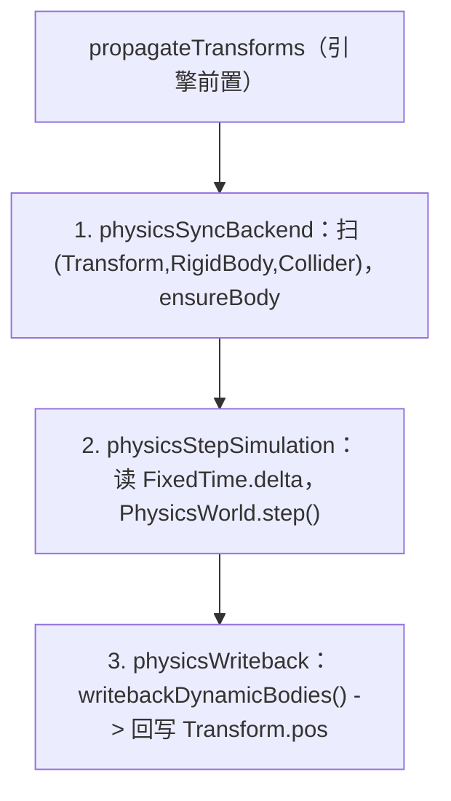

# forgeax-engine-physics

> **物理 = 给 entity 挂三件套（Transform + RigidBody + Collider）；静态/运动学 Collider 从已解析的 world TRS 同步，动态刚体把模拟姿态写回 `Transform`**。`@forgeax/engine-physics` 是**接口层**：定义 ECS 组件 schema（`RigidBody` / `Collider` / `CollidingEntities`）、`PhysicsWorld` / `PhysicsWorld2D` Resource 接口、`PhysicsErrorCode` 闭集，但不含实现。实现是两个 WASM 后端：`@forgeax/engine-physics-rapier2d` 与 `@forgeax/engine-physics-rapier3d`。开物理只需 `createApp(canvas, { plugins: [physicsPlugin('rapier-3d')] })`——`physicsPlugin` dynamic-import 对应 rapier 包、注册 `PhysicsWorld` Resource、装好三段式 tick 系统。聚合 `@forgeax/engine-physics`（接口）+ `physics-rapier2d` + `physics-rapier3d`（后端）。

## 心智模型

物理是**组件驱动**的：你不调"创建刚体"API，而是给 entity 挂上组件，`physicsSyncBackend` 系统每帧扫描 `(Transform, RigidBody, Collider)` 原型、为新 entity 在 Rapier 侧 `ensureBody`，`physicsStepSimulation` 推进模拟，`physicsWriteback` 把动态刚体的位置和旋转写回 `Transform`。`propagateTransforms` 后的 world TRS 是 static / 非 CharacterController kinematic Collider 的物理姿态来源：父子层级、旋转与缩放都投影到 Rapier；dynamic body 创建后由 Rapier 取得姿态所有权。后端选择经 `createApp` 的 `physics` 选项（`'rapier-2d' | 'rapier-3d'`），它把 `PhysicsWorld`（3D）/ `PhysicsWorld2D`（2D 接口）作为 World Resource 注入。`World` 把宿主帧 delta clamp 到 `Time.delta`，再用常量 `FixedTime.delta` 驱动物理，最多执行 `FixedTime.maxStepsPerUpdate` 次；丢弃的整步累计到 `droppedSeconds` / `droppedUpdates`，只保留 fractional `overstep`，后续健康帧不会重放。`PhysicsWorld` Resource 未就绪时（WASM fire-and-forget 加载），三个系统都安全 early-return——不 fail，等下一帧。碰撞对经只读组件 `CollidingEntities` 读取。

## 核心 API / 组件速查

| 名字 | 来源包 | 形态 | 用途 |
|:--|:--|:--|:--|
| `RigidBody` | physics | 组件 | 刚体；`type`（`RigidBodyTypeValue.{dynamic,static,kinematic}`）+ `mass` 等 |
| `Collider` | physics | 组件 | 碰撞体；`shape`（`ColliderShapeValue.{sphere,cuboid,capsule}`）+ 形状参数 |
| `CollidingEntities` | physics | 组件（只读） | 当前帧与本 entity 接触的 entity 列表 |
| `CharacterController` | physics | 组件 | 运动学角色调参（offset / slope / autostep / snap，角度用度）+ 引擎写回的 `grounded`（bool）|
| `PhysicsWorld.moveAndSlide` | physics | 方法（3D `Vec3` / 2D `Vec2`） | 碰撞感知角色移动原语；解析 `desiredDelta` 后写回 `Transform` + `grounded` |
| `PhysicsWorld` | physics | Resource 接口（3D） | `step()` / `ensureBody` / `moveAndSlide` / `writebackDynamicBodies()` 等；后端实现 |
| `PhysicsWorld2D` | physics | Resource 接口（2D） | 2D 版同形接口（`moveAndSlide` 收 `Vec2` 返 `Vec2`）|
| `RigidBodyTypeValue` / `ColliderShapeValue` | physics | 枚举常量 + `*FromF32` 窄化助手 | 写组件字段时的类型安全枚举 |
| `createRapier3DPhysicsWorld` | rapier3d | `async fn` | 手动建 3D PhysicsWorld（`createApp` 内部用） |
| `createRapier2DPhysicsWorld` | rapier2d | `async fn` | 手动建 2D PhysicsWorld |
| `PhysicsErrorCode` | physics（types SSOT） | 闭集 union（9 成员，勿抄） | 结构化失败码 |

### Collider 的 Transform 投影

物理边界消费 resolved world TRS，不是 local TRS：子 Collider 会跟随父节点的平移、旋转和缩放。`cuboid` 的 half-extents 按各轴绝对缩放；sphere 用最大绝对缩放保守地保持球形；capsule 沿 Y 轴缩放 half-height、横截面取 3D X/Z 最大值或 2D X 值。负缩放只取绝对值，不表示镜像碰撞形状。2D 只投影 Z 轴旋转到 Rapier 的标量 angle。

> [!IMPORTANT]
> 写 `RigidBody.type` / `Collider.shape` 用枚举常量（`RigidBodyTypeValue.dynamic` / `ColliderShapeValue.sphere`），不要塞裸数字。组件字段全集 + 默认值见 `packages/physics/README.md` §Component Schemas；`PhysicsErrorCode` 9 成员 SSOT 在 `packages/types/src/index.ts`，**勿抄**。

## 运动学角色：moveAndSlide

角色移动**不走**三段式 tick 自动驱动，而是每帧手动调 `PhysicsWorld.moveAndSlide(entity, desiredDelta)`（3D 收/返 `Vec3`，2D 收/返 `Vec2`）。给 entity 挂 `RigidBody({ type: kinematic })` + `Collider` + `CharacterController`，游戏层每帧把输入 + 重力 + 跳跃合成 `desiredDelta`，`moveAndSlide` 做碰撞响应 / 斜坡 / 自动上台阶 / 贴地，把解析后位置写回 `Transform`、把接触态写回 `CharacterController.grounded`，返回实际位移。无 options、无 `dt`（delta 已含时间）。调参每帧从组件读（D-7 全量重置）。

```ts
import { CharacterController, Collider, ColliderShapeValue, RigidBody, RigidBodyTypeValue } from '@forgeax/engine-physics';

const char = world.spawn(
  { component: Transform, data: { pos: [0, 0.45, 0] } }, // 静置高度：地面顶 + radius + halfHeight
  { component: RigidBody, data: { type: RigidBodyTypeValue.kinematic } },
  { component: Collider, data: { shape: ColliderShapeValue.capsule, radius: 0.3, halfHeight: 0.5 } },
  { component: CharacterController, data: {} },
).unwrap();

app.registerUpdate(() => {
  const pw = world.getResource('PhysicsWorld'); // WASM 未就绪先 try/catch early-return
  if (!pw.hasBody(char)) return;              // body 尚未建出（WASM fire-and-forget），跳过不走 body-not-found
  pw.moveAndSlide(char, [dx, dy, dz]); // 写回 Transform + grounded
});
```

> [!CAUTION]
> 四个常见坑：① `grounded` 是 JS `boolean`，比较用 `=== true`，禁止 `!== 0`（恒 true）。② capsule 必须 spawn 在静置高度（中心 = 地面顶 + radius + halfHeight），埋进地里会让 KCC 接触退化。③ 连续斜坡上的贴地效果看轨迹 y，不依赖 `computedGrounded()`。④ WASM 异步加载使首 tick 存在窗口；驱动前用 `if (!pw.hasBody(entity)) return;` 守护，勿靠捕 `body-not-found` 做控制流。`physicsSyncBackend` 对带 `CharacterController` 的原型跳过 kinematic 镜像，避免双写。完整 demo：`apps/hello/character`。

## 三段式 tick 顺序



> 三系统由 `createApp`（`physics` 选项已设）自动注册并按此序排；`PhysicsWorld` Resource 未就绪时全部安全 early-return。

## idiom 代码骨架

```ts
import { createApp } from '@forgeax/engine-app';
import { Collider, ColliderShapeValue, RigidBody, RigidBodyTypeValue, physicsPlugin } from '@forgeax/engine-physics';
import { Transform } from '@forgeax/engine-runtime';

const app = await createApp(canvas, { plugins: [physicsPlugin('rapier-3d')] });
const world = app.world;

// dynamic body: falls under gravity
world.spawn(
  { component: Transform, data: { pos: [0, 5, 0] } },
  { component: RigidBody, data: { type: RigidBodyTypeValue.dynamic, mass: 1 } },
  { component: Collider, data: { shape: ColliderShapeValue.sphere, radius: 0.5 } },
);

// static ground: immovable collision target
world.spawn(
  { component: Transform, data: { pos: [0, 0, 0] } },
  { component: RigidBody, data: { type: RigidBodyTypeValue.static } },
  { component: Collider, data: { shape: ColliderShapeValue.cuboid, halfExtents: [5, 1, 5] } },
);

app.start();
```

## 踩坑

- **挂了组件但 entity 不动**：缺 `Transform`（写回目标）或缺 `createApp({ plugins: [physicsPlugin(...)] })`（没装 tick 系统）。三件套必须齐：`Transform` + `RigidBody` + `Collider`。
- **前几帧没物理反应**：`PhysicsWorld` Resource 是 WASM fire-and-forget 异步加载，未就绪时系统 early-return；这是正常的，不是错误。
- **大 host delta 的恢复**：不要把宿主帧 delta 直接传给物理。`World` 先把 `Time.delta` clamp 到 `maxDeltaSeconds`，再以 `FixedTime.delta` 执行最多 `maxStepsPerUpdate` 次；超出的整步记录到 `droppedSeconds` / `droppedUpdates`，不会在下一健康帧追赶。`physicsStepSimulation` 的 `dt <= 0` / `> 0.1s` guard 是后端防御，不是大帧恢复路径。
- **2D / 3D 后端选错**：`physics: 'rapier-2d'` 用 `PhysicsWorld2D` 接口，`'rapier-3d'` 用 `PhysicsWorld`；组件 schema 共用但坐标维度不同，别混。

## 深入

- 组件字段全集 / 默认值（`RigidBody` / `Collider` / `CollidingEntities`）+ 枚举常量与窄化助手：见 `packages/physics/README.md` §Component Schemas / §Enum Constants
- 三段式 tick pipeline 细节（系统名 / 排序 / early-return）：见 `packages/physics/README.md` §Three-Phase Tick Pipeline；源码 `packages/physics-rapier3d/src/rapier-physics-world-3d.ts`
- `PhysicsWorld` / `PhysicsWorld2D` Resource 接口（`step` / `ensureBody` / `moveAndSlide` / raycast）：源码 `packages/physics/src/physics-world.ts`
- 碰撞事件（`CollisionEvent` / `CollisionEventPayload`）：源码 `packages/physics/src/collision-event.ts`
- `CharacterController` 组件 schema + `moveAndSlide` 调参语义：`packages/physics/README.md` §Character Movement
- `PhysicsErrorCode` 9 成员闭集（**勿抄**）：`packages/types/src/index.ts`；详见 AGENTS.md §Error model
- rapier WASM 后端实现：源码 `packages/physics-rapier2d/src/` · `packages/physics-rapier3d/src/`
- `createApp` 物理 auto-attach 入口：源码 `packages/app/src/create-app.ts`；app 引导见 [`forgeax-engine-app`](../forgeax-engine-app/SKILL.md)

## Simulation participant

Register one ready physics participant with the ECS World when deterministic
source/fresh-target evidence must include portable physics state. Let ECS own
the record, restore transaction, trace, report, tolerance, and error contract.
Keep Rapier handles and native values inside the backend; never expose them to
App, Preview, or Remote. Recover by switching on the error code and following
its `expected`, `hint`, and `detail`.
