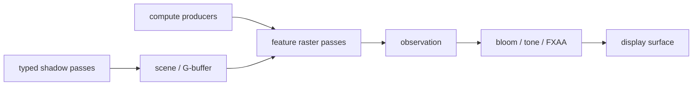

# forgeax-engine-render-pipeline

> [!IMPORTANT]
> `RenderPipeline.build` 只声明 typed graph topology。Renderer 独占 compile、last-known-good 替换、execute、retire、`finish()` 与每帧一次 `queue.submit()`。

## Transmission/refraction

Transmission/refraction stays in the Standard pipeline: one renderer-owned backdrop copy, optional
rough mip raster passes, transmission before ordinary transparent, then temporal/post. Use
`renderer.inspect().transmission` for capability, extent, format, mips, bytes, and recovery facts;
never add a second graph or app-owned scene-color copy.

## 路由

| 目标 | 使用入口 |
|:--|:--|
| tonemap / bloom / FXAA / MSAA | `Camera` 字段 |
| 天空盒 | `SkyboxBackground` |
| CubeCamera / ReflectionProbe capture | `CubeCamera` / `ReflectionProbe` + one Renderer receipt path |
| RenderTarget source / readback | `Renderer.createRenderTargetTextureSource` + receipt-bound `observe` |
| 在 URP 尾部追加全屏效果 | `renderer.postProcess.register` + `URP_PIPELINE_ID` 的 `config.postEffects` |
| 替换整条 pass topology | `RenderPipeline.build` |
| feature 写 scene color/depth | `createRenderFeatureTarget` + `staging.addGraphicsPass` |
| compute 生成 vertex/index/indirect buffer，再 raster 消费 | `staging.addComputePass` + `staging.addGraphicsPass`；共享同一 prepared GPU buffer ref |
| RHI backend / capability | `forgeax-engine-rhi` |
| 帧录制/replay | `forgeax-engine-rhi-debug` |

## Directional shadow AI 入口

Directional shadow 只有一个 public author 入口：`DirectionalLight` 的
`shadowFilter`。它是 ECS enum 字段，赋值时使用
`DirectionalShadowFilterValue.pcf1`、`.pcf3`、`.pcf5`、`.pcssMedium` 或
`.pcssHigh` 数值常量，而不是字符串 label；合法 label 固定为
`pcf1`、`pcf3`、`pcf5`、`pcssMedium`、`pcssHigh`，默认 `pcf3`；不要创建
数值别名或兼容 alias。PCSS 的
`shadowAngularRadius` 单位是弧度，默认 `0.00465`，合法范围
`[0.0001, 0.05]`；`maxPenumbraTexels` 单位是 texel，默认 `32`，必须是
范围 `[1, 64]` 的有限整数。其余 CSM author 字段、单位和默认值见
[`packages/render/README.md`](../../packages/render/README.md) 的 Directional
shadow quality 表格；skill 不复制另一份 schema。

author 后只读取一次 `renderer.inspect().directionalShadow`。这个 bounded
POD 的字段命名与 Render/Runtime README 完全一致：`requested`、`effective`、
`status`、`fallbackReason`、`lastKnownGood`、`pixelEvidence`、
`cascadeCount`、`mapSize`、`atlasBytes`、`writerPasses`、`blockerTaps`、
`filterTapUpperBound`、`seamTapUpperBound`、`deviceGeneration` 和
`graphGeneration`。`effective` 不是作者请求的回显：WebGL2 的 PCSS 请求只能
得到显式 PCF fallback，RhiNull 只能得到 `rhi-null-structural`；它们都不是
PCSS 像素证据。`not-run` 必须保持 `not-run`。

失败时按属性诊断，不读 `message`：`error.code`、`error.expected`、
`error.hint` 与 code-specific `error.detail` 是稳定入口；对于
`shadow-invalid-config`，读取 `detail.field`、`detail.actual`、
`detail.bound`、`detail.reason`，修复指定 author 字段后重试同一请求。若
`status` 为 `rejected` 且保留 `lastKnownGood`，先修复或 rebuild/cold-cook
被指出的 producer，再调用既有 `renderer.recover()`，最后重试；不要把
fallback、LKG 或结构证据改写成 accepted PCSS。

冷 AI 的证据读取顺序是：author label/unit → `inspect()` 的
requested/effective/reason → `deviceGeneration`/`graphGeneration` →
MVD receipt 的 backend、visual/readback/timing 状态。`available` 才能支持
相应的像素结论；`unsupported` 与 `not-run` 是显式结果。Renderer 仍独占
compile、LKG、execute、retire、`finish()` 和每帧一次 `queue.submit()`；skill
不引入第二 query、buffer、UBO、binding、atlas、pass、RPC 或 recovery owner。

## Camera 与内建管线

```ts
world.spawn(
  { component: Transform, data: cameraTransform },
  {
    component: Camera,
    data: {
      fov: Math.PI / 3,
      aspect: canvas.width / canvas.height,
      near: 0.1,
      far: 1000,
      tonemap: 'aces',
      exposure: 1,
      antialias: 'fxaa',
      bloom: 'on',
      bloomThreshold: 1,
      bloomIntensity: 0.35,
      bloomBlurRadius: 4,
    },
  },
);
```

内建 topology：



`renderer.perFramePassNames` 返回编译后的 pass 顺序；它是 topology 观测面，不是执行 API。

## GPU pass timing boundary

The public Render route is one opt-in on `RendererOptions.gpuPassTiming`, one
`draw()` `FrameReceipt`, and one `observe(receipt, { include: ['timings'] })`
request. Observation returns bounded JSON-safe facts for that receipt. Branch
on the closed statuses `complete`, `partial`, `unavailable`, and `failed`, then
read the matching `reason` or `error` `code`, `expected`, `hint`, and `detail`.
Pass duration is a pass fact; it is not frame latency. `current` status,
completeness, and `latestKnownGood` are distinct projections, and an omitted
`timings` include does not start work or materialize a future observation.

Render owns the session, generation fence, parser, retention, and recovery
publication. The bounded fact contract is
[`packages/render/src/record/gpu-pass-timing/contract.ts`](../../packages/render/src/record/gpu-pass-timing/contract.ts);
the fail-closed benchmark validator is
[`packages/render/bench/gpu-pass-timing/validator.ts`](../../packages/render/bench/gpu-pass-timing/validator.ts).
RenderGraph contributes only neutral pass-boundary seams such as
`timestampWrites` and `after(frame)`; it never owns timing policy or status.

```ts
const renderer = created.value;
const frame = renderer.draw(request);
if (frame.ok) {
  const observation = await renderer.observe(frame.value, { include: ['timings'] });
  if (observation.ok && observation.value.timings !== undefined) {
    const timing = observation.value.timings;
    if (timing.status === 'complete') console.log(timing.frame.passes);
    else console.log(timing.reason?.code ?? timing.error?.code, timing.latestKnownGood);
  }
}
```

Use the producer-owned recovery `hint` and inspect the named source before
retrying. Do not add a timing controller, second counter, live trace, or
membership-specific accepted-evidence path.

Target/probe capture stays inside this same typed graph. Each cube face uses its own face camera
and array-layer view; promotion waits for `FrameReceipt.completed`. PMREM work is bounded to one
face/mip step per frame, and a probe outside its box selects the renderer's Skylight irradiance
fallback. A healthy `renderer.recover()` result with `renderer-state-invalid` is a guard, not a
device-loss recovery result; recovery invalidates the old generation and rebuilds physical targets.

## 自定义 RenderPipeline

```ts
import {
  addTypedScenePass,
  addTypedTonemapPass,
  createRenderPipelineTarget,
  importRenderPipelineSurface,
  type RenderPipeline,
} from '@forgeax/engine-render';
import { ok } from '@forgeax/engine-types';

export const customPipeline: RenderPipeline = {
  build({ graph, contributeFeatures }, topology) {
    const surface = importRenderPipelineSurface(graph, topology);
    if (!surface.ok) return surface;

    const color = createRenderPipelineTarget(graph, 'scene-color', {
      format: 'rgba16float',
      size: 'surface',
    });
    if (!color.ok) return color;
    const depth = createRenderPipelineTarget(graph, 'scene-depth', {
      format: 'depth24plus-stencil8',
      size: 'surface',
    });
    if (!depth.ok) return depth;

    const scene = addTypedScenePass(graph, {
      name: 'main',
      color: color.value,
      depth: depth.value,
      selector: { LightMode: ['Forward'] },
    });
    if (!scene.ok) return scene;

    const features = contributeFeatures([
      {
        kind: 'scene-color',
        texture: color.value.texture,
        view: color.value.view,
        format: color.value.format,
        sampleCount: color.value.sampleCount,
      },
      {
        kind: 'scene-depth',
        texture: depth.value.texture,
        view: depth.value.view,
        format: depth.value.format,
        sampleCount: depth.value.sampleCount,
      },
    ]);
    if (!features.ok) return features;

    if (topology.camera.tonemap === 'none') {
      return addTypedTonemapPass(graph, color.value, surface.value.storage, true);
    }
    return addTypedTonemapPass(graph, color.value, surface.value.display);
  },
};
```

安装：

```ts
renderer.registerPipeline('game::custom', customPipeline);
const installed = renderer.installPipeline({
  kind: 'render-pipeline',
  pipelineId: 'game::custom',
});
if (!installed.ok) throw installed.error;
```

> [!CAUTION]
> 安装自定义 pipeline 是整体替换。要保留 URP 阴影、tone、bloom，只追加 `config.postEffects`。

## Typed resource ownership

`RenderGraphBuilder` 只接受本 builder 创建或导入的 opaque handle：

| 资源 | 创建/导入 | pass access |
|:--|:--|:--|
| texture | `createTexture` / `importTexture` | `sampled-read`, `storage-read`, `storage-write`, `color-attachment`, `depth-stencil-read`, `depth-stencil-write`, `copy-src`, `copy-dst` |
| texture view | `view` / `importView` | attachment 与 texture read/write access |
| buffer | `createBuffer` / `importBuffer` | `uniform-read`, `storage-read`, `storage-write`, `vertex-read`, `index-read`, `indirect-read`, `copy-src`, `copy-dst` |

`storage-write → vertex-read/index-read/indirect-read` 会建立 compute→raster 依赖并触发所需 barrier。不要另建 resource ledger、string key 或手写 pass dependency 来复制这条事实。

```ts
const compacted = graph.importBuffer(
  'visible-draws',
  { size: maxBytes, usage: STORAGE | VERTEX | INDIRECT },
  (frame) => frame.visibleDrawBuffer,
);
if (!compacted.ok) return compacted;

const cull = graph.addComputePass('cull-and-compact', {
  accesses: [{ resource: compacted.value, usage: 'storage-write' }],
  encode: ({ pass, frame }) => {
    pass.setPipeline(frame.cullPipeline);
    pass.setBindGroup(0, frame.cullBindings);
    pass.dispatchWorkgroups(frame.cullWorkgroups);
  },
});
if (!cull.ok) return cull;

return graph.addRasterPass('visible-raster', {
  accesses: [
    { resource: compacted.value, usage: 'vertex-read' },
    { resource: compacted.value, usage: 'indirect-read' },
    { resource: color.view, usage: 'color-attachment' },
  ],
  colorAttachments: [{ view: color.view, loadOp: 'load', storeOp: 'store' }],
  encode: ({ pass, resources }) => {
    const buffer = resources.buffer(compacted.value);
    if (!buffer.ok) throw buffer.error;
    pass.setVertexBuffer(0, buffer.value);
    pass.drawIndirect(buffer.value, indirectOffset);
  },
});
```

## RenderFeature compute → raster

Pipeline 拥有 attachment；feature 只声明所需的逻辑 target：

```ts
const sceneColor = createRenderFeatureTarget({
  kind: 'scene-color',
  format: 'rgba16float',
  sampleCount: 1,
});
```

feature 的 `prepare` 创建 GPU program、bindings 与 buffer refs；`contribute` 用同一 ref 先 `addComputePass`，再在 `addGraphicsPass` 的 `vertexData` / `indexData` / indirect command 中消费。Projection 会把 physical buffer 导入一次，并把 compute `storage-write` 与 raster `vertex-read` / `index-read` / `indirect-read` 投影进 renderer 的同一个 graph。

规则：

- attachment 使用 `RenderFeatureTargetHandle`，不得猜 pipeline 内部名字。
- compute 与 raster 共享 prepared buffer ref，不能复制 handle registry。
- topology 变化写入 contribution signature；下一帧编译并原子替换 last-known-good graph。
- capability 缺失返回结构化错误或选择显式 fallback lane；不得静默提交无效 compute。
- multi-World 的 `worldId` 是 renderer-local attachment identity；不得把它当作本帧 `worlds[]` 下标，detach 后重挂必须获得新 generation。

完整 VFX prepared-compute authoring 见 `forgeax-engine-vfx`；底层 builder/error contract 见 `packages/render-graph/README.md`。

## Points and Lines main-pass route

Points and Lines are a raster consumer of the existing Standard main geometry
pass. Route them as `MeshAsset` topology -> `Points` or `Lines` style ->
`Materials.unlit` -> retained extract -> prepared expansion -> recorded draw.
The renderer owner retains the expanded vertex/index resources and carries the
vertex layout into record; the main pass binds the Points/Lines view at group 0,
binding 10 and resolves the dedicated manifest-backed material pipeline.

This is not a second graph, renderer, cache, recovery ledger, or backend branch.
The normal material and legacy topology paths remain unchanged. A point draw is
non-indexed when the source has no indices; a line draw preserves indexed or
non-indexed source semantics after paired expansion. Prepare must publish the
complete resource set atomically, and stale or failed preparation keeps the
retained last-known-good state.

Evidence routing is explicit:

| Route | Evidence strength |
|:--|:--|
| direct WebGPU focused probe | pixels, source/derived bytes, bindings, draw, and validation errors |
| clustered unlit | structural material/graph contract unless a lane-specific runtime capture exists |
| WebGL2 | structural no-compute/no-storage/no-indirect contract unless a WebGL2 runtime capture exists |
| RhiNull | structural resource and command bookkeeping only; never pixel or GPU timing evidence |

For a failure, inspect the same retained/prepared/record state, repair the
source or producer, and rerun the route. Do not add application WGSL, manually
fetch a stand-in mesh, or bypass capability data with a backend-name switch.
The browser gate may be explicitly skipped by the loop authority; record that
as skipped, never as a pass. A Dawn timeout is blocked environment evidence,
not a successful smoke result.

## 后处理追加

```ts
renderer.postProcess.register('game::vignette', {
  source: vignetteWgsl,
  params: { byteSize: 16 },
});

renderer.installPipeline({
  kind: 'render-pipeline',
  pipelineId: URP_PIPELINE_ID,
  config: { postEffects: ['game::vignette'] },
});
```

## 验证

| 修改 | 最小验证 |
|:--|:--|
| pipeline topology | `pnpm --filter @forgeax/engine-render test` |
| RenderFeature projection | render + runtime integration tests |
| RHI access/barrier | render-graph unit + Dawn mixed compute→raster capture/replay |
| engine/RHI/demo | 全部 hello/learn-render Dawn 300 帧 + `pnpm test:browser` + `pnpm test:dawn` |

检查点：

- graph compile 在 swapchain acquisition 前完成；失败继续使用 last-known-good graph。
- 每帧一个 shared encoder、一个 `finish()`、一个 frame submit。
- retired graph 等待 in-flight execution 后销毁资源。
- compute-produced indirect buffer 的 physical usage 同时包含 storage 与 indirect。
- Browser/Dawn 验证是真实执行证据；rhi-null 只证明结构。

## SSOT

- Pipeline contract：`packages/render/src/render-pipeline.ts`
- Builtin topology：`packages/render/src/urp-pipeline.ts`、`packages/render/src/hdrp-pipeline.ts`
- Typed targets/primitives：`packages/render/src/render-pipeline-target.ts`、`packages/render/src/typed-render-graph-primitives.ts`
- Feature projection：`packages/render/src/features/render-graph-compute.ts`、`packages/render/src/features/render-graph-raster.ts`
- Graph builder/access validation：`packages/render-graph/src/builder.ts`
