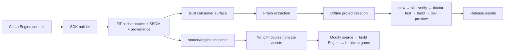

# ForgeaX Engine SDK skill design

## Core proposition

The distributable unit is the ZIP, not the Engine checkout. It has two coherent
surfaces: a built Engine/DevKit closure for immediate game work and a clean-commit
Engine source snapshot for source-level development. Acceptance therefore starts
from an extracted archive with no workspace links and no registry access.

## Authority topology

| Fact | Authority |
|:--|:--|
| Engine source identity | `engineCommit` from the clean Git checkout |
| SDK contents | `sdk-manifest.json` inside the ZIP |
| Consumer dependency graph | full ZIP: bundled template `pnpm-lock.yaml` plus `store/pnpm`; npm carrier: the same lockfile resolved from the registry |
| Offline store integrity | full ZIP `sdk-manifest.json#artifacts`; consumer installs disable side-effects caching and may not write back into the SDK. The npm carrier has no store and is verified by the carrier surface gate |
| Engine skill source | SDK and game root `skills/`; `sdk-manifest.json#skills` binds the distributed closure |
| Agent skill discovery | Disposable links from each supported discovery root to the game root `skills/`, verified by `.forgeax/skill-install-manifest.json` |
| Engine source project | `source/engine/` materialized from `git archive HEAD` then sanitized into the public source profile |
| Private repository boundary | `.gitmodules` and `forgeax-engine-assets` are excluded; `.forgeax-public-distribution` selects the safe build path |
| Public resource closure | `SDK_RESOURCE_ALLOWLIST` is the only source-resource input; the verifier requires exact equality in the source snapshot and bare built package directory |
| Template runtime closure | Every direct `templates/<id>/template.json` descriptor is validated and becomes the one SDK template collection; the current descriptors are `empty` and `game-3d`. `game-3d` derives all assets from `assets/*.pack.ts` and its root `assets/plugin.ts`, so `SDK_TEMPLATE_RESOURCE_ALLOWLIST` stays empty |
| Standalone template host | Build-time importers are Engine/DevKit contributions selected from the validated project EntryTree; projects do not maintain a second `package.json#forgeax.assets` registry |
| Source WASM hydration | Original package `pkg/` paths under `source/engine/` |
| Static deployment closure | generated `forgeax-dist.json` |
| Archive identity | `SHA256SUMS` beside the ZIP |
| Dependency disclosure | SPDX document and third-party notices |

The manifest lists every archive file by digest. Package rows and the source
summary point to the same artifact rows instead of forming a second inventory.
The source snapshot is not a nested Git checkout; it includes the tracked
project, `AGENTS.md`, `CLAUDE.md`, README files, `rules/`, and `skills/`, while
removing the contributor-only private asset boundary. The checked WASM package
outputs let a source consumer skip the separate Rust, Emscripten, or
release-fetch prerequisite unless it changes those outputs.

## Failure posture

Verification is intentionally downstream of packaging. A green workspace build proves the producer checkout; it cannot prove missing package exports, leaked wrappers, a partial pnpm store, non-portable links, or static URL closure. The verifier executes the consumer workflow from the archive so those failures stay attributable to the distributed product.

`--allow-dirty` exists only for local iteration because a dirty checkout has no reproducible source identity. Candidate production binds current `origin/main`; Promotion consumes that bound artifact and never builds from a different checkout.

## Candidate / Promotion boundary

Release production is split across `sdk-release-candidate.yml` and
`sdk-release-promote.yml`. Candidate builds the seed once, fans out the npm
consumer, exact archive/browser, reproducibility, and version-collision gates,
then seals `sdk-candidate.json` with per-file SHA-256 and npm tarball integrity.
Promotion downloads that sealed artifact, revalidates it, publishes the exact
tarballs, waits for public npm visibility, and finalizes Release assets without
rebuilding or repacking.
The collision smoke writes its report through an absolute workspace path because
`pnpm --filter @forgeax/preview` changes the script cwd; the root-level combine
step and artifact upload must consume that same path.

The Candidate artifact is the handoff authority; a changed commit requires a
new Candidate. Same-commit CI means the successful `ci.yml` `push` run for the
exact main SHA, not a PR result or a run for another SHA. The CI path SSOT must
include tracked SDK `skills/**`, so catalog and skill changes cannot merge into
main without producing the baseline Candidate needs. The reproducibility lane
uses a full-history checkout because `sdk:build` validates catalog-baseline
ancestry; shallow history would turn a valid baseline into a false failure.
Promotion is retryable for
transport or propagation failures:
same-version matching bytes are accepted, different bytes are terminal, and
Release assets are compared before any missing asset is uploaded. The operator
runbook and recovery commands live in `SKILL.md`.
