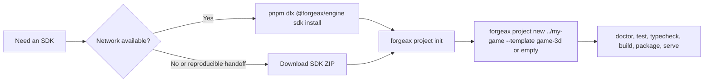

# @forgeax/engine-sdk

> [!IMPORTANT]
> This package is the npm carrier for the ForgeaX Engine SDK. It contains the
> portable SDK payload under `sdk/`; it is not a game project and it does not
> install dependencies into the current directory by itself.

## Quick start

Use the ForgeaX umbrella CLI to install this carrier into a directory outside
the npm cache:

```bash
pnpm dlx @forgeax/engine@latest sdk install ~/ForgeaX/sdk
cd ~/ForgeaX/sdk
node ./bin/forgeax.mjs project init
node ./bin/forgeax.mjs project new ../my-game --template game-3d  # 3D 游戏
cd ../my-game
pnpm exec forgeax project check --json && pnpm test && pnpm exec tsc --noEmit && pnpm exec forgeax project build --json
pnpm exec forgeax project preview --json
```

The carrier uses the exact SDK lockfile and installs the Engine packages from
the npm registry. It does not contain the full ZIP's offline pnpm store. For a
network-free or reproducible handoff, download the matching SDK ZIP from the
release instead.

## What is included

| Surface | Purpose |
|:--|:--|
| `sdk/bin/` | Standalone `forgeax` CLI used to initialise the SDK and create games |
| `sdk/packages/` | Bare built Engine package directories |
| `sdk/templates/` | Explicitly selected `empty` and source-complete `game-3d` starter projects; the latter keeps procedural packs and a readable imported UI pair |
| `sdk/skills/` | Engine authoring and debugging skills copied into each game |
| `sdk/source/engine/` | Public Engine source snapshot for inspection and extension |
| `sdk/AGENTS.md` | AI-first workflow, capability map, asset and verification guidance |

The package root README is intentionally short; after installation, read
[`sdk/README.md`](sdk/README.md) and [`sdk/AGENTS.md`](sdk/AGENTS.md) for the
complete workflow and capability tour.

## Choose ZIP or npm



Both surfaces use the same Engine version and pnpm 11 lockfile. A game stays
pinned to the SDK used to create it; when a newer `@forgeax/engine-sdk` is
available, review its release notes and migrate/test the game explicitly.

For browser-compositor screenshots, use `forgeax project capture --backend auto`; use
`--backend software` on a machine without a display or physical GPU. The final
`page.screenshot()` PNG contains the Canvas and HTML/Shadow DOM UI, while the
sidecar separately proves a non-flat Canvas frame and the Engine
`frame-submitted` signal.

Source iteration can bind a game to a local Engine checkout without changing its
manifest:

```bash
forgeax project engine status --json
forgeax project engine use-local ../forgeax-engine --json
forgeax project engine check --json
forgeax project engine unlink --json
```

The binding lives in `.forgeax/engine-binding.json`; `doctor` fails closed for
an unbuilt workspace or npm-incompatible `workspace:*` dependencies.

## Requirements and links

- Node.js `>=22.13.0`
- pnpm `11.7.0` (Corepack can activate it)
- Browser with native WebGPU or the supported WebGL2 downlevel path for rendered previews

For the public entry guide, see [ForgeaX Engine for AI-assisted game
development](https://forgeax.github.io/download/engine-ai.md). The installed
SDK remains the authoritative, versioned documentation for its exact
capabilities and files.

Apache-2.0. © ForgeaXGame.
