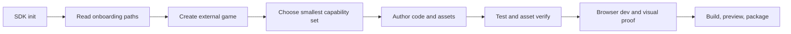

# ForgeaX Engine SDK

## First five minutes: understand before authoring

SDK `init` and project `new` print three local files under `onboarding.read`. Read them in order: root `AGENTS.md` for workflow constraints, this skill for selection, then [the current capability catalog](references/feature-catalog.md) when the task needs a broader inventory. The catalog is a compact snapshot whose header records the exact Engine commit used to generate it; it is a discovery index, not an enablement list. For a selected capability, continue to the focused skill and owning package README.

> [!IMPORTANT]
> Available is not enabled. A package in the SDK means the capability can be selected; a game enables it only through its `forge.json`, plugin composition, ECS components, assets, renderer features, or build configuration. Do not install or register every capability.

Translate the requested game into a small capability adoption plan before editing:

```text
Need: <player-visible or production requirement>
Use: <one ForgeaX capability and its owner>
Entry: <focused skill, CLI operation, or package README>
Proof: <test, asset verification, browser evidence, or package output>
Defer: <available capabilities not needed now>
```

| Need | Start with | Proof before claiming it works |
|:--|:--|:--|
| Frame loop, execution tier, input, plugin assembly | `forgeax-engine-app`, then `forgeax-engine-ecs` or `forgeax-engine-state` | Unit/system test plus real browser interaction |
| Scene, imported files, code-first packs, GUID loading | `forgeax-engine-assets`; discover operations through `forgeax-engine-cli` | `asset verify`, build catalog, runtime load by GUID |
| PBR, textures, custom WGSL | `forgeax-engine-material`, then `forgeax-engine-shader` | Shader check, material readiness, browser pixels |
| Lighting, shadows, sky, fog, AA, post effects, custom passes | `forgeax-engine-render-pipeline` | Requested pipeline active and real GPU/browser evidence |
| GPU particles, trails, ribbons, beams | `forgeax-engine-vfx` | Cooked effect, runtime playback, browser pixels |
| Bodies, colliders, character motion | `forgeax-engine-physics` | Fixed-step/collision test plus playable behavior |
| BGM, SFX, spatial audio | `forgeax-engine-audio` | Host playback, intent/cleanup evidence, user gesture handling |
| Black frame, wrong binding, GPU divergence | `forgeax-engine-rhi-debug`; use `forgeax-engine-debug` for symptom routing | One capture artifact, inspect/replay or paired differential |
| Create, inspect, develop, build, preview, package | `forgeax-engine-cli` | Structured command result and final HTTP-served package |

Create a game only after selecting its template: `forgeax project new <dir> --template game-3d` for every
3D game; use `--template empty` otherwise. Missing selection is `sdk-template-required`.

> [!IMPORTANT]
> `game-3d` is a runnable, contentful third-person reference, not an empty 3D scene. It copies
> authored scene/physics, character/animation, material/mesh, and UI examples into the new project;
> those examples affect visible composition, collision space, and asset closure. After creation,
> read the generated project's `README.md` and keep, adjust, replace, or remove starter content by
> game goal; update scene, runtime, and pack references together when removing it.

Use [the full capability catalog](references/feature-catalog.md) for less common areas such as animation/skinning, UI/font/video, picking, networking, intelligence, profiler, Remote, custom RenderGraph/RHI work, and source-mode Engine development. Then read only the focused skill and owning package README. The catalog is a discovery index, not a substitute for those precise contracts.

For browser-compositor screenshots, software/hardware backend selection, Engine frame readiness, repeated play-test checkpoints, and local Engine binding, use [the browser capture and local-Engine guide](references/browser-capture-and-local-engine.md).

The normal consumer route is:



Run `forgeax help --tree --json`, then `forgeax help <command-path> --json`, before guessing authoring-operation inputs. Use the CLI skill for the command boundary. Start the seven-stage ForgeaX closed loop only when the user explicitly authorizes it for the current task.

Successful `new` also performs a two-second, best-effort check of the configured npm registry's `@forgeax/engine-sdk` `latest` tag. Only a strictly newer semantic version produces a text warning; JSON always records `sdkUpdate` as `available`, `current`, `skipped`, or `unavailable`. Offline mode and `FORGEAX_DISABLE_UPDATE_CHECK=1` skip the query, and registry failure never rolls back a created game. Treat the warning as information, not migration authority: install the newer SDK in another directory, read its release notes, then migrate and test each existing game explicitly. Games remain pinned and are never rewritten by SDK discovery.

> [!IMPORTANT]
> A successful build is not acceptance. Verify the exact ZIP that will be distributed; the verifier creates a project, installs from the bundled pnpm store with networking disabled, and runs `new`, `skill verify`, `doctor`, `test`, `build`, `dev`, and `preview`.

## Preflight

Run from the Engine repository root:

```bash
git status --short
node --version
pnpm --version
command -v zip
command -v unzip
```

| Check | Required state | Recovery |
|:--|:--|:--|
| Git | Clean checkout for a distributable archive | Commit the intended Engine state; do not use `--allow-dirty` for Release assets |
| Node | `>=22.13.0` | Select a supported Node installation |
| pnpm | Available to the SDK builder | Enable the repository-declared package manager with Corepack |
| ZIP tools | `zip` and `unzip` on `PATH` | Install the platform ZIP tools |

## Build and verify

```bash
pnpm sdk:build -- --version 1.2.3
pnpm sdk:verify -- --archive artifacts/sdk/forgeax-sdk-v1.2.3.zip
```

`pnpm build:engine` (and the CI package-artifact lane) scans every built public package's JavaScript imports and fails if an `@forgeax/engine-*` runtime import is absent from `dependencies`, `optionalDependencies`, or `peerDependencies`. Treat that check as part of SDK production, not as a consumer-side workaround.

Read `artifacts/sdk/sdk-build-result.json` and `artifacts/sdk/sdk-verify-result.json`. Both must contain `"ok": true`; the `engineCommit` values must equal `git rev-parse HEAD`, and the verify result must list all seven commands: `new`, `skill.verify`, `doctor`, `test`, `build`, `dev`, and `preview`.

## Allocate an official release

> [!IMPORTANT]
> Do not create or push `sdk-v{version}` before verification. A formal tag is an immutable published identity, not a release-candidate trigger. The old quick/unverified route is retired.

Create a sealed Candidate from current `main`:

```bash
gh workflow run sdk-release-candidate.yml \
  --ref main \
  -f version=1.2.3
```

The Candidate workflow binds the current `origin/main` commit and its CI baseline, builds the SDK seed once, runs npm-consumer, exact archive/browser, reproducibility, and version/tag collision gates in parallel, then seals `sdk-candidate.json` with per-file SHA-256 and npm integrity. The normal baseline is a successful `ci.yml` `push` run for that exact main SHA; when an admin merge is intentionally tree-empty, the workflow may instead reuse a successful `ci.yml` `push` run for the merge commit's first parent, but only after proving the two commit trees are byte-identical and recording that basis in the run summary. A PR check, a non-empty merge, or an unrelated SHA is never interchangeable. If neither baseline exists, Candidate remains fail-closed and must not be promoted. The reproducibility lane keeps full Git history because `sdk:build` validates the feature-catalog baseline ancestry; a depth-1 checkout can falsely reject a valid main commit. Record the successful workflow run ID; only a sealed Candidate is promotable.

Promote that exact Candidate:

```bash
gh workflow run sdk-release-promote.yml \
  --ref main \
  -f candidate_run_id=123456789 \
  -f version=1.2.3
```

Promotion downloads the sealed artifact, revalidates every byte and identity, publishes the existing tarballs without rebuilding, waits for npm metadata/dist-tag/tarball visibility, and creates or completes the GitHub Release idempotently. Re-running Promotion with the same Candidate is the recovery path for propagation or Release transport failures; a changed source needs a new Candidate. A same-version different-integrity response is terminal and must never be overwritten.

## Archive surfaces

Every SDK archive contains both of these surfaces:

| Surface | Archive path | Contract |
|:--|:--|:--|
| Built use (full ZIP) | `bin/`, bare `packages/`, `templates/`, `skills/`, `store/pnpm/` | The CLI requires `empty` or `game-3d`, installs project-local Engine skills, and creates games without registry access. |
| Built use (npm carrier) | `bin/`, bare `packages/`, `templates/`, `skills/` | The carrier deliberately omits `store/pnpm/` to stay publishable; `new` and `init` use the exact lockfile against the npm registry. |
| Source development | `source/engine/` | A public source snapshot containing the tracked Engine project, `AGENTS.md`, `CLAUDE.md`, README files, `rules/`, and `skills/`, with private submodule inputs removed. |
| Prebuilt WASM | `source/engine/packages/{wgpu-wasm,fbx,codec}/pkg/` and `toolchain/wasm/` | Checked glue and binary outputs remove the default Rust/Emscripten hydration prerequisite. |

The source snapshot is not a nested Git checkout and intentionally excludes
`node_modules`, `.git`, `.gitmodules`, `.forgeax-harness`, and
`forgeax-engine-assets`. It carries `.forgeax-public-distribution`, which makes
`pnpm install`, `pnpm build:engine`, and `bun fx setup` avoid internal repository
hydration. The non-code resource closure is the preview package's explicit
`assets/canonical-kit/{sky.hdr,sky.hdr.meta.json,cook-receipt.json}` allowlist in
`scripts/forgeax/sdk-lib.mjs`. The `game-3d` template needs no copied binary
closure because its analytic sky, materials, meshes, and scene are generated by
tracked `*.pack.ts` sources. The builder copies only the package allowlist into
the source snapshot, and the verifier checks exact equality. The source
project may still install ordinary JavaScript dependencies from its configured
registry; the bundled WASM outputs only remove the separate WASM fetch/compile
step. `sdk-manifest.json` records both resource allowlists, every root skill's
file/byte closure, source file/byte counts, explicit exclusions, and checked WASM paths, while `artifacts` remains
the single per-file inventory.

验证器会覆盖两种产品表面：它通过 `new`、`skill verify`、`doctor`、`test`、
`build`、`dev` 和 `preview` 明确创建 `templates/empty` 项目，并通过显式模板选择创建
`game-3d` 项目，
然后单独检查 source snapshot 的公共资源闭包与真实 Preview-host 模板 smoke。Standalone host
消费项目中由 `*.pack.ts` 声明的 build-time producer；`forgeaxShader` 负责 WGSL 编译，
游戏插件负责对应的 runtime loader。

The exact source-distribution smoke proves renderer health, UI, pointer lock,
mouse look, W/D movement, animation, projection, and FixedTick from the unpacked
source snapshot. It records the long `game-3d` collision journey as exactly
`{ status: 'omitted', reason: 'sdk-source-distribution' }`; any other omitted or
missing state fails verification. Collision acceptance remains owned by the
default full `@forgeax/preview smoke:templates` gate. The Candidate workflow runs
that complete `game-3d` collision journey through the exact archive/browser
lane and requires successful baseline CI for the exact commit before sealing.
That lane must fetch the content-keyed private `wgpu-wasm` release with
`GHA` and pass `verify-current.mjs` before building Engine; best-effort WASM
hydration is not release evidence.
The collision lane keeps `FORGEAX_TEMPLATE_SMOKE_DIR` absolute (`${{ github.workspace
}}/artifacts/sdk-release-template-smoke`) because pnpm's filtered Preview script
runs from `apps/preview`; the root combine step reads the report from that same
workspace path.

Pointer-lock carrier selection is page-local: every fresh `game-3d` browser
process probes native acquisition and Escape release on a dedicated same-origin
blank document in the same Playwright Page before navigating that Page to the
real game. The blank document must not boot a second Preview/game instance, and
a different or discarded browser must not donate a stale native-capability
result. When that exact Page cannot carry native lock, the smoke records the
failed native probe and installs its explicit test-only Host-input shim before
navigation; UI, relative mouse look, movement, animation, projection, and
FixedTick assertions remain mandatory.

Hosted Chrome/Lavapipe may lose its external GPU Instance while the unpacked
source journey is running. The source-distribution route accepts at most one
exact `A valid external Instance reference no longer exists` event only when it
is ordered before `journey-complete`, the complete UI, pointer, mouse-look, W/D,
animation, projection, and FixedTick evidence is still present, and the old
renderer's real terminal state remains `device-lost`. The verifier then starts a
new Chrome/GPU process and requires an `alive` renderer with a submitted frame;
that fresh-process viability is not described as survival of the lost renderer.
The report records the event sequence, journey-completion sequence, old terminal
health, and fresh frame as `sdk-source-host-gpu-instance-loss`. Every different,
duplicate, late, page, response, or console error remains fatal. Source
verification reports `passed-with-omissions`, preserving both bounded omissions
in the release evidence instead of presenting them as full Preview/physics
acceptance.

The full ZIP treats pnpm package payloads under `store/pnpm/` as immutable distribution content. The verifier recomputes those payloads after creating and exercising both templates; `sdk-consumer-mutated-store` blocks content drift. pnpm 11 may hydrate its SQLite `index.db` runtime cache during the first install, so that cache is the only post-extraction digest exception and carries no package authority. The npm carrier intentionally has no store: `findSdkContext()` detects that absence and the bootstrap path runs a frozen, registry-backed install.

Release these sibling files together:

```text
forgeax-sdk-v{version}.zip
SHA256SUMS
forgeax-sdk-v{version}.spdx.json
forgeax-sdk-v{version}.provenance.json
sdk-verify-result.json
sdk-candidate.json
```

The build also emits `npm/packages/*.tgz` and
`npm/forgeax-engine-sdk-{version}.tgz`. Run the local contract gate before any
network publication:

```bash
pnpm sdk:publish:npm -- --version 1.2.3 --check-only
```

The check-only gate serves the exact staged tarballs from a local registry and
proves umbrella `dlx` → carrier install → SDK init → both template
new/doctor/test/build/dev paths without publishing.

The Promotion workflow publishes the exact Candidate tarballs with `NPM_TOKEN`. Focused
Engine packages are physical dependencies, `@forgeax/engine` is the user-facing
runtime/CLI umbrella, and `@forgeax/engine-sdk` is its on-demand SDK carrier.
Because the source repository and its Releases are private, no public install
path may require a GitHub token.

Publication is not complete when `npm publish` merely exits successfully. npm
may expose version metadata and tarball bytes several minutes apart while it
scans a release. Before creating the GitHub Release, the publisher waits up to
20 minutes for every exact version on the public registry, repairs a missing
requested dist-tag when the immutable bytes already match, checks its staged
integrity, confirms the requested dist-tag, and proves the tarball URL is
downloadable. `npm-publication-not-visible` means the version remains pending
or incomplete after that window; inspect the per-package reason and npm status,
then rerun Promotion with the same Candidate only when its immutable registry
bytes are absent or match exactly.
`npm-published-integrity-mismatch` is terminal for those bytes and must never be
repaired by overwriting or retagging the version.

## Reproducibility check

Build twice from the same clean commit into separate output directories:

```bash
pnpm sdk:build -- --version 1.2.3 --output artifacts/sdk-a
pnpm sdk:build -- --version 1.2.3 --output artifacts/sdk-b
shasum -a 256 artifacts/sdk-a/forgeax-sdk-v1.2.3.zip artifacts/sdk-b/forgeax-sdk-v1.2.3.zip
```

The ZIP digests must match. The Candidate workflow independently compares a
sorted SHA-256 inventory of both `npm/` trees, including every physical package
tarball and the SDK carrier; a mismatch in either evidence set blocks
publication.

## Failure routing

| Signal | Owning input | Action |
|:--|:--|:--|
| `sdk-dirty-checkout` | Git source identity | Commit or remove unintended changes |
| `sdk-package-*` | Bare public package directories | Repair package visibility, exports, wrapper removal, or file closure; rebuild |
| `package-runtime-dependency-closure` | Built package JavaScript plus package manifests | Move every external `@forgeax/engine-*` runtime import out of `devDependencies` and into `dependencies`, `optionalDependencies`, or `peerDependencies`; rebuild |
| `npm-publication-not-visible` | Public npm metadata, dist-tag, or tarball propagation | Inspect the named package reason and npm status; preserve the version and retry only absent bytes |
| `npm-published-integrity-mismatch` | Immutable registry bytes versus staged tarball | Stop; never overwrite or retag the version |
| `sdk-candidate-*` / `sdk-npm-version-conflict` / `sdk-tag-conflict` | Sealed Candidate identity, artifact, or collision gate | Keep the version unallocated; repair the source/gate and create a new Candidate |
| Other `npm-*` | Exact-version npm package set or SDK carrier | Repair version projection, umbrella closure, or carrier bytes; never publish a partial mismatched version |
| `sdk-artifact-mismatch` / `sdk-unmanifested-artifact` | Archive manifest generation | Repair the SDK builder; do not edit the staged archive |
| `sdk-manifest-schema` | `sdk-manifest.schema.json` contract | Repair the producer or schema in one change |
| `sdk-source-file-count` / `sdk-source-byte-count` / `sdk-source-unportable-tree` | Source snapshot materialization | Repair source archival or exclusion rules; rebuild |
| `sdk-source-private-dependency` / `sdk-source-exclusions` | Public source sanitization | Remove submodule metadata or private asset paths from the staged source; rebuild |
| `sdk-resource-allowlist-missing` / `sdk-resource-allowlist-drift` / `sdk-resource-package-drift` | SDK resource closure | Repair the allowlist or the package-owned resource; rebuild and rerun the verifier |
| `sdk-template-resource-missing` / `sdk-template-resource-allowlist-drift` | Full template resource closure | Repair the template allowlist or its package-owned inputs; rebuild and rerun the verifier |
| `sdk-skill-*` / `skill-verify-failed` | SDK root `skills/` or project-local mount projection | Repair the skill source/manifest or rerun `forgeax project skill install`; never patch mount copies |
| `sdk-consumer-mutated-store` | SDK-backed pnpm package payloads | Repair package-content mutation; SQLite `index.db` hydration is the only cache exception |
| `npm-sdk-carrier-store-*` | npm carrier surface | Remove `store/pnpm/` from the carrier; keep it in the full ZIP and rebuild |
| `sdk-source-wasm-path` / `sdk-source-wasm-unmanifested` | Prebuilt source WASM closure | Restore the owning package `pkg/` outputs and rebuild |
| `project-target-inside-sdk` | SDK and game ownership boundary | Choose a sibling directory or an absolute path outside the SDK; never turn the distribution into a game workspace |
| `sdkUpdate.status=available` | Public npm `latest` tag | Consider a separate newer SDK install; review release notes and explicitly migrate/test each pinned game before changing Engine versions |
| `project-create-failed` | Offline store/template closure | Repair lockfile/store generation and rerun the verifier |
| `doctor`, `test`, `build`, or `preview` failure | External consumer path | Fix the owning Engine/DevKit layer, rebuild a new ZIP, verify that ZIP |

Do not publish an archive verified before its final bytes were produced. Do not substitute a workspace-linked project for the verifier's extracted offline project.
