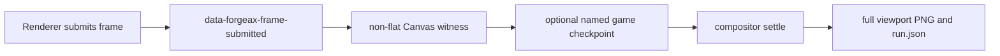

# Browser capture and local Engine iteration

> [!IMPORTANT]
> This is a development evidence path for any browser backend. Software rendering is one selectable lane, not the identity of the tool. Release visual acceptance still requires the target hardware and display path.

## Capture owner and readiness

`forgeax project capture` owns one browser compositor capture. The final PNG comes from Playwright `page.screenshot()`, so it includes the WebGPU/WebGL Canvas together with normal HTML, CSS, and open Shadow DOM UI in the same viewport. A Canvas-element screenshot alone does not include surrounding HTML UI.

The readiness chain is explicit:



The Engine publishes `data-forgeax-frame-submitted` after a real renderer submission. A deterministic game may additionally set `data-forgeax-capture-ready` to `true` or a checkpoint name. `--wait-ms` is only extra compositor settle time after those signals; it is not the game-readiness authority.

```bash
forgeax project capture --backend auto --require-ui --deterministic \
  --output artifacts/capture/game-ui.png --json
```

`--require-ui` requires mounted game UI under `#game-ui`. The sidecar records Canvas liveness separately, so a visible HTML HUD cannot hide a black or flat 3D frame.

## Backend lanes

| Requested backend | Intended use | Evidence |
|:--|:--|:--|
| `auto` | Default local and CI route | Selects a browser adapter and reports the observed backend |
| `hardware` | Explicit physical or non-software adapter check | Fails if the observed adapter is software or cannot be identified as hardware |
| `software` | No physical GPU and/or no display | Uses the supported software browser flags and creates Xvfb on Linux when needed |

The report keeps `backendRequested` distinct from the observed backend. Do not infer the renderer from the requested flag.

For repeatable cross-machine evidence, use DPR 1, the same viewport, project-local Web fonts, sRGB, a fixed locale/time zone, a fixed random seed, and named logical checkpoints. These controls reduce incidental differences; they do not make software rendering identical to an HDR display, a vendor driver, or a physical GPU.

## One playthrough, multiple screenshots

Use the persistent browser session exposed to `a Node or Bun script using the SDK command client`. It preserves one Vite server, browser, page, and game World while Playwright drives input and assertions:

```js
export default async function playthrough({ browser }) {
  const session = await browser.open({
    backend: 'auto',
    deterministic: true,
    requireUi: true,
    outputDir: 'artifacts/playthrough',
  });
  try {
    await session.page.getByRole('button', { name: 'Start' }).click();
    const spawn = await session.capture('spawn');
    await session.page.keyboard.press('KeyW');
    const arena = await session.capture('arena');
    return { report: session.reportPath, captures: [spawn, arena] };
  } finally {
    await session.close();
  }
}
```

```bash
a Node or Bun script using the SDK command client tests/playthrough.mjs --json
```

Each `capture(name)` waits for a newly submitted Engine frame and the exact game checkpoint before appending an ordered row to the same `run.json`. Repeated one-shot `forgeax project capture` calls restart the game and are not a substitute for a continuous playthrough.

## Local Engine binding

A game normally resolves the exact published `@forgeax/engine` version. Source iteration stores one development-only override in `.forgeax/engine-binding.json` without rewriting the project manifest:

```bash
forgeax project engine status --json
forgeax project engine use-local ../forgeax-engine --json
forgeax project engine check --json
forgeax project engine unlink --json
```

`use-local` validates the Engine package family and built entry points. `doctor` reports the real workspace, package versions, build coverage, content-derived digest, newest build time, and npm-incompatible `workspace:` dependencies. File absence is the one normal SDK/registry state; `unlink` removes the sole override and returns to normal dependency resolution.

To retain source changes across SDK upgrades, copy `source/engine/` to a user-owned version-controlled directory, build it there, and bind the game to that directory. The SDK never treats its source snapshot as a nested Git checkout and never silently migrates a game to a newer Engine.

## Current product boundary

| Capability | Status |
|:--|:--|
| Built SDK packages and editable `source/engine/` | Supported |
| Local Engine status, bind, doctor, restore, and unlink | Supported |
| Canvas plus HTML/Shadow DOM compositor screenshots | Supported |
| Named screenshots during one automated playthrough | Supported |
| `forgeax project engine use-local <engine-directory>` convenience copy | Not exposed; copy the snapshot to a user-owned directory, then `use-local` |
| `package --format single-html` and verified `file://` runtime | Not supported; the official output remains Web ZIP served over HTTP(S) |

Do not present an HTTP-loaded single-file experiment as verified `file://` support. A formal single-file format must own Worker, WASM, dynamic import, shader, pack-index, asset URL, browser security, and zero-network verification as one versioned build contract.
