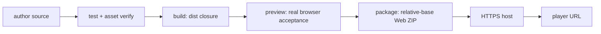
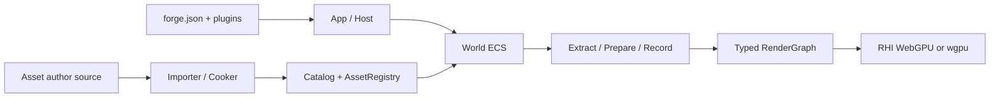

# ForgeaX 游戏工程指南

这是一个 AI-first TypeScript 游戏工程。先通过命令和已有契约发现能力，再修改 author source；构建产物、缓存和索引都不是手写权威。

## 第一次进入工程

先完成下面三步，再写代码或资产：

1. 读本文件，确认工程结构、资产权威和验证路径。
2. 读 [`skills/forgeax-engine-sdk/SKILL.md`](skills/forgeax-engine-sdk/SKILL.md) 的五分钟能力导览，为当前需求写一个最小的“Need / Use / Entry / Proof / Defer”能力采用计划。
3. 查 [`skills/forgeax-engine-sdk/references/feature-catalog.md`](skills/forgeax-engine-sdk/references/feature-catalog.md) 的当前能力快照，先确认文件头部的生成基准 commit。目录说明可用能力，不说明本游戏已启用。

`forgeax project new --json` 会把这三个本地路径返回在 `value.onboarding.read`；文本模式逐行打印。随后运行 `forgeax help --tree --json` 发现当前工程实际可执行的命令，不从能力名称猜 API 或输入。

> [!IMPORTANT]
> `forge.json` 是工程配置权威，稳定 GUID 是资产身份权威，`forge.json#plugins[]` 是唯一的插件组合权威。不要再造第二套清单、生命周期或运行入口。

> [!CAUTION]
> 默认直接在当前游戏工程中修改并运行相关验证。ForgeaX closed loop 会创建独立的多阶段交付流程；只有用户在当前任务中明确同意后才能启用。根 `skills/` 的存在只提供 Engine 使用知识，不构成启动 closed loop 的授权。

## `game-3d` 模板内容处置

如果当前工程由 `game-3d` 创建，先把它当作可运行的 Engine 能力参考，
不要把其中的玩家可见内容当作新游戏的产品底座。原创、垂直切片、作品集、
品牌体验和高保真任务默认替换或重做角色外观、展示网格、材质色板、场景构图、
灯光/环境、UI 文案和示例命名；输入、控制器数学、物理接线、镜头平滑、动画绑定、
pack 结构和 GUID 加载模式可以在适用时复用。`forge.json` 的 `id`、`name`、
`defaultScene`、插件身份，`package.json` 的 `name`，以及包/资产 GUID 和 source key
也属于模板身份，必须整体替换；只改显示名称、颜色或位置不算完成。

写游戏代码或资产前，先在任务记录中输出 `Template Disposition`：

```text
Template Disposition
- Runtime/controller code: KEEP | ADAPT | REPLACE — reason
- Player character and animation: KEEP | ADAPT | REPLACE — reason
- Scene entities and composition: KEEP | ADAPT | REPLACE — reason
- Meshes and materials: KEEP | ADAPT | REPLACE — reason
- Lighting and environment: KEEP | ADAPT | REPLACE — reason
- UI and copy: KEEP | ADAPT | REPLACE — reason
- Template tests: KEEP | REWRITE | REMOVE — reason
- Residual template identifiers allowed at delivery: <explicit allowlist or none>
```

玩家可见项选择 `KEEP` 必须说明它为什么属于新游戏身份；没有理由时先
回到资产/构图层处理。第一次浏览器截图应发生在首轮替换或白盒构图之后、
大规模玩法扩展之前。完整的残留检索命令、模板 owner 说明和测试改写边界见
`templates/game-3d/README.md`。

验证类型时优先运行 `pnpm exec tsc --noEmit`。新 SDK 生成的工程和
`forgeax project init` 应提供等价的 `typecheck` 脚本；旧工程若缺少该脚本，先把它
归类为脚本/引导问题，不要把命令失败误报为源码类型错误。

## 快速判断当前工程

`forge.json#plugins[]` 是实际入口权威。下面是 `empty` 模板的推荐结构；能力展示模板可以拆出更多 owner plugin 与工程级测试，但不应把构建生成态混入 author source。

```text
AGENTS.md                 AI 首入口；工程、资产、工具、调试和引擎心智模型
README.md                 模板/游戏的人类快速入口
docs/feedback.md          开发过程中遇到的问题与 Engine/SDK 反馈
forge.json                 工程身份、入口、默认场景、插件、资产根目录
package.json               单一 @forgeax/engine 依赖与 pnpm 脚本
pnpm-workspace.yaml        pnpm 11 的 native build 与跨平台依赖策略
pnpm-lock.yaml             SDK 生成的可复现依赖闭包
.npmrc                     提升 Engine 动态依赖；ZIP 工程还固定 SDK 的 pnpm store
assets/                    唯一内容根：游戏 Plugin、资产 author source 与外部源文件
assets/plugin.ts           工程根 Plugin Group；按功能组合 owner plugin
assets/**/__tests__/       与 owner 就近维护的 Vitest 单元测试
assets/lib.ts              可被多个 pack.ts 或 Plugin 复用的纯构造逻辑
assets/*.pack.ts           程序化 ScriptablePack author source
assets/*.pack.json         手写的最终 POD 资产包
assets/*.ui.html + *.ui.css 可读的 UI HTML/CSS author source；同名 .meta.json 负责导入 GUID
assets/* + *.meta.json     外部资产及其 GUID/导入策略 sidecar
.assetlib/                 本地资产库工作区；不参与 author source、cook 或运行时扫描
.assetlib/downloads/       下载的原始文件；仅作留档和后续整理，默认不提交
.assetlib/staging/         原始文件解压后的暂存目录；默认不提交
skills/<skill>/            SDK 随游戏安装的普通文件；可提交、可独立阅读
.agents/skills/*           指向 ../../skills/* 的可重建 Agent 发现链接
.claude/skills/*           同一份 skill 正文的 Claude 发现链接
.cursor/skills/*           同一份 skill 正文的 Cursor 发现链接
.codebuddy/skills/*        同一份 skill 正文的 CodeBuddy 发现链接
.workbuddy/skills/*        同一份 skill 正文的 WorkBuddy 发现链接
.forgeax/skills/*          ForgeaX 发现链接；整个 .forgeax/ 是本地生成态
node_modules/              离线安装结果，不提交
dist/                      构建投影，不提交也不手改
release/                   package 生成的可分享归档与 SHA-256，不提交
.forgeax/                  本地生成态和缓存，不手改
```

## 问题反馈与游戏归档

做游戏时遇到 Engine、SDK、模板、构建、资产、运行时或浏览器问题，应在确认事实后立即追加到
`docs/feedback.md`。每条记录至少写清日期、范围、复现步骤、期望结果、实际结果、证据路径和当前状态；
不要写入 token、密码或其他敏感信息。这个文件是随工程维护的反馈账本，不要只留在聊天记录或终端输出里。

`forgeax project package --format web-zip` 会在构建并校验运行时闭包后，把根 `README.md` 和
`docs/feedback.md` 原样附加到 ZIP 的 `README.md` 与 `docs/feedback.md`。因此发布前先更新 README，
并确认反馈记录包含本次开发中已知但尚未解决的问题；缺少任一文件时 package 会明确失败。

`forgeax project new` 把 SDK 根 `skills/` 的全部 Engine skills 复制为游戏根的普通文件，再为各 Agent 创建相对链接。正文只有 `skills/` 这一份 SSOT；各挂载目录的 `.gitignore` 只忽略 CLI 管理的 skill 名，不会吞掉用户自己的规则或 skill。检查或修复链接：

```bash
pnpm exec forgeax skill verify --json
pnpm exec forgeax skill install --json
```

`skill install` 幂等地重建缺失链接并清理清单中已过期的链接；目标位置已有非本安装器管理的文件时会失败，不覆盖用户内容。`.forgeax/skill-install-manifest.json` 是本地安装证据，删掉 `.forgeax/` 后运行 `skill install` 即可恢复。

新工程由 SDK 根目录的 CLI 创建。下载或解压 SDK 后先初始化一次；初始化不写入游戏，
只在 SDK 临时工程中准备 native 闭包：

```bash
node ./bin/forgeax.mjs project init                  # 每个 SDK / 平台只做一次
node ./bin/forgeax.mjs project new ../my-3d-game --template game-3d  # 所有 3D 游戏
node ./bin/forgeax.mjs project new ../my-game --template empty       # 其他游戏
cd ../my-game
pnpm exec forgeax project check --json && pnpm test && pnpm exec tsc --noEmit && pnpm exec forgeax project build --json
pnpm exec forgeax project preview --json
```

> [!IMPORTANT]
> `game-3d` 是可直接运行的 third-person 指导性起点，不是空白 3D 场景。它会带入示例场景、可见物和碰撞体、程序化角色/动画、材质/资产包与 UI；这些内容会影响画面、玩家移动空间和 asset closure。创建后先读生成工程的 `README.md`，按目标保留、调整、替换或删除；删除时按该文档的依赖边界同步更新 scene、runtime code 和 pack sources。

若尚未安装 SDK，联网入口是
`pnpm dlx @forgeax/engine sdk install <versioned-sdk-directory>`；它从公开
npm registry 获取精确版本，不依赖私有 GitHub Release。游戏仍创建在 SDK
目录之外。

`package.json` 只声明 `@forgeax/engine`；游戏从根入口或
`@forgeax/engine/<package-directory>` focused subpath 导入能力。`.npmrc` 的
`public-hoist-pattern[]=@forgeax/engine-*` 只负责让 Vite dev 能解析 Engine
包内的动态 import；它不把物理包重新变成用户依赖，也不得扩大为
`shamefully-hoist`。

游戏目标必须位于 SDK 根目录之外；SDK 根及其子目录返回 `project-target-inside-sdk`。多个游戏使用兄弟目录或其他外部绝对路径。已有外部工程先执行 SDK 根 `init`，再在游戏目录执行 `forgeax project init` 补齐精确依赖、脚本和离线锁文件。`new` 使用 `--ignore-scripts` 复用 SDK init 生成的 native side-effects cache，不会重复执行 esbuild/Rapier/WASM postinstall；完整 ZIP 还会把真实 SDK store 路径写入游戏 `.npmrc`，让后续 `pnpm test/build/serve` 继续离线复用同一闭包。SDK 自带 `packages/` 裸包与 `store/pnpm/`，完整 ZIP 创建工程不依赖 npm 网络；npm carrier 没有 store，会联网获取同一版本。

> [!TIP]
> macOS 只在可信下载被 Gatekeeper 明确阻止时手动清除 quarantine：
> `xattr -dr com.apple.quarantine /path/to/forgeax-sdk`。不要把 `file://` 作为预览或发布方式；
> 生产构建必须通过 HTTP(S) 静态服务器访问。

## 游戏代码与插件

游戏逻辑是原生 Cordis `Plugin`。`forge.json#plugins[]` 声明根 Entry，根 Entry 通常是 `assets/plugin.ts`，再由 `definePluginGroup`/`usePlugin` 按功能组合服务、ECS components、systems、UI 和其他插件。清理由 `ctx.effect()` 返回值拥有，不写平行的全局生命周期。单元测试放在 owning source 下的 `__tests__/`，不在工程根创建测试框架目录。

- `realm: "engine"`：World、ECS、渲染侧逻辑。
- `realm: "host"`：DOM、输入、Web Audio 等浏览器主线程能力。
- `realm: "build"`：importer、shader producer、authoring tool 等构建能力。
- 插件控制使用 `forgeax plugin <inspect|install|configure|disable|enable|uninstall>`；持久声明落在 `forge.json#plugins[]`，运行时变更先候选验证再由原生 Fiber reconcile。
- ECS 的游戏态由组件、资源和 `Update` / `FixedUpdate` systems 表达；状态切换使用 engine-state，不建立另一棵对象场景树。

## 资产权威与格式

资产链是 author source → importer/cooker → DDC → catalog/pack-index → runtime `loadByGuid()`。运行时用 GUID，不用磁盘路径猜身份。

`.assetlib` 是游戏工程内的本地资产库工作区：把下载得到的原文件放在
`.assetlib/downloads/`，把解压后的工作副本放在 `.assetlib/staging/`。它们都被模板的
`.gitignore` 排除，不会被 Engine 自动扫描、导入或打包；确认要进入游戏的内容后，再复制到
`assets/`，通过 `.meta.json` 或 `*.pack.ts` / `*.pack.json` 建立正式的 author source 和 GUID
资产链。

| 形式 | 适用场景 | 是否手写 |
|:--|:--|:--|
| `lib.ts` | 复用几何、材质、场景、VFX 等纯构造函数 | 是，但不登记资产身份 |
| `*.pack.ts` | 程序化生成一个或多个相关资产；只声明 packageId，返回 sourceKey 到 Asset 的拓扑 | 是，首选 code-first 形式 |
| `*.pack.json` | v3 direct/instance author source；direct 以 sourceKey 命名，instance 以 parent + values 继承 | 是 |
| `*.ui.html` + `*.ui.css` | UI 的可读 HTML/CSS author source；由同名 `.meta.json` 注册 UI importer 并声明 GUID | 是；适合多行编辑 |
| `<source>.<ext>.meta.json` | 图片、glTF/FBX、字体、音频、视频等外部文件的稳定 GUID 与导入策略 | 是；由 CLI 创建/维护 |
| `pack-index.json`、cooked pack、DDC | 构建与运行时投影 | 否，删除后可重建 |

`*.pack.ts` 文件名必须带 `.pack.ts` 后缀；推荐让 `lib.ts` 只负责可复用内容，让 pack 文件只负责 `packageId`、参数和输出构造。每个 `build()` 输出 key 都是稳定的 `sourceKey`，其 GUID 由 `UUIDv5(packageId, sourceKey)` 派生。修改外部文件时保留 sidecar，外部 importer 的 GUID 才能跨 reimport 稳定；Pack author source 不维护逐输出 GUID 表。

### 资产类型

- `scene`：实体、组件与层级的可实例化快照。
- `mesh`：顶点属性、索引和 submesh；可由 geometry 过程化构造，也可从 glTF/FBX 导入。
- `texture`：2D/cube/HDR 等纹理；外部图像由 image importer 与 meta compression policy 烹制。
- `material`：统一 `MaterialAsset`，其 pass、参数 schema 与 shader 身份决定渲染表现。
- `vfx`：GPU 粒子、billboard、mesh、ribbon、trail、beam 等 cooked effect。
- `ui`：浏览器 ShadowRoot 中挂载的 UiAsset；动态行为留在消费者插件。
- `audio`：BGM/SFX clip；Host Web Audio 播放，Engine Worker 只发 POD intent。
- `video`：视频源与视频纹理 primitive；浏览器媒体对象不进入 World。
- `font`：构建时 MSDF atlas 与 runtime font payload。
- `animation` / skin：clip、animation graph 和 joint-path binding，通常来自模型 importer。

常见 runtime-ready payload 的最小形状如下；以 `@forgeax/engine/types` 的实际类型为最终权威：

| kind | 关键字段 |
|:--|:--|
| `scene` | `{ kind, entities: [{ localId, components }], mounts?, skinGuids? }` |
| `mesh` | `{ kind, vertices, indices?, attributes, aabb, submeshes, materialSlots }`；`aabb` 和非空 submesh 不可省略 |
| `texture` | `{ kind, width, height, format, data, colorSpace, mipmap }` |
| `material` | `{ kind, parent?, passes?, parameters?, values? }`；自定义 pass 的 program 指向构建期 shader module |
| `particle-effect` | `{ kind, schemaVersion: 2, programFingerprint, emitters, program }`；由 vfx compiler 烹制 WGSL hooks |
| `audio` | `{ kind, sourceKey, mediaType, bytes }`；解码和播放由 Host 完成 |
| `video` | `{ kind, url }`；尺寸和时长从 `HTMLVideoElement` metadata 获得 |
| UI | `{ guid, html, css, actions? }`；每次 mount 拥有独立 ShadowRoot 和 dispose |

复杂 mesh/material/VFX 不要从零猜对象字段：优先用 geometry factories、模型 importer、MaterialAsset builder 和 VFX compiler，再对照包类型与 README。手写 POD 时运行 `asset verify` 和 TypeScript 测试。

### 生产、导入和验证

```bash
pnpm exec forgeax asset add assets/character.glb --json
pnpm exec forgeax asset verify --json
pnpm exec forgeax asset list --json
pnpm exec forgeax asset inspect <guid-or-unambiguous-name> --json
pnpm exec forgeax shader check assets/shaders --json
pnpm exec forgeax project build --json
```

`asset add` 为外部源建立 sidecar；`asset verify` 校验 GUID、sidecar、ScriptablePack 和外部闭包；`build` 执行 importer/cooker 并生成 `dist/pack-index.json`。看到 `asset not in pack index` 时，先核对资产根目录、sidecar GUID 和构建/开发 catalog，而不是绕过 AssetRegistry 手动 fetch。

## CLI 是唯一工具入口

优先使用 `--json`，让错误码、expected、hint 和 detail 保持机器可读。

| 命令 | 用途 |
|:--|:--|
| `forgeax project init`（SDK 根） | 预检并缓存 esbuild/Rapier/WASM native 闭包，写入 `.forgeax/sdk-init.json` |
| `forgeax project new [dir] --template id` | 必须显式选模板：3D 用 `game-3d`，否则用 `empty` |
| `forgeax project init [dir]`（游戏根） | 将已有外部工程初始化为 SDK consumer |
| `forgeax project check` | 检查 Node/pnpm、manifest 和依赖边界 |
| `forgeax project test` | 运行工程 Vitest |
| `pnpm exec tsc --noEmit` / `pnpm typecheck` | 运行工程 TypeScript 检查；旧工程缺脚本时先用前者 |
| `forgeax dev start` | 启动开发服务器和 HMR 资产 catalog |
| `forgeax project build` | 生产构建、烹制资产和静态闭包验证 |
| `forgeax project package` | 用相对基址重建并输出包含 Engine runtime 的 Web ZIP 与 SHA-256 |
| `forgeax project preview` / `preview` | 服务生产构建并检查最终路径 |
| `forgeax asset ...` | 外部资产接入、校验、枚举、检查 |
| `forgeax asset shader check` | 构建期 WGSL 编译/反射诊断 |
| `forgeax project plugin inspect/configure/disable/enable/install/uninstall` | 候选验证、Fiber reconcile 与原子维护插件 Entry |
| `forgeax project skill install/verify` | 从游戏根 `skills/` 重建或校验所有 Agent 的发现链接 |
| `forgeax help [path] --json` / `forgeax help --tree --json` | 渐进发现命令、输入 schema 和完整命令树 |
| `a Node or Bun script using the SDK command client <program.mjs>` | 对运行中实例做受契约约束的 remote eval/inspection |

`new` 成功后会 best-effort 查询 npm 的 `@forgeax/engine-sdk` `latest` tag。只有严格更新版本才在文本模式提示；JSON 的 `value.sdkUpdate` 记录完整状态。提示不代表可原地升级：在独立目录安装新 SDK，阅读 release notes，并逐个迁移、测试仍锁在旧 Engine 版本的游戏。离线或 registry 不可用不会阻塞创建；确定性自动化可设 `FORGEAX_DISABLE_UPDATE_CHECK=1`。

先 `forgeax help --tree --json`，再 `forgeax help <path> --json` 查看单个命令，最后直接执行 `forgeax <path> --input request.json --json`。不要猜命令输入。

## 运行、测试、构建与发布

```bash
pnpm exec forgeax project check --json
pnpm test
pnpm exec forgeax project build --json
pnpm exec forgeax project preview --json
pnpm exec forgeax project preview --json
pnpm exec forgeax project package --output release/game-web.zip --json
```



- 单元测试覆盖纯逻辑、系统和资产 builder；资产验证与 build 覆盖 author → cooked → catalog 闭包。
- 画面、输入、音频或浏览器路径需要 Playwright 的真实页面证据；端口监听和 HTTP 200 不等于游戏正确。验证 `justPressed` 一类帧边缘输入时，让 `keydown` 至少跨过一个已渲染帧再 `keyup`，瞬时按下可能落在两次输入扫描之间。
- `package` 输出 `release/<game>-web.zip` 与 `.sha256`。ZIP 根是 `index.html` 和 `forgeax-dist.json` 描述的 Engine/游戏静态闭包，不含 SDK source、`node_modules` 或 author source。
- 将 ZIP 上传到支持 HTML 游戏的 HTTPS 平台，或解压到任意静态站点目录后分享 URL。不得让玩家用 `file://` 双击 `index.html`；ESM、WASM、`fetch` 和资产索引都要求 HTTP(S)。
- 离线桌面包是单独产品目标：按 OS/CPU 生成并签名浏览器壳或本地 HTTP 启动器，不能把开发机的 `pnpm preview` 当成玩家运行时。

> [!IMPORTANT]
> SDK verifier 只证明精确 SDK 能创建并运行 canonical 工程，不证明当前游戏的峰值实体、VFX、输入、包体或长时稳定性。模板中的 disabled metrics 是待项目接管的显式债务，不是 production acceptance。

准备分享或发布前，项目自己的 production gate 至少应从最终 `package`/`dist` 启动 HTTPS 预览，驱动目标场景 300 帧，并在以下任一信号出现时失败：`app.onError`、浏览器 page/console error、uncaptured GPU error、失败的静态资源响应。证据同时记录实体/候选/draw 峰值、frame-time median/p95、目标分辨率与浏览器/设备；玩法峰值不同就替换 workload，不要借 SDK verifier 或空模板阈值代证。

## 动态调试顺序

1. 先读结构化命令错误与浏览器 console，运行 `doctor`、`asset verify`、`shader check`。
2. 用 Playwright 打开真实 URL，检查 canvas、交互和目标像素；不要只证明页面存活。
3. 用 `remote` / `a Node or Bun script using the SDK command client` 查询运行中的 World、Renderer、资源和 profiler，不在游戏里加一次性调试 API。
4. 黑屏、错贴图、错 binding、draw/RT 分歧优先录制 RHI-debug frame tape；离线 inspect 或 paired-diff 从 draw、resource lineage 和像素证据定位。
5. 空间事实可用 debug-draw 的 line/sphere/aabb/frustum/axes，不创建临时 ECS 可见实体污染游戏态。

## 引擎心智模型



- App 组合 Host、World、Renderer、输入、音频与插件；World 是游戏态和时间权威。
- Render 持有 extract/prepare/record 与 GPU Scene 投影；RenderGraph 持有 pass 资源生命周期；RHI 是无数学策略的硬件边界。
- 高质量画面的关键路径包括程序化天空/环境光、Directional/Point/Spot 光源、阴影 atlas/CSM、PBR 材质与 IBL、VFX、HDR/SSAO/TAA/bloom 等后处理。
- 高级能力包括 GPU 粒子、compute/raster RenderFeature、自定义 WGSL shader。其定位类似材质蓝图的可组合材质表达，但 author source 是可审查、可编译、可反射的 shader module 与 `MaterialAsset` 参数 schema。
- 能力缺失要通过 capability 数据分支；不要依赖 backend 名称或把 WebGPU 对象穿过 Engine 边界。

若需求跨多个能力，仍只采用能形成当前玩家价值与验收证据的最小集合。比如“有氛围的可战斗场景”可以先选 ECS + 输入 + PBR 光照/阴影 + Scene Fog；GPU VFX、物理、空间音频和自定义 shader 应在需求或证据需要时再加入，而不是因为 SDK 已包含就全部注册。

## 查权威文档

安装后的包 README 是精确 API 契约，例如 `node_modules/@forgeax/engine-pack/README.md`、`engine-runtime`、`engine-ecs`、`engine-render`、`engine-material`、`engine-vfx`、`engine-rhi-debug`。游戏根 `skills/` 是随 SDK 安装的任务型指南，SDK 还提供 `source/engine/` 完整公开源码快照。

遇到错误时读源码中的闭合 `*ErrorCode` union 和实际类型，不复制一份可能漂移的成员列表。预期失败返回 `Result`；分支处理 `.code`，保留 `.expected`、`.hint` 与 `.detail`。
