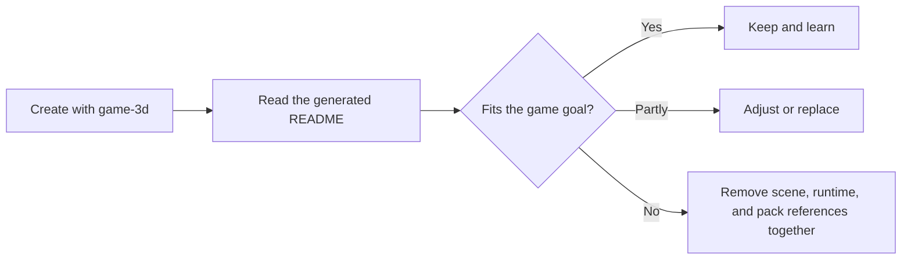

# ForgeaX Game 3D

Compact third-person reference: pointer-locked camera, camera-relative movement, Rapier character
collision, a fantasy PBR showcase, one connected procedural skinned humanoid, and one UiAsset.

> [!IMPORTANT]
> `game-3d` is a runnable, contentful reference—not an empty 3D scene. `forgeax project new` copies a
> working scene, the `assets/plugin.ts` author Group, procedural meshes and materials, a skinned character, and
> UI into the new project. These starter contents intentionally affect the visible composition,
> player collision space, and asset closure.
>
> Treat this as a guidance starting point: read the examples, keep what matches your game, and
> adjust or replace the rest. Do not delete visible scene entities, their colliders, or their pack
> dependencies independently; use the dependency guide below when pruning the starter.

> [!IMPORTANT]
> Click the game to lock the camera. Move with <kbd>W</kbd><kbd>A</kbd><kbd>S</kbd><kbd>D</kbd>,
> look with the mouse, jump with <kbd>Space</kbd>, and release the pointer with <kbd>Esc</kbd>.



## Starter content guide

| Content | Role | Adjust or remove together |
|:--|:--|:--|
| `assets/scene.pack.ts` | Runnable scene and 3C example: ground, obstacles, lights, sky, camera, kinematic `Player`, and `Player Body`. Showcase obstacles have matching static `RigidBody` + `Collider` components. | Move, recolor, or replace entities freely. Removing a blocking/showcase object means removing its scene entity and matching collider; keep or update `Ground` for the floor and `Player`/`Main Camera` for the starter runtime. |
| `assets/character.pack.ts` + `assets/player/player-rig.ts` | Skinning and animation example: generated player mesh, skeleton, skin, joint paths, and walk clip. | When replacing player art, update the `Player Body`/`Skin` scene reference and the binding code in `assets/player/player.plugin.ts` together; do not leave stale identity rows in the pack closure. |
| `assets/fantasy-meshes.pack.ts`, `geometry.pack.ts`, and `materials.pack.ts` | Procedural geometry, PBR material, and fantasy-showcase examples. Geometry also supplies the ground and obstacle meshes used by the scene. | Keep, tune, or replace the examples. When deleting a showcase, remove its scene GUID references and now-unused pack/source keys together; preserve anything still referenced by the scene. |
| `assets/materials.pack.ts` + `assets/shaders/rusted-iron.wgsl` | Import-first Standard Surface example: a short `evaluate_surface` function drives the engine-owned lit passes. | Change the WGSL parameters and matching Pack values together; keep `moduleSlots.surface` pointed at the imported module. |
| `assets/environment.pack.ts` | Analytic daylight used by the scene's `Skylight` and `SkyboxBackground`. | Keep it for the default lighting lesson, or replace the environment asset and both scene references as one change. |
| `assets/guide.ui.html` + `assets/guide.ui.css` + `assets/ui/ui.plugin.ts` | Readable ShadowRoot control overlay authoring, pointer-lock state, and crosshair example. | Restyle or replace the HTML/CSS pair, or remove the corresponding UI mount/update code in `assets/ui/ui.plugin.ts` and its `.ui.html.meta.json` sidecar together. |

The current reference implementation expects the authored `player`, `camera`, and `player/joint/*`
binding keys, plus the walk clip and guide UI. Those are requirements of this runnable sample—not
a rule that every game must keep the same content. If the game changes that contract, change the
owning runtime code and author sources together.

## Import-first Surface material example

[`assets/shaders/rusted-iron.wgsl`](assets/shaders/rusted-iron.wgsl) declares
`game_3d::rusted_iron_surface` and implements only
`evaluate_surface(SurfaceInput) -> SurfaceData`. The companion
[`assets/materials.pack.ts`](assets/materials.pack.ts) supplies the parameter
schema and values, and its `moduleSlots.surface` selects that module for the
Standard material. Authors therefore write the surface calculation, not
Forward/Deferred/ShadowCaster stages or light bindings.

The build and runtime route is one ownership chain:

```text
WGSL source + Pack values -> importer/cooker -> DDC payload + pack-index
  -> catalog -> assets.loadByGuid(materialGuid)
```

The cooker resolves the imported module and the Engine derives the pass family
from the root parameters. Runtime reads the cooked GUID record; it never parses
raw WGSL or repairs a missing artifact. For the TypeScript form of the same
contract, see the [`Materials.standard` Surface example](../../packages/render/README.md#standard-surface-authoring).

## Coordinate contract

ForgeaX uses a right-handed world with `+Y` up. This template sets yaw `0` to camera-forward `-Z`
and camera-right `+X`. Mouse-right turns the view right; mouse-down looks down and mouse-up looks
up. WASD is projected onto the camera's horizontal forward/right axes, then the character turns to
that resolved world-space movement. Pitch never adds vertical movement; Rapier remains the only
owner of the final player position.

## Reference ownership

| Source | Owns |
|:--|:--|
| `assets/camera/third-person.ts` | Camera axes, pointer look, pitch clamp, orbit, and facing math |
| `assets/camera/camera.plugin.ts` + `assets/player/player.plugin.ts` | Pointer-lock policy, fixed-step movement, camera follow, animation binding, and UI state |
| `assets/scene.pack.ts` | Kinematic player controller plus static colliders for every visible obstacle |
| `assets/character.pack.ts` | One connected implicit-surface humanoid with hands and feet, three material ranges, blended 14-joint skin, and walk clip |
| `assets/fantasy-meshes.pack.ts` | Klein bottle, trefoil knot, and astral bloom multi-material meshes |
| `assets/guide.ui.html` + `assets/guide.ui.css` | Readable HTML/CSS authoring pair for the control/lock-state overlay |
| `assets/guide.ui.html.meta.json` | UI importer declaration and stable public GUID |

> [!IMPORTANT]
> Keep the `rapier3d` provider and the `assets/plugin.ts` Group in `forge.json#plugins[]`. Player motion runs in `FixedUpdate` through
> `PhysicsWorld.moveAndSlide`; visible walkable/blocking geometry has a matching static
> `RigidBody` + `Collider`, including the fantasy showcase pieces. Do not write player positions
> directly around collision or use a render mesh as implicit physics.

```bash
pnpm test
pnpm typecheck
pnpm exec forgeax project check --json
pnpm exec forgeax project preview --json
pnpm exec forgeax project preview --json
pnpm exec forgeax project package --output release/game-3d-web.zip --json
```

`test` / `typecheck` are template-local checks. `serve` is the development game
path, `preview` serves the validated build, and `package` emits the Web release
ZIP; do not use `pnpm dev` or `pnpm build` as template lifecycle commands.

During development append confirmed Engine, SDK, template, build, asset, runtime,
or browser issues to [`docs/feedback.md`](docs/feedback.md). `forgeax project package
--format web-zip` attaches both this README and that feedback file unchanged to
the release archive.

The UI overlay is intentionally authored as the `guide.ui.html` / `guide.ui.css`
pair. DevKit's standalone host includes the Engine UI importer in its default
build composition; the `.ui.html.meta.json` sidecar declares the importer,
semantic source key, and stable public GUID. DevKit cooks the pair into the
runtime `UiAsset` package. Keep HTML and CSS multiline and readable in source
control; the generated Pack and DDC output are build projections, not
hand-edited sources.
